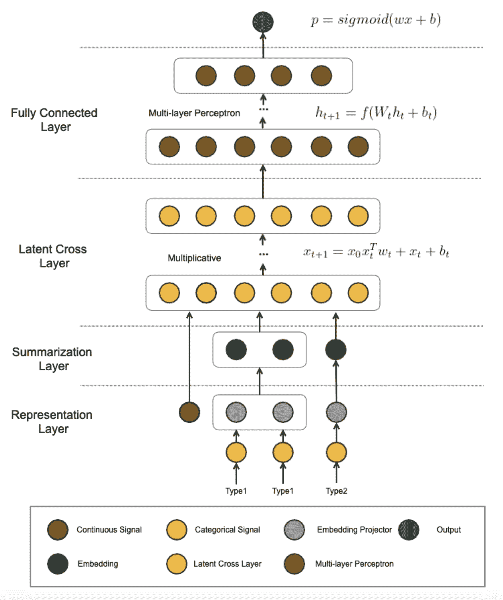
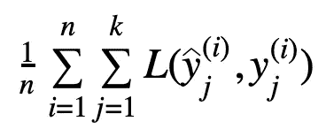
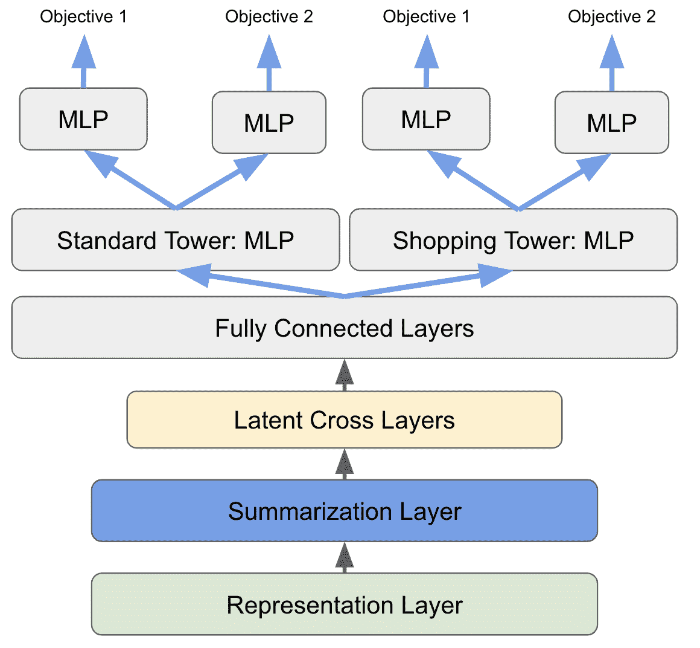
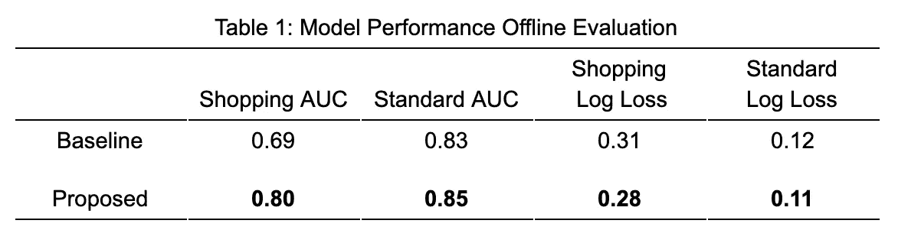
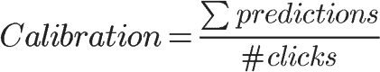
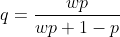

# 我们如何为 Pinterest 广告使用 AutoML、多任务学习和多塔模型

> 原文：<https://medium.com/pinterest-engineering/how-we-use-automl-multi-task-learning-and-multi-tower-models-for-pinterest-ads-db966c3dc99e?source=collection_archive---------0----------------------->

Ernest Wang |软件工程师，Ads 排名

人们带着探索的心态来到 Pinterest，经常像对待有机大头针一样处理广告。在 ads 中，我们的使命是通过向 Pinners 介绍广告商必须提供的引人注目的产品和服务，帮助他们从灵感走向行动。广告市场的一个核心组成部分是根据我们展示给他们的广告来预测 Pinners 的参与度。除了点击预测，我们还关注用户保存或隐藏广告的可能性。我们针对不同类型的广告格式(图像、视频、轮播)和用户上下文(例如，浏览主页、执行搜索或查看特定的 Pin)进行这些预测。)

在这篇博文中，我们解释了当我们在 Pinterest 建立广告市场时，AutoML、DNN、多任务学习、多塔模型和模型校准等关键技术如何实现高性能和可扩展的解决方案。我们还讨论了 AutoML 的基础知识以及如何将其用于 Pinterest 广告。

# AutoML

Pinterest 的 AutoML 是一个自包含的深度学习框架，支持特征注入、特征转换、模型训练和服务。AutoML 提供了一个简单的描述模板来融合各种预先实现的特征变换，以便深度神经网络能够从原始信号中学习。这大大减轻了特征工程中的人工劳动。AutoML 还提供了丰富的模型表示，其中采用了最先进的机器学习技术。我们用 AutoML 开发了广告点击率预测模型，取得了实质性的成果。

## 特征处理

虽然许多数据科学家和机器学习工程师认为特征工程与其说是科学，不如说是艺术，但 AutoML 在这项工作中找到了许多共同的模式，并尽可能地自动化了这个过程。深度学习[理论](https://en.wikipedia.org/wiki/Universal_approximation_theorem)已经证明，如果提供足够的资源，深度神经网络(DNN)可以逼近任意函数。AutoML 利用这一优势，通过应用一系列预定义的特征转换规则，使我们能够直接从原始特征中学习。

AutoML 首先将特征描述为通用信号格式:

*   **连续**:可直接消费的单浮点值特征
*   **OneHot** :通常经过嵌入查找层的单值分类数据，例如，用户国家和语言
*   **索引**:通常经过嵌入然后投影/MLP 汇总图层的多热点分类特征
*   **Hash_OneHot** :词汇大小不受限制的单热数据
*   **Hash_Indexed** :词汇大小不受限制的索引数据
*   **密集:**密集浮点值向量，例如 [GraphSage](http://snap.stanford.edu/graphsage/) [6]嵌入

然后，根据信号格式和原始信号的统计分布执行特征变换:

*   连续和密集的要素通常会经过挤压或归一化
*   一个热点和多个热点编码信号将被查找嵌入并被投影
*   具有无界词汇的分类信号被散列并被转换成单热点和多热点信号

通过这种方式，可以节省通常繁琐的特征工程工作，因为机器学习工程师可以更多地关注信号质量和建模技术。

## 模型结构

AutoML 利用最先进的深度学习技术来支持排名系统。该模型由多个层次组成，这些层次具有不同但强大的学习能力。

Figure 1: AutoML Model Structure

**表示层**:输入特征在表示层形成。上一节中描述的要素变换将应用于该图层。

**摘要层:**相同类型的特征(例如，Pin 的类别向量和 Pinner 的类别向量)被分组在一起。学习通用表示(嵌入)来概括信号组。

**潜在交叉层:**潜在交叉层连接来自多个信号组的特征，并与乘法层进行特征交叉。潜在交叉使得特征之间的高度交互成为可能。

**全连接层:**全连接(FC)层实现经典的深度前馈神经网络。

## 主要学习内容

尽管 AutoML 非常复杂，但该框架对引入系统的错误或噪声非常敏感。确保模型的稳定性以最大化其学习能力是至关重要的。我们发现，在我们的开发过程中，有几个因素会显著影响 AutoML 模型的质量:

*   **特征重要性:** AutoML 让我们有机会重新审视模型中使用的信号。在旧 GBDT 模型中突出的一些信号(参见校准部分)在 DNNs 中不一定重要，反之亦然。坏的特征不仅对模型无用，引入的噪声还可能使模型恶化。因此，使用随机排列[7]技术开发了特征重要性报告，这非常有利于模型开发。
*   **特征值分布:** AutoML 由于跳过了人体工程学，所以依赖于特征值的“正态”分布。然而，在制图表达图层中定义的要素变换有时可能无法捕捉到极值。它们会破坏后续神经网络的稳定性，特别是潜在的交叉层，在这些层中，极值被增大并传递到下一层。必须正确管理训练和服务数据中的异常值。
*   **归一化:**(批量)归一化是最常用的深度学习技术之一。除此之外，我们发现*最小最大*带值裁剪的归一化对输入层特别有用。如上所述，这是一种简单而有效的处理特征值异常值的方法。

# 多任务多塔

除了点击率(CTR)预测，我们还估计了其他用户参与度，作为综合用户满意度的代理。这些用户参与包括但不限于良好的点击(用户不会立即弹回的点击)和向上滚动(用户在广告上向上滚动以到达登录页面上的更多内容)。DNNs 允许我们学习多任务模型。多任务学习(MTL) [1]有几个优点:

*   **简化系统**:学习每种业务类型的模型并管理它们可能是一项困难而乏味的任务。如果能同时训练一个以上的人，系统将大大简化，工程速度也将提高。
*   **节省基础设施成本**:通过由多个头共享的通用底层模型，可以在服务和培训期间最大限度地减少重复计算。
*   **跨目标传递知识**:同时学习不同但相关的目标使得模型能够彼此共享知识。

每种参与类型都被定义为模型的输出。MTL 模型的损失函数如下所示:

其中 *n* 表示示例的数量， *k* 表示头的数量， *y^* 和 *y* 分别表示预测和真实标签。

除了 MTL，我们在 Pinterest 购物和标准广告产品方面面临着另一个挑战，这两种产品在许多方面都有所不同:

*   **创意**:标准广告的图像是合作伙伴的创意；购物广告是从合作伙伴的目录中抓取的。
*   **库存规模:**购物广告的库存比标准广告大很多
*   特征:购物广告有独特的产品特征，如质地、颜色、价格等。
*   **用户行为模式:**购买意愿较强的用户倾向于参与购物广告。

Figure 2: A Shopping Ad (top) and a Standard Ad (bottom)

在采用 DNN 之前，我们一直在分别培训和服务购物和标准模式。在 AutoML 的帮助下，我们开始整合这两个模型。然后，我们遇到了一个悖论:尽管用购物或标准数据训练的单个 DNN 模型分别优于旧模型，但从购物和标准数据的组合中学习的合并模型并没有优于任何一个旧的单个模型。假设是单塔结构不能同时了解两个数据源的不同特征。

因此，采用了共享底部的多塔模型架构[1]来解决这个问题。我们使用现有的 AutoML 层作为两个数据源的共享底层。多塔结构被实现为独立的多层感知器(MLP)。来自每个来源的示例只能通过一个单独的塔。其他来源的信息被屏蔽。对于每个塔，每个目标(交战类型)都用 MLP 训练。图 3 展示了模型架构。

Figure 3: Multi-task, multi-tower structure

多塔结构有效地隔离了来自不同数据源的训练样本之间的干扰，而共享底层则捕获了所有数据源的公共知识。

我们评估了提议的多塔模型和单塔基线模型的离线 AUC 和对数损失。结果总结在表 1 中。我们发现所提出的模型在购物广告和标准广告上的表现都更好。特别是在购物广告方面，我们观察到了显著的改善。我们通过在线 A/B 测试进一步验证了这些结果，从离线评估中可以看出，这些测试显示了持续的积极收益。

## 校准

校准代表概率预测的可信度，这对于广告排名至关重要。对于 CTR 预测模型，校准定义为:

Pinterest 广告排名系统的校准模型经历了三个阶段:

*   **GBDT + LR 混合** [5】:梯度推进下降树(GBDT)针对 CTR 目标进行训练。GBDT 模型被特征化并嵌入到针对相同目标进行优化的逻辑回归(LR)模型中。LRs 本质上产生校准的预测。
*   **宽&深**:我们依靠宽&深模型【2】的宽组件(也是 LR 模型)进行校准。
*   **AutoML +校准层**:为 AutoML 模型的每个头部训练一个轻量级普拉特缩放模型【3】。

AutoML +校准层方法是校准模型的最新里程碑。

如上所述，我们一直依赖 LR 模型来校准敬业度的预测。该解决方案有几个缺点:

1.  宽(LR)模型通常包含数百万个特征，其中大部分是 ID 特征和交叉特征。模型的稀疏性很高。虽然 LR 在记忆许多关键信号方面做得很好，但它需要大量的训练样本才能收敛。我们的模型通常难以捕捉广告库存或用户行为变化的某些瞬时趋势(例如，趋势事件或主题)。
2.  LR 模型未能学习特征的非线性和高阶交互，而这正是 DNNs 的优势。

我们将所有稀疏特征推送到 AutoML 模型。AutoML 的 DNN 模型往往没有校准好[4]。然后，我们创建一个轻量级普拉特缩放模型(本质上是一个 LR 模型)，使用相对少量的信号进行校准。校准层中的信号包括上下文信号(国家、设备、一天中的时间等。)、创意信号(视频 vs 图像)和用户简档信号(语言等。).该模型既精简又密集，这使得它能够快速收敛。当 dnn 每天更新时，我们能够每小时更新校准层。

新的校准解决方案将日常校准误差减少了 80%。

更具体地说，我们发现了关于校准模型的两个技术上的细微差别:负下采样和选择偏差。

## 负向下采样

训练数据中的负样本被下采样以保持标签平衡[5]。由模型生成的预测 *p* 用下采样率 *w* 重新缩放，以确保最终预测 *q* 被校准:

这个公式不适用于多任务学习，因为不同用户参与度之间的比例是不确定的。我们的解决方案是为其中一个任务(比如 CTR 头)设置一个基本的下采样速率；在每个训练批次期间，根据基础比率和其他任务与基础之间的参与次数的比率，动态地估计其他任务的重标度乘数。

## 选择偏差

我们的广告模型是通过用户行为日志来训练的。当训练样本由其他模型生成时，选择偏差是不可避免的。直觉在于，新模型从未接触到旧模型未选择的示例。因此，我们经常观察到，新训练的模型在用于实验时总是校准错误。在上升之后，校准通常是固定的，假设它们较少受选择偏差的影响，有更大部分的例子是它们自己产生的。

虽然我们的目标不是从根本上修复选择偏差，但一个小技巧可以帮助我们缓解这个问题:我们只使用校准层自己生成的示例来训练校准层。基本的 DNN 模型仍然用所有可用的例子来训练，以确保收敛。然而，校准模型的轻量级不需要大量的训练数据来收敛。这样，校准层可以从自己犯下的错误中学习，结果令人惊讶地好:新训练的模型在 A/B 测试期间与生产模型一样校准良好，即使流量较低。

# 结论

AutoML 为我们的多任务广告 CTR 模型配备了自动特征工程和最先进的机器学习技术。多塔结构使我们能够通过相互隔离干扰，从具有不同特征的数据源中学习。这一创新极大地提升了 Pinners、广告商和 Pinterest 的价值。我们还了解到，轻量级的普拉特标度模型可以有效地校准 DNN 预测，并减轻选择偏差。作为未来的工作，我们将使 AutoML 框架更具可扩展性，以便我们可以尝试更多的深度学习技术，如序列模型。

# 承认

本文总结了 Pinterest 多个团队历时三个季度的工作。作者要感谢周敏哲、王凡·傅、、许一平和 Aayush Mudgal 的不懈努力。感谢陈晓芳、、和张世元参与了许多有意义的讨论。感谢徐佳婧、刘鑫、马克·奥图泰耶、鲁洛夫·范·兹沃尔、周定和兰德尔·凯勒的领导。

# 参考

[1]卡鲁阿纳。多任务学习。机器学习，28(1):41–75，1997。

[2]陈，孙，李，陆，华。展示广告的深度点击率预测。《第 24 届 ACM 多媒体国际会议论文集》，第 811–820 页，2016 年。

[3] J. C .普拉特。支持向量机的概率输出和正则似然方法的比较。大幅度分类器的进展，第 61-74 页。麻省理工学院出版社，1999 年。

[4] C .郭、g .普莱斯、y .孙和 K. Q .温伯格。现代神经网络的校准

[5] X. He，J. Pan，O. Jin，T. Xu，B. Liu，T. Xu，Y. Shi，A. Atallah，R. Herbrich，S. Bowers，等.预测 facebook 上广告点击的实际经验。《第八届在线广告数据挖掘国际研讨会论文集》，第 1–9 页，2014 年

[6]汉密尔顿、应和莱斯科维奇。大图上的归纳表征学习，2017。

[7] A .费希尔、c .鲁丁和 f .多米尼克。所有模型都是错误的，但许多是有用的:通过同时研究一整类预测模型来学习变量的重要性，2018。