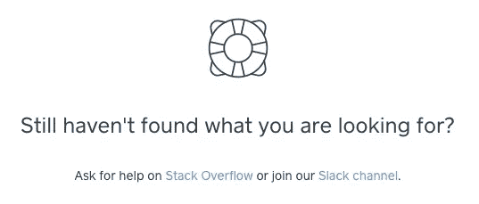
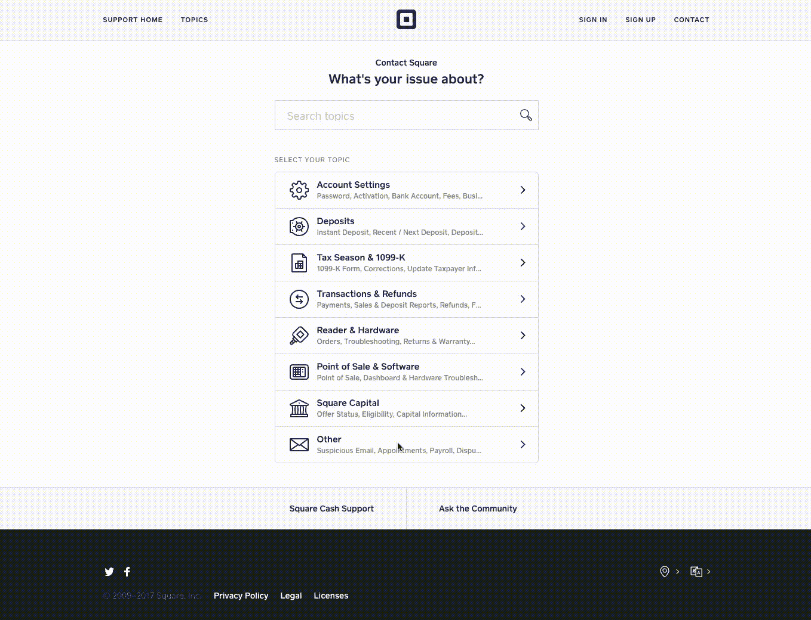
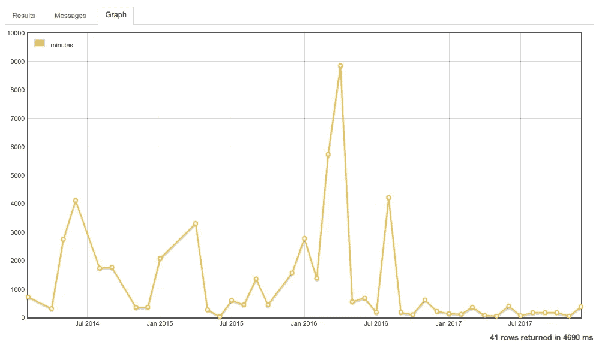
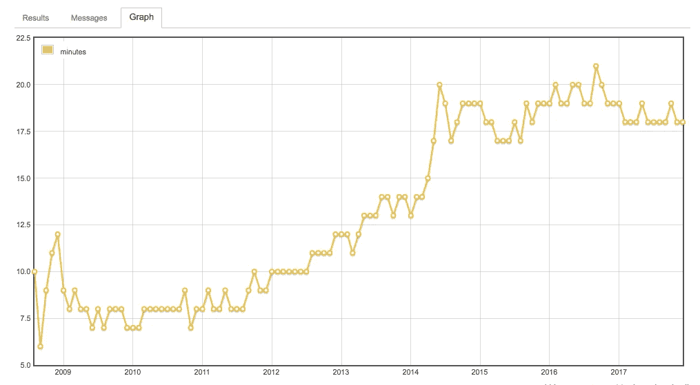

# 我们如何使用 StackOverflow 支持我们的开发人员

> 原文：<https://medium.com/square-corner-blog/how-we-use-stackoverflow-to-support-our-developers-d800fc37f650?source=collection_archive---------4----------------------->

## 这些是我们用来回答你关于 Square 的 API 的问题的一些工具和技术；他们也可能帮助你支持你的社区！

> 注意，我们已经行动了！如果您想继续了解 Square 的最新技术内容，请访问我们在 https://developer.squareup.com/blog[的新家](https://developer.squareup.com/blog)

StackOverflow 对于所有技能水平的开发人员来说都是一个无价的资源，并且是数百万开发人员常规工作流的一部分。所有这些知识只有在人们回答问题时才有用。我们使用工具、设计和分析的组合来确保我们能够有效地回答我们最了解的问题。

## 磨尖

问题标签是 StackOverflow 拥有的最基本的元数据之一。我们尽最大努力回答开发人员的问题，但是如果没有正确标记，就很难找到他们。为了让开发人员明白这一点，我们试图让我们的标签尽可能地显而易见:

*   我们在我们的文档中的[故障排除页面](https://docs.connect.squareup.com/articles/troubleshooting-errors)和每页底部都提到了它，比如这个⬇️

*   如果一个开发者碰巧去了 squareup.com/help[并且想问一个关于 API 的问题，我们也会在那里讨论。](https://squareup.com/help/us/en)

## 工具

标记问题并不能得到答案，所以我们使用几个集成来帮助我们了解`square-connect`标记下的最新问题。

*   [特定标签集的电子邮件通知](https://meta.stackexchange.com/questions/25224/email-notifications-for-new-questions-matching-specific-tags)。Stack Exchange 具有内置功能，可根据任何 Stack Exchange 网络中特定标签的新问题，以各种时间间隔发送电子邮件。
*   RSS 源。我们对`square-connect`标签使用 RSS 提要，这样我们就可以很容易地在我们的内部团队聊天应用中获得关于新问题的通知。从那里，我们可以讨论它们，并帮助确定合适的人来回答。
*   [栈交换](https://stackoverflow.blog/2017/05/16/stack-overflow-official-app-launches-ios-android/)手机 app。在旅途中回答问题并不总是一个好主意，但当你不在电脑前时，这可能是一种简单的回复评论的方式。这是帮助确保开发人员不要等待太久的一个关键方法。

## 韵律学

对于任何产品或服务，衡量它在满足客户需求方面的有效性是非常重要的。对于我们和 StackOverflow 来说，我们希望确保开发人员能够快速解除封锁，并在需要时轻松获得帮助。幸运的是，[栈交换数据浏览器](https://data.stackexchange.com/)提供了一种便捷的方式来访问我们可能想要的任何信息。有大量有用的度量标准；一个特别有趣的是用`square-connect`标签提问的平均响应时间。你可以在这里看到[查询](https://data.stackexchange.com/stackoverflow/query/538487/median-time-to-first-answer-by-month-for-a-given-tag?tag=javascript#graph)，以及下面的数据图:

You can see when we started paying closer attention to our tag 😉

看看最受欢迎的标签之一，`javascript,`你会发现，当你被问到成千上万个问题时，肯定有一些趋势在起作用。我会让你决定原因是什么。

Javascript: 10 minutes harder to answer since 2014

我希望您喜欢我们为支持开发人员所做的一些幕后工作！如果你想看到更多这样的帖子，或者你认为我们可以做得更好，请在下面的评论中告诉我们。😁