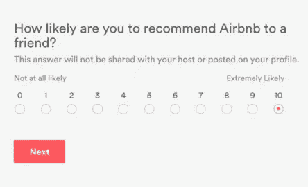
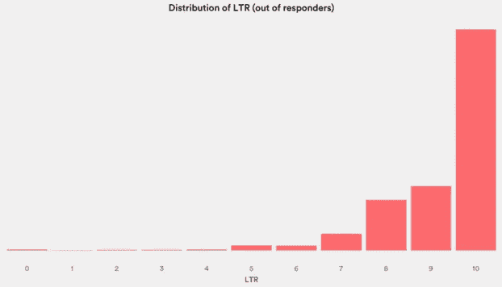
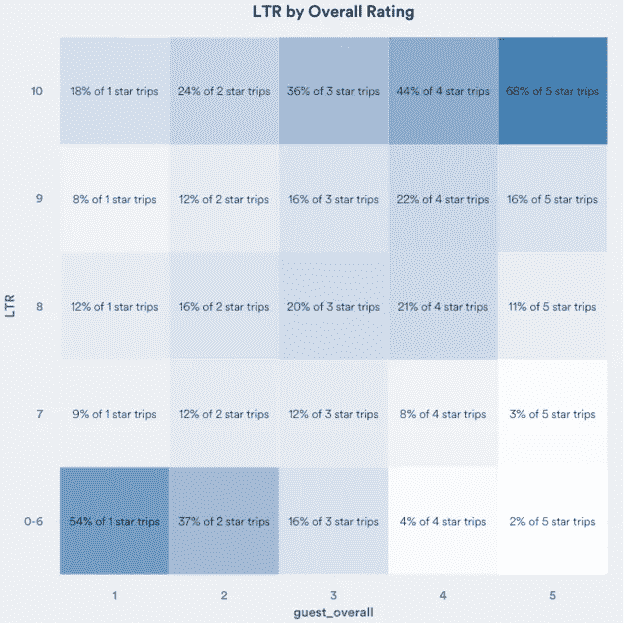
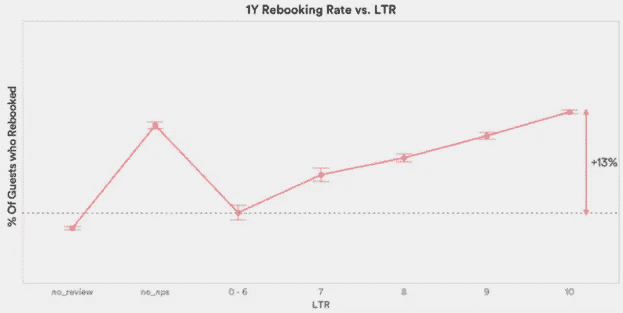
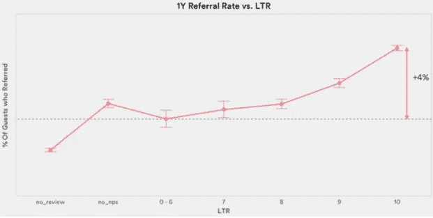
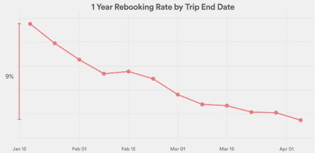
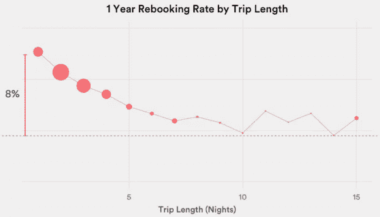
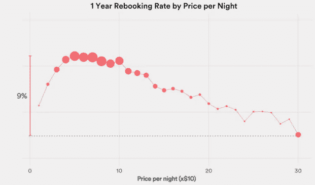
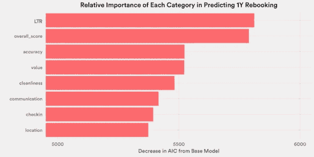
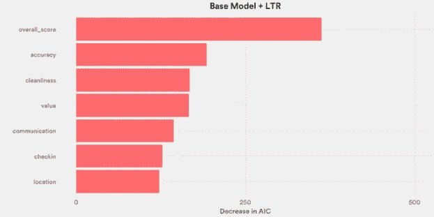

# NPS 对重新预订的预测有多准确？

> 原文：<https://medium.com/airbnb-engineering/how-well-does-nps-predict-rebooking-9c84641a79a7?source=collection_archive---------0----------------------->


由[钱丽莎](https://twitter.com/_lisaq)

Airbnb 的数据科学家收集和使用数据来优化产品，确定问题领域，并为商业决策提供信息。然而，对于大多数客人来说，“Airbnb 体验”的决定性时刻发生在现实世界中——当他们前往自己的房源，受到主人的欢迎，安顿下来，探索目的地。无论我们的网站做得多么好，这些都是决定 Airbnb 体验成败的时刻。这篇文章的目的是展示我们如何利用数据来了解旅行体验的质量，特别是“净推介值”如何增加价值。

目前，我们能收集到的关于线下体验的最佳信息来自游客在旅行结束后在 Airbnb.com 上完成的评论。审查是可选的，要求对总体体验以及子类别(准确性、清洁度、登记、沟通、位置和价值)进行文本反馈和评分(1-5 分)。从 2013 年底开始，我们在评估表中增加了一个问题，即 NPS 问题。



NPS，即[“净推介值”](https://hbr.org/2003/12/the-one-number-you-need-to-grow/ar/1)，是一个广泛使用的客户忠诚度指标，由 Fred Reicheld 于 2003 年引入。我们问客人“你向朋友推荐 Airbnb 的可能性有多大？”—一个名为“推荐可能性”或 LTR 的问题。回答 9 分或 10 分的客人被称为“推广者”，或忠诚的爱好者，而回答 0 分至 6 分的客人则是“诋毁者”，或不高兴的顾客。留下 7 或 8 的人被认为是“被动者”。然后，我们公司的 NPS(净推广者分数)通过从“推广者”的百分比中减去“贬低者”的百分比来计算，并且是一个范围从-100(最坏情况:所有响应都是贬低者)到+100(最好情况:所有响应都是推广者)的数字。

NPS 调查通过衡量客户忠诚度，而不是对单次入住的满意度，旨在成为一种更有效的方法来确定客户再次预订的可能性，将消息传播给他们的朋友，并抵制市场压力，转向竞争对手。在这篇博文中，我们通过我们的数据来找出事实是否如此。我们发现，NPS 越高，推荐和重新预订就越多。但我们发现，在控制了其他因素后，它并没有显著提高我们预测客人明年是否会再次在 Airbnb 上预订的能力。因此，提高 NPS 分数的业务影响可能比我们根据简单分析所估计的要小。

# 方法学

我们将把一个人对 NPS 问题的回答称为他们的 LTR(推荐可能性)分数。NPS 的范围是从-100 到+100，而 LTR 是从 0 到 10 的整数。在这项研究中，我们调查了所有在 2014 年 1 月 15 日至 2014 年 4 月 1 日期间结束旅行的客人。如果游客在该时间段内进行了多次旅行，则只考虑第一次旅行。然后，我们试图预测客人是否会在第一次旅行结束后的一年内再次预订 Airbnb。

需要注意的一点是，旅行结束后是否留下评论是可选的，评论本身的各个组成部分也是可选的。一小部分游客没有留下评论或留下评论，但选择不回答 NPS 问题。虽然 NPS 通常仅从回应者处计算，但在本分析中，我们通过将没有离开点评的游客以及离开点评但选择不回答 NPS 问题的游客都计算在内，从而将无回应者包括在内。

为了评估 LTR 的预测能力，我们控制了与再预订相关的其他参数。其中包括:

*   总体评审分数和对评审子类别的回应。所有评论类别的评分标准为 1-5 分。
*   顾客获取渠道(如有机或通过营销活动)
*   旅行目的地(如美洲、欧洲、亚洲等)
*   客人的来源
*   客人之前在 Airbnb 上的预订
*   行程长度
*   客人数量
*   每晚价格
*   结帐月份(考虑到季节性)
*   房间类型(整个家庭、私人房间、共享房间)
*   主持人拥有的其他列表的数量

我们承认我们的方法可能有以下缺点:

*   可能还有其他形式的忠诚度无法通过重新预订获得。虽然我们确实会查看通过我们公司的推荐计划提交的推荐，但客户忠诚度也可以通过推荐的口碑来体现，这一点在本研究中没有涉及。
*   一些客人可能需要更长的时间来重新预订。我们预计一年后，但一些客人可能会减少旅行频率，并在两到三年后重新预订。
*   一个游客的 LTR 不能直接替代总 NPS。即使我们不能根据客户的 LTR 准确预测一个客户重新预订的可能性，如果我们使用 NPS 来预测整个群体重新预订的可能性，我们可能会做得更好。

尽管有这些缺点，我们希望这项研究将提供一种基于数据的方式来思考 NPS 给我们理解线下体验带来的价值。

# 数据的描述性统计

我们的数据涵盖了 60 多万名客人。我们的数据显示，在提交评论的客人中，三分之二的客人是 NPS 推广者。超过一半的人给出的 LTR 为 10。在我们的数据集中的 600，000 个客人中，只有 2%是诽谤者。



虽然旅行的总体审查分数旨在评估旅行的质量，但 NPS 问题用于衡量客户忠诚度。我们通过观察 LTR 分数的分布来了解这两个变量之间的相关性，LTR 分数是根据总体审查分数来划分的。虽然 LTR 和总体审核评级是相互关联的，但它们确实提供了一些不同的信息。例如，在少数有令人失望的经历并留下 1 星评价的客人中，26%的人实际上是 Airbnb 的促销员，这表明他们对该公司仍然非常积极。



请记住，我们的旅行者中只有很小一部分是 NPS 的诋毁者，LTR 与总体点评分数密切相关，我们调查了 LTR 与重新预订率和推荐率的关系。

如果游客在旅行结束后的 12 个月内通过我们的推荐系统推荐了至少一位朋友，我们会将他们视为推荐人。我们看到，在回答 NPS 问题的客人中，较高的 LTR 对应着较高的重新预订率和较高的推荐率。



在不控制其他变量的情况下，LTR 为 10 的人在未来 12 个月内重新预订的可能性比贬低者(0-6)高 13%，提交推荐的可能性高 4%。有趣的是，我们注意到回复者的重新预订率的增加几乎与 LTR 成线性关系(我们没有足够的数据来区分 0-6 之间的回复者)。这些结果意味着，对于 Airbnb 来说，将回答 9 分和 10 分的人归入一个“推广人”类别会导致信息丢失。我们还注意到，没有留下评论的客人的行为与诽谤者相同。事实上，与 LTR 为 0-6 的客人相比，他们重新预订和提交推荐的可能性略低。然而，提交了评论但没有回答 NPS 问题(标记为“no_nps”)的客人的行为类似于推广者。这些结果表明，在测量 NPS 时，跟踪响应率也很重要。

接下来，我们看看其他因素如何影响重新预订率。例如，我们从 10 周的数据中发现，重新预订率是季节性的。这可能是因为更多的淡季游客往往是忠诚的顾客和常客。



我们发现短途旅行的客人更有可能重新预订。这可能是因为一些客人将主要使用 Airbnb 进行更长时间的住宿，他们不太可能在明年再住一次。



我们还看到，重新预订率与每晚的房源价格之间有一种抛物线关系。住在非常贵的房源的客人不太可能重新预订，但是住在非常便宜的房源的客人也不太可能重新预订。



# 哪些点评类别最能预测重新预订？

除了总体星级和 LTR 评分，客人还可以选择对其评论中的以下子类别做出回应，所有子类别都在 1-5 分的范围内:

*   准确(性)
*   清洁
*   记入工时
*   沟通
*   位置
*   价值

在本节中，我们将研究点评评分的力量，以预测客人在旅行结束后的 12 个月内是否会在 Airbnb 上再次旅行。我们还将研究哪些子类别最能预测重新预订。

为此，我们比较了一系列嵌套逻辑回归模型。我们从一个基础模型开始，其因变量仅包括我们在上一节中提到的非审查旅行特征:

```
f0 = 'rebooked ~ dim_user_acq_channel + n_guests + nights + I_(price_per_night*10) + I((price_per_night*10)^2) + guest_region + host_region + room_type + n_host_listings + first_time_guest + checkout_month
```

然后，我们构建一系列的模型，向这个基础模型添加一个评审类别:

```
f1 = f0 + communication
f2 = f0 + cleanliness
f3 = f0 + checkin
f4 = f0 + accuracy
f5 = f0 + value
f6 = f0 + location
f7 = f0 + overall_score
f8 = f0 + ltr_score
```

我们通过比较拟合的 Akaike 信息标准(AIC)来比较模型‘f1’到‘F8’中每一个的质量与嵌套模型‘F0’的质量。AIC 在模型的拟合优度和参数数量之间进行权衡，从而阻止过度拟合。



如果我们只包括一个评论类别，LTR 和总得分几乎并列第一。添加任何一个子类别也可以改进模型，但不如我们将总分或 LTR 包括在内的效果好。

接下来，我们调整我们的基本模型以包含 LTR，并重复该过程以查看我们可以添加的第二个审查类别。



给定 LTR，下一个将最大程度地改进我们的模型的子类别是总体评审分数。向模型中添加第二个审查类别只会略微提高模型的拟合度(注意不同之处在于两个图表的比例)。

我们重复这个过程，逐渐地向模型添加评审类别，直到模型不再具有统计意义。我们剩下以下一组评论类别:

*   长期关系
*   总分
*   六个子类别中的任何三个

这些发现表明，因为评论类别彼此之间有很强的相关性，一旦我们有了 LTR 和总得分，我们只需要六个子类别中的三个子类别来优化我们的模型。添加更多的子类别将增加更多的自由度，而不会显著提高模型的预测准确性。

最后，我们测试了模型的预测准确性:

类别| **准确度**

仅 LTR |**55.997%**

仅行程信息| **63.495%**

行程信息+ LTR | **63.58%**

行程信息+其他评论类别| **63.593%**

行程信息+ LTR +其他评论类别| **63.595%**

仅在旅行结束时使用客人的 LTR，我们可以准确预测他们是否会在接下来的 12 个月内再次预订(56%)。给定我们所知道的关于客人、主人和旅行的基本信息，我们将预测准确率提高到 63.5%。增加评论类别(不包括 LTR)，我们额外增加 0.1%的改进。鉴于所有这些，将 LTR 添加到模型中只会将预测准确性再提高 0.002%。

# 结论

旅行后检查(包括 LTR)只能略微提高我们预测客人在退房 12 个月后是否会重新预订的能力。在控制了旅行和游客特征后，查看星级仅将我们的预测准确度提高了约 0.1%。在所有的评论分类中，LTR 是预测重新预订最有用的，但如果我们控制其他评论分类，它只会增加 0.002%的预测准确性。这是因为 LTR 和复习成绩高度相关。

点评的目的不是预测重新预订。它们可以增强对平台的信任，帮助主机建立信誉，还可以用于主机质量强制。我们发现 LTR 较高的客人更有可能通过我们的推荐计划推荐某人。他们也更有可能通过口头介绍。诋毁者实际上可能会转移潜在用户加入平台的注意力。这里不探讨 NPS 与企业绩效之间的其他联系。但是考虑到极低数量的批评者和被动者，以及旅行后 LTR 在预测重新预订方面的边缘力量，我们应该小心不要过度重视客人 NPS。

## 在 [airbnb.io](http://airbnb.io) 查看我们所有的开源项目，并在 Twitter 上关注我们:[@ Airbnb eng](https://twitter.com/AirbnbEng)+[@ Airbnb data](https://twitter.com/AirbnbData)

*原载于 2015 年 12 月 10 日*[*nerds.airbnb.com*](http://nerds.airbnb.com/nps-rebooking/)*。*