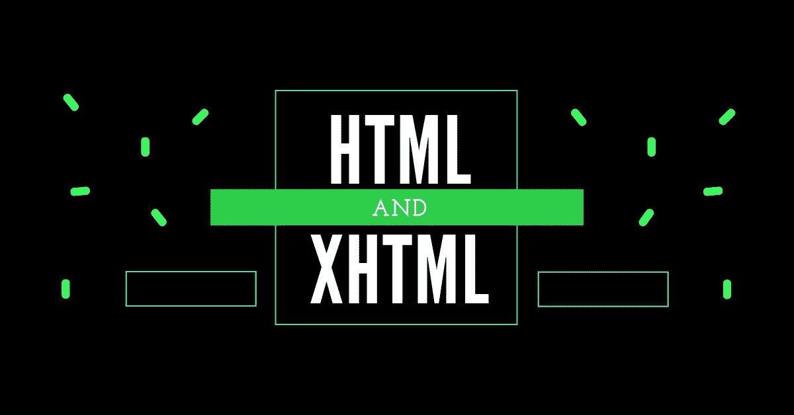

# HTML 和 XHTML

> 原文：<https://medium.com/quick-code/html-and-xhtml-24b2bff8e0d?source=collection_archive---------1----------------------->

😎XHTML 是被写成 XML 的 HTML。😎

HTML & XHTML

## XHTML 是什么？

👉XHTML 代表可扩展超文本标记语言
👉XHTML 几乎和 HTML 一模一样
👉XHTML 比 HTML 严格
👉XHTML 是定义为 XML 应用的 HTML】👉所有主流浏览器都支持 XHTML

## 为什么是 XHTML？

→网上很多页面都含有“不良”HTML。

→此 HTML 代码在大多数浏览器中运行良好(即使它不遵循 HTML 规则):🚦🚦

> <标题>
> <标题>这是不好的 HTML</标题>
> 
> <h1>HTML
> 
这是一段
> < /body >

→今天的市场由不同的浏览器技术组成。有些浏览器运行在电脑上，有些浏览器运行在手机或其他小型设备上。较小的设备通常缺乏解释“坏”标记的资源或能力。

→ XML 是一种标记语言，文档必须正确标记(格式良好)。✅

→ XHTML 是结合了 HTML 和 XML 的优点而开发的。

→ XHTML 是 HTML 重新设计成 XML。

## 与 HTML 最重要的区别是:

→文件结构
👉XHTML 文档类型是必需的
👉< html >中的 xmlns 属性是强制性的
👉< html >、< head >、< title >和< body >为必填项

→ XHTML 元素
👉XHTML 元素必须正确嵌套
👉XHTML 元素必须总是关闭的
👉XHTML 元素必须小写
👉XHTML 文档必须有一个根元素

→ XHTML 属性
👉属性名必须小写
👉属性值必须加引号
👉禁止属性最小化

## .>是强制性的

→一个 XHTML 文档必须有一个 XHTML DOCTYPE 声明。

→所有 XHTML 文档类型的完整列表可在我们的 HTML 标记参考中找到。

→还必须存在、、<title>和</title>元素，并且中的 xmlns 属性必须指定文档的 xml 名称空间。

此示例显示了一个 XHTML 文档，其中包含最少的必需标记:

> <标题>文件标题</标题>
> </标题>
> 
> 有些内容
> </正文>

## XHTML 元素必须正确嵌套

→在 HTML 中，一些元素可能会不恰当地相互嵌套，如下所示:

> ***此文字为粗斜体***

→在 XHTML 中，所有元素必须相互嵌套，就像这样:

> ***这段文字是粗斜体***

## XHTML 元素必须总是关闭的

> 这是 wrong:✖️
> 
> 这是一段
> p<这是另一段
> 
> 这是 correct:✔️
> 
> 这是一段
> 
> < p >这是另一段< /p >

## 空元素也必须关闭

> 这是 wrong:✖️
> 
> 一个 break:
> 
> 一个横条:< hr >
> 一个 image:
> 
> 这是 correct:✔️
> 
> 一个 break:
> 
> 一个横条:< hr / >
> 一个 image:😀

## XHTML 元素必须是小写的

> 这是 wrong:✖️
> 
> < P >这是一段话

> </正文>
> 
> 这是 correct:✔️
> 
> < p >这是一段

> </正文>

## XHTML 属性名必须是小写字母

> 这是 wrong:✖️
> 
> 这是 correct:✔️
> 
> ## 属性值必须用引号括起来
> 
> > 这是 wrong:✖️
> 
> 这是 correct:️️✔️
> 
> ## 禁止属性最小化
> 
> > Wrong:✖️
> > 
> > Correct:✔️
> > 
> > Wrong:✖️
> > 
> > Correct:✔️
> 
> ## 如何从 HTML 转换成 XHTML
> 
> 1).在每页的第一行添加一个 XHTML2)。给每个页面的 html 元素添加一个 xmlns 属性。将所有元素名称改为小写
> 4)。关闭所有空元件
> 5)。将所有属性名改为小写
> 6)。引用所有属性值
> 
>  [## 自举角度 7
> 
> ### 😎在 Angular 中安装和添加引导程序。💻
> 
> medium.com](/@dhavalpurohit/bootstrap-in-angular7-b9b540e41283)  [## SASS(系统化的令人敬畏的样式表)😎
> 
> ### 😳什么是萨斯？又为什么用？。优点和缺点。😛
> 
> medium.com](/@dhavalpurohit/sass-systematically-awesome-style-sheets-7525ad6da5b)  [## 角度 7 游戏攻略
> 
> ### 介绍角度 7 和安装角度 7 的步骤。
> 
> medium.com](/@dhavalpurohit/https-medium-com-dhavalpurohit-angular-7-introduction-e3a7a3b75995)