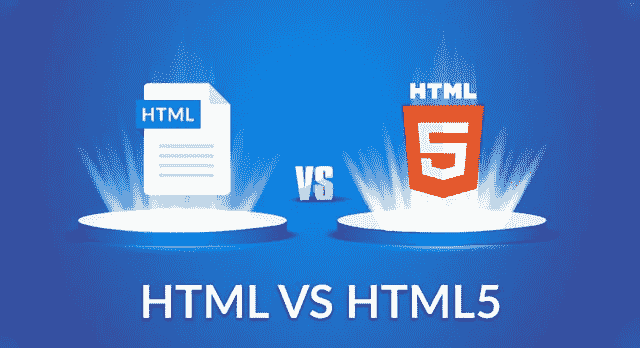

# HTML vs HTML 5:HTML 5 有什么新功能？

> 原文：<https://medium.com/edureka/html-vs-html5-83302f95652e?source=collection_archive---------0----------------------->



HTML vs HTML 5 — Edureka

这个关于 **HTML 与 HTML5** 的比较旨在提供关于这两种标记语言的简明知识，并指导你在构建自己的**网页**或**网络应用**时找到合适的语言。这篇 **HTML vs HTML5** 的文章将按照以下顺序为您提供对这种语言的全面了解:

*   HTML 的历史
*   HTML 和 HTML5 简介
*   两者的比较
*   HTML5 中的新元素

# HTML 的历史

超文本标记语言的历史是一个奇怪而有趣的故事。HTML 背后的人，蒂姆·伯纳斯·李正在为网络**组装他的第一个基本的**浏览**和**创作系统**，并创造了一个快速的小超文本语言来服务于他的目的。**

但是问题在于语言的简单性。HTML 是基于文本的，任何人都可以使用任何编辑器或文字处理器为网络创建或转换文档。开发人员开始在他们的浏览器中实现新功能，并开始发布 **HTML** 的**高级版本**。

# HTML 和 HTML5 简介


**HTML** 代表超文本标记语言，是创建**网页**和**网络应用**的标准标记语言。它用于使用标记来描述网页的结构。


**HTML5** 是 HTML 的第五版，是互联网的核心技术标记语言，用于**结构化**和**向 **www** 呈现**内容。

# 两者的比较

现在让我们看看 HTML5 中添加的所有新元素以及使它比 HTML 更好的因素。

让我们来看看**因素**，我们将使用这些因素对 **HTML 和**HTML 进行**比较**

*   视频和音频
*   向量图形
*   储存；储备
*   网络浏览器支持
*   易用性

## 视频和音频


HTML vs HTML5 的第一个因素是 HTML5 中**音视频**的引入。在 HTML 中没有媒体的概念。但它是第五版的组成部分之一。

## 向量图形


在各种技术的帮助下，如 VML、Flash、Silverlight 等，HTML 中使用了矢量图形。但它是 HTML 5 的组成部分比如 **canvas** 和 **svg** 。这是修订版的新增内容。

## 储存；储备


第三个比较因素是存储。在 HTML 的情况下，我们可以使用**浏览器缓存**作为临时存储，而在 HTML5 的情况下，使用**应用缓存、web SQL 数据库**和 **web 存储**。

## 网络浏览器支持


现在对于 HTML 的第一个版本，所有旧的**网络浏览器**在创建**网页**时运行顺畅。对于 HTML5，新的浏览器已经开始支持它的规范。一些浏览器包括 mozilla firefox、chrome、opera 等。

## 易用性


虽然 HTML5 确实有不断更新的风险，但由于与其他版本的 HTML 相比语法更简单，所以通常很容易跟上变化和更新。例如，在页面的开始有一个非常简单的声明来将其设置为 HTML5 页面，即 **doctype 声明。**

# HTML 5 中的新元素

HTML 与 HTML5 的比较还包括最新版本中添加的新元素和标签。HTML5 提供了许多新元素，并删除了其他几个元素。在新的 HTML 版本中，一些标签被丢弃了，标签的**用法也做了相应的改变。**

让我们来看看在 **HTML5** 中添加的一些重要的**标签**:

## < Audio & Video >

**音频标签**和**视频标签**是 HTML5 的两个主要补充。音频标签和视频标签使开发者能够在他们的网站上嵌入音乐和音频。音频&视频标签也有许多用于附加控制的属性。

```
<audio autoplay=”autoplay” controls=”controls”>
<source src=”music.ogg” />
<source src=”music.mp3″ />
</audio>
```

HTML5 还有一些其他的多媒体属性和元素，比如为视频元素提供文本轨道的**轨道元素**。

## < Canvas >

HTML5 中添加的一个关键元素是

<canvas>，它极大地影响了 **Adobe Flash** 在网站中的使用。< canvas >元素可用于**通过脚本(通常是 JavaScript)绘制各种形状和颜色的图形**。元素只是图形的容器。</canvas>

```
<canvas id=”myCanvas” width=”200″ height=”100″ style=”border:1px solid #000000;”>
</canvas>
```

## < Header > & < Footer >

HTML5 附带的另一个大的增加是新的

和元素，表明一个新的**网络剖析**。有了这些新标签，就不再需要用一个< div >标签来标识这两个元素了。

```
<header>
<h1>Title </h1>
<div class=”post-meta”>
<p>By Author</a> <span class=”category”>Filed in Web 2.0</span></p> 
</div>
</header>
<article>
<p>Body of text</p>
</article>
```

**页脚**放在网页的底部，但也可以放在页面部分的末尾。

```
<header>
<h1>Title </h1>
<div class=”post-meta”>
<p>By Author</a> <span class=”category”>Filed in Web 2.0</span></p> 
</div>
</header>
<article>
<p>Body of text</p>
</article>
```

## < menu >

鉴于网络已经变成了更多的链接页面和文档，

<menu>标签是一个受欢迎的附加功能，可以增强**网络交互性**。它代表桌面和**移动应用**中的简单菜单命令。</menu>

```
<body contextmenu=”new-context-menu”>
<menu id=”new-context-menu” type=”context”>
<menuitem>Hello World</menuitem>
</menu>
</body>
```

至此，我们结束了对 **HTML 和 HTML5** 的比较。我希望你们喜欢这篇文章，并且理解这两个版本之间的区别，以及在使用中 **HTML5 如何更好更简单**。所以，如果你读过这篇文章，你可能会清楚地知道在构建自己的网页时应该选择哪个版本的 HTML。

如果你想查看更多关于人工智能、Python、道德黑客等市场最热门技术的文章，你可以参考 Edureka 的官方网站。

请留意本系列中的其他文章，它们将解释 Web 开发的各个方面。

> 1.[前端开发者技能](/edureka/front-end-developer-skills-ebb32d19f488)
> 
> 2.[前端开发人员简历](/edureka/front-end-developer-resume-c3d443f98296)
> 
> 3.[网络开发项目](/edureka/web-development-projects-b01f0fe85d3f)

*原载于 2019 年 6 月 14 日*[*https://www.edureka.co*](https://www.edureka.co/blog/html-vs-html5/)*。*