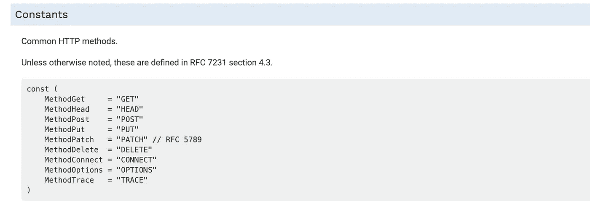
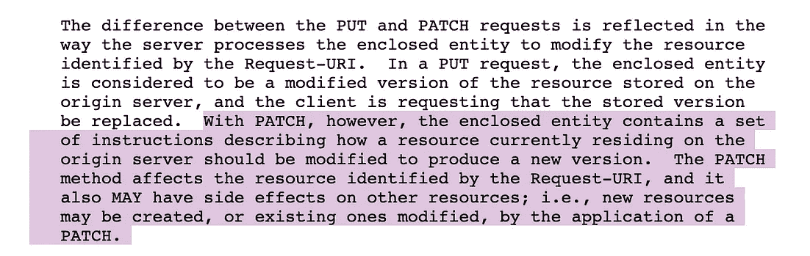
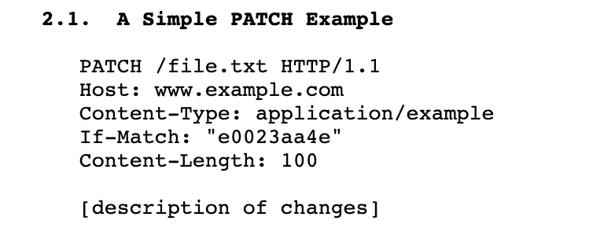
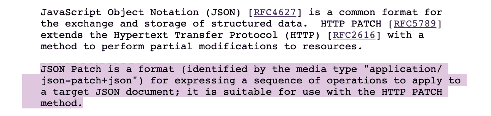

# HTTP —补丁方法！我想错了！！！

> 原文：<https://medium.easyread.co/http-patch-method-ive-thought-the-wrong-way-c62ad281cb8?source=collection_archive---------0----------------------->

## 今天我知道了，人们从来没有告诉我 HTTP-PATCH 的事实！


Photo by [Free To Use Sounds](https://unsplash.com/@freetousesoundscom?utm_source=medium&utm_medium=referral) on [Unsplash](https://unsplash.com?utm_source=medium&utm_medium=referral)

我从事软件工程已经 3 年多了。我很惊讶，在这 3 年里，我从来没有面对任何补丁端点，直到现在。

正因为如此，我以前从未真正使用过补丁方法，也从未开发过它。我记得 3 年前，我第一次向我的学长询问 PUT 和 PATCH 之间的区别时，只是更改了值。PUT 将替换整个项目，并修补更改的指定字段。

就是这样！但事实上，在我的职业生涯中，我们从未使用过补丁方法。原因是那时候我们还不需要。所以我现在带着这个信念生活，无论何时我和别人说话，他们通常都能理解我的意思。

## 我对补丁最初的想法

所以，既然知道了 HTTP 方法和 REST。我只用这些方法，GET，DELETE，POST，和 PUT。我从来没有机会使用补丁。

我们清楚地知道看跌期权是如何运作的。我已经用 PUT 很长时间了。比如我有这个 JSON。我在做 PUT 操作。

```
GET /user/bxcodec
{
  "name": "Iman",
  "username": "bxcodec"
}
```

应用 HTTP PUT

```
PUT /user/bxcodec
{
  "name": "Iman Tumorang",
  "username": "bxcodec"
}
```

决赛成绩

```
GET /user/bxcodec
{
  "name": "Iman Tumorang",
  "username": "bxcodec"
}
```

然后，从 PUT 中派生出 PATCH，从人们所说的“ **PATCH 不能替换整个项目，而只能替换指定的一个**

因此，从声明来看，默认情况下，这就是我认为补丁工作方式。比如我有这个 JSON。

```
GET /user/bxcodec
{
  "name": "Iman",
  "username": "bxcodec"
}
```

应用 HTTP 补丁

```
PATCH /user/bxcodec
{
  "name": "Iman Tumorang"
}
```

决赛成绩

```
GET /user/bxcodec
{
  "name": "Iman Tumorang",
  "username": "bxcodec"
}
```

对吗？这是我认为 HTTP-PATCH 应该工作的方式。我带着这个信念生活了 3 年多。

## 情节曲折

但是，就在刚才，当我写这篇文章的时候，我在 Golang docs 上找到了这个:[https://golang.org/pkg/net/http/](https://golang.org/pkg/net/http/)



出于好奇，我注意到这里有一个不同的值，我发现了一个关于`RFC 5789`的评论。为什么它有不同的 RFC，不像其他的？为什么不一样？

看了一下 RFC 5789，发现一个很诡异的事情。从描述来看，



RFC 5789

> 然而，对于 PATCH，封闭的实体**包含一组指令**，描述当前驻留在源服务器上的资源应该如何被修改以产生新版本。

因此，在 RFC 文档中，它说，在请求体中，我必须指定一组操作或指令来修改请求 URI 中的当前资源。正如我们在上面的例子中看到的。但是我如何在请求体中设置动作呢？我应该如何格式化它？

## JSON 补丁简介

要回答前面的问题，我应该如何在我的请求正文中格式化动作列表？我发现了一个有趣的事情，是另一个 RFC 叫 JSON-Patch (RFC 6902)。这是一个解释如何使用 JSON-Patch 进行 JSON 操作的 RFC。

JSON-PATCH 如何工作的一个简短例子更像这样。例如，我们这里有一个 JSON。

```
{
  "name": "Iman",
  "username": "bxcodec"
}
```

使用 JSON 补丁。

```
[
  { "op": "replace", "path": "/name", "value": "Iman Tumorang" },
  { "op": "add", "path": "/likes", "value": ["go", "blogging"] }
]
```

修补结果。

```
{
  "name": "Iman Tumorang",
  "username": "bxcodec",
  "likes": [
    "go",
    "blogging"
  ]
}
```

所以在 JSON-PATCH 中，我必须定义修改资源的操作、路径和值。所有可用的命令都可以在 [RFC6902](https://tools.ietf.org/html/rfc6902) 中看到。

令人惊讶的是，HTTP 补丁和 JSON 补丁有关联。当我打开 RFC 6902，我得到了这个。



RFC 6902

> json 补丁是一种格式(由媒体类型“application/ json-patch+json”标识)，用于表达应用于目标 JSON 文档的操作序列；**适合与 HTTP 补丁方法**一起使用。

抓住你了。

因此，简单地说，对于 HTTP-PATCH，我们可以对请求体使用 JSON-PATCH。所以请求体的动作列表，我们可以用 JSON-PATCH 来定义。

所以，把 HTTP-PATCH 和 JSON-PATCH 结合起来，如果我把它放到一个例子中，它会更像下面这样。

```
GET /user/bxcodec
{
  "name": "Iman",
  "username": "bxcodec"
}
```

应用 HTTP 补丁

```
PATCH /user/bxcodec
[
  { "op": "replace", "path": "/name", "value": "Iman Tumorang" }
]
```

最终结果。

```
GET /user/bxcodec
{
  "name": "Iman Tumorang",
  "username": "bxcodec"
}
```

## 结论

今天，在带着错误的信念生活之后，我学到了新的东西。HTTP-PATCH 有一种不同的实现方式。我们可以使用 JSON-PATCH 作为 HTTP-PATCH 请求方法的请求体。

但是，我不知道，说实话，我还是觉得这种方式不太方便。与我过去的想法相比，它增加了我们实现的额外一层。幸运的是，已经有很多 JSON 补丁库了，比如 Golang 的 https://github.com/evanphx/json-patch、Typescript 的 https://www.npmjs.com/package/fast-json-patch[等等。所以我认为在我的下一个项目中实现它并不困难。不过是啊，让我们看看哈哈。](https://www.npmjs.com/package/fast-json-patch)

但是，是的，即使直接改变补丁的值更方便(不使用 JSON-PATCH，也不遵循 RFC 5789 ),哈哈，我会在我的下一个项目中尝试遵循这一点。

*原发布于我的个人博客:*[*https://bxcodec . io/posts/http-patch-method-ive-thought-the-wrong-way/*](https://bxcodec.io/posts/http-patch-method-ive-thought-the-wrong-way/)