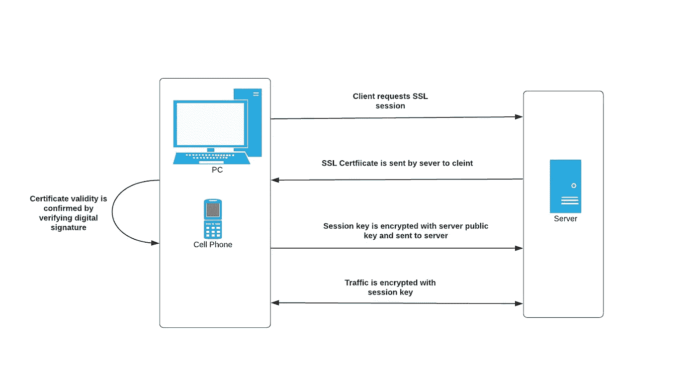
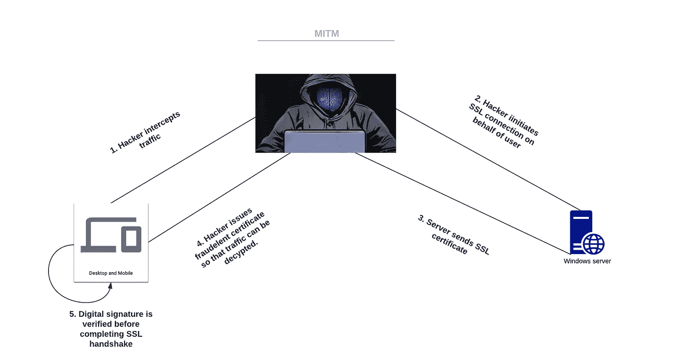
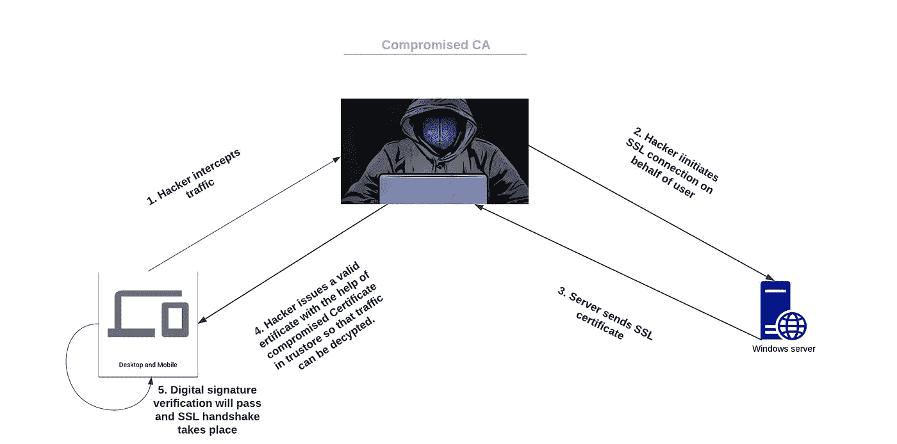
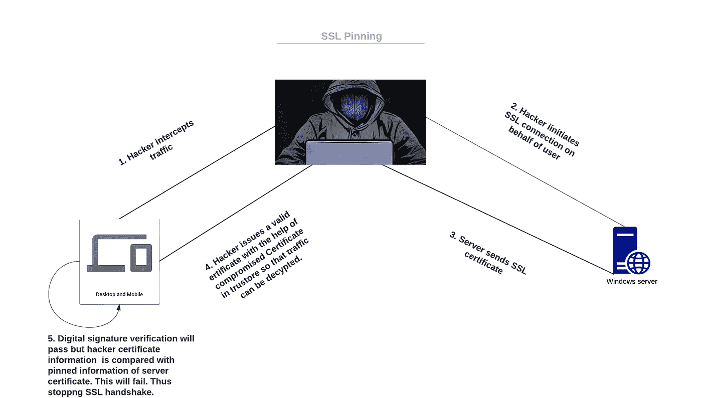

# 移动 HTTP SSL 锁定:解码未知

> 原文：<https://medium.com/walmartglobaltech/http-ssl-pinning-decoding-the-untold-1fa751c63c3e?source=collection_archive---------1----------------------->

HTTPS 是一种与服务器通信的安全方式。这个标准已经被接受了很长一段时间，十年来一切都很好。随着黑客技术的进步，传统的建立安全 SSL 连接的方式已经不能满足当今的安全需求。这种需求催生了 SSL pinning。SSL pinning 越来越受欢迎，在移动应用程序中被广泛采用，最近甚至浏览器都支持 web 应用程序的 pinning。

Image Source[https://pixabay.com/photos/post-it-note-office-list-memo-1277427/](https://pixabay.com/photos/post-it-note-office-list-memo-1277427/)

要解码 SSL 固定的目的，我们需要首先弄清楚两个概念。

*   握手期间的 SSL 证书验证。
*   MITM 攻击

**握手期间的 SSL 证书验证。**

从握手开始，最重要的一步是第二步。在这里，应用程序在信任存储中已经存在的根 CA 的帮助下验证服务器提供的证书是否有效。这种验证是通过在信任存储中已经存在的根 CA 公钥的帮助下确认证书是否被数字签名来完成的。现在，让我们试着了解一下，如果有人试图拦截流量，在进行这种验证的情况下会发生什么。这导致了 MITM 的攻击。

SSL certificate verification during the handshake

**MITM 遇袭**

让我们理解这种攻击的流程，稍后我们将看到 SSL 认证验证如何防止 MITM 攻击。

MITM flow

假设:一个真正的用户正试图访问 xyz.com，这是一个有效的网站，具有由 CA 之一颁发的有效 SSL 证书。

**第一步:**与真实用户在同一个局域网上的黑客截获 SSL 握手。

第二步:黑客现在将通过启动他的 SSL 连接作为 xyz.com 的真正用户。

**第三步**:黑客在握手过程中收到来自 xyz.com 的证书。

**步骤 4** :黑客不是将 xyz.com 证书转发给正版用户，而是将自己的证书提供给正版用户。

**第五步**:证书验证发生在客户端。

**第六步:**黑客开始解密所有网络流量，并开始查看。

在步骤 4 中，出现了一个问题，黑客为什么要发布他的证书？

原因是他只拥有他发给真正用户的相应证书的私钥。因此，黑客将能够解密 SSL 流量。如果黑客传递了由 xyz.com 颁发的相同证书，那么黑客就不能解密流量，因为黑客没有对应于 xyz.com 证书的私钥。这仅适用于 xyz.com。

现在我们知道了 MITM 是如何发生的。让我们看看，这种攻击在现实世界中有效吗？我上面描述的流程将会实时失败。因为证书的数字签名是在客户端验证的。从而防止用户接受无效证书并成为 MITM 的受害者。通常，每当应用程序遇到无效证书时，应用程序就会停止握手或请求用户同意继续。

好哇！！！所以我们是安全的，SSL 握手会检查我的连接是否安全，并保护我免受 MITM 攻击。

等等，我们有没有考虑过这样一种情况，其中一个根 CA 遭到破坏，或者黑客已经能够将他自己的 CA 推入您的客户端信任存储中？:(

上述问题引导我们找到了两种实现 MITM 的方法:

**案例 1:黑客攻破了一个真正的根 CA(这意味着黑客拥有用于签署证书的 CA 的私钥)**

由于黑客拥有有效的根 CA 私钥，他可以开始为他选择的任何域生成有效的证书。因此在 MITM 的第 4 步中，颁发给客户端的证书将是有效的。因此，导致一个成功的 MITM。

由于已经存在的根 CA 被黑客破坏，他可以对任何用户执行 MITM。

**案例 2:黑客将自己的 CA 推送到客户端信任库**

由于黑客自己的 CA 证书被推送到客户端的信任库，他可以开始为他选择的任何域生成他的有效证书。因此在 MITM 的第 4 步中，颁发给客户端的证书将是有效的。因此，导致一个成功的 MITM。

这里，因为黑客的根 CA 被推入客户端信任存储，所以 MITM 仅限于黑客的根 CA 被推入的客户端。

以上两种情况可以总结在下图中:

MITM flow with compromised CA

案例 1 和案例 2 有共同的解决方案吗？

这就是 SSL 固定概念的由来。SSL 固定在防止 MITM 的 SSL 验证中又增加了一步。

**什么是 SSL pin？**

SSL 固定意味着在客户端固定(或硬编码)与证书相关的信息，以验证证书是否有效。不要将这与证书的数字签名验证混淆，两者是两个不同的概念。随着我的解释，进一步的概念将变得更加清晰。

可以固定的证书相关信息列表包括:

*   服务器证书本身
*   证书散列
*   证书中存在的公钥
*   公钥的哈希

SSL pin 验证的流程如下:

SSL pinning verification flow

可以看出，通过交叉检查数字签名来验证证书是否有效。还需要一个验证步骤。在此步骤中，应用程序验证服务器证书的已锁定信息是否与 SSL 握手期间发布的证书信息相匹配。这就是 SSL 固定的全部含义。

现在出现的问题是，SSL pin 如何防止前面描述的 MITM 的情况 1 和情况 2？

在 MITM 的步骤 5 中，如果我们注意到黑客必须发布他的证书，该证书可能是由有效的 CA 签署的有效证书。在这种情况下，签名验证将通过，但是，固定的信息将是服务器证书的信息，它将与黑客颁发的证书不匹配。因此，在两种情况下都防止了 MITM。

总结一下，我们已经了解了使用 SSL 固定的原因，什么是 SSL 固定？又是如何实现的？。尽管如此，我还没有提供关于如何实现 pinning 的信息，这是最好的 pinning 方式，pinning 的任何缺点，以及我们如何克服笔测试的 SSL pinning。敬请关注即将到来的博客，在那里我将解释所有这些有趣的概念。

**参考文献:**

[https://developer . Android . com/training/articles/security-SSL](https://developer.android.com/training/articles/security-ssl)