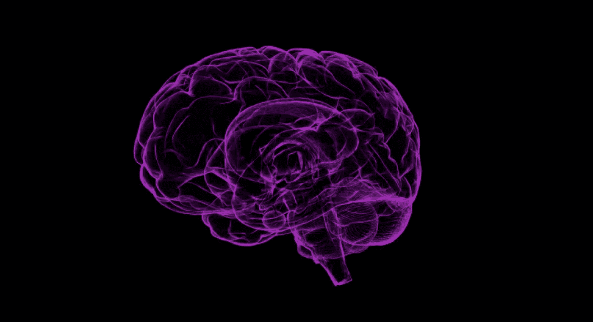

# 谁害怕机器学习？第一部分:他们都在谈论什么？！？

> 原文：<https://medium.com/google-developer-experts/https-medium-com-britt-barak-whos-afraid-of-ml-part1-e464264c3cf0?source=collection_archive---------3----------------------->

## ML 简介(面向移动开发者。)

最近，似乎每个人都在谈论 AI，ML，DL…当这种炒作开始时，我对所有这些新术语感到有点压力。作为一名开发人员，这一切对我意味着什么？

**我不是数据科学家，也不是机器学习专家。**我是一名非常好奇的移动开发者，她做了一些研究。我创建了这一系列的博客文章和演讲，用我希望他们能向我解释的方式来解释事情。

本系列旨在以一种易于掌握的方式解释 ML 中的一些基本概念。然后将演示如何使用 ML-Kit 和 TensorFlow Lite 将 ML 付诸实践。它不会提供深入的数据科学知识，但旨在提供(移动)开发人员需要了解的实用介绍，以便开始开发更智能的应用程序(或..具有 ML 功能的应用😁)

## **本系列:**

1.  **第一部分**:他们都在说什么？ **(←你在这里**🍓 **)**
2.  [**第二部分**:如何让一台机器学习？](/@britt.barak/whos-afraid-of-machine-learning-part-2-making-a-machine-that-can-learn-a3c6d2715e26)
3.  [**第三部分**:关于学习的更多内容](/@britt.barak/whos-afraid-of-machine-learning-part-3-about-that-learning-85a8bf336b5a)
4.  [**第四部分**:走向移动！ML-Kit 为什么和如何？](/@britt.barak/whos-afraid-of-machine-learning-part-4-going-mobile-ml-kit-why-how-200f245ef8f8)
5.  第 5 部分:使用本地模型(即将在✨推出)
6.  第 6 部分:使用云模型(即将在✨发布)
7.  第 7 部分:使用定制模型(即将在✨发布)

自古以来，人类一直着迷于大自然是如何运作的，以及他们如何利用它为自己谋利。

例如:当人类想要创造一个可以在空中飞行的机器时，他们用什么作为灵感？

[Jordan Sanchez](https://unsplash.com/@jordaneil?utm_source=medium&utm_medium=referral) on [Unsplash](https://unsplash.com?utm_source=medium&utm_medium=referral)

他们利用了鸟类翅膀和胸部的解剖结构！

当他们想制造能探测水下物体的机器时，或者在他们几乎看不见的黑暗中，他们用什么作为灵感呢？

[Kieren Andrews](https://unsplash.com/@kierenjandrews?utm_source=medium&utm_medium=referral) on [Unsplash](https://unsplash.com?utm_source=medium&utm_medium=referral)

他们受到蝙蝠和海豚的启发，创造了基于声纳的探测器！

20 世纪 90 年代，日本的工程师受子弹的启发，创造了子弹头列车..没有那么多的自然😊它被设计成骑得非常快。时速可以达到 180 英里/300 公里左右。问题是当它穿过隧道时声音非常大，几英里外你都能听到。科学家用什么做灵感？

[Fikri Rasyid](https://unsplash.com/@fikrirasyid?utm_source=medium&utm_medium=referral) on [Unsplash](https://unsplash.com?utm_source=medium&utm_medium=referral)

有一只非常可爱的小鸟叫费希尔国王。它很特别，因为它可以飞得很快，潜入水中，抓鱼，出去时几乎不溅起水花！这要归功于它的喙和头的结构，科学家们用它作为灵感来修复子弹头列车。

当人类想要创造一个可以学习的机器，获取数据并从中得出结论。他们会用什么来激发灵感呢？自然界中学习的东西…你猜对了！大脑！

# 大脑是如何学习的？

我们的大脑包含许多称为神经细胞的粒子，也称为神经元。每个神经元基本上只是一小段信息，一点数据。

我们大脑中有多少这样的东西？一千亿！听起来很多。但是 1000 亿是多少呢？如果你拿起 1000 亿张纸，把它们一张一张地叠起来，高度将达到 5000 英里/8500 公里，这相当于伦敦和洛杉机[T3【乔·迪彭扎博士】之间的距离。】](http://www.drjoedispenza.com/)

一个神经元，一点信息，并不意味着什么。就像一整本书里面的一封信。当一点数据没有上下文时，它只意味着一点点。一个字母和一个字母连在一起组成一个单词，这个单词比单个字母有更多的含义。然后，一个单词和另一个单词连接起来组成一个句子，这个句子有更多的含义。当我们把句子连接在一起，一本书就形成了，它有很多含义。

同样的，神经元，我们的信息，倾向于连接到相同背景的其他神经元，在实际的物理连接中，称为突触。一个神经元其实有很多连接(或突触)，在 10k-40k 之间。相互连接的神经元在我们的大脑中形成了某种群落或网络，我们称之为 ***神经网络*** 。对于我们的每一项技能或习惯，我们都有一个神经元社区，它包含了技能或习惯的信息。这样，我们就有了一个网络，例如，一个弹吉他的网络，一个练习瑜伽的网络，一个开发安卓系统的网络…

每当我们学习新的东西，一个新的神经元就会产生，并与其他相关的神经元相连。因此，每当我们学习新的东西时，我们的大脑中就会产生实际的物理联系，或者更准确地说是成千上万的物理联系。

这是学习的真实物证。神经元之间建立了新的连接。这是慢动作，质量也没那么好..但是..多棒啊。！？

## 暂时就这样了

这是我们大脑中发生的一点点事情。我们怎么把它翻译成机器？让机器像我们的大脑一样学习？

在下一篇文章中，我将展示一个例子，让这个概念对我们来说变得切实可行。这将是一个非常简单的方法，我将要提到的任何方法都有很多变体。但是这个想法是为了给我们一个切实的感觉，让我们知道它是如何工作的。

那里见！(→【http://bit.ly/brittML-2】T2←)**😍**👏🍓

## 链接:

这个系列基于我做过的一些演讲。

更新的**版本 2** 的幻灯片在这里:[bit.ly/BrittMLKit](http://bit.ly/BrittMLKit)。会议视频即将发布。

**版本 1** 在 MLKit 之前给出。几个视频是[这里](https://youtu.be/8YDt2J7dHXA) ( *安卓创客 2018* )和[这里](https://www.youtube.com/watch?v=rlcsZ5c-VB0) ( *芝加哥机器人 2018* )。