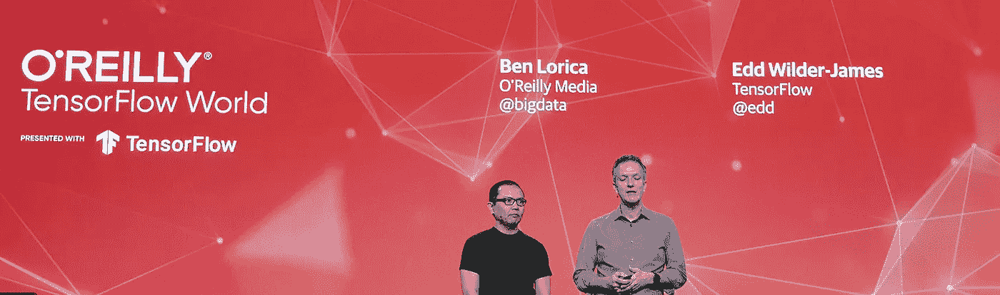
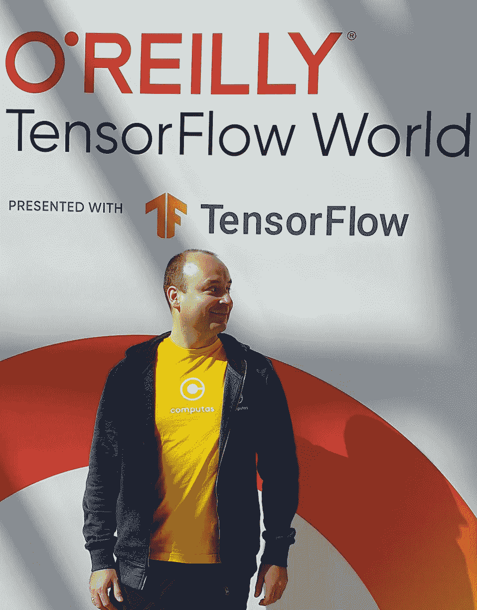

# 奥莱利 2019 年张量流世界集锦

> 原文：<https://medium.com/compendium/https-medium-com-grensesnittet-tf-world-2019-bf2a352807e3?source=collection_archive---------1----------------------->

Ben Lorica and Edd Wilder-James welcoming us to TensorFlow World 2019

在参加了世界上最大的 TensorFlow 专家和爱好者聚会后，我现在正在返回挪威的路上。这次会议是由奥赖利组织的。前两天用于指导，后两天用于会议的主要项目。请看一下[会议日程](https://conferences.oreilly.com/tensorflow/tf-ca/schedule/2019-10-28)中的项目概述和相关的 [YouTube 频道](https://www.youtube.com/playlist?list=PLQY2H8rRoyvxcmHHRftsuiO1GyinVAwUg)中的讲座将在大约三周后发布。

Me at the registration booth

会议重点关注以下主题:

*   [TensorFlow 2.0](https://www.tensorflow.org/guide/effective_tf2)
*   [Kubeflow](https://www.kubeflow.org/) ，Kubernetes 的机器学习工具包。
*   [张量流扩展](https://www.tensorflow.org/tfx/) (TFX)。如果你不熟悉 TFX，你可以把它看作是谷歌开源的关于如何建立机器学习管道的一套最佳实践模板。

接下来，我将只讨论对我影响最大的几个讲座。这当然是我个人的偏见，因此，鉴于我的个人经历，它只是探索了会议的“一部分”。请看看其他谈论他们在 TensorFlow World 的经历的帖子，以便更好地了解这个伟大的会议。

# [延伸 TensorFlow 的生产 ML 管道(TFX)](https://conferences.oreilly.com/tensorflow/tf-ca/public/schedule/detail/79404)

这个教程是由 Aurélien Géron 带领的，他做了一件很棒的工作，带领我们浏览了来自 TFX 的所有组件，以建立端到端的管道。该研讨会是围绕 colab 笔记本电脑组织的，您可以在下面的 [GitHub repo](https://github.com/tensorflow/workshops/tree/master/tfx_labs) 中亲自尝试。笔记本写得非常好，即使你没有参加辅导，你也应该能够遵循重要的步骤。其他几位演讲者向我们介绍了以下主题(在上面提到的报告中有相应的笔记本和演示):

*   TFX 的公平指标。他们刚刚在会议期间被释放。这是如何测量张量流偏差的第一步。目前，还没有实现缓解算法，它们只是关注分类问题。IBM 已经有了一个很棒的库 [AIF360](https://github.com/IBM/AIF360) ，它不仅能检测偏见，还能减轻偏见。我相信，如果这两个项目共同努力，使我们处理公平问题的方式标准化，社区将从中受益。我们需要更少的工具来解决同样的问题，更好地理解如何从抽象的道德原则到公平的正确技术实现。在会议期间，我花了一些时间向这些项目中的 Google 和 IBM 团队游说这个想法，看起来他们已经开始一起讨论这些问题了。我真的希望他们能得到卓有成效的合作，从而使整个社区受益。[谷歌](https://conferences.oreilly.com/tensorflow/tf-ca/public/schedule/detail/79001)和 [IBM](https://conferences.oreilly.com/tensorflow/tf-ca/public/schedule/detail/80790) 都就人工智能的道德使用进行了讨论。确保在讲座开始时观看！
*   如何在 Google Cloud 中用 TFX 构建 CD/CI 管道(此处[有代码](https://github.com/jarokaz/tfx-kfp-demo))。如果您要将 TFX 集成到 CI/CD 管道中，这是一个很好的起点。代码带有 Terraform 脚本，可以在 GCP 自动完成整个设置。你绝对应该检查代码并尝试一下！
*   [神经结构化学习](https://www.tensorflow.org/neural_structured_learning) ( [视频](https://www.youtube.com/watch?v=2Ucq7a8CY94&list=PLQY2H8rRoyvxcmHHRftsuiO1GyinVAwUg&index=13&t=0s))，解决如何在数据中定义结构的问题。这通常是你的特征中没有表现出来的东西，这种技术允许你在你的例子之间建立关系。这种技术的一个应用是当你只有很少的标记数据时增加模型的准确性，或者使你的模型对敌对攻击具有鲁棒性。
*   [TensorFlow 发球](https://conferences.oreilly.com/tensorflow/tf-ca/public/schedule/detail/78365)。是的，不要用 Gunicorn / Flask 进行深度学习推理。它不是针对这种工作负载优化的，如果你做错了，你可能会阻塞你的 GPU，还有其他几个问题。当它变得可利用的时候看谈话。

总而言之，这是一个奇妙的教程。但是，让我对没有涵盖的内容进行挑剔，考虑到时间限制，这是可以理解的:

*   超参数调谐。我不太清楚如何对模型进行超参数调整。我猜一种方法是创建一个自定义组件(repo 上有一个示例笔记本)。在与 TFX 团队交谈后，我听说他们正在开发一个标准组件来解决这个问题，并使事情变得更简单。
*   固定随机种子的可重复性。据我所知，随机种子是不暴露在 TFX 从梁实施的一些组成部分。我可能误解了这里，但我正在与 TFX 团队讨论，当我知道更多的时候，我会更新这个帖子。
*   更好的采样技术。TFX 提供了一种[收集数据统计](https://www.tensorflow.org/tfx/guide/statsgen)的方法。这些在流水线的下游被用于检测异常，例如特征偏斜、不良训练/测试分离或模型偏差等等。在我看来，对数据进行第一轮处理并计算整个数据集的统计数据是非常有益的。然后，可以有一个标准的机制来在训练/测试/评估中分割数据，给定那些统计数据(并且可能有其他限制来防止数据泄漏)。这将是一种预防性措施，而不是在稍后阶段发现数据的不平衡并重新进行整个过程。据我所知，目前在 TFX 没有“简单”的方法进行这种取样。但是一个好的起点是使用 Beam 的[复合转换](https://cloud.google.com/blog/products/gcp/keys-to-faster-sampling-in-cloud-dataflow)并构建自己的 TFX 组件。有人要吗？

# [使用 MLflow 模型注册中心管理 TensorFlow 模型的整个部署生命周期(由 Databricks 赞助)](https://conferences.oreilly.com/tensorflow/tf-ca/public/schedule/detail/80581)

克莱门斯·梅瓦尔德

这是一个很好的概述，介绍了 MLFlow 如何帮助您在构建 ML 管道时跟踪实验。该讲座对正常软件开发和机器学习的开发工作流程的差异进行了很大的比较。然后，Clemens 给了我们一个关于 MLFlow 如何解决普通软件开发工具没有覆盖的部分的很好的概述。最后，我们得到了 MLFlow 新的[模型注册表](https://mlflow.org/docs/latest/registry.html)的演示，它展示了一个很棒的用户界面，团队可以在这里一起工作，共享、实验、测试和监控 ML 模型。它还提供了一种与审批和治理工作流集成的方式。总而言之，对我们从业者来说是一个很棒的工具！

据我所知，在 TFX 或 Kubeflow 中没有一个组件具有与 MLFlow 的模型注册中心所提供的功能等同的功能。但是，来自 Kubeflow 贡献者的会议谣言告诉我们，在这个问题上有一项工作正在进行中，这样一个组件很快就会发布。在我看来，社区必须共同努力来标准化模型治理的可用格式，这样我们就可以跨技术工作并减少碎片化。从我得到的谣言来看，人们已经在沿着这些路线思考了，所以希望事情会进展顺利。

# [tensor flow 2.0 中具有 tf.data、tf.function 和 tf.distribute 的高性能、可扩展模型](https://conferences.oreilly.com/tensorflow/tf-ca/public/schedule/detail/79318)

由[泰勒·罗比](https://conferences.oreilly.com/tensorflow/tf-ca/public/schedule/speaker/358954)和[普里亚·古普塔](https://conferences.oreilly.com/tensorflow/tf-ca/public/schedule/speaker/327320)主持。([视频](https://www.youtube.com/watch?v=yH1cF7GnoIo&list=PLQY2H8rRoyvxcmHHRftsuiO1GyinVAwUg&index=7&t=0s))

如果你关心如何优化 TensorFlow 管道以获得最佳性能，你应该看看这个演讲。它提供了许多实用的技巧，你可以在下面的 [Colab 笔记本](https://colab.research.google.com/gist/robieta/9463e86b5501541a441d431b9c4f1a1e/tf_world.ipynb)中尝试，同时[观看](https://www.youtube.com/watch?v=yH1cF7GnoIo&list=PLQY2H8rRoyvxcmHHRftsuiO1GyinVAwUg&index=7&t=0s)演讲。

# [TensorFlow 隐私:针对训练数据的差分隐私学习](https://conferences.oreilly.com/tensorflow/tf-ca/public/schedule/detail/78650)

谈话者[乌尔法·厄林松](https://conferences.oreilly.com/tensorflow/tf-ca/public/schedule/speaker/349663)

这是整个会议中对我影响最大的一次演讲。它解决了一些我一直想知道的问题。演讲的重点是什么是[差分隐私](https://en.wikipedia.org/wiki/Differential_privacy)，如何用隐私训练机器学习模型，以及如何使用 [tensorflow.privacy](https://github.com/tensorflow/privacy) 库。

你的第一个想法可能是:“当然，隐私，嗯，我的数据不是敏感的，所以我不需要它”，你就错了！

> “……差别隐私是一种稳定性保证，从根本上符合统计学的核心目标，即从关于全体人口而不是特定个人的数据中学习。”
> [http://blog . mrtz . org/2015/03/13/practicing-differential-privacy . html](http://blog.mrtz.org/2015/03/13/practicing-differential-privacy.html)

隐私训练将帮助您的模型从总体中学习，以便它能够进行归纳。神经网络倾向于[记忆训练数据](https://bair.berkeley.edu/blog/2019/08/13/memorization/)，尤其是位于数据分布尾部的数据。非正式地说，当你进行隐私训练时，你的训练方式是，用某个单独的例子进行训练所得到的模型输出，与你一开始没有用那个例子进行训练所得到的模型输出非常相似。我知道，这听起来像魔法，从某种意义上说，引擎盖下有一些很好的数学咒语！

该技术的一个好处是，在给定模型如何“看到”数据的情况下，它允许您以一致的方式定义训练数据上的哪些实例是“良好表示的”。这里的直觉是，你可以获得一个“分数”，让你按照“异常值等级”对训练数据进行排序(例如，参见 [arxiv:1910.13427](https://arxiv.org/abs/1910.13427) ，第 7 节)。这需要在启用隐私的情况下反复训练几次。这里的好处是，它告诉你什么样的数据已经足够，什么样的数据你需要收集更多。所以这也可以作为一种可解释性技术来使用(参见 [arxiv:1910.13427](https://arxiv.org/abs/1910.13427) ，第 4 节)！lfar 告诉我，即将发布的代码将让我们以更具体的方式来处理这些想法。我真的很期待！等我拿到代码的链接我会更新文章的。

另一个优势是符合 GDPR 协议。当你对一个特定的用户数据进行训练，而用户请求删除他/她的数据时会发生什么？是不是一定要扔掉你的模型重新开始？好吧，如果你够聪明，受过隐私保护训练，你什么都不需要做！这个模型真的不记得你用来训练它的任何特定例子。这是因为当你使用差分隐私时，你对你的算法可能泄露的关于其输入的信息设置了界限(见第 9.3 节 [arxiv:1802.08232](https://arxiv.org/abs/1802.08232) )。

一个很酷的应用是针对敏感数据微调语言模型，比如 [BERT](https://arxiv.org/abs/1810.04805) 。在启用隐私的情况下进行这种微调，将允许您获得一个尊重用户隐私的模型。

这里要记住的一个很酷的提示是，如果训练和评估损失函数的曲线图在收敛时彼此非常接近，那么您的模型在启用隐私的情况下训练正确。直觉上，这是因为模型不应该能够区分哪些数据来自训练集，哪些来自评估集。

通常，当您使用这种技术时，您会发现性能有所下降。这并不坏，因为这也将保护你的模型架构不至于过度适应给定的问题(见 [arxiv:1806.0045](https://arxiv.org/abs/1806.00451) )。因此，您可以更好地评估您的模型在现实世界中的真实技能。希望你现在和我一样确信在可能的时候使用这种技术。这项技术的一个警告是，你将不得不喝比平时更多的咖啡，因为训练时间可能增加 10-100 倍(参见第 10.1 节 [arxiv:1802.08232](https://arxiv.org/abs/1802.08232) 了解局限性和未来工作的完整概述)。

# [使用变压器架构的自然语言处理](https://conferences.oreilly.com/tensorflow/tf-ca/public/schedule/detail/78333)

由[奥雷连·盖伦](https://conferences.oreilly.com/tensorflow/tf-ca/public/schedule/speaker/270099)主讲

这次演讲最终给了我深入了解变压器架构的最后动力。Aurélien 以一种漂亮而直观的方式解释了这些架构是如何组合在一起的，以及每个组件的作用。如果你一直在等待那个推送，我真的向你推荐他的演讲。

The conference opened an amusement park for us to celebrate Halloween!

# 结论

总而言之，来到 TensorFlow World 2019 是一次很棒的经历。我与其他参与者、TFX 的团队、谷歌、英伟达、IBM 和一些演讲者进行了许多精彩的讨论。我回到家里，对社区的知识感到谦卑，并对如何解决我们客户面临的问题充满了最佳实践和新想法。

最后，我可能对 TensorFlow World 的其他演讲极不公平。老实说，有很多次我很难选择一个演讲，因为有这么多伟大的演讲者。幸运的是，你可以关注 [TensorFlow 的 Youtube 频道](https://www.youtube.com/playlist?list=PLQY2H8rRoyvxcmHHRftsuiO1GyinVAwUg)，选择你感兴趣的讲座。让我在评论中知道哪些其他的谈话对你影响最大。

如果你想讨论更多关于张量流、TFX、库伯流、可解释性或公平性的问题，我很乐意[与你](https://www.linkedin.com/in/marcobertaniokland/)联系。如果您想了解我们如何帮助您的使用案例，您可以访问我们的[主页](https://computas.com/tjenester/skyteknologi)并联系我们！

# 有用的链接

我给你们留下了一个列表，里面有一些来自 TensorFlow World 其他讲座和教程的有趣链接。感谢 Rahul Joglekar 提供的一些链接！

*   文本分类有 https://github.com/lapolonio/text_classification_tutorial
    伯特 [T5](https://github.com/lapolonio/text_classification_tutorial)[https://github.com/lapolonio?tab=repositories](https://github.com/lapolonio?tab=repositories)
*   零到 ML 英雄
    [https://colab.research.google.com/github/lmoroney/](https://colab.research.google.com/github/lmoroney/)
    [https://codelabs . developers . Google . com/codelabs/tensor flow-lab3-convolutions/# 0](https://codelabs.developers.google.com/codelabs/tensorflow-lab3-convolutions/#0)
*   无博士的递归神经网络
    [https://github . com/Google cloud platform/tensor flow-without-a-PhD/tree/master/tensor flow-rnn-tutorial](https://github.com/GoogleCloudPlatform/tensorflow-without-a-phd/tree/master/tensorflow-rnn-tutorial)
*   没有博士学位的 tensor flow
    [https://github . com/Google cloud platform/tensor flow-without a-PhD](https://github.com/GoogleCloudPlatform/tensorflow-without-a-phd)
*   雨燕为张量流在 3 小时内
    https://github.com/AIwithSwift/TFWorld2019-SwiftIn3Hours
*   张量流世界:用张量流进行隐私保护机器学习
    [https://github.com/dropoutlabs/tf-world-tutorial](https://github.com/dropoutlabs/tf-world-tutorial)
*   来自 https://github.com/teamdatatonic/tf-sampling 的数据张量流采样
*   张量流模型优化
    [https://www.tensorflow.org/model_optimization](https://www.tensorflow.org/model_optimization)

# 承认

我要感谢 [Ole-Magnus Bergby](https://www.linkedin.com/in/bergby/) 、 [Michael Gfeller](https://www.linkedin.com/in/michaelgfeller/) 和 [Josephine Honoré](https://www.linkedin.com/in/josephine-honor%C3%A9-79125047/) 对本文早期草稿的反馈。