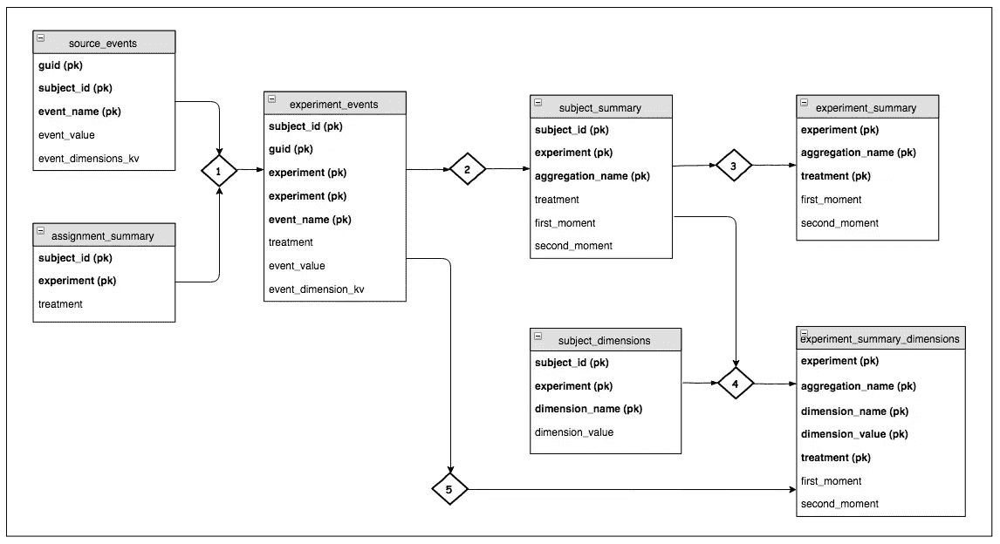

# 扩展 Airbnb 的实验平台

> 原文：<https://medium.com/airbnb-engineering/https-medium-com-jonathan-parks-scaling-erf-23fd17c91166?source=collection_archive---------5----------------------->

在 Airbnb，我们在用户体验和产品功能上不断迭代。这可能包括改变网站或原生应用的外观和感觉，优化我们的智能定价和搜索排名算法，甚至为我们的电子邮件活动确定正确的内容和时间。对于这项工作的大部分，我们利用我们的内部 A/B 测试平台——实验报告框架(ERF ),来验证我们的假设并量化我们工作的影响。阅读关于 ERF 的[基础知识和我们关于口译实验的](/airbnb-engineering/experiment-reporting-framework-4e3fcd29e6c0)[哲学](/airbnb-engineering/4-principles-for-making-experimentation-count-7a5f1a5268a)。

ERF 于 2014 年推出，最初是一种工具，它允许用户用一种通用的配置语言定义指标，然后计算并展示这些指标，用于一小组实验。从那以后，在 ERF 中运行的并发实验的数量从几十个(2014 年)增长到大约 500 个并发实验(在本文发表时)。更令人印象深刻的是，每天计算的指标数量呈指数级增长，从几十个开始(2014 年)。今天，我们每天计算大约 2500 个不同的指标，以及大约 50000 个不同的实验/指标组合。我们还引入了几个高级功能(例如维度削减、全球覆盖、预分配偏差检查)，这些功能增加了我们的扩展挑战。这篇文章探索了我们在 Airbnb 解决这些问题的建筑方法，以及我们在这个过程中必须考虑的权衡。

# 初始设计

ERF 结果最初是通过每天执行的 Ruby 脚本计算的。这个脚本是一个简单的查询生成器，它为每个实验组装并运行一个巨大的、单一的 Hive 查询。这种方法有几个问题:

1.  查询会多次扫描源表，导致效率低下。
2.  查询的整体性质不支持“检查点”；因此，当遇到故障时，必须重新处理所有工作。这就形成了一个反馈回路。由于查询需要更多的时间来完成，这增加了失败的可能性。这反过来导致更多的集群拥塞，并最终导致查询运行时间更长。
3.  依赖性检查要求所有度量表在实验可以被处理之前着陆。

随着采用的增加，最初的 ERF 管道无法扩展，导致 Hadoop 集群陷入困境，最终用户不满意。

# 迁移到气流

为了解决这些问题，用 Python 重新编写了 ERF，以在 [Airflow](https://airflow.incubator.apache.org/) 中运行，这是一个在 Airbnb 开发并开源的工作负载编排器，利用了“配置即代码”的原则。这使得电流变流体管道能够被构造成由更小的工作单元组成的动态生成气流管道(也称为 Dag)。今天，我们利用 5 个气流管道来计算电流变流体分配、来源、指标和维度，每个都由数千个任务组成。

# 通过公制计算

在过渡到气流的过程中，我们不再一次计算一个实验的所有指标，而是将处理单元转移到“事件源”(即定义几个指标的查询)。这种方法的主要优点是只扫描源表一次，从而节省了大量计算资源。这也解决了“依赖性问题”,在这种情况下，一个不完整的指标有时会阻碍特定实验的所有指标。今天，大多数实验的指标都是独立计算的。在迁移到 Airflow 并重新架构我们的数据管道后，ERF 的运行时间从 24 小时以上减少到了大约 45 分钟。

以下是“游客行程”的事件源定义示例。该文件定义了两个用于计算指标的事件，并在这些事件的基础上创建了两个额外的聚合。

在某一天，ERF 独立处理大约 350 个这样的“事件源”。这比针对每个指标(2.5k)或每个指标/实验组合(50k)执行查询更具可伸缩性。下图显示了计算单个事件源所需任务的气流图。每个气流管道包含大约 350 个并行执行的数据流。

# **公制等级**

随着 ERF 稳定性的提高和更加灵活/直观的配置语法，它的应用很快开始蓬勃发展。这导致了更多的实验和新度量标准的大量涌入。随着一些实验采用 100 或更多的度量，事情很快失去控制。高级用户不知道哪些指标是重要的，UI 过度拥挤使得很难快速找到顶级指标。这也使得很难确保关键业务指标的 SLA。为了解决这些问题，我们引入了一个度量层次结构。

*   *核心指标:*每个实验都需要采用核心指标，这是一个预先定义的关键业务指标列表。这确保了所有实验负责人都知道他们的影响(即使没有预期)。
*   *目标指标:*每个实验可以指定一个目标指标列表。它们被固定在 UI 的顶部，以提高关键指标的可见性。
*   *认证指标:*数据工程团队认证了大约 50%的 ERF 指标。这些指标有 SLA 保证，对其定义的更改受到严格审核。所有*核心指标*都保证是*认证指标*。

# 尺寸切割

尺寸切割是电流变流体中最有用的特性之一。这允许用户根据用户属性(例如地理、语言、平台)和活动本身的属性(例如“即时预订”与非“即时预订”)来划分指标。这两种类型的属性之间有重要的区别，这将在下面讨论。

**主题级维度**

受试者水平的属性使我们能够观察实验人群群组/部分的反应。如前所述，这些维度是在主题级别定义的，对应于实验中每个来宾或主人的一些属性。例如，我们可以专门查看来自特定地区(如欧洲、法国、巴黎)的客人的治疗表现。

**事件级维度**

随着 ERF 的采用开始增加，我们注意到一种模式，用户正在创建度量的变体，将维度细节嵌入定义本身。例如，用户创建了 3 个独立的预订指标来独立衡量 Android、iOS 和 Web 上的预订情况。这是对现有预订指标的补充。这种方法被证明是不可扩展的，并且导致了 UI 的过度拥挤。为了解决这个问题，我们引入了事件级维度。

事件级属性是事件的原子属性，允许我们将指标细分为其组成部分(例如，我们可以通过用于预订的设备或目的地的地理位置来探索预订)。事件级维度的一个关键区别是，度量是针对整个实验群体计算的。主题级维度按维度划分事件和作业，而实验的所有事件级片段使用相同的总体规模。例如，通过是否可即时预订来考虑预订的事件级维度缩减。在这种情况下，预订和即时预订本质上被认为是针对同一人群计算的不同指标。

**预计算和 UI**

ERF 目前预计算每个指标的大约 50 个维度，并在 ERF UI 中即时提供这些信息(见下面的 gif)。这是 ERF 中最耗费资源的计算，因为数据通常是按维度分解的，并使用分组集进行聚合。生成的大量统计数据也需要特别注意，因为这些数据必须加载到服务于 UI 的 MySQL 数据库中，并针对查询性能进行优化。

**通过 ERF Explorer 进行交互式分析**

预计算维度削减的引入取得了巨大的成功，但让用户希望更深入地研究度量。为了满足这一需求，我们推出了 ERF Explorer，这是一个支持维度下钻和过滤的专用 UI。ERF Explorer 利用中间数据集(由主要 ERF 管道留下)通过 Presto 动态计算统计数据。该工具支持多级深入/过滤和其他高级分析，如量化实验交互。这使得用户能够回答几乎任何关于他们实验的问题，而无需编写一个数据库查询。

# 管道逻辑和实体

下图描述了计算电流变流体指标和尺寸切割所需的实体。菱形图表示加入上下文信息(例如分配、维度)并将数据聚合到所需粒度的 ETL 作业。在这种情况下，目标是计算每个实验处理的一阶和二阶矩。这又用于计算增量和 p 值统计数据。

这种流水线架构的主要目标是组织数据，使计算需求最小化，防止重复处理。例如，我们从 experiment_events 表中计算事件级维度(参见步骤 5)，但是选择从 subject_summary 表中计算主题级维度。这极大地提高了效率，因为数据已经在连接键(即 subject_id，experiment)上聚合了。

# 未来的工作

过去几年，我们在 Airbnb 的实验中取得了巨大的进步。对于工程组织来说，这是一个重要的杠杆，使团队能够准确地评估新特性的质量，并以更高的频率迭代。尽管有这些收获，Airbnb 在这一领域仍有许多正在进行的工作。一个主要项目是利用 ERF 中的度量定义来驱动公司范围的仪表板，支持切片和切片功能(由 Druid 提供支持)。我们还有一个正在进行的项目，以建立对实时指标和定制工具的支持，用于分析站点性能数据。

特别感谢 Maxime Beauchemin、Adrian Kuhn、Jeff Feng 和 Gurer Kiratli。

*在*[*Airbnb . io*](http://airbnb.io/)*查看我们所有的开源项目，并在 Twitter 上关注我们:@AirbnbEng + @AirbnbData*