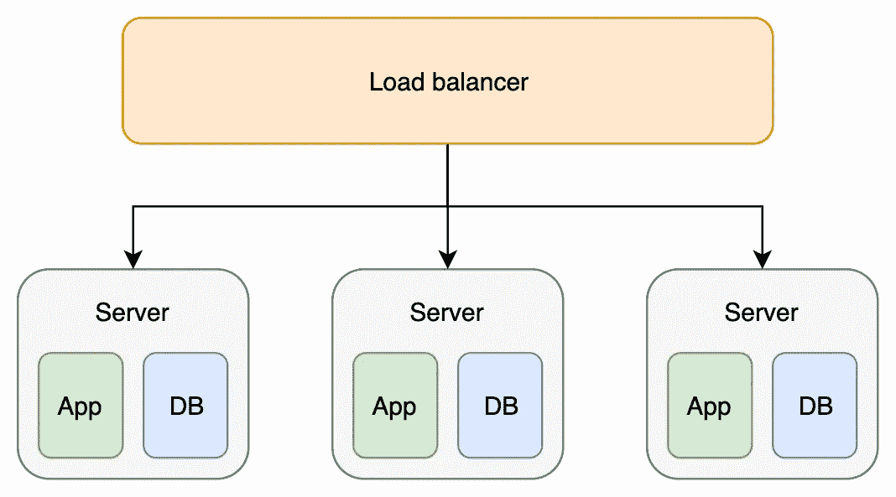
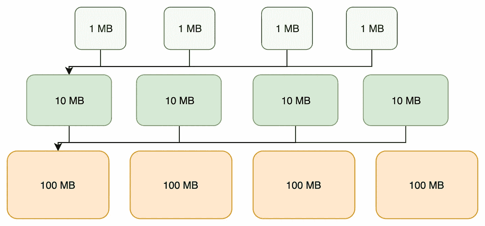
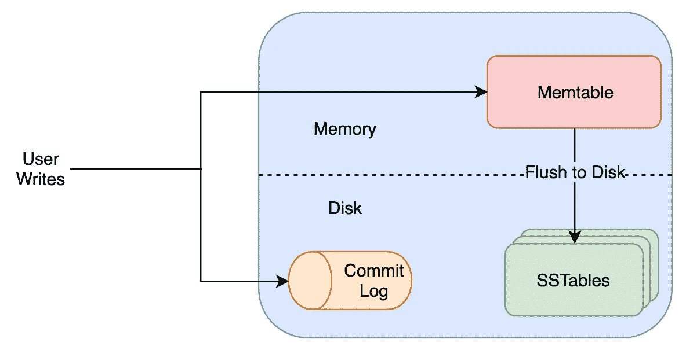

# 嵌入式数据库领域的一瞥。RocksDB

> 原文：<https://medium.com/walmartglobaltech/https-medium-com-kharekartik-rocksdb-and-embedded-databases-1a0f8e6ea74f?source=collection_archive---------2----------------------->


Photo by [Jan Kolar / VUI Designer](https://unsplash.com/@jankolar?utm_source=medium&utm_medium=referral) on [Unsplash](https://unsplash.com?utm_source=medium&utm_medium=referral)

RocksDB 是脸书创建的一个数据库。它不支持 SQL，不提供 ACID 保证，并且不能以分布式方式运行。尽管如此，它仍然是开发者生态系统中最受欢迎的数据库之一。它被用在诸如 Apache Flink 和[cocroach db](https://www.cockroachlabs.com/blog/cockroachdb-on-rocksd/)这样的高规模框架中。

那么，是什么让 RocksDB 成为超越竞争对手的令人信服的选择呢？

为了理解它的用例，首先，我们需要了解一下嵌入式数据库的世界。


# 嵌入式数据库

顾名思义，开发人员将嵌入式数据库放在使用它的服务/应用程序中。这意味着如果您的应用程序运行在容器/服务器 A 中，数据库也将出现在相同的位置。网络呼叫会导致显著的延迟。通过避免它们，您可以将数据库访问时间减少几个数量级。

Latency Numbers Every Programmer Should Know by [Jonas Bonér](https://github.com/jboner)

然而，这种设计选择的明显限制是，您既不能保证数据库的可用性，也不能存储超出当前机器容量的数据。



Embedded Database Architecture

## 什么时候应该使用嵌入式数据库？

如果需要存储大量数据，但是这些数据可以快速地重新创建，并且不是关键数据，那么应该使用嵌入式数据库。将这样的数据存储在应用程序的内存中是不可靠的，而以某种简单的格式存储在磁盘上将导致很高的延迟。

这个领域中最流行的数据库之一是 SQLite。Android 应用程序广泛使用它来存储详细信息，例如用户是否已经登录，以及用户 id、出生日期、地址等。从服务器获取所有数据的成本很高，而一旦关闭应用程序，内存中的数据就会消失。

# RocksDB

虽然 SQLite 在大多数情况下都很好，但是它有一个严重的局限性。SQLite 是一个单线程数据库，不支持并发访问。这种无法多线程化的特性使得它在高吞吐量的情况下执行速度非常慢。

由于这个限制，Google 创建了支持多线程的 LevelDB。脸书以 LevelDB 为基础创建了 RocksDB。另一个流行的嵌入式数据库是 T4 LMDB T5。LMDB 拥有与 LevelDB 完全不同的体系结构，在特定场景中表现出色。然而，为了保持内容简短，我将在本文中重点讨论 RocksDB。

现在，让我们来看看 LevelDB 和 RocksDB 共有的一些概念，这些概念使它们比它们的前辈强大得多。

## 表

Google 创建了 BigTable，它使用下面的 [SSTable](https://www.igvita.com/2012/02/06/sstable-and-log-structured-storage-leveldb/) 来存储数据。RocksDB 中使用了相同的表。表以键值的方式存储数据。数据也根据关键字进行排序。排序允许快速访问数据，因为在排序的关键字范围内搜索很容易。

表本质上也是不可变的。这意味着您可以从 SSTable 中读取数据，而不用担心它在 mid 中被修改(如果有一个 SSTable 的话)。

LevelDB 和 RocksDB 共享相同的[表格式](https://github.com/google/leveldb/blob/master/doc/table_format.md)，只是 RocksDB 包含更多类型的元数据块。元数据块包含文件属性，如用于填充压缩库的字典或压缩过程中使用的过滤器。您可以在下面找到一般的表格格式:

```
<beginning_of_file>
[data block 1]
[data block 2]
...
[data block N]
[meta block 1]
...
[meta block K]
[metaindex block]
[index block]
[Footer]        (fixed size; starts at file_size - sizeof(Footer))
<end_of_file>
```

该文件包含内部指针。每个这样的指针称为块句柄，包含以下信息:

```
offset:   varint64
size:     varint64
```

## 日志结构合并树

如果只将数据存储在一个表中，它会变得很大，从而减少访问时间。此外，你不能简单地创建多个固定大小的表，因为随着文件数量的增加，这将导致同样的问题。

[LSM 树](https://en.wikipedia.org/wiki/Log-structured_merge-tree)就是为了解决上述问题而产生的。当固定大小的表超过一个数时，它们被合并成一个更大的表。这一步称为压缩，在后台进行。例如，如果 10MB 的 s 表文件的数量超过 10 个，则它们被合并以创建单个 100MB 的 s 表文件。对于新数据，将创建最小大小的新表，例如 1MB。

最新的数据总是在最小的文件中找到，而最旧的数据驻留在较大的文件中。



Log-Structured Merged Format

## 内存表

DB 首先将数据插入到一个简单排序的内存结构(称为 Memtable)和一个磁盘文件(称为提交日志)中。这使得访问最近的数据非常快，因为它已经存在于内存中。

因为 Memtable 已经被排序，所以它被转储到磁盘中以创建一个 SSTable。



Memtable, Commit Log and SSTables organization in RocksDB

# 那么为什么不仅仅使用 LevelDB 呢？

RocksDB 几乎在每个方面都改进了 level DB，这使得它与 Google 的产品相比是一个有吸引力的选择。

让我们来看看 RocksDB 为改进其前身所采取的措施。

## 不要读不存在的东西

BloomFilters 允许用户快速知道数据库中是否存在某个键。它们有助于防止对数据库的不必要的读取，并使查询响应更快。

RocksDB 将 bloom filter 方法带到了下一步。它为整个数据库之外的每个 Memtable 和 SSTable 实现了一个 bloom filter。

## 更新您的密钥，无忧无虑

[列族](https://github.com/facebook/rocksdb/wiki/Column-Families)是一种帮助用户在单个数据库中对数据进行逻辑分区的机制。用户可以跨列族对多个键进行安全的原子写入。

列族共享预写日志，不共享 memtables 和表文件。通过共享预写日志，您可以获得原子写入的好处。通过分离 memtables 和表文件，可以独立配置列族并快速删除它们。例如，将元数据存储在一个列族中，将实际数据存储在另一个列族中。然后，您可以对元数据和数据应用不同类型的压缩和压缩策略。如果需要，可以在保留数据的同时删除元数据列族。

## 拍快照

因为 RocksDB 不提供 ACID 保证，所以您读取的数据可能会在多个请求之间发生变化，例如，由于压缩用一个值替换另一个值。

但是，如果您的应用程序需要一致的数据视图，您可以在 RocksDB 中创建一致的快照。局限性在于，它不会包含创建快照后插入的任何数据。

## 避免部分更新

RocksDB 支持悲观和乐观并发控制的事务。

在悲观流中，DB 锁定用户正在修改的所有密钥，这使它安全但缓慢。乐观流不进行任何锁定，并在提交时解决任何可能的冲突。

除了前面提到的主要变化，RocksDB 还提供了一些附加功能:

*   开箱即用的速率限制器，用于控制数据库的吞吐量
*   多线程压缩使它们更快
*   多种压缩算法，如 LZ4，GZIP，SNAPPY 等。

要了解更多详情，您可以参考下面提到的文章:

1.  [表和日志结构化存储:LevelDB](https://www.igvita.com/2012/02/06/sstable-and-log-structured-storage-leveldb/)
2.  [RocksDB 的历史](http://rocksdb.blogspot.com/2013/11/the-history-of-rocksdb.html)
3.  [RocksDB 技术讲座](https://www.slideshare.net/mobile/HiveData/tech-talk-rocksdb-slides-by-dhruba-borthakur-haobo-xu-of-facebook)