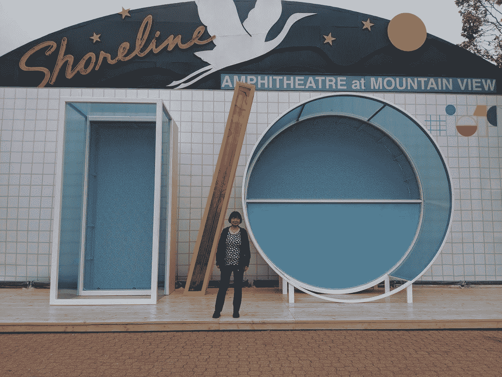
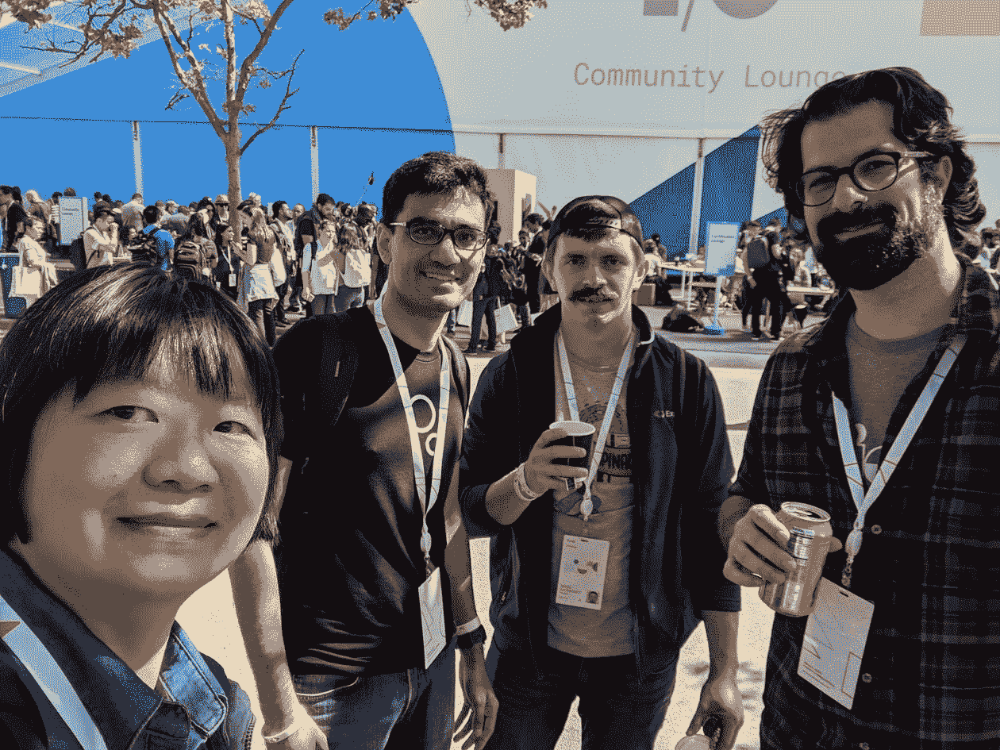

# 参加 Google I/O 2019

> 原文：<https://medium.com/google-developer-experts/https-medium-com-margaretmz-attending-google-io-2019-715956f5ec62?source=collection_archive---------3----------------------->

今年我参加了山景城圆形剧场的 I/O，这又是一次不可思议的经历！这完全是关于社区和学习新的谷歌技术。和往常一样，亲自参加会议最棒的部分是人:晚餐聚会、办公时间和沙盒演示，这些你不会从网上观看视频中得到。

# 社区

I/O 的前一天晚上有那么多派对！我参加了 3 个聚会:与 ML GDEs 的晚餐，女性技术制造者的晚餐，然后与 Android 社区一起闲逛。

ML GDEs Dinner Party

Women Techmakers Dinner Party

Women Android Devs

我和朋友在社区休息室打乒乓球，非常有趣！

Ping Pong at Community Lounge

周三下午，我被邀请参加谷歌云 VIP 招待会，在那里我与 ML GDEs、Cloud GDEs 和谷歌云团队一起闲逛。

Google Cloud VIP Reception

我正在与 Sergii、Paige 和 ML GDEs / GDG 全球组织者一起组织 TensorFlow 2.0 全球文档冲刺赛。我们有一个办公时间，Sergii、Paige、Jason、Billy、Jeongkyu、Vikram 和我一起讨论活动的计划。

Margaret, Jason, Sergii & Billy (missing Paige, Jeongkyu & Vikram in photo)

晚上，我参加了杰夫·迪恩和谷歌大脑团队的人工智能/人工智能会议。

AI/ML Meetup at I/O 2019

# 从 I/O 中学习

首先，我过滤了 I/O 应用程序，以保留或启动我感兴趣的会话。然后，我写了一份每天的日程草案:我绝对想亲自参加的会议、要会见的人以及要拜访的沙盒/办公时间。这样，如果我错过了一节课，我可以通过观看视频立即补上。我在会议期间做了很多笔记，照片/推文也帮助我记忆。

今年，我将从 I/O 中学到的知识集中在这三个方面:1)设备上的 ML，2)ML 入门，以及 3)高级/未来 ML 讲座。

## 设备上的 ML

超级令人兴奋的是今年的许多设备上的 ML 讲座！在过去，ML 讲座倾向于关注 ML 模型培训的工具或平台。现在，我们有许多选项来将这些 ML 模型部署到移动设备和物联网:

*   你的设备上的 ML:选项 ( [视频](https://www.youtube.com/watch?v=yQuUDX6r2Ic&list=PLQY2H8rRoyvy2_vtWvCpQWM9GJXNTa5rV&index=7))，作者 Laurence Moroney&Daniel Situnayake。
*   **Android ML**([视频](https://www.youtube.com/watch?v=wpKJpeOy-68&list=PLOU2XLYxmsILVTiOlMJdo7RQS55jYhsMi&index=28))的新功能，作者陈栋、海琳、劳伦斯·莫罗尼和马特·普法贾尔所作。
*   **移动和物联网设备的人工智能:TF Lite** ( [视频](https://www.youtube.com/watch?v=Jjm7MT6W0Dc&list=PLQY2H8rRoyvy2_vtWvCpQWM9GJXNTa5rV&index=8))，作者 Tim Davis 和 Sara Sirajuddin。
*   **ML Kit:ML for Mobile with fire base**([视频](https://www.youtube.com/watch?v=QwHD36bhXZA&list=PLOU2XLYxmsILVTiOlMJdo7RQS55jYhsMi&index=53&t=0s))，作者、Chrisitaan Prins、Sonakshi Watel、Ann Zimmer。
*   **介绍谷歌珊瑚:构建基于设备的人工智能** ( [视频](https://www.youtube.com/watch?v=Jgm25QdF90A&list=PLOU2XLYxmsILVTiOlMJdo7RQS55jYhsMi&index=10&t=6s))，作者比尔·栾。
*   **介绍 CameraX Jetpack 库** ( [视频](https://youtu.be/rP8CGyDbxBY))，作者 Vinit Modi、James Fung、Franklin Wu、Trevor McGuire。相机对于计算机视觉来说非常重要，因为你需要捕捉图像作为你的 ML 算法的输入。CameraX 将使应用程序开发人员在实现设备上的 ML 时更加轻松。

## ML 入门

我写博客，举办研讨会/学习堵塞，并创建关于机器学习的视频课程。所以我总是对“ML 入门”课程感兴趣，因为我很好奇别人是如何教授这门课程的。此外，总是有新的东西要学，即使是在初级阶段！

如果你是 ML 新手，一定要看看这些课程:

*   **ML 零到英雄** ( [视频](https://www.youtube.com/watch?v=VwVg9jCtqaU))，作者卡梅尔·艾利森&劳伦斯·莫罗尼。
*   **从头开始现场编码一个 ML 模型** ( [视频](https://www.youtube.com/watch?v=_RPHiqF2bSs&list=PLOU2XLYxmsILVTiOlMJdo7RQS55jYhsMi&index=32&t=0s))，作者 Sara Robinson。
*   **tensor flow 2.0**入门([视频](https://www.youtube.com/watch?v=lEljKc9ZtU8))，作者乔什·戈登和佩吉·贝利。

## 高级和未来 ML

如果您已经是 ML 领域的专家，请查看以下课程:

*   **斯威夫特为 TensorFlow** ( [视频](https://www.youtube.com/watch?v=3fJsqGHhlVA))，作者詹姆斯·布拉德伯里和理查德·魏。
*   **联合学习:分散数据上的机器学习** ( [视频](https://www.youtube.com/watch?v=89BGjQYA0uE&list=PLQY2H8rRoyvy2_vtWvCpQWM9GJXNTa5rV&index=11))，作者 Emily Glanz 和 Daniel Ramage。
*   **尖端张量流:新技术** ( [视频](https://www.youtube.com/watch?v=Un0JDL3i5Hg))，由迈克·本登斯基、索菲恩·布阿齐兹、埃利·伯斯坦和乔希·狄龙拍摄。
*   **tensor flow Extended:ML Pipelines and Model Understanding**([视频](https://www.youtube.com/watch?v=drYM04t57tU&list=PLOU2XLYxmsILVTiOlMJdo7RQS55jYhsMi&index=86&t=0s))，作者 Kevin Haas、Tulsee Doshi 和 Konstantinos Katsiapis。
*   **深度学习解决挑战性问题** ( [视频](https://www.youtube.com/watch?v=rP8CGyDbxBY&list=PLOU2XLYxmsILVTiOlMJdo7RQS55jYhsMi&index=16&t=0s))，作者杰夫·迪恩。

## Codelabs

Martin Gorner 写了 4 个 codelabs 来帮助人们开始在 TPU 上进行深度学习。

你可以在这里查看所有其他的 I/O 代码实验室。

## 沙盒演示和办公时间

我参观了沙盒 G 的 AI/ML 演示和办公时间。我最喜欢的是#DanceLike 应用程序演示。我开始学习如何跳舞，最后收到了我跳舞的视频。该应用程序展示了 TensorFlow Lite 和设备 ML 的强大功能:最新的分割、姿势和 GPU 技术都在设备上。它让我的动作看起来很棒，好像我可以像专业人士一样跳舞。

DanceLike App Powered by TFLIte

观看[这个视频](https://youtu.be/n-PNTWyXsjk)在 I/O 2019 上看到所有很酷的 **ML & AL 沙盒演示。**

我上面只列出了几个会议，I/O 上还有很多其他精彩的演讲，你可以在这里观看**所有 I/O 会议** [和**所有 TensorFlow 会议**](https://goo.gle/io19allsessions) [。](http://bit.ly/2GW7ZJM)