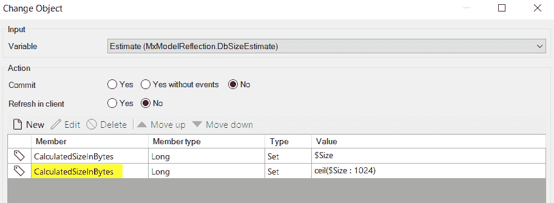
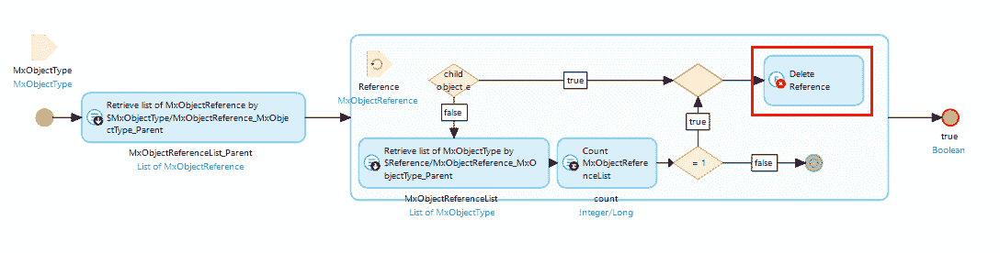
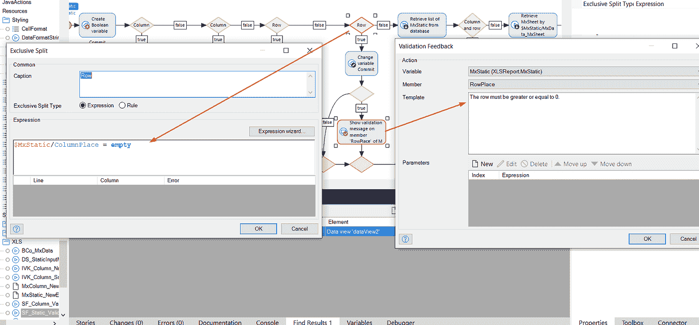
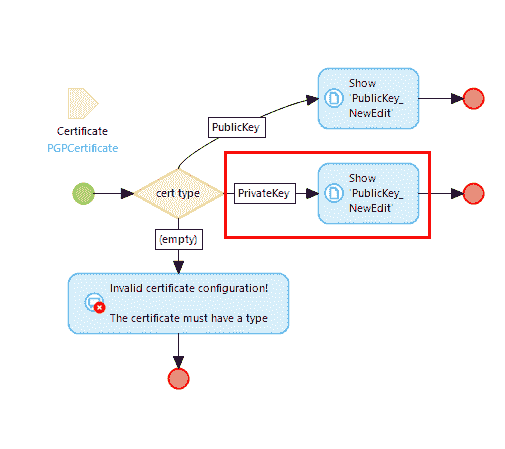
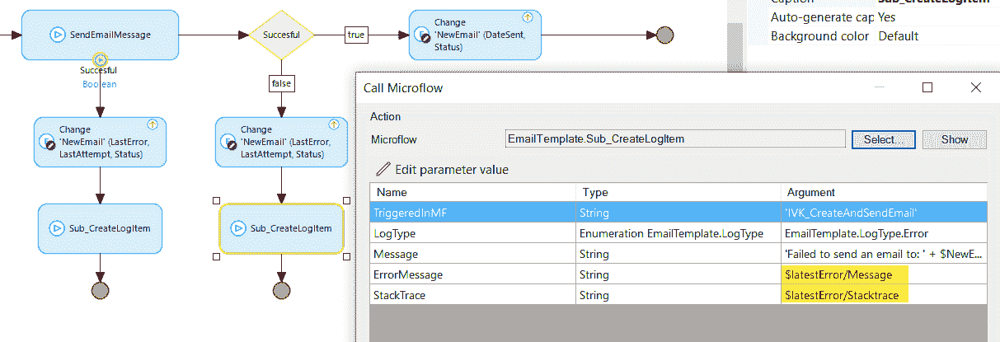
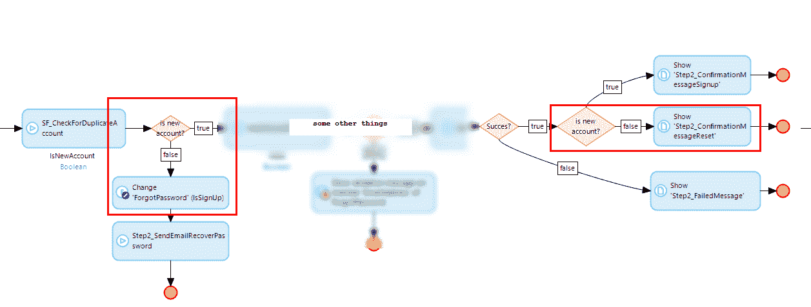
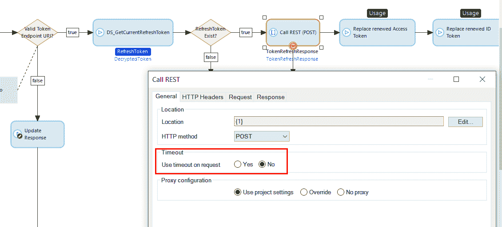
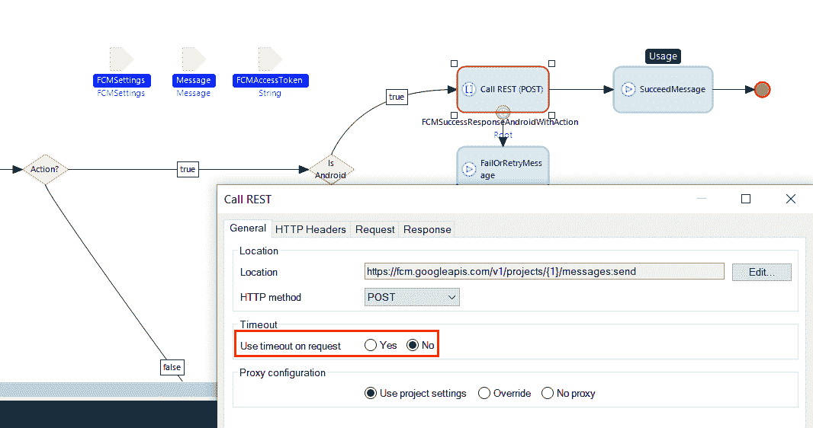
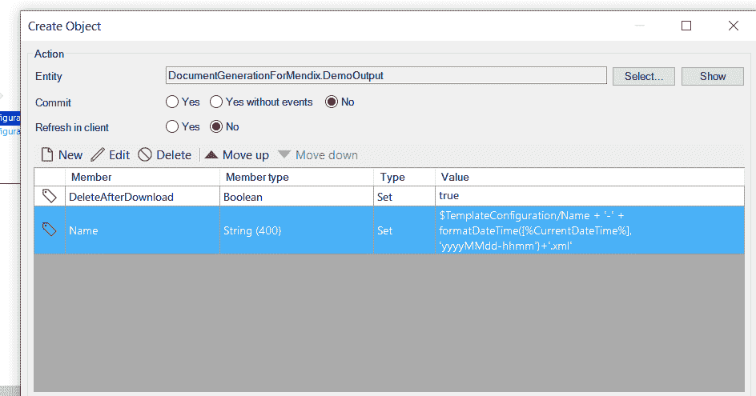

# 在门迪克斯市场猎捕虫子

> 原文：<https://medium.com/mendix/hunting-bugs-in-the-mendix-app-store-913fc9dc8eb4?source=collection_archive---------0----------------------->

**这里提到的所有错误，在这篇文章发表之前，已经与出版商进行了沟通，许多问题已经得到解决。*

作为一个有趣的小练习，我从 Mendix 应用商店下载了一些流行的模块，并使用自动代码审查程序(简称 ACR)进行了审查。不用太担心命名约定或代码可维护性，重点只是这些模块中潜在的 bug。

目标**不是批评**app store 小工具的质量，**而是展示代码审查员**发现 bug 的能力，同时强调这些模块中的问题，为了整个社区的利益，这些问题应该得到解决。

让我们从一个愚蠢的错误开始。

## 规则:[不应在创建/更改对象](https://sdf-docs.mansystems.com/docs/acr-rules/reliability/reassignedmembers/)中重新分配属性

**模块**:MxModelReflection
**元素**:IVK _ 重新计算大小。ChangeObjectAction
原因:以下成员被覆盖:CalculatedSizeInBytes

解决方案:第二个属性应该是`CalculatedSizeInKiloBytes`。

**模块**:MxModelReflection
**元素** : BDe_MxObjectType。delete action
原因:Microflow ' MxModelReflection。“BDe_MxObjectType”在循环中有 delete。

解决方案:所有要删除的对象都应该放在一个列表中，并在循环之外删除。

**模块:**xls report
元素: SF_Static_Validate。exclusive split
原因:同一个动作在一个流程中使用了多次。

解决方案:检查应该是行而不是列。

**模块:**加密
**元素:** MB_OpenCertificateDetails。show page action
原因:同一个动作在一个流程中被多次使用。

解决方法:页面要改成`PrivateKey_NewEdit`。

**模块** : EmailTemplate
**元素:**IVK _ 发送邮件。微流程动作
**原因:**同一个动作在一个流程中被多次使用。

解决方法:应该用`$NewEmail/ErrorMessage`代替`$latestError/Message`。

**模块:**forgot password
元素:MB _ step 2 _ SendConfirmationEmail。exclusive split
原因:同一个动作在一个流程中使用了多次。

解决方法:第二次检查没有必要，只能返回 true。

## 规则: [REST/Web 服务应该有一个超时](https://sdf-docs.mansystems.com/docs/acr-rules/reliability/webservicenotimeout/)

**模块:**门迪克索
**元素:** SUB_RefreshTokens。RestCallAction
**原因:**动作没有自定义请求超时。

解决方法:什么都不做。现在是 2020 年，互联网是可靠的。开玩笑的。

**模块**:push notifications
**元素**:sendfcmessage。RestCallAction(和其他在同一个微流中)
**原因:**动作没有自定义请求超时。

解决方案:不要在家里尝试！

## 规则:[在解析/格式化日期时间函数](https://sdf-docs.mansystems.com/docs/acr-rules/reliability/hourformat/)中应正确指定小时格式

**模块**:DocumentGenerationForMendix
元素:SF _ template configuration _ Export。CreateObjectAction.Name **原因:**函数' format datetime([% current datetime %]，' yyyyMMdd-hhmm ')'未正确格式化小时。

解决方案:应该是`formatDateTime([%CurrentDateTime%], 'yyyyMMdd-HHmm')`

我希望你喜欢阅读这篇文章，并希望它能帮助你构建更好的应用。

# Mendix 的自动代码审查程序

Mendix 的自动代码审查程序检查超过 150 个不同类别的规则，例如*安全性*、*性能*和*可维护性*。其中有 [40 *可靠性*规则](https://sdf-docs.mansystems.com/docs/acr-rules/reliability/)它们的目标是在你的应用程序中发现如上所述的错误。

不要等待，免费注册，直接体验自动化代码审查的力量:[https://content.mansystems.com/acr-trial-request](https://content.mansystems.com/acr-trial-request)。不需要信用卡。

*最初发布于*[*https://www . ignition . so/gaj Duk/Finding-bugs-in-Mendix-modules-6ab 2707 fa 68 F4 e 60 b 29 DDD 4 Fe 0a 23748*](https://www.notion.so/gajduk/Finding-bugs-in-Mendix-modules-6ab2707fa68f4e60b29ddd4fe0a23748)*。*

*来自发布者-*

如果你喜欢这篇文章，你可以在我们的 [*媒体页面*](https://medium.com/mendix) *或我们自己的* [*社区博客网站*](https://developers.mendix.com/community-blog/) *找到更多类似的内容。*

*有兴趣加入我们的社区吗？你可以加入我们的 slack 社区* [*这里*](https://join.slack.com/t/mendixcommunity/shared_invite/zt-hwhwkcxu-~59ywyjqHlUHXmrw5heqpQ) *或者想更多参与的人，看看加入我们的聚会* [*这里*](https://developers.mendix.com/meetups/#meetupsNearYou)