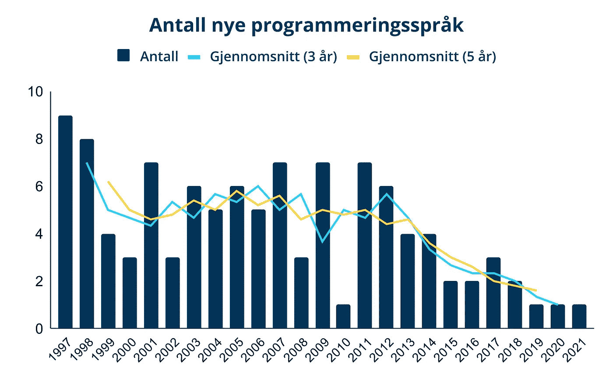

# Hvor er alle nye programmeringsspråk?

> 原文：<https://medium.com/compendium/hvor-er-alle-nye-programmeringsspr%C3%A5k-18e9ef6f4e51?source=collection_archive---------9----------------------->

*Denne teksten ble først* [*publisert*](https://www.kode24.no/artikkel/hvorfor-kommer-det-ingen-nye-programmeringssprak/75837029) *hos* [*Kode24*](https://www.kode24.no/) *.*

Det slo meg for et par uker siden at det er lenge siden jeg har hørt om et nytt programmeringsspråk som på en grunnleggende måte legger om på ting. Det siste store må ha vært funksjonell programmering og utvikling av mobile apper, og så har det kommet et par programmeringsspråk som retter seg mot kvanteinformatikk. Men alle disse tingene er i mellomtiden minst fem år gamle…

Min første hypotese for hvorfor det lages færre nye programmeringsspråk nå var –selvfølgelig– at pandemien hadde noe med det å gjøre. I vår industri er vi heldige at de fleste av oss kunne fortsette å jobbe hjemmefra når pandemien inntraff, men en del av kreativiteten som man får av å være i samme rom forsvant. Uformelle diskusjoner under lunsjpausen eller rundt kaffemaskinen kan man ikke erstatte med uformelle videomøter, og de er i hvert fall ikke like inspirerende. Det samme gjelder for øvrig for konferanser: fint med digitale versjoner, men interaksjonen blir bare ikke den samme.

**Tørke etter 2014**

Men for at pandemien skal være mer enn bare en medvirkende årsak, burde vi fortsatt ha sett en masse nye programmeringsspråk frem til 2020\. Dessuten er det da nå de burde begynne å bli tatt i bruk i en større skala. Og det ser jeg bare ikke. En rask titt på en Wikipedia-side som lister opp [de viktigste programmeringsspråk sortert etter året de først ble publisert](https://en.wikipedia.org/wiki/Timeline_of_programming_languages) viser at det begynte å stoppe opp allerede rundt 2014.

Antall nye programmeringsspråk gjennom årene. Kilde: [https://en.wikipedia.org/wiki/Timeline_of_programming_languages](https://en.wikipedia.org/wiki/Timeline_of_programming_languages)

Det er selvfølgelig mulig at denne Wikipedia-side ikke er så veldig representativ for de siste årene. Det tar tross alt litt tid før det viser seg om et programmeringsspråk hører hjemme i kategorien «viktig» eller ikke. Men på den andre siden inneholder tabellen mange programmeringsspråk som kanskje ikke er så veldig viktige likevel, som f.eks. [LOLCODE](http://www.lolcode.org/) . Det virker i hvert fall som om det vage inntrykket jeg satt med for et par uker siden kan underbygges litt med det jeg fant på denne siden.

**Anbefaler å lære gamle språk i 2022**

Her er et annet element som underbygger inntrykket mitt: listene med programmeringsspråk som en synsere anbefalte å lære i [2021](https://www.google.com/search?q=programming+languages+to+learn+in+2021) og [2022](https://www.google.com/search?q=programming+languages+to+learn+in+2022) . Dette er jo stort sett gamle programmeringsspråk! I mange av listene er Swift det nyeste språket, og det ble jo utviklet… for åtte år siden, i 2014\. Faktisk er mange av listene omtrent identiske med de fra 2015, men med Swift byttet ut med Objective-C.

**Trenger vi nye programmeringsspråk?**

Så hvorfor kommer det ingen nye programmeringsspråk? Jeg tror at årsaken er at vi ikke har hatt et særlig stort behov for nye programmeringsspråk de siste par årene. Kotlin og Swift ble laget for å understøtte utviklingen av native mobile apper, og siden har Kotlin også kommet over på serversiden. Grunnen til det siste er at Kotlin hadde et par nye konsepter som traff hos en del utviklere. Men overgangen fra on-prem til sky har vi klart fint med de etablerte programmeringsspråkene. Ellers er det jo også litt begrenset på hvor mange måter man kan bygge opp nye programmeringsspråk ved å bytte ut krøllparantes med indentering, håndtering av typing og lambda-uttrykk, osv…

Vi vi ser på nye konsepter fra de siste årene kunne Terraform kanskje ha tellet som et nytt språk, men det bruker jo YAML som basis og faller uansett kanskje ikke helt under begrepet *utviklings* språk. Andre paradigmeskifter som blockchain, maskinlæring og dataflyt har riktignok ført til utviklingen av nye biblioteker, men ikke nye språk. Kanskje blir det flere nye programmeringsspråk når kvanteinformatikk får sitt store gjennombrudd?