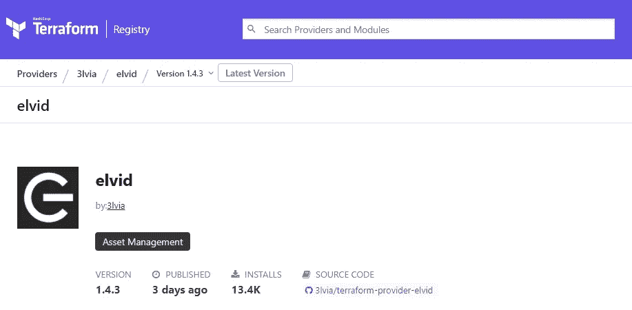
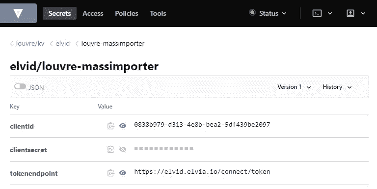
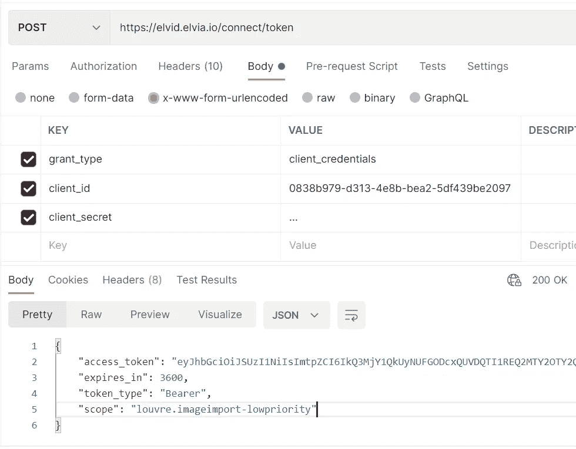

# Hvorfor og hvordan lage din egen terraform provider

> 原文：<https://medium.com/compendium/hvorfor-og-hvordan-lage-din-egen-terraform-provider-db54f88c7d68?source=collection_archive---------0----------------------->

Sammen med flere gode kollegaer hos Computas har jeg jobbet for Elvia de siste årene. Her har vi hatt stor suksess ved bruk av Terraform fra Hashicorp, og har også utviklet en egen Terraform provider for å styre våre tjenester.

Terraform er et verktøy for å skrive Infrastructure as Code. Det skrives i HashiCorp configuration language (HCL). Vi styrer alt mulig fra Terraform, som opprettelse av databaser, ad-grupper, devops-prosjekter, kjøretidsmiljøet i kubernetes og alt annet av sky-tjenester. Vi klikker altså aldri i Azure-portalen for å opprette en ressurs, men skriver heller hvilken ressurs vi vil ha i Terraform kode, og ruller det så ut i våre dev, test og prod-miljøer med terraform apply.

Ressurser som kan opprettes i Terraform er tilknyttet en provider. Feks benytter du Azure-provideren for å kunne opprette ressurser i Azure. Store skyleverandører og andre har laget providere slik at du allerede enkelt kan opprette ressurser for de store skyplattformene.

Men hva med de systemene du har laget selv? Hvis konfigurasjon av dem blir såpass omfattende at du gjerne skulle hatt “Infrastructure as Code” for dette kan det være en mulighet å lage din egen terraform provider. Sånn var det for oss med Elvias innloggingstjeneste som heter ElvID (Elvia ID).

# Vårt case

ElvID er en tokenbasert tjeneste som bygger på rammeverket IdentityServer. Tjenesten brukes av interne og eksterne Elvia-brukere, samt til å sikre maskin-til-maskin kommunikasjon mellom våre tjenester.

Konfigurasjon for klientene må registreres i ElvID. For UserClients (Authorization code) må man registrere scopes, gyldige urler for redirects, CORS, innloggingsmetoder for sluttbrukere osv. For maskinclienter (client credentials) må det registres en client_id og client_secret, samt scopes.

Vi benyttet først et simpelt GUI for å registrere klientene, men det viste seg at det ikke var en tilstrekkelig. Over tid ble det stadig behov for nye klienter. Samtidig var det få personer som hadde tilgang og kompetanse til å registrere disse. Utviklerne flest måtte da vente på at denne jobben ble gjort av andre. Sikkerhetsmessig var det ikke heldig at secrets måtte manuelt genereres og kopieres over til vår secret-manager (via terraform). Dette manuelle arbeidet tok jo også endel tid og måtte også gjøres for hvert av våre miljøer.

Med nå rundt 100 slike klienter, som måtte registreres i 3 miljøer hadde det blitt veldig mye manuelt arbeid å gjøre det måten vi gjorde før. Løsningen for oss var å lage vår egen terraform provider.

# Hvordan lage en terraform provider

Terraform kom etter hvert med muligheten for å lage egen provider. Providere skrives typisk i Go, og det finnes libraries og eksempler som støtter i utviklingen. Se installasjonsguider for [Golang](https://golang.org/doc/install) og [Terraform](https://learn.hashicorp.com/terraform/getting-started/install.html) .

Provideren vi har laget er opensourcet ( [her er github-repo](https://github.com/3lvia/terraform-provider-elvid) ). Både fordi vi synes det er fint å dele kode og at det gjør det lettere ved publisering i Terreaform Registry.

## Schema for provideren

Først må du beskrive schema for provider-en. Her bestemmer du hvilke variable som kan eller må settes ved oppsett av provideren i terraform-koden. Her kan du også sette opp validering og description. Du lager også en ResourcesMap hvor du definerer hvilke resources som skal kunne settes opp med provideren.

Under ser du utdrag fra kildekoden for vår provider. Her defineres blant annet en tenant_id som required input. Fullstendig kode finner du [her](https://github.com/3lvia/terraform-provider-elvid/blob/trunk/provider.go#L9) .

Go kode i terraform provider

[Les mer dokumentasjon om provider schema](https://learn.hashicorp.com/tutorials/terraform/provider-setup?in=terraform/providers#explore-provider-schema) .

## Resources

Hver ressurs du skal lage trenger et resource-schema. Her defineres variable for ressursen, samt deres egenskaper. Her setter du opp CRUD-operasjoner for ressursen. CRUD-operasjonene kaller typisk et API du setter opp for å gjennomføre create, read, update, delete av ressursen i ditt system.

Terraform holder selv styr på status på hver resource du har rullet ut, og kaller selv riktig CRUD-operasjon ved terraform apply.

Se feks vår resource for machineclient. Fullstendig kode for resourceMachineClient finner du [her](https://github.com/3lvia/terraform-provider-elvid/blob/trunk/resource_machineclient.go#L11) .

Go kode i terraform provider

HCL kode for bruk i terraform

Merk at denne machineclient-en er ubrukelig uten en client_secret. Client_secret er en annen resource i vår provider. Mer om dette i avsnittet om moduler.

[Se mer info om å lage resources på denne og påfølgende sider i terraforms guide](https://learn.hashicorp.com/tutorials/terraform/provider-create?in=terraform/providers) .

## Sikring av API

Sørg også for at du sikrer disse api-endepunktene så ikke uvedkommende kan gjøre disse api-kallene.

Vi brukte her tokens fra AzureAD, da vi allerede hadde det tilgjengelig i våre terraform workspaces.

## Lokal bygging og debugging

Se informasjon om dette i [terraforms guide](https://learn.hashicorp.com/tutorials/terraform/provider-debug?in=terraform/providers) , vi har også skrevet litt i [readme for terraform-provider-elvid](https://github.com/3lvia/terraform-provider-elvid#readme) .

# Publisering av provideren til Terraform registry

Når du er klar for at provideren skal brukes så kan du feks publisere den i Terraform Registry. Da kan den brukes på samme måte som andre providere.

Følg [denne guiden](https://learn.hashicorp.com/tutorials/terraform/provider-release-publish?in=terraform/providers) for publisering av provideren. Vi benytter github-actions for automatisk publisering av nye releases. Dette er også beskrevet i den nevnte guiden.

Skjermbilde fra Terraform Registry

Denne provideren finner du [her i Terraform Registry](https://registry.terraform.io/providers/3lvia/elvid/latest)

# Lag moduler for å forenkle bruk og innføre standarder

I stedet for å bruke resources direkte i terraform så bruker vi som oftest terraform-moduler.

Fordelen er at du kan innføre standarder på feks navn og alt mulig annet, og koble sammen flere resources for enkelt bruk, også på tvers av providere.

Feks har vi en modul for elvid-machineclients. Den benytter elvid-provideren til å lage en machineclient-resource og en client_secret-resource. Så benytter den Hashicorp Vault provider for å legge client_id og client_secret i vår secret-manager.

HCL kode i modul

# Bruk av provider og modul

Med provideren registrert i Terraform Registry og modulen ovenfor registrert i vår Terraform Enterprise kan dette nå enkelt brukes.

HCL kode for bruk i terraform

Resultatet etter å kjøre terraform apply er at dette er klart til bruk med hemmeligheter lagt inn i Vault. Fra Vault kan vi programmatisk hente ut disse hemmelighetene under kjøring.

Skjermbilde fra Vault

Klienten kan også benyttes i Postman, her ved å få laget et access_token for denne machineclient-en basert på client_id og client_secret

Skjermbilde fra Postman

# Resultat

Med denne terraform provideren på plass har vedlikehold av elvid klienter blitt mye lettere for oss.

Nå kan alle teamene vi har her sette opp det de trenger i terraform selv, med en gang de trenger det og uten å involvere admins. Også helt uten manuelt toil-arbeid, og ingen copy-paste av hemmeligheter. Dette kan så enkelt rulles ut til alle miljøer, og navnestandarder blir håndhevet av seg selv.

Takk til Elvia for et godt samarbeid og at vi kunne dele koden og det vi har gjort rundt dette.