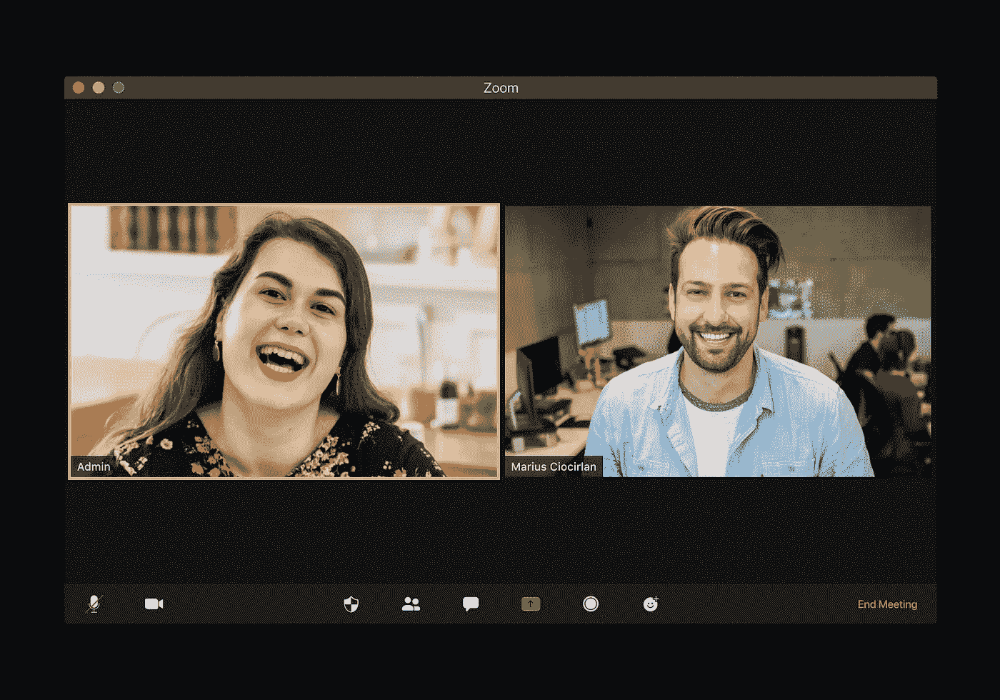

# 混合事件——客户获取的未来

> 原文：<https://medium.com/globant/hybrid-events-future-of-customer-acquisition-c68997c70b7c?source=collection_archive---------3----------------------->

什么是混合事件？

简单来说，混合赛事就是**现场和虚拟赛事的混合**。您采取现场活动，包括观众、内容等，并向其中添加虚拟组件，以便您的观众可以参与您的活动，无论他们在哪里。

**为什么更喜欢混合赛事？**

**扩大外联和参与度**

只有当你面对面时，观众才能积极地参与到活动中，这是一种误解。你可能会认为，通过促进一个杂交的场合，你分裂了你的绝对参与。然而，反过来也是有效的。交叉场合允许你*建立你的范围*和*获得参与者*，而不是更少。

**更好的赞助商机会**

72%的企业赞助商有兴趣参加混合活动，只要他们能够有效地接触到双方受众。这是因为混合赛事对赞助商来说非常有价值，原因有几个。原因一，是延伸范围的扩大。更多的参与者意味着更大的潜在客户群，这是赞助的首要原因。

此外，他们可以与感兴趣的各方进行一对一的交流，同时还可以与在线虚拟与会者进行互动。一些人口统计数据，尤其是千禧一代，更喜欢虚拟交流，这可能会增加他们在虚拟展台的参与度。

**与观众更多互动**

在现场活动中加入虚拟元素，无论是在活动期间还是活动结束后，都会比纯粹的现场活动带来更多的*参与机会*。这是因为你的虚拟观众通过他们的移动设备或台式电脑积极参与，这意味着他们可以交谈、分享、喜欢、评论等等。

**较小的环境影响和成本**

我们已经看到了减少旅行对环境的影响。以前拥堵的城市街道空无一人，排放量也大幅下降。

一些报告预测全球能源使用量将下降 6%——这听起来可能不多，但这相当于整个印度陷入黑暗。虽然面对面的会议仍然很重要，但混合会议是一种很好的方式，可以适应那些可能对自己的碳足迹感到内疚的与会者。这样，他们仍然可以参加你的活动并享受其中，同时也为减少碳排放尽自己的一份力量。

**降低旅行成本**

按照同样的趋势，混合活动可以显著降低所有参与者的旅行成本。虽然与会者省钱是显而易见的，但混合活动也可以减少赞助商和工作人员的差旅费用。

在家工作已经成为全球公司和员工的新常态。

**创建可重复使用的内容**

您可以轻松地重新利用和共享数字内容，而不是保持活动的独家性，以保持源源不断地流向您的观众。例如，您可以共享整个直播(或其中的某些片段)来宣传您未来的活动。分享你的直播也确保了赞助商的持续可见性。

流式传输您的活动还有一个额外的好处，就是确保您不会忘记记录任何内容。由于高度关注广播，您可以放心地知道您的所有内容都被记录下来供以后使用！

您还可以根据之前的内容来确定未来的营销活动。有没有一个会议吸引了很多与会者？也许你可以详述一下。

**更好的投资回报(ROI)**

在活动中，ROI 很难计算，因为所有的部分都在移动。然而，混合活动提供了更高的投资回报，这主要是由于覆盖范围和可伸缩性的增加。因为你通过你的混合活动获得了更多的参与，这可以转化为赞助商更多的观点和活动后更多的注册。

此外，您还可以获得大量数据，为您的绩效提供更准确的报告。

**收集有价值的数据**

与离线数据相比，混合事件具有数据的重要优势。在线活动中收集的数据可以帮助您以图形方式分析许多可跟踪的指标，以及与出席率、观众互动、在什么时候似乎失去兴趣并退出会议等相关的各个方面。这将有助于改进活动，而且在没有实际反馈的情况下也是如此。

**总之……**

疫情无疑改变了我们看待协作和相互联系的方式；随着许多人接受这种变化，混合赛事变得越来越受欢迎，这是可以理解的。不同受众的不同需求也有望最终改变我们举办和参与活动的方式。这就像是，我们最终见证了混合事件成为新的规范！