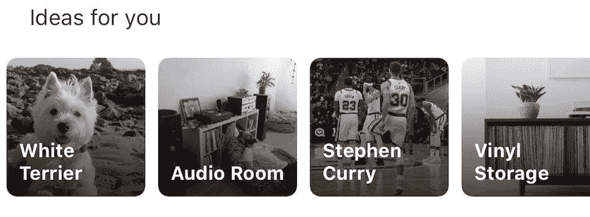

# 混合搜索:在 Pinterest 建立文本和视觉发现体验

> 原文：<https://medium.com/pinterest-engineering/hybrid-search-building-a-textual-and-visual-discovery-experience-at-pinterest-8527ba9728a9?source=collection_archive---------0----------------------->

Matthew Fong | Pinterest 搜索功能技术主管

作为一个视觉发现引擎，Pinterest 可以帮助你发现想法，即使你不知道你在寻找什么，或者没有词语来描述它。通过混合使用技术(包括视觉搜索)和社区输入(感谢人们保存的 175 b+pin)，我们能够根据其他 Pinners 的重叠兴趣显示根据您的口味定制的结果。我们不断地问自己如何让人们从灵感变为行动。

想象你已经找到了一组你真正喜欢的艺术版画的图像。如果你想设计一个受这种艺术启发的房间，你会从哪里开始？在传统的关键字搜索查询中很难表达这种意图。找到与你已经找到的图片相似的图片也不能解决寻找房间设计想法的意图。

Figure 1\. Example of inspirational artwork ([Source](https://www.pinterest.com/pin/780178335426018887/))

在这里，我将分享我们在 Pinterest 上传递视觉灵感的方法。给定关键字搜索查询和大头针图像，系统可以产生相关的、多样的和鼓舞人心的结果。例如，通过查询“房间创意”和上面的艺术图片，我们能够返回墙上有类似艺术的房间和托儿所的创意。

Figure 2\. Hybrid search results of the query “room ideas” and Figure 1

我们给这个新功能起了个名字:*混合搜索*，因为它是传统文本搜索和图像搜索的混合体。我们正在产品的多个表面推广这项技术，并继续寻找新的应用方式。这篇文章将详细介绍混合搜索的技术细节和产品探索。

**建筑**

自从我们最近一次更新搜索排名以来，很多事情都发生了变化。这篇文章将关注普通文本搜索和混合搜索的主要区别。

Figure 3\. Overview of search ranking for normal text search

这是一个高层次的观点，我们的评分架构，为普通的引脚搜索，只有一个文本查询。有一个三步流程—检索、轻量级评分和相关性评分。轻量级评分阶段的目的是精选结果集，以选择近似的“最佳”候选项，从而进入计算成本更高的相关性评分阶段。在最后阶段，我们构建一个全局模型，优化与查询的相关性。

Figure 4\. Overview of search ranking for hybrid search

在混合搜索中，我们仍然利用基于文本的检索，但我们看到轻量级评分和相关性评分的显著差异。我们使用嵌入来表示输入引脚和结果引脚——更具体地说，这里的[描述了引脚嵌入。在轻量级评分中，我们通过汉明距离将最接近的检索到的 pin 发送到相关性评分回合，在该回合中，我们采用前面提到的 GBDT 相关性分数以及汉明距离的线性组合。这为我们提供了一个结果集，该结果集仍然与查询有很高的文本相关性，而且还包含了输入 Pin 的视觉和主题元素。](/pinterest-engineering/pinsage-a-new-graph-convolutional-neural-network-for-web-scale-recommender-systems-88795a107f48)

在我们获得最好的结果之前，我们经历了几次轻量级和相关性评分的迭代。最初，我们试图保持大部分原始轻量级计分公式不变，但是我们发现我们过滤掉了与输入 Pin 最相似的 Pin。我们认为，我们的纯文本检索流程在文本级别上已经足够了，因此我们将第一轮评分改为只查看输入 Pin +候选 Pin 的相似性。

对于最后的评分阶段，我们根据应用混合搜索的应用程序来改变α和β。如果我们对输入 Pin 的选择更有信心，我们将获得更高的β，而如果我们正在进行对用户隐藏的隐式个性化，我们将获得更高的α。

**彩色椅子的故事**

假设品酒师想找一个能与这个令人愉快的椅子搭配的家居装饰，却不知道它甚至有一个特定的名字(叫做蒙德里安椅)。

Figure 5\. Example of a Mondrian chair ([Source](https://www.pinterest.com/pin/45810121187164912/))

如果她看着视觉上相似的大头针，结果的反馈主要是椅子，但没有一个真正抓住了原始的意图，也没有任何东西可以帮助填充这个项目周围的房间。

Figure 6\. Visually similar Pins to Figure 5

然而，通过混合搜索，她可以找到各种各样与这把椅子相配的装饰。使用上面的输入密码和查询*书架*、*墙壁*，甚至*时钟*，我们会得到大量的结果。我们已经进行了一些实验，用来自输入引脚的文本信号扩充原始查询，这只是一个它表现非常好的例子。

Figure 7\. Hybrid search results of “bookshelves”, “walls”, and “clocks” with the image in Figure 5

**产品应用:个性化搜索建议**

混合搜索的最初用例是我们的搜索推荐，我们将其插入主页提要(用户个性化的 pin 提要)。一旦我们综合了所有这些信息，并将其缩小到最佳建议，我们为每个建议选择一个封面图片。这张封面图片实际上是 Pinner 与之互动的其中一个图钉的图片。

Figure 8\. Personalized search suggestions in the home feed

点击其中一个图标，Pinner 就会被带到一个使用混合搜索的 Pins feed。您可以看到，与使用文本查询和所有 pin 的上下文进行搜索相比，只搜索文本查询形成了鲜明的对比。例如，看看“音频室”的例子。我最近在看展示黑胶唱片储存和展示的不同例子的别针。

Figure 9\. (L): Globally popular results for “audio room” (R): Personalizes results for the same search

在左边，我们看到的是普通的搜索结果，更多的是关于大型扬声器的设置。这可能是搜索查询时最流行的全局意图。在右边，我们看到了个性化的搜索结果——我们仍然可以看到关于音频室的内容，但它明显偏向于黑胶唱片和电唱机。对于这个特定的用户和查询，我们能够显示与他们过去在 Pinterest 上的行为更加一致的结果。

在这个用例中，我们发现利用混合搜索来个性化搜索结果可以改善用户体验。我们已经对普通搜索结果和相关搜索结果进行了实验，混合搜索结果明显优于两者。具体来说，我们有一个对*搜索成功*的度量，它涉及结果页面上以及结果页面下游的各种操作。对于一般的搜索，这个比例通常在 30%左右(基于内部数据)，而对于这些个性化的搜索建议，这个比例在 40%左右。

**下一步是什么？**

我们目前正在进行实验，以更好地了解这项新技术最适合哪些其他用例。随着我们开始加大搜索个性化的努力，这将是这些努力的关键部分。当然，我们也在不断努力提高这些结果的质量，并将基础设施与普通文本搜索的排名架构统一起来。如果你对这些问题和挑战感兴趣，看看我们的空缺职位[这里](https://careers.pinterest.com/careers/engineering)！

*鸣谢:程璐璐，，兰德尔·凯勒，，，卢海波，吉米·罗，亚尼斯·马金，拉杰特·刘冰*