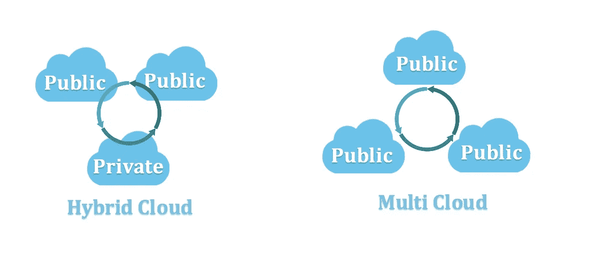
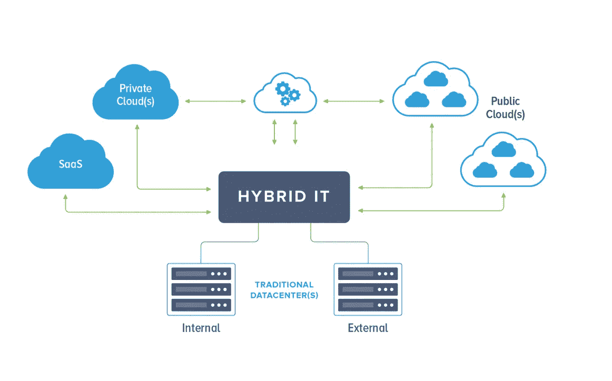
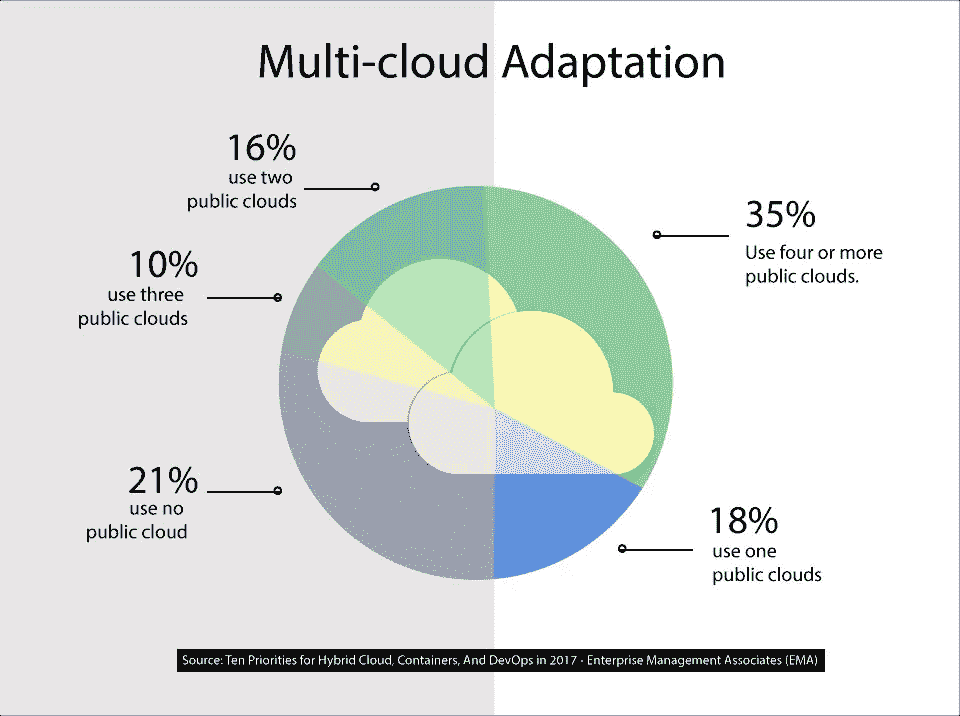

# 混合与多云环境

> 原文：<https://medium.com/oracledevs/hybrid-vs-multi-cloud-environment-765f01077498?source=collection_archive---------0----------------------->

云计算提供资源，特别是存储和计算能力，可以通过互联网而不是通过本地资源按需访问。按消费计费的订阅服务可以是 SAAS(软件即服务)、PAAS(平台即服务)和 IAAS(基础设施即服务)解决方案。根据云提供商的不同，客户可能拥有完全根访问权限或间接访问权限，或者拥有集成的解决方案。

云部署受制于这些类别:公共云、私有云和混合云。私有云由一个企业或组织专用的计算资源组成。相反，在公共云中，您可以与其他组织或云“租户”共享相同的硬件、存储和网络设备

虽然公共云和私有云有明确的定义，但我们应该如何定义混合云呢？对于亚历克斯·崔贝克来说，这个微不足道的回答可能已经足够了:什么是多种云部署模式的结合？ [Stephen G. Bennett，](https://www.linkedin.com/in/stephengbennett/)经验丰富的云架构师领导者，拥有超过 30 年的多元化服务经验，他证明了这样一个常见术语很少会有如此琐碎的定义。有人可能会将其解释为公共云与内部托管的任何系统的集成，但另一个人可能会认为它们是在私有云还是更传统的裸机部署中是有区别的。最后，Stephen 将混合云定义为利用和*组合来自*私有*云和*公共*云提供商的*云服务的策略。

多云是独特的，可以作为混合云的补充。混合云必然包含私有和公共解决方案，而多云战略则利用并组合来自多个公共云提供商的云服务。

内部资源呢？据全球领先的研究和咨询公司 Gartner 称，混合 IT 能够开发、执行和治理连接内部和基于云的流程、服务和应用程序的任何组合的集成流程。和数据，或者跨多个应用程序。

当您构建云企业战略以开始使用额外的云或将部分工作负载迁移到公共云时，您可能会考虑采用混合和/或多云战略。你将与一些最成功的 IT 战略家分享一条道路，从 LLC 到网飞。

## **混合云越来越受欢迎，因为它支持私有云安全性和公共云灵活性。**

**符合性**。监管要求总是具有挑战性。例如，治理或金融机构可能在内部实施敏感工作负载，但通过公共云提供其他服务。在最近的 GDPR 更新中，大多数公共云提供商增加了完整的审计功能和 API，这是相对于一些传统环境的优势。然而，极其敏感的工作负载倾向于使用私有云。

**增容** **增容**。整合混合解决方案后，组织可能还会采用更传统的部署策略，例如使用公共云来备份或归档数据。在为此而构建的解决方案中，还可以使用公共云服务来实现季节性可扩展性或云爆发。

**敏捷**。一个组织可能在内部或私有云上运行其所有生产工作负载，但仅将公共云用于开发和测试。一个组织可能仅仅基于成本、性能或用户体验来定位其工作负载。

**创新**。借助数字化转型，组织可以利用聊天机器人、人工智能或区块链解决方案作为 PAAS 解决方案。

**遗留问题**。对于这种使用情形，随着组织继续其云之旅，公共云服务变得更加强大和灵活，混合云可能会成为一个中转站。

**成本**。需要昂贵存储系统的大数据应用程序在公共云上运行可能更经济高效。此外，企业可能会选择公共云，因为它是灾难恢复的经济高效的选择。

**偶然**。作为一个例子，影子 IT 或者可以考虑。并购。影子 IT —指未经 IT 部门明确许可或知情的情况下，在公司使用的工具、技术和设备。混合云提供了一套相关的基础架构和平台服务，有助于消除影子 IT 的挑战。在合并和收购期间，IT 基础架构可能会很复杂，包括硬件、网络、软件，甚至人与人之间的协作，其中一些组件可以更容易地从混合云中受益。

## **多云是在单一异构架构中使用多个云计算和存储服务。**

**减少供应商锁定**。供应商锁定的问题是，如果出现问题，很难转移到另一个云服务提供商。通过使用多种云，您将不再那么依赖一家内容服务提供商来满足您的所有需求。另一个好处是，您可以从每个云提供商那里挑选产品，以便在您的应用程序中实施最佳服务。

**风险缓解**。与多家云提供商合作或构建混合云环境有助于降低本地数据中心和公共云提供商的服务中断风险。

**地缘政治。**并非每个云提供商都在其拥有云数据中心的所有地区提供所有服务。因此，如果您打算在某个地区与某个特定的云提供商签约，您需要确保他们在该地区提供您需要的特定服务。

**同类最佳**。通过访问多个云提供商，您的工程师可以选择最适合他们想要部署的工作负载的提供商。通过避免“全有或全无”的方法，IT 领导者可以更好地控制他们不同的云服务。他们可以挑选最符合其上市时间或成本效益要求的产品、服务或平台。此外，这种方法可能有助于避免单个提供商遇到麻烦时出现的问题！

**价格谈判**。在多个云中存在也有助于未来的云定价谈判，因为它提供了更多的供应商优势。

总之，任何问题都没有单一的解决方案。根据您组织的优先级和某些权衡，解决方案可能会有所不同。向云的迁移基于组织当前的业务环境、当前的运营模式、当前的技术部署以及独特的机会、挑战和风险。虽然总是会有反对云计算的论点，但人们只需要看看混合云或多云的统计数据就知道，对大多数人来说，好处远远大于坏处。