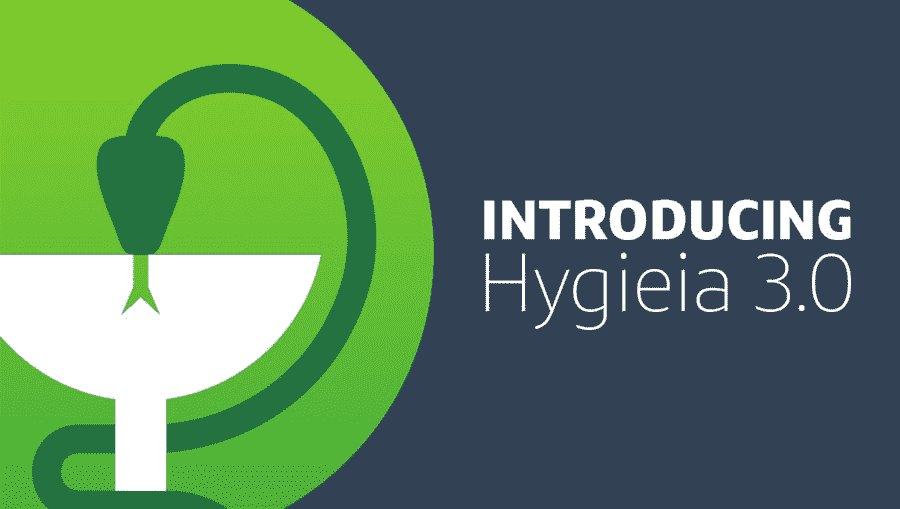

# Hygieia 3.0 —为我们扩展的开源路线图做出贡献

> 原文：<https://medium.com/capital-one-tech/hygieia-3-0-contributing-to-our-expanded-open-source-roadmap-dd967ade7dc2?source=collection_archive---------3----------------------->

随着我们的 DevOps dashboard [Hygieia](https://developer.capitalone.com/opensource-projects/hygieia/) 进入第三个年头，这个流行的 OSS 项目正在进行大的路线图改变。

> 发布于 2015 年的 Hygieia 本质上是一个聚合平台。它深入到企业中的各种系统，获取相关信息，保存这些信息，并通过仪表板视图提供这些信息。最初，它获取的信息与开发人员对 CI/CD 管道的看法有关，不出所料，这个仪表板的主要用户是开发团队。

我们的贡献者社区花了两年时间为 Hygieia 编写新的收集器(负责从您的工具中获取信息并显示在仪表板上的插件)来增加这个仪表板的效用。贡献者继续扩大收集器生态系统，haven 为 DevOps 仪表板编写了超过 55 个收集器。

但是，开发人员并不是唯一能够从他们的管道的可视化解释和一组为他们的工作流程定制的收集器中受益的群体。通过 Hygieia 3.0，我们的目标是将该仪表板的效用扩展到管理人员，使他们能够利用我们正在开发的新功能管理整个企业的成熟度和风险。

# 卫生学 3.0

我们在卫生学 3.0 开发中探索的两个用例是:

1.  面向高管和经理的新仪表板
2.  发布管理中的审计功能

## 1.执行仪表板

这个仪表板的愿景是让 it 部门对所有应用程序的指标进行汇总，为您提供所有项目的汇总指标。例如，您将能够看到您的投资组合中有多少测试覆盖率，以及存在多少已知的安全违规。这些指标将基于您的组织级别进行汇总，为了有助于这一点，卫生收集器将能够连接到您的配置管理数据库，以发现谁拥有哪些应用程序以及您公司的组织结构是什么。

## 2.发布管理中的审核

我们正在探索的第二个计划是将 Hygieia 定位为自动发布的审计员。Hygieia 不仅能洞察 CI/CD 管道的健康状况，还能洞察即将投入生产的产品质量。

我们的目标是加强卫生，收集发布审查所需的所有信息。如果 Hygieia 显示在要部署的工件中存在安全违规，如果有一个开源库包含了错误类型的许可证，如果自动化测试覆盖率低于标准，如果这些指标不可用——所有这些情况都会导致发布被自动拒绝。

# 你如何能有所贡献？

为了讨论如何更好地为卫生事业做出贡献，我们与 [Capital One 高级工程研究员 Tapabrata Pal](https://www.linkedin.com/in/tapabratapal/) 讨论了该项目的路线图。该团队专注于帮助技术专业人员提升他们在 CI/CD 交付方面的水平，当他们进入 Hygieia v3 的开发阶段时，他们希望看到有类似目标的当前和未来 Hygieia 用户的贡献。

## ***自 2015 年推出以来，卫生棉的捐款增长如何？***

自 2015 年夏季推出以来，我们看到了大量的社区参与。在发布之后，我们只有八个贡献者。到今天为止，我们已经有超过 70 个贡献者在为卫生项目做贡献。根据这个数字，我们可以说，到目前为止，这个项目是一个成功的社区项目，吸引了各种大型企业之间的合作。

## ***·你认为这对项目的健康发展意味着什么？***

老实说，当我们推出 Hygieia 时，我们没有任何期望。这是 Capital One 的第一个开源项目。我们甚至没有一个专门负责这个项目的团队；这一切都是由 Capital One 工程团队中的少数 DevOps 爱好者创造的。就在发布之后，我们开始收到许多问题、寻求帮助的请求以及关于协作的询问。两个多星期以来，这是 GitHub 上的热门项目之一。我们中的许多人非常努力地工作，以跟上外部需求。在这段时间里，我们意识到，我们真的需要为这个产品组建一个专门的全职团队。这个项目赢得了 [2015 年 Blackduck 开源年度新秀](https://www.blackducksoftware.com/2015-open-source-rookies)的事实充分说明了它在市场上创造的影响。

目前，我们有一个专门的产品团队和一个产品经理来满足内部和外部客户的需求。单纯看 GitHub 的状态(1900+星，850+叉和 70+贡献者)，我可以说这是迄今为止一个非常成功的开源项目。你可以在 [Open Hub](https://www.openhub.net/p/Hygieia) 上获得更多关于卫生的有趣数据。

## ***·2018 年你对 Hygieia 的目标是什么？***

Hygieia 1.0 最初的简单想法是从各种 CI/CD 工具中收集数据，并将其显示在一个仪表板上，以便开发团队可以评估他们的 CI/CD 管道的健康状况。

随着我们在这一领域的成熟，我们意识到仅仅显示特定团队的管道状态是不够的。对于大型产品，有多个团队同时开发多个组件，每个组件都有自己的管道。然后，我们创建了 Hygieia 2.0，它包括所有组件的 CI/CD 管道的产品级视图。我们创建了一种方法来关联从工具收集的数据，并以无缝的方式跟踪从生产到部署的代码提交。利用这一点，我们能够在 Hygieia 2.0 仪表板上显示管道瓶颈，以及各种关键指标的 90 天趋势。

在过去的几年中，DevOps 和 CI/CD 已经成为主流—目前，我还不知道有哪家企业没有启动 DevOps 计划。人们还认为，尽管 DevOps 是一个基层“运动”，但如果没有高层领导的支持，很难成功实施 DevOps 实践。牢记这一点，我们下一年的路线图重点关注一些关键计划:

*   引入更多“企业”特征
*   高级领导的执行仪表板
*   整体产品包装、文档和操作简便性

我们根据从社区收到的反馈创建了这个路线图，我们希望他们能得到好评。

## ***·第一次投稿的人在投入 Hygieia 之前需要了解或核实什么？***

正如我前面提到的，这是 Capital One 的第一个开源项目，我们继续学习如何管理一个好的开源项目。最近，我们花了大量的时间来更新我们的[文档](http://www.capitalone.io/Hygieia/getting_started.html)，我们有一个全职的技术作家专门负责这个。

作为第一次投稿的人，应该先阅读本文档以了解当前的产品架构。遵循当前的编码风格有助于我们审查拉请求。我们欢迎各种贡献——从文档修改到小的 bug 修复、增强、新的收集器等等。在接受拉取请求之前，我们要求贡献者接受标准的贡献者协议。个人贡献者必须签署[个人协议](https://docs.google.com/forms/d/e/1FAIpQLSfwtl1s6KmpLhCY6CjiY8nFZshDwf_wrmNYx1ahpsNFXXmHKw/viewform)。我们也很少有企业被指定为企业贡献者。这些团体有一个单独的协议。

## ***·第一次投稿者可以通过哪些方式或途径为 Hygieia 做出贡献？***

有许多方法可以促进卫生。贡献代码是一种方式——这是通常和传统的方式。开源卫生用品的一个主要原因是，作为一个社区，我们可以在更大的 DevOps 社区中互相学习。每个企业都有自己实现持续交付的方式。我们想创造一个工具来分享想法、模式和实践。在这方面，改善卫生的想法和建议将是重要的贡献。

我们确实有很多 GitHub 问题形式的想法、建议和请求。我们将问题标记为“bug”、“增强”、“需要帮助”等。“未决问题”列表是挑选和处理问题的最佳地方。

如果您对可能的解决方案有任何疑问，请随时提问！

# [*在 GitHub*](https://github.com/capitalone/Hygieia) *上查看我们，了解更多关于使用和促进卫生保健的信息。*

***披露声明:以上观点为作者个人观点。除非本帖中另有说明，否则 Capital One 不属于所提及的任何公司，也不被其认可。使用或展示的所有商标和其他知识产权都是其各自所有者的所有权。本文为 2018 首都一。***