# 超自动化、UiPath 人工智能中心和情绪分析，以及可能的使用案例

> 原文：<https://medium.com/globant/hyper-automation-uipath-ai-center-sentiment-analysis-with-possible-use-cases-5e707efe6b4c?source=collection_archive---------0----------------------->

U ipath AI Center，原名 UiPath AI-Fabric，可以定义为连接传统自动化和超自动化的桥梁。现在，当有人听到超自动化这个术语时，总是有一种好奇心，想知道更多关于它可能的用例以及实现它的复杂性。

让我向你保证，这篇文章可以成为你所有超自动化和人工智能中心相关问题的一站式答案。

**注:读完这篇文章后，你肯定会得到一些关于优先考虑客户反馈以改进你的产品的绝妙想法&如果你是一家营销机构，那么你会知道如何从媒体新闻和公众反馈中检查你的营销活动是否成功。**

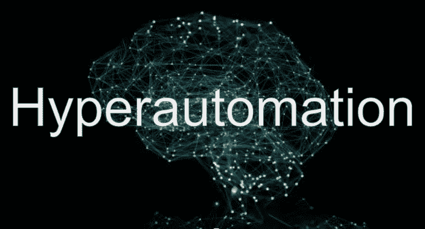

***我们先来了解一下超自动化到底是什么？***

高度自动化可以简单地定义为传统机器人流程自动化与人工智能、机器学习和数据科学能力的融合。

***为什么需要高度自动化？***

*让我们试着用一个非常简单的例子来理解这一点。*

考虑一下，你的组织开发 Android 或 IOS 应用程序&你会得到关于开发的应用程序的各种反馈。

到目前为止，很少有用户喜欢你开发的应用程序，而你却从他们那里得到了一些惊人的反馈和评价。另一方面，有一些软件极客或严厉的评论家在你的软件中发现了很多错误，并在反馈和评级中使用相同的内容来嘲笑你的开发。

如果你在这种情况下问我的意见，我会最不关心积极的反馈。因为，作为一个组织，你希望你的产品得到认可。另一方面，我喜欢关注消极的方面。在我看来，填补空白的最好方法是找到最负面的反馈，把它们作为改进你的软件的输入，以此来巩固你的市场地位。

***不确定如何去做，或者担心开发一个 ML 算法来解析反馈所需要的时间？***

***让我来带，UiPath AI 中心来救你……***

如果您是一个在自动化库存中有自动化速赢和低挂果实的组织，现在您想主动自动化需要复杂决策能力的更复杂的用例，那么 UiPath AI Center 可能是您在自动化行业各种可用选项中的最佳选择。

下面列出了它的一些功能:

1.  语言翻译。
2.  记录理解。
3.  情感分析。
4.  发票处理(印度、澳大利亚、日本和中国)
5.  发票处理(通用)
6.  图像处理

***现在你可能会疑惑，如何使用 AI 中心以及与之相关的各自 ML 技能？***

***让我们试着用一个简单的情感分析例子来理解这一点，这个例子甚至可以解释我们之前讨论过的解析客户反馈的问题？***

如前所述，情感分析 ML 模型的最佳用途可能是 ***监控产品反馈*** (例如:Play Store 上 Android 应用程序的反馈)或 ***客户&媒体情感，以测试营销活动的成功。***

***怎么用？***

1.  首先，你需要**在 UiPath Cloud 上选择 UiPath AI Center** ，或者你可能会检查相同的本地可用性。
2.  一旦安装了人工智能中心，你需要确保获得**人工智能机器人许可证**来使用人工智能技能。
3.  一旦你具备了以上两点，你就可以很好地利用现有的人工智能技能，或者通过在 UiPath 人工智能中心创建一个数据管道来训练你自己开发的人工智能技能。
4.  为了使用任何 ML 技能，你需要点击 AI 中心主页右上角的“创建项目”,如下图所示。

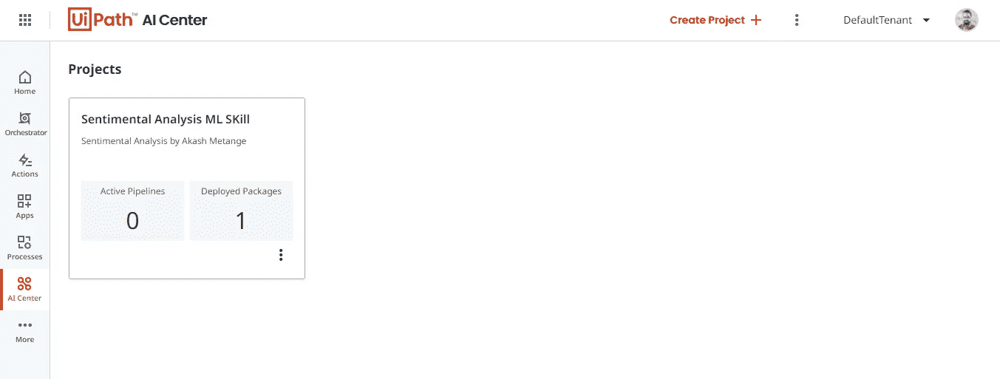

AI Center HomePage

5.单击 Create Project 后，您会得到下面的代码片段来命名项目。

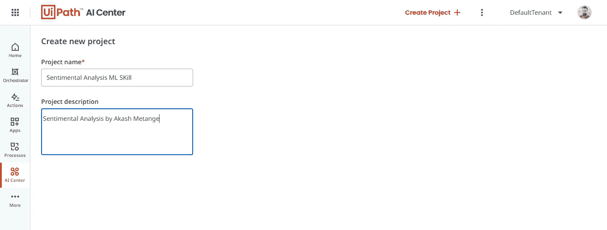

Wizard to Name the Project.

5.命名项目并单击“创建”按钮后，您将能够看到如下图所示的一组选项，用于选择即时可用的 ML 包(如情绪分析)或创建管道来训练您的内部 ML 算法。

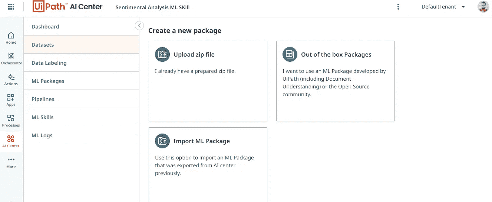

Option to Use ML Skills

6.既然，我们只是想看看如何实现情感分析，你需要点击 ML 包，稍后 ***选择如上图所示的“开箱即用”包。***

7.然后你将能够看到各种“开箱即用”的 ML 技能可供选择。可以选择 ***【情绪分析】*** ，如下图所示。

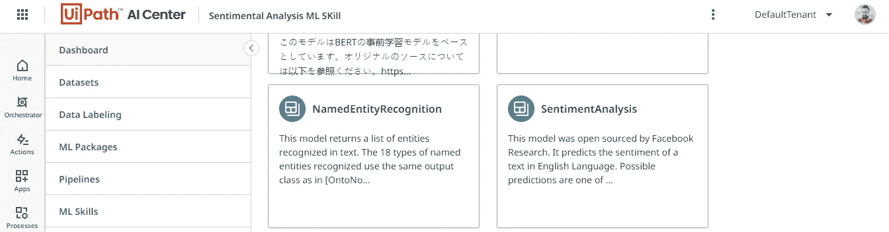

8.一旦你选择了“情感分析”，你将得到一个关于 ML 技能的信息，比如创建者、输入、输出等。您可以直接选择版本并点击提交，如下图所示。

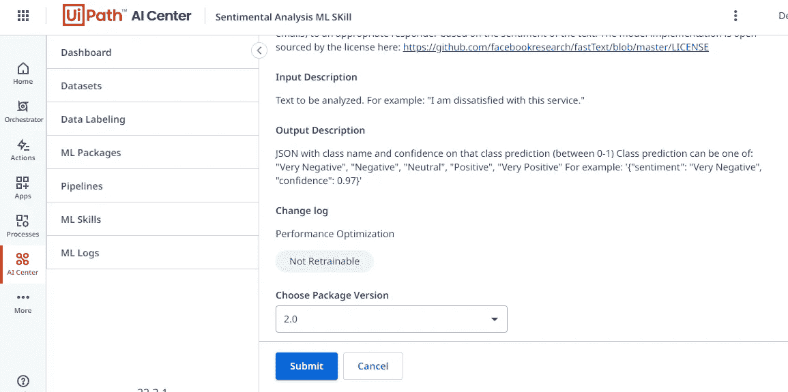

Sentiment Analysis ML Skill Info

9.作为下一步，您需要选择 ML 技能选项，并根据您的方便命名您在上述步骤中选择的 ML 技能。请注意 ***您在此步骤中提供的名称将反映在您的 Orchestrator 租户中，并且可以在您的工作室活动中通过相同的名称访问。完成后，点击创建，如下图所示。***

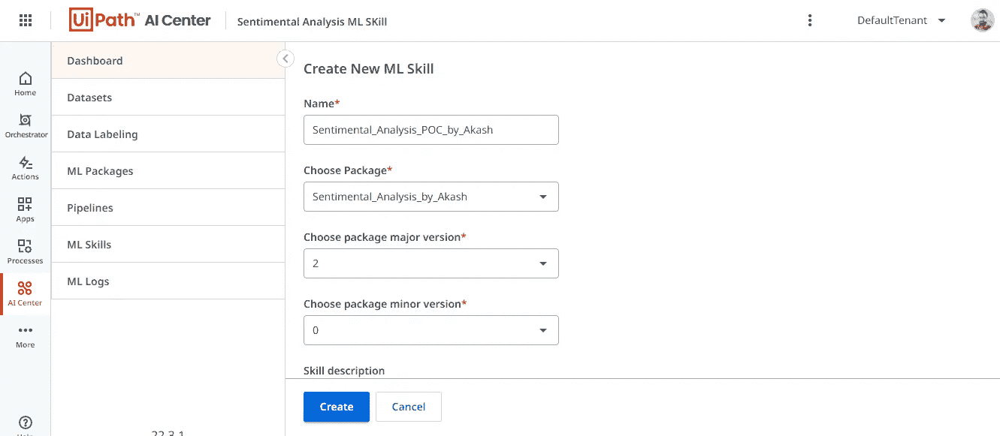

Naming ML Skill your way

10.完成上述步骤后， ***等待 ML 技能处于“可用”状态*** ，如下图所示。

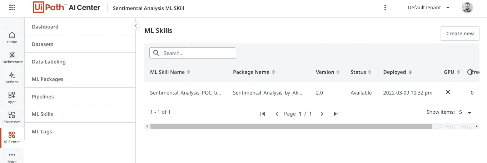

11.一旦它可用，就进入你的 UiPath 工作室，它连接到部署这个 ML 技能的同一个 Orchestrator，并安装***“ui path。ML.Services.Activities"*** 包来自 UiPath Studio 中的“管理包”部分，如下图所示。

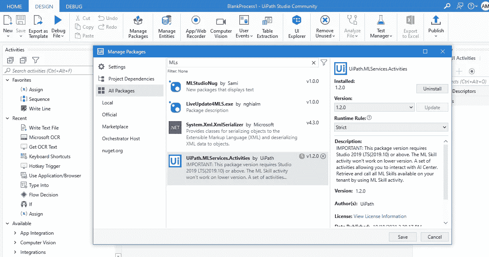

12.完成后，拖放 ML 技能活动，并选择您已部署到 Orchestrator 租户的 ML 技能。接下来，提供描述任何正面或负面人类情感的输入字符串。例如，在下图中，我给出的输入字符串是 ***“产品非常差”。*** *同样，在 json 响应字段中点击 Ctrl + K 来创建一个变量。*

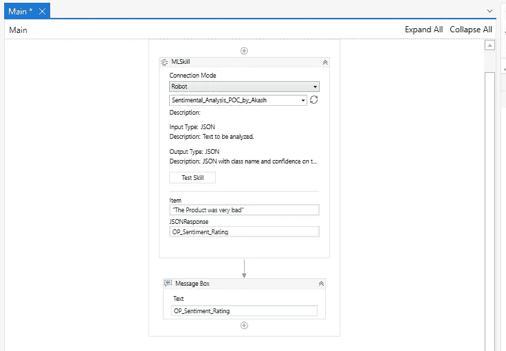

13.完成后，执行一个 Mesage Box 活动来打印输出，并将此变量作为输入提供给相同的。

现在您已经准备好运行测试用例，您将获得如下图所示的输出。

***输出是一个带有两个参数的 json 字符串。***

1.  *情绪(可以是消极的、非常消极的、中性的、积极的和非常积极的)*
2.  *自信(这告诉你，ML 技巧对所传达的情感有多自信)*

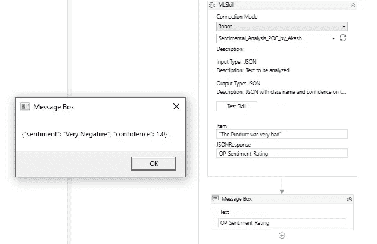

Ml Skill Output

***输出:如您所见，给定字符串中的客户情绪被分析为“非常消极”&置信度为 1。***

***请注意，输出的置信度是以中间小数 0 到 1 的标度来衡量的。***

*开发人员可以使用* ***【反序列化 Json 字符串】*** *活动反序列化该输出，以分离输出参数并决定该用例的进一步流程。*

在讨论的用例中，为了分析和区分客户反馈的优先级，开发人员可以创建一个 Orchestrator 队列，其中包含作为客户反馈的每个事务。接下来，使用情感分析 ML 技能处理反馈以区分积极和消极的反馈&根据置信度得分从最消极到最不消极排列消极反馈的优先级。

***为您的超自动化计划选择 AI 中心的优势:***

*   *在 UiPath Automation Cloud 上部署、管理和改进 ML 模型*
*   *没有基础设施，没有对 UiPath AI 云的维护*
*   *企业版正常运行时间保证。*
*   *全系列开箱即用的 ML 型号。*

***希望你喜欢这篇文章。***

***快乐自动化！！***