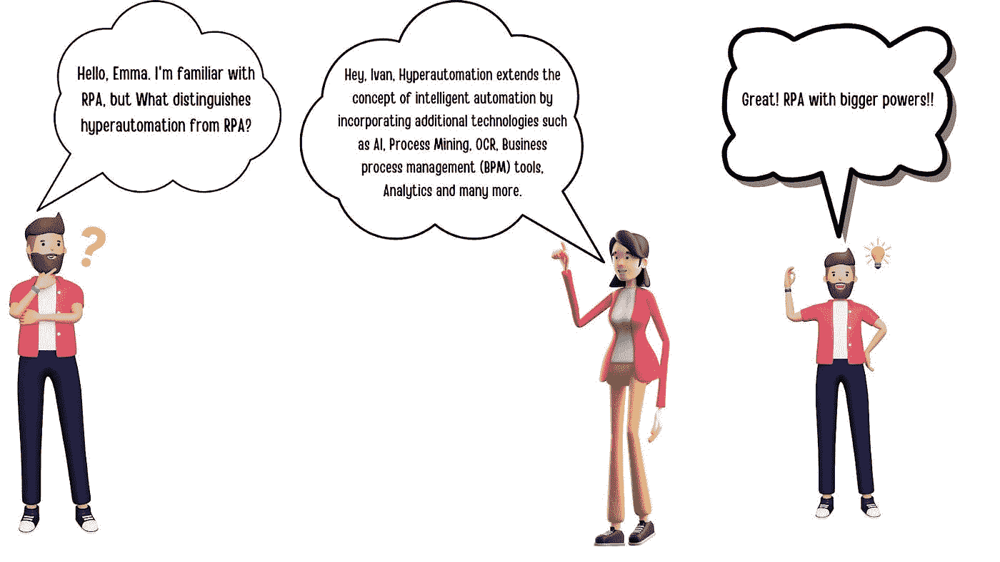
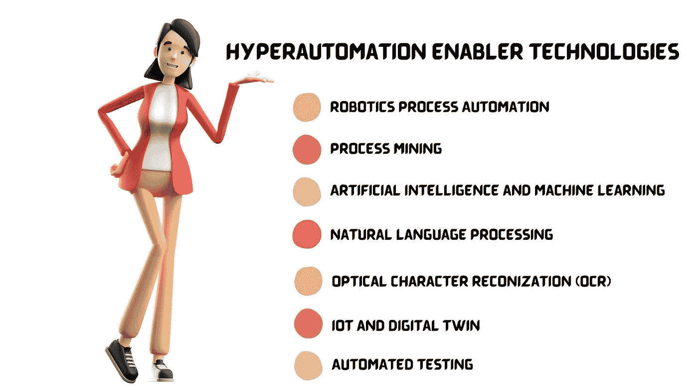
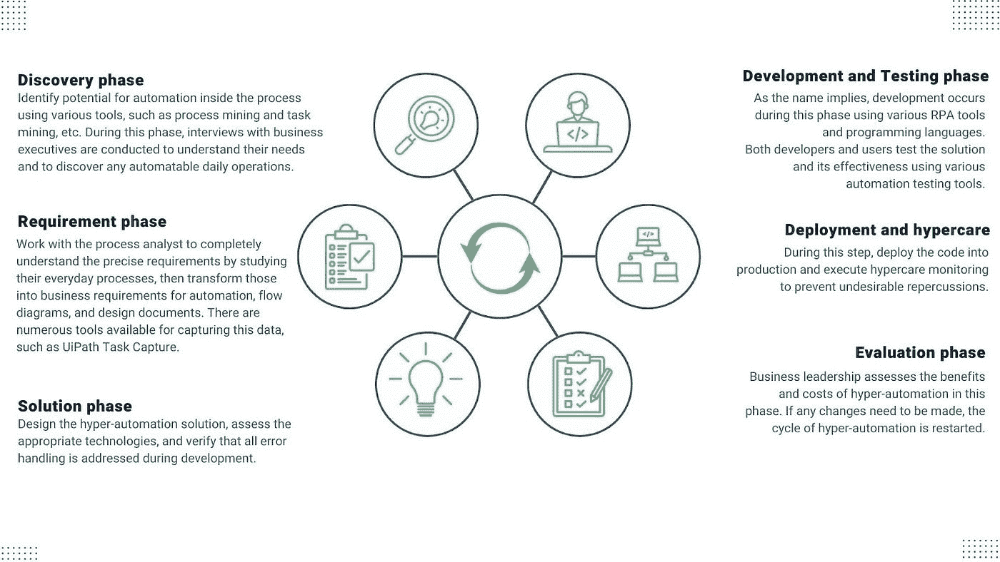

# 超自动化:欢迎来到下一代智能自动化

> 原文：<https://medium.com/globant/hyperautomation-welcome-to-the-next-generation-of-intelligent-automation-d1116c80d515?source=collection_archive---------0----------------------->

**合著:** [**马扬克·沃拉**](/@mayank.vora)

**LinkedIn:** [迪普什·阿加瓦尔](https://www.linkedin.com/in/deepesh-agarwal-2125b52b/)，[马扬克·沃拉](https://www.linkedin.com/in/mayank-vora/)

RPA 或机器人流程自动化已经存在了一段时间，并帮助企业实现了各种任务的自动化。智能自动化是 RPA 和 AI 的结合，但如果有一种方法可以实现更大程度的自动化，而不仅仅是 RPA 和 AI，会怎么样呢？这就是超自动化的用武之地，在本文中，我们将探讨它是什么以及它如何给企业带来好处。

根据 Gartner 的研究，2022 年的最高技术趋势将是超自动化。它是许多自动化技术的综合，包括 RPA、AI、ML 和 OCR。借助于任务挖掘和过程挖掘，还可以在发现阶段帮助企业。这是微软和谷歌等行业巨头的自动化和云战略的最高目标，像 [Uipath](https://www.uipath.com/rpa/hyperautomation) 、 [Automation Anywhere](https://www.automationanywhere.com/rpa/hyperautomation) 和 [BluePrism](https://www.blueprism.com/resources/blog/hyperautomation-the-competitive-advantage/) 这样的工具已经开始致力于此。

你知道吗？Globant 还提供了一个基于流程挖掘的解决方案，叫做[导航](https://www.globant.com/studio/process-optimization/navigate)。

# 什么是超自动化？

这是超越传统机器人流程自动化(RPA)的下一级流程自动化。超自动化不仅自动化了流程，还优化和改进了流程。这意味着企业可以在更少的人工干预下实现更高的效率和生产率。此外，它还可以帮助企业快速高效地扩大运营规模。

超自动化是使用先进的技术，包括人工智能(AI)和机器学习(ML)，来自动化传统上由人类执行的任务。它有可能改变许多行业的工作方式，从制造和物流到医疗保健和金融服务。

超自动化可以通过不同的 RPA 工具实现，如 Uipath 和 Blueprism，高级 OCR 工具，如 Abby，AI/ML 技术，流程挖掘，AR 和基于行业的处理工具。

# 超自动化的生命周期

超自动化是一项先进的技术，涉及从流程识别到解决方案设计、开发和生产部署以及业务效益评估的繁琐过程。

让我们看看超自动化的不同阶段:

# 用一个例子理解超自动化

企业最近开始在许多情况下扩张，这就需要使用基于规则的 RPA 之外的技术来解决各种问题。

让我们围绕超自动化讨论一个用例:

健康保险在美国是一个重要的行业，自从 COVID 爆发以来，其市场价值已经显著增加。一个更广泛的提供商网络是整个美国健康保险市场正常运转的必要条件。在这个提供商网络的帮助下，消费者和健康保险提供商可以进行交流。

然而，它在劳动力限制方面遇到了麻烦。大多数服务提供商接受消费者表单，他们可以通过手写信息或复选框来填写这些表单。尽管 RPA 在光学字符识别(OCR)方面有其自身的局限性，包括准确性和分辨率方面的问题，但这些提供商的表单是通过手动或使用 RPA 进行数字化的。

对于大多数大型保险公司来说，用人力将这些文档数字化需要大量的金钱、资源和劳动力。

于是，超自动化出现了。一些最好的 OCR 技术现在由 Uipath 和其他盈利解决方案提供。例如，Uipath 推出了文档理解，这是一个使用人工智能和机器学习阅读各种类型文本的框架，解决了这个问题，并为这些组织降低了巨大的成本。

# 超自动化的好处

超自动化比传统的自动化方法有许多好处。它有助于加快流程、提高质量和准确性、降低成本，并使员工能够专注于更高价值的任务。

它可以在许多方面帮助企业。例如，它可以用来自动识别和纠正数据输入中的错误。它还可以用来创建预测模型，预测未来的需求或趋势。此外，它可以通过提供所有自动化流程的审计跟踪来帮助实现法规遵从性。

随着企业努力用更少的资源做更多的事情，许多人开始转向超自动化——这个术语是用来描述使用先进技术来大规模自动化工作的。

简而言之，高度自动化的主要优势在于:

数字化转型(区分任务优先级)

自动化机会(RPA)

更快上市

提高生产率和质量

审计和合规

降低成本，提高可扩展性

分析文件和流程

# 结论

Hypeautomation 正在推动未来工作场所的快速发展，它是自动化业务任务方面超越 RPA 的下一步。它可以自动化整个流程，而不仅仅是单个任务，并且可以跨多个平台实现。这使得它比单独的 RPA 强大得多。如果您希望实现业务流程的自动化，超自动化是您的不二之选。

它有很多优点，但重要的是要记住，它不是万能的。确保技术被合乎道德地和负责任地使用是仍然需要解决的问题之一。然而，超自动化是一种正在彻底改变现代工作场所的有效方法。然而，保持对大局的关注并为未来做好准备至关重要。