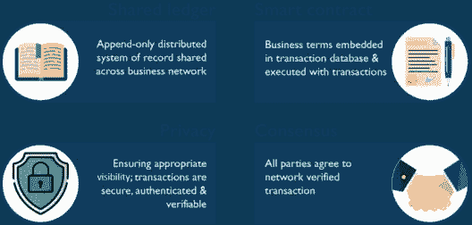
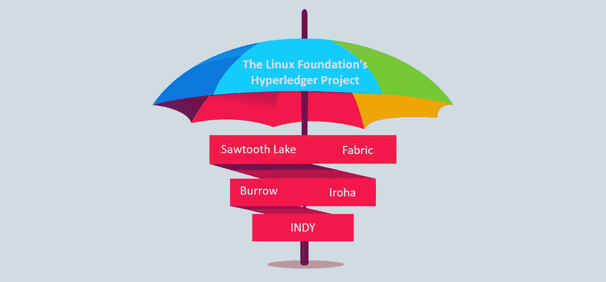
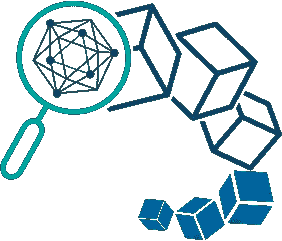
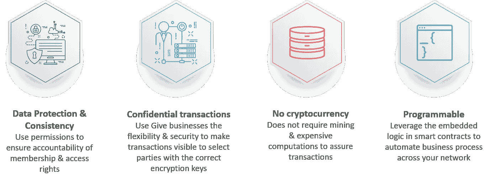
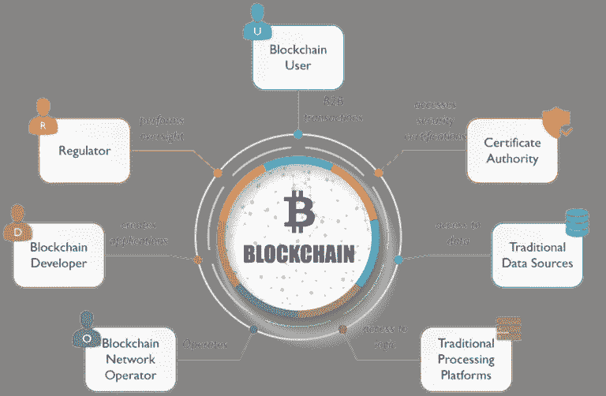
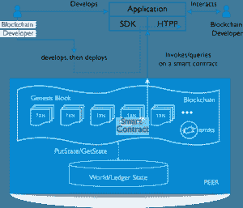
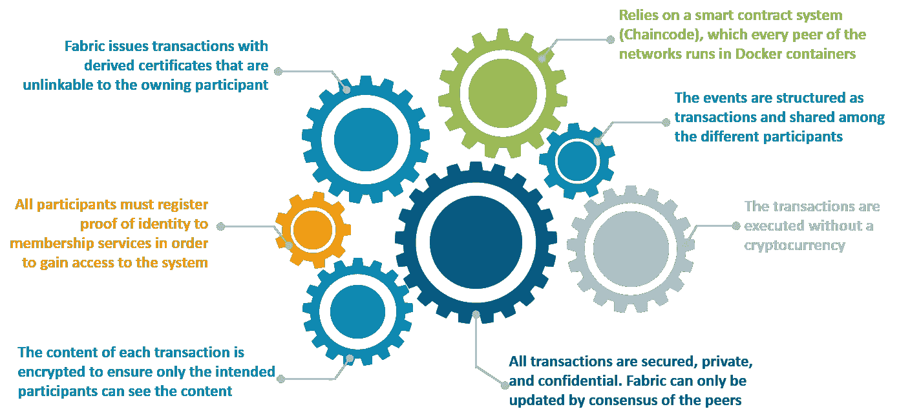
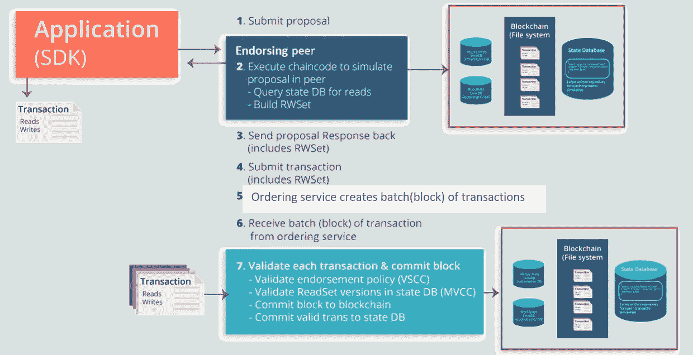
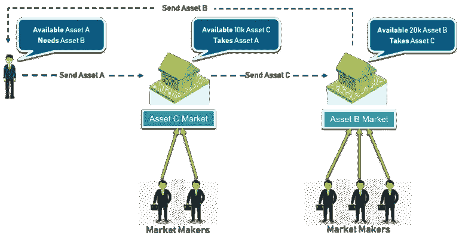

# Hyperledger Fabric——Hyperledger Fabric 架构如何工作？

> 原文：<https://medium.com/edureka/hyperledger-fabric-184667460-edc184667460?source=collection_archive---------4----------------------->

Hyperledger Fabric — Edureka

区块链将改变我们做生意的方式。共享的不可变账本和智能合同的编纂将重新定义信任在企业中的表现方式。这篇关于“Hyperledger Fabric”的文章将帮助您理解如何按照以下顺序在区块链系统上建立业务网络:

1.  商业的区块链是什么？
2.  超级分类帐项目
3.  什么是 Hyperledger Fabric？
4.  Hyperledger 结构的主要优势
5.  超分类帐结构模型
6.  Hyperledger 区块链网络的参与者
7.  织物建筑
8.  Hyperledger 是如何工作的？
9.  同行的类型
10.  超级分类帐结构的事务处理生命周期
11.  Hyperledger 结构上的用例

# 商业的区块链是什么？

它是记录的分布式分类账，其中业务条款被纳入智能合同，参与方同意网络的当前状态，并且隐私没有受到损害。

因此，为了推进企业区块链技术， *Linux 基金会在 2015 年创立了 Hyperledger。*

# 超级分类帐项目

正如 Hyperledger 网站上所说，

> “Hyperledger 是一个开源的合作项目，旨在推进跨行业的区块链技术。这是一项全球合作，由 Linux 基金会主办，包括金融、银行、物联网、供应链、制造和技术领域的领导者。”

Hyperledger 在其“**伞式战略**”下孵化了过多的商业区块链技术、框架。目前，Hyperledger 包含以下项目:

*“IBM 领导的* ***Fabric*** *(或 Hyperledger Fabric)旨在开发具有权限灵活性的高可伸缩性区块链应用”*

现在，我的意思是什么，你会知道的！！

# 什么是 Hyperledger Fabric？

该结构旨在开发具有模块化架构的解决方案。Hyperledger 允许组件即插即用。

这是一个私有和许可的区块链系统，这意味着与允许未知身份参与网络的无许可(或公共网络)系统不同，成员通过**成员服务提供商(MSP)** 注册。

它还提供了创建通道的能力，允许一组参与者创建单独的交易分类帐。

*由于 Fabric 是被许可的区块链，它比其他区块链系统有一些主要优势。*

# Hyperledger 结构的主要优势

# 超分类帐结构模型

以下是 Hyperledger Fabric 的主要功能，实现了其可定制企业区块链的承诺

> **资产:**实现网络上的货币价值交换。
> 
> **Chaincode:** 从交易顺序中划分，限制跨节点类型所需的信任和验证级别，优化网络可扩展性和性能。
> 
> **账本功能:**对每个渠道的全部交易历史进行编码，并包含类似 SQL 的查询功能隐私通过。
> 
> **渠道:**实现高度私密性和保密性的多边交易。
> 
> **安全&会员服务:**获得许可的会员参与者知道，所有交易都可以被授权的监管机构和审计机构发现和追踪。
> 
> **共识:**允许网络创业者选择最能代表参与者之间关系的共识机制。

# Hyperledger 区块链网络的参与者

# 织物建筑

*   区块链开发者编写应用程序和智能合约。
*   他使用 **DEPLOY 将应用程序部署在服务器上，并将智能合约部署在对等设备上。**
*   注册用户通过智能合约与应用程序发送命令**(调用)**或检索信息**(查询)**进行交互
*   智能合约可以发出应用程序订阅的事件

# Hyperledger 是如何工作的？

Hyperledger Fabric 旨在成为工业区块链解决方案的真正模块化、可扩展和安全的基础。从 Fabric 1.0 版升级到 Fabric 1.0 最显著的变化可能是对等体现在被分离成两个独立的运行时，并有三个不同的角色。

# 同行的类型

1.  **提交者对等体**:提交事务，维护分类帐和状态
2.  **背书方:**接收背书交易提议，响应同意或拒绝背书
3.  **订购对等方:**批准将交易块纳入分类帐，并与对等方和批准对等方节点通信

# 超级分类帐结构的事务处理生命周期

# Hyperledger 结构上的用例

Hyperledger 几乎可以托管任何类型的业务网络。由于可扩展性是一个优势，许多用例正在该结构上开发。

## **用例:资产的互操作性**

## **描述:**

资产的互操作性意味着一组人之间的资产交换。

## 问题陈述:

如果一个组织需要 20，000 个单位的资产 B，但却拥有 10，000 个单位的资产 A，它需要一种将资产 A 交换为资产 B 的方法。尽管当前市场可能无法提供足够的流动性来快速完成这种交易，但在资产 A 和资产 C 之间以及资产 C 和资产 B 之间可能有大量的流动性

现在 A 和 B 之间的直接交易有市场限制，那么可能的解决方案是什么？

## **解决方案:**

在这种情况下，一个连锁网络将买家与“埋藏”的卖家联系起来，找到最佳匹配(可能埋藏在几层资产之下)，并执行交易。因此，基本上可以在 Hyperledger 结构上建立一组个人的业务网络，并且可以在买方和卖方之间交换资产。

因此，Hyperledger 的战略目标是在区块链技术上构建商业解决方案，这与基于货币的区块链截然不同。这对某些人来说可能很平常，但对技术来说也更简单。

我猜我的 Hyperledger 结构的信息桶现在是空的，我希望阅读是富有成效的。如果你想查看更多关于人工智能、DevOps、道德黑客等市场最热门技术的文章，你可以参考 Edureka 的官方网站。

请留意本系列中的其他文章，它们将解释区块链的其他各个方面。

> 1.[区块链教程](/edureka/blockchain-tutorial-d05f9c36b62b)
> 
> 2.[以太坊教程](/edureka/ethereum-tutorial-with-smart-contracts-db7f80175646)
> 
> 3.[以太坊私人网络](/edureka/ethereum-private-network-tutorial-22ef4119e4c3)
> 
> 4.什么是智能合约？
> 
> 5.[坚固性教程](/edureka/solidity-tutorial-ca49906bdd47)
> 
> 6.[松露以太坊教程](/edureka/developing-ethereum-dapps-with-truffle-7533289c8b2)
> 
> 7.[最佳以太坊开发工具](/edureka/ethereum-development-tools-7175503a1ac7)
> 
> 8. [Hyperledge vs 以太坊](/edureka/hyperledger-vs-ethereum-bdc868e10817)

*原载于 2018 年 2 月 7 日*[*www.edureka.co*](https://www.edureka.co/blog/hyperledger-fabric/)*。*