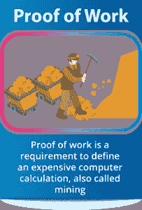

# Hyperledger vs 以太坊——哪个区块链平台会让你的业务受益？

> 原文：<https://medium.com/edureka/hyperledger-vs-ethereum-bdc868e10817?source=collection_archive---------6----------------------->

Hyperledger vs Ethereum — Edureka

想了解区块链概念和相关工具如何成为商业和技术之间的纽带？它们将如何使您的企业受益？那你就来到了正确的地方。这篇关于 **Hyperledger vs Ethereum** 的文章将强调两个备受追捧的区块链平台之间的差异。然后，您可以自己决定这两者中哪一个更适合您的需求。

*以下是您将在本文中了解的主题:*

1.  以太坊是什么？
2.  什么是 Hyperledger？
3.  Hyperledger vs 以太坊:关键区别
    3.1 目的
    3.2 保密性
    3.3 同行参与的模式
    3.4 共识机制
    3.5 编程语言
    3.6 加密货币
4.  你应该选哪一个？

在深入研究这个概念之前，让我们先来概述一下这两个平台之间的区别:

# 超级账本 vs 以太坊

现在，让我们来了解一下这些平台，并详细了解上述每一点。

# 以太坊是什么？

以太坊是一个开源的分布式公共区块链网络。它允许在智能合约功能的帮助下，在其上构建分散的应用程序。

Vitalik Buterin 开发了以太坊，作为最初核心区块链概念的延伸。他临时修改了比特币的协议，以支持货币发行以外的应用。它的主要突破是能够轻松编写和部署智能合同。这些实际上是在网络上执行的代码。因此，这个平台可以帮助开发人员编写构建分散式组织的程序。

世界各地的任何人都可以与以太坊区块链连接，并可以保持网络的当前状态。因此，以太坊也被广泛称为 ***【世界计算机】*** 。

# 什么是 Hyperledger？

*“Hyperledger 是一个开源开发项目，旨在让基于 Hyperledger 的解决方案提供商和用户的生态系统受益。它专注于将在各种工业部门下工作的区块链相关用例。”* —布莱恩·贝伦多夫(Hyperledger 执行董事)

每个企业和行业都有自己独特的方式，满足其需求的应用程序必须个性化。以太坊区块链通过一个非常通用的协议来处理网络上运行的所有东西。另一方面，你可以把 Hyperledger 看作是一个软件，让人们开发他们自己的个性化区块链来满足他们的业务需求。

Hyperledger 是一个由 Linux 基金会主持的开源协作项目。它既不是工具，也不是以太坊那样的平台。这是一个包含多个平台的总体战略，用于开发企业解决方案。

现在你知道什么是超账本和以太坊了，让我们来比较一下它们的不同之处，以及它们是如何服务于不同目的的。

# 超级账本与以太坊:主要区别

## 目的:

超账本和以太坊最本质的区别在于它们的设计意图。

***以太坊*** 在 EVM 上运行智能合约，用于那些被认为是去中心化的、面向大众消费的应用。

另一方面， ***Hyperledger*** 借力区块链技术进行业务。它旨在支持组件的可插拔实现，提供高度的机密性、弹性和可伸缩性。Hyperledger 有一个模块化的体系结构，并在如何使用它方面提供了很大的灵活性。其可扩展的架构为区块链企业提供了超前的解决方案。

## 保密性:

假设*安迪*在区块链上经营着一个馅饼制造业。

通过 Hyperledger，安迪可以以折扣价向鲍比出售馅饼，同时对他们的协议保密，不让安迪的其他客户知道。

如果安迪用以太坊做同样的事情，这样的安排是不可能的。因为以太坊是绝对透明的，每个交易对网络上的每个人都是可见的。

因此，*总账*允许保密交易。因此，它为企业提供了灵活性和安全性，使交易对具有正确加密密钥的特定方可见。

## 同行参与的方式:

我们来看看 Hyperledger vs 以太坊的运作模式。

*以太坊*可以是公共的，也可以是私人的，没有任何权限，而 Hyperledger 是一个私人的，有权限的网络。

这意味着在以太坊，任何人都可以在任何时候加入网络。但是 Hyperledger 有一个预定义的参与者社区，只有他们才能访问网络。一个需要许可才能加入网络。这种参与模式对如何达成共识有着深远的影响。

## 共识机制:

有了以太坊，所有的网络参与者(或节点)必须就所有的交易达成共识。这与节点是否参与特定事务无关。目前，以太坊通过基于工作证明(PoW)算法的挖掘来建立其共识机制。所有的节点必须同意一个共同的分类账，所有的节点都可以访问所有记录的条目。

相比之下，Hyperledger 允许节点在无操作(不需要共识)和协商协议(PBFT)之间进行选择，通过协商协议，两方或多方可以以双方都影响结果的方式就密钥达成一致。这阻止了不受欢迎的第三方将关键选择强加给同意方。因此， *Hyperledger* 拥有对共识的细粒度控制和对事务的受限访问，从而提高了性能可伸缩性和隐私性。

## 编程语言:

另一个关键区别是以太坊中智能合约的使用，它是用一种叫做 **Solidity** 的面向合约的高级语言编写的。

但是，在 Hyperledger 中，您可以将术语“*链码*”用作智能合同的同义词。链码通常处理网络成员同意的业务逻辑，因此它可以被视为智能契约。这些链码是用谷歌创造的编程语言 Golang 编写的。

## 加密货币:

*Hyperledger* 不需要加密货币进行交易。它没有像以太坊的令牌以太那样内置原生加密货币。因此，根本不需要采矿。这允许可扩展的一致性算法能够处理大多数企业应用程序所需的高事务速率。但是，看硬币的两面(或令牌，嗯？)由于*以太坊*有自己的以太，在需要加密货币的用例中，它比 Hyperledger 更有优势。

由于 Hyperledger 也是可编程的，它可以利用 chaincode 中的嵌入式逻辑来自动化整个网络中的业务流程。如果需要，您还可以通过 chaincode 开发定制令牌。

# 你应该选哪一个？

在实践层面上，想要在这样的平台上构建应用程序或开始一个行业的开发者必须做出选择。Hyperledger 和以太坊，两者都是高度灵活的，只是在不同的方面。

以太坊强大的智能合约引擎使其成为几乎任何类型应用的通用平台。然而，它的无许可操作模式和完全透明性是以牺牲性能可扩展性和隐私为代价的。

Hyperledger 通过许可的操作模式和细粒度的访问控制解决了性能可伸缩性和隐私问题。此外，模块化架构允许 Hyperledger 针对众多应用程序进行定制，类似于一个工具箱。

我希望这篇关于*以太坊与 Hyperledger* 的文章与您相关，并帮助您了解哪种平台更适合您的业务应用。

如果你想查看更多关于人工智能、DevOps、道德黑客等市场最热门技术的文章，那么你可以参考 [Edureka 的官方网站。](https://www.edureka.co/blog/?utm_source=medium&utm_medium=content-link&utm_campaign=hyperledger-vs-ethereum)

请留意本系列中的其他文章，它们将解释区块链的其他各个方面。

> 1.[区块链教程](/edureka/blockchain-tutorial-d05f9c36b62b)
> 
> 2.[以太坊教程](/edureka/ethereum-tutorial-with-smart-contracts-db7f80175646)
> 
> 3.[以太坊专用网络](/edureka/ethereum-private-network-tutorial-22ef4119e4c3)
> 
> 4.什么是智能合约？
> 
> 5.[坚固性教程](/edureka/solidity-tutorial-ca49906bdd47)
> 
> 6.[松露以太坊教程](/edureka/developing-ethereum-dapps-with-truffle-7533289c8b2)
> 
> 7.[最好的以太坊开发工具](/edureka/ethereum-development-tools-7175503a1ac7)
> 
> 8.[总账结构](/edureka/hyperledger-fabric-184667460-edc184667460)

*原载于 2018 年 3 月 16 日*[*www.edureka.co*](https://www.edureka.co/blog/hyperledger-vs-ethereum/)*。*