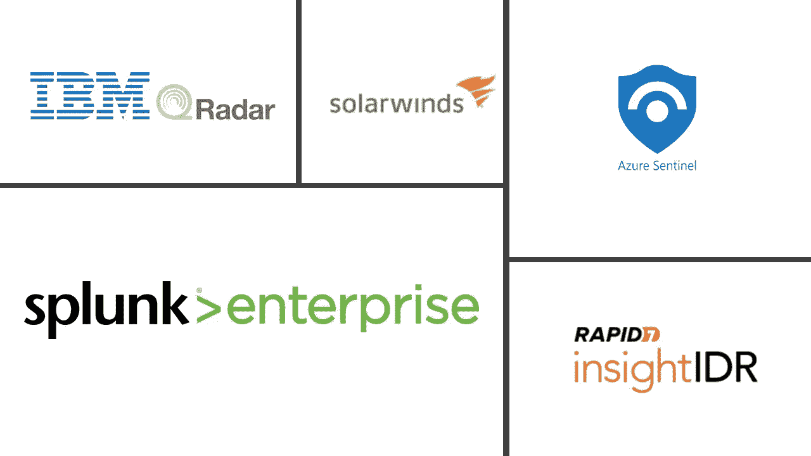

# 我已经有了监控，为什么还需要 SIEM？

> 原文：<https://medium.com/version-1/i-already-have-monitoring-in-place-why-do-i-need-a-siem-2fe05a216509?source=collection_archive---------0----------------------->

随着网络攻击的急剧增加，对安全攻击或事件的监控变得前所未有的重要。组织需要找到一种方法来领先于攻击者。许多组织都有某种形式的监控，并避免使用安全信息和事件管理(SIEM)技术，认为它们执行相同的工作。