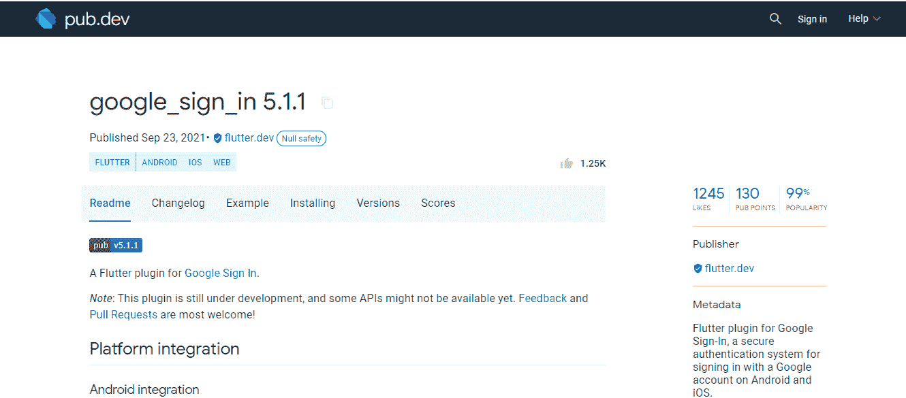

# 我用 Flutter 和 Firebase 在 1 个小时内创建了一个聊天应用程序——你也可以这么做！

> 原文：<https://medium.com/quick-code/i-built-a-chat-app-using-flutter-and-firebase-in-1-hour-heres-how-you-can-too-d0004a6dc932?source=collection_archive---------0----------------------->

## 使用 Firebase 在 Flutter 中创建聊天应用程序的分步指南

Image By: [roketpik](https://unsplash.com/@roketpik)

使用 Firebase 在 Flutter 中创建聊天应用程序的分步指南。(此外，关键的技术见解来自一家涉足多种移动应用开发服务的 [***颤振应用开发公司***](https://www.suntecindia.com/flutter-app-development-company.html) *。)两个平台(Flutter & Firebase)都在发展，所以请继续关注更新。*

比方说，您需要一个简单的应用程序，允许您注册、登录和注销，使用贴纸、文本和图像与其他用户对话，并跟踪您的对话。

多亏了 Flutter，为这样的东西设计 UI 非常简单快捷。但是，这个应用程序将在多个设备上运行，您需要一个共享的数据源——后端——供所有设备使用。它必须是安全的，保持强大的实时连接，并保持每个人同步。

> 这就是我们推出 Firebase(和云 FireStore 的原因，稍后会详细介绍！)

在这里，您可以找到以下问题的答案。

> 如何用 Firebase & Flutter 创建一个聊天应用？
> 
> Firebase 是搭建聊天 app 的好选择吗？
> 
> 不用 Firebase 可以搭建一个 Flutter 聊天 app 吗？

我们还将讨论成本结构和利弊，以防您选择外包 Flutter 应用程序开发服务。

开始了。

# 对我们今天所做事情的一个快速总结

我们将开发一个聊天应用程序。选择的框架-颤动。后端-谷歌 Firebase。

这个聊天应用程序将至少有以下功能。

*   Google 帐户的登录、注册和注销选项
*   聊天选项中的文本、图像和贴纸
*   具有基本细节和头像的用户配置文件
*   数据上传和检索

我假设我们有一个处于半工作状态的颤振项目。没什么特别的，所以不用担心。你还不需要雇佣移动应用开发者。该项目只需要有我们的聊天应用程序的框架。这包括页面(主页、聊天、登录等。)

# 介绍

## 谷歌 Firebase

Firebase 是谷歌支持的后端即服务平台。它用于构建和运行软件应用程序。

在 Firebase 上构建一个聊天应用程序很容易，也是理解实时数据库如何工作的一个很好的方式。此外，它还提供了解决常见应用程序开发挑战的工具。

## Firebase 是搭建聊天 App 的好选择吗？

这是有原因的。我举几个例子:

*   无限的分析报告，500 个独立事件免费
*   安全的身份认证系统，以及直观的登录体验
*   自定义用户入职流程的配置
*   电子邮件和密码帐户，加上社交媒体登录
*   密码认证
*   实时数据库、实时数据同步和离线数据访问
*   一个省时的事故记者
*   简化的跨设备、跨配置应用测试
*   最小学习曲线

# 摆动

Flutter 是 Google 的产品——一个开源的、免费的、可移植的 UI 工具包。它用于通过代码重用和单一代码库为不同系统(如 Android 和 iOS)构建原生移动应用程序。

# 为什么我们更喜欢颤振？

Flutter 是大多数领先的移动应用程序开发服务的最爱。颤振的开发相对来说更便宜和更有效率。

> 很多其他原因让 Flutter 成为 app 开发的好选择。

*   快速 UI 编码
*   现成的小部件
*   dart——一种简单的面向对象语言
*   温和的学习曲线
*   大量的文档
*   用于实时更新的热重装工具

# 使用 Firebase 在 Flutter 中开发聊天应用程序的 4 个步骤

1.  在 Firebase 中创建一个项目
2.  将 Firebase 连接到您的 Flutter 应用程序
3.  安装插件
4.  创建屏幕布局
5.  登录屏幕
6.  主屏幕
7.  个人资料页面
8.  聊天屏幕

# 1.在 Firebase 中创建一个项目

使用 Firebase 的第一步是一个谷歌账户。您需要一个登录并进入 Firebase 控制台，在那里您可以创建一个新项目。

Image By: Author

到达这里后，单击“创建项目”按钮。接下来，输入“项目名称”并单击“继续”

Image By: Author

接下来就是用 Firebase 注册你的 app，也就是把 Firebase 添加到你的 iOS、 [**Android**](https://www.suntecindia.com/android-application-development-company.html) ，或者 [**web app**](https://www.suntecindia.com/web-application-development-services.html) 。控制台会要求您输入 iOS 包 ID 或 Android 包名称。您可以在 Android 清单或源代码中找到详细信息。

如果你计划在多个平台上发布你的聊天应用，比如 iOS 和 Android，你需要在 Firebase 上注册所有的应用。您可以在这里添加多个应用程序，所以这不是问题。

Image By: Author

注册您的应用程序并下载配置文件。(保存好以备将来使用。)

现在，记住，这个想法是通过 Google Firebase 建立认证和存储。为此，我们将使用云 FireStore。

Image By: Author

创建新的数据库。您可以在生产模式或测试模式下启动。

Image By: Author

至此，您已经为创建集合做好了准备。你有一个工作的后端。现在，我们需要将它连接到您的 Flutter 应用程序，以建立一个无缝的、活动的连接。

# 2.将 Firebase 连接到颤振

您需要将云 Firestore 插件添加到您的 Flutter 应用程序中。为此，我们将回到名为 google-services.json 的配置文件。

Image By: Author

转到您的 Flutter 项目源代码，并将配置文件放在 android/app 目录中。

Image By: Author

完成后，打开 build.gradle 文件。向依赖项部分添加一行代码。

*class path ' com . Google . GMS:Google-services:3 . 2 . 0 '*

然后，在 app 级别打开 build.gradle 文件，在底部再添加一行代码。

*应用插件:' com . Google . GMS . Google-services '*

这是给安卓用的。对于 iOS，将属性列表文件，即在 Firebase 上注册 iOS 应用时下载的配置文件，拖动到 Flutter 上项目的 Runner 文件夹中。

Image By: Author

Image By: Author

现在，你只需要建立最后的联系。在 Flutter 中打开 pubspec.yaml 文件。这是 Flutter 存储项目元数据和依赖项的地方。在这里，在依赖项部分下添加 *cloud_firestore:* 。然后，点击“工具”、“Flutter”菜单和“Flutter 包获取”

就是这样！插件已被导入。您的 Flutter 应用程序项目和 Firebase 现在可以进行通信了。

# 3.为聊天应用获取合适的插件

让我们回到我们讨论 Firebase & Flutter 聊天应用中的便利设施的时候。或者，问问自己- **我如何使用一个实时聊天 app** ？

*   注册或登录
*   进入包含所有打开的聊天的主页
*   点击一个
*   键入文本
*   发送图像
*   通读旧课文
*   设置个人资料图片和用户名
*   查看其他用户的个人资料图片和用户名

从开发人员的角度来看，这些动作都需要在 Flutter 中执行的许可，以及 Firebase 获取、记录和使用数据的许可。这是通过插件完成的。

> 特别是这些。

*   firebase_auth —用于 firebase 身份验证 API
*   google _ sign _ in——一个插件，方便在 Android 或 iOS 上使用 Google 帐户登录
*   cloud _ Firestore——用于 Google Firestore(我们已经使用过这个)
*   firebase _ 存储
*   fluttertoast —用于 Flutter 的 toast 库
*   shared_preferences —方便键值对的读写
*   image_picker —从内部图库中挑选照片，并从相机中拍摄照片
*   Cached_network_image —用于加载和缓存网络图像
*   intl —处理本地化的消息、日期格式、数字格式、来回文本、解析和其他国际化问题

根据你如何扩展和添加功能，记住要放入正确的插件，这样你的 Flutter 和 Firebase 就可以毫无问题地交互。要获得这些包的最新版本，在搜索引擎上键入包名+Flutter。

Image By: Author

单击“Pub.devhttps://pub.dev”结果。

Image By: Author

通过这个技巧，你可以很容易地获得所有这些插件。

# 4.使用插件和小部件的 Flutter & Firebase 中的屏幕布局设计

目前为止还好吗？

完美！

让我们来谈谈屏幕、后端数据库以及使用插件来连接这两者。

关于屏幕布局的转换包括它们的外观和行为。比如**如何在 Flutter** 上添加一个 chatbox？

您编写代码并设计一个带有文本框、背景和发送按钮的用户界面。但是，您也可以将它链接到一个数据库，并定义文本的位置，或者当一个用户向另一个用户发送消息时存储图像。

Image Source: ([https://www.youtube.com/watch?v=wHIcJDQbBFs](https://www.youtube.com/watch?v=wHIcJDQbBFs))

当我们的用户登录时，该数据应该记录在 Firebase 存储中。用户换头像应该会出现这种情况。图像名称和网址应该存储在后端。当两个用户聊天时，数据应该在 Firebase 中的同一个节点读写。

因此，当我们将我们的 Flutter 应用程序与 Google Firebase 连接，并通过注册或登录，或发送文本或图像来运行测试时，它应该会反映在数据库中。

这是您的数据库中有几个条目时的样子。

Image By: Author

我希望你已经为每个屏幕创建了页面。如果你还没有，现在是时候这样做了。为了方便起见，我们将它们命名为-

*   签到镖
*   注册. dart
*   主屏. dart
*   聊天屏幕. dart
*   密码忘记了. dart
*   轮廓.镖

在每个文件中，您将创建一个小部件并添加 UI 元素(按钮、支架等)。)是特定屏幕所需的。

完成这部分的 Flutter 聊天应用程序设计后，打开 *lib/main.dart* ，为你想要激活的插件添加一行代码。这里有几个例子。

1.  *导入‘package:flutter/material . dart’；*
2.  *导入‘包:Google _ sign _ in/Google _ sign _ in . dart’；*
3.  *导入' package:image _ picker/image _ picker . dart '；*

你明白了！

因为我们已经在 pubspec.yaml 文件中添加了 *cloud_firestore:* 依赖项，所以这个导入链接将充当电源按钮，并为目标插件启动 Cloud Firestore。当用户使用任何屏幕向你的应用程序发送数据时，内容会自动记录在 Firebase 上。

*   第二个命令将记录数据(用户名等。)在数据库中通过 Google 登录。
*   第三个命令将记录图像细节。
*   第一个会改变用户界面背景。

根据屏幕的不同，我们使用插件来定义你的布局的功能，并将数据自动传送到 Firebase。这消除了数据库错误，使您的工作更快。

此时，请记住还要将某些特定信息存储到本地存储中。例如，这可以用来存储和加载贴纸和表情符号。

# 在 Flutter 和 Firebase 中创建聊天应用程序的成本

有两种方法可以做到这一点。

1.  使用这里显示的过程，做更多的研究，然后自己构建它。
2.  从 Flutter 应用程序开发公司雇佣移动应用程序开发人员。

我提到这一点是因为创建一个 Flutter 聊天应用程序的成本因您选择的方法而异。而且，这两个阶段都有起伏。

DIY 的方式会帮助你的学习过程。然而，你可能会注意到我的教程中的缺口。我们已经讨论了用 Firebase、Flutter 和互联网构建聊天应用程序的步骤。但是，我更关注 Google Firebase。如果你想了解更多关于在 Flutter 中创建聊天应用的信息，你需要一个更详尽的指南。

另一方面，如果你 [**雇用软件开发人员**](https://www.suntecindia.com/hire-dedicated-developers.html) ，同时了解你可以用 Firebase 和 Flutter 实现什么(我在这篇文章中已经清楚地说明了这一点)，那你就占了上风。你知道自己需要什么，知道自己的发展方向。而且，Flutter 应用程序开发服务将为您处理细节。没有压力。没有麻烦。

说到这里，让我们来看看这个成本结构，以衡量 Flutter 聊天应用的情况。

此外，您选择的功能将影响您向任何移动应用程序开发服务提供商支付的最终价格。这里有一个例子，说明了构建 Facebook Messenger 这样的 Flutter 应用程序的成本。

我的建议是:确定您的功能、复杂性和扩展需求。相应地定制外包费用。

# 我们结束了！

您已经使用 Firebase 构建了一个可行的(尽管有些幼稚)抖动的 chap 应用程序。恭喜你！

> 在我们继续下一步之前，我将解决一些与当前主题相关的常见问题。看看他们！

1.  **我们能把 Firebase 用于聊天应用吗？**

是的。作为后端。

**2。Firebase 可以免费使用吗？**

绝对的。谷歌确保了这一点。

**3。从哪里可以获得 Flutter 聊天 app 源代码？**

试试 GitHub。你会发现很多。

**4。可以用 MySQL 搭建一个 Flutter 聊天 app 吗？**

是的。要知道我们如何做到这一点，继续检查这个空间的更新。

当你刚刚开始学习 Flutter 和 Firebase 的时候，像我这样的教程会有很大的帮助。然而，如果你想用 Firebase 在 Flutter 中为企业创建一个聊天应用，我建议你咨询专业的 Flutter 移动应用开发服务。

因为涉及到投资、预期、ROI，所以雇佣一个 Flutter 的 app 开发公司更有可能为你带来结果。

如果你有任何困惑或疑问，请在评论中留下。比如问我任何关于 Flutter，Firebase，live chat 应用的问题。或者，如果你想了解更多关于 [**手机 app 开发服务**](https://www.suntecindia.com/mobile-app-development-services.html) 或者如何 [**聘请软件开发者**](https://www.suntecindia.com/hire-dedicated-developers.html) ，问吧。我会准备好答案的！

祝你发展顺利！

## 查看我们最新的博客:

[做一个像优步这样的 App 要多少钱](https://www.suntecindia.com/blog/how-to-make-an-app-like-uber/)

你应该将房地产照片编辑外包给自由职业者还是网络公司？

[如何创建一个互动的&增强型电子书](https://www.suntecindia.com/blog/how-to-create-an-interactive-and-enhanced-ebooks/)