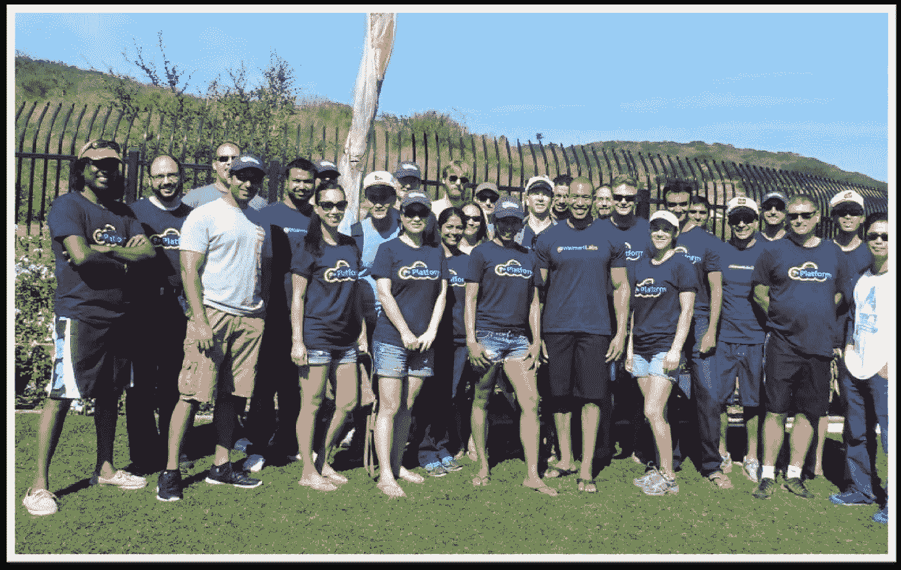
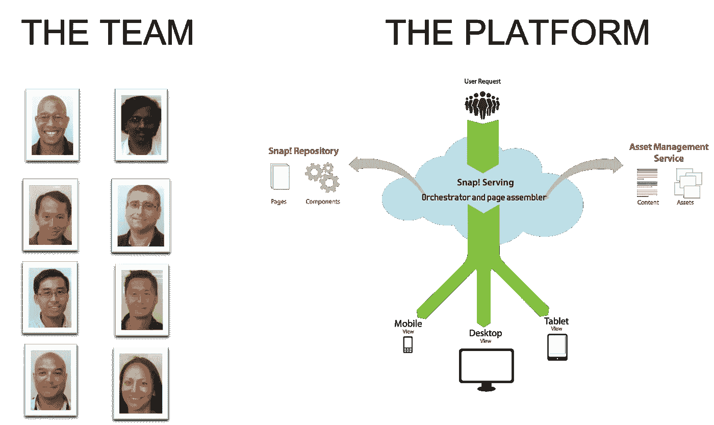
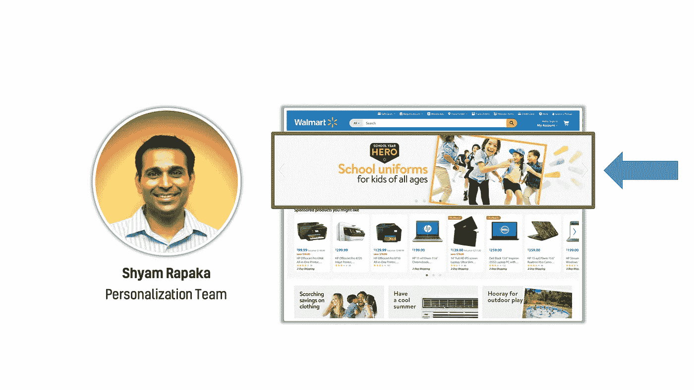
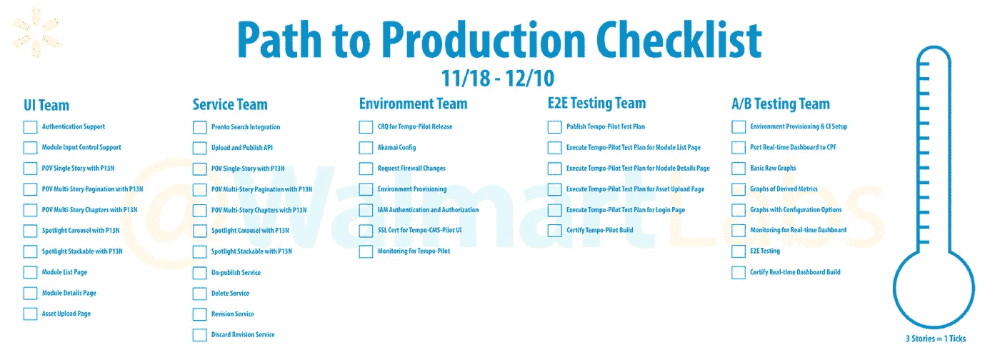
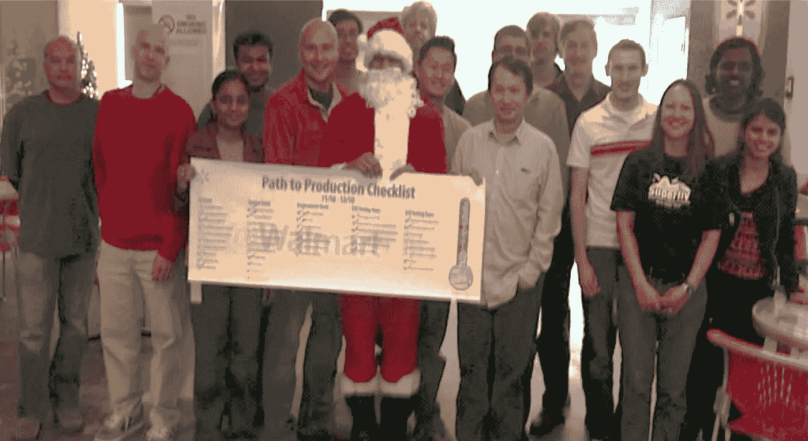
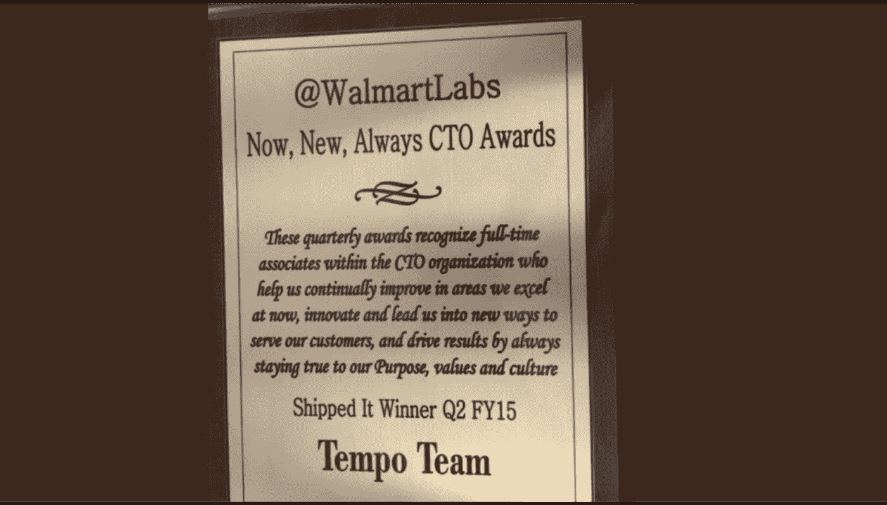
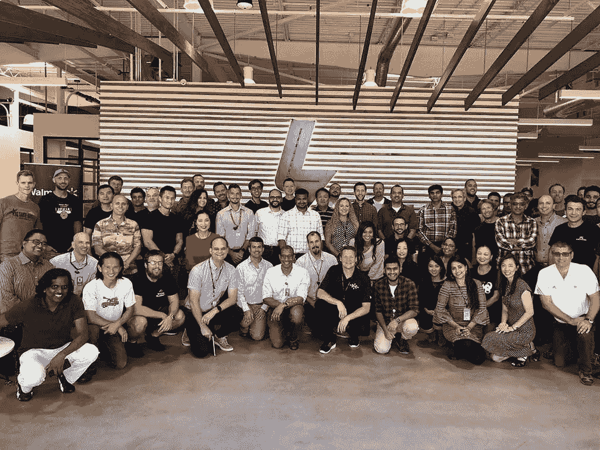

# 我差点被沃尔玛实验室解雇。以下是我用来扭转我的处境的 4 个基本原则。

> 原文：<https://medium.com/walmartglobaltech/i-was-almost-fired-from-walmart-labs-bdeb874cdbef?source=collection_archive---------0----------------------->

Image Credit: [retrorocket](https://www.istockphoto.com/vector/getting-fired-gm450962875-24752741)

# **前奏**

Experience Tools team during our annual team event in Carlsbad

## 复原力与建立团队信任的个人案例研究

12 月是我差点被沃尔玛实验室解雇的周年纪念日。

这是我职业生涯中的一个里程碑，在这里我学会了如何领导和建立团队信任，让我有信心创造一种团队文化，随时准备应对我们前进道路上的任何挑战。

我意识到生活总是会扔给你曲线球，但只要有适当的专注、坚定的立场和耐心，你就能打出全垒打。

这是我的全垒打故事。我与你分享这个，希望它能给任何经历挑战的人以鼓励。

# **插曲**

## **决定**

I made the decision to join Walmart Labs. One of the best decisions of my career.

在为雅虎工作了九年之后，2012 年 7 月，我被邀请加入沃尔玛实验室。老实说，这个决定很难做出，因为沃尔玛品牌并没有喊“科技公司”。

我未来的老板讲述了一个有说服力的故事，讲述了沃尔玛实验室如何从头开始建立一个全球电子商务平台，他描绘了一个绿色领域的机会，旨在解决沃尔玛规模的技术挑战，同时利用我们选择的任何技术。最棒的是，如果我加入并找到其他七名工程师跟随我，他会考虑在卡尔斯巴德开设业务，以启动 SoCal tech 的存在。

听到这个消息后，我迅速进入我的网络，找到了七名工程师。另一位来自雅虎的领导加入了这个团队，并增加了四人。于是，2012 年 8 月，卡尔斯巴德沃尔玛实验室的办公室开了门，有 13 个人。

## **问题**

我的七人团队负责为沃尔玛的全球电子商务品牌开发一个多租户内容发布平台。

The original team of 8 and a graphic of our publishing platform.

*问题:*经过一年的“正式”工作和项目推广，我遇到了阻止平台采用的政治挑战，导致我团队的工作变得无关紧要，让我不得不匆忙寻找其他机会。

说到鼓舞士气。

## **拐点**

我和我的团队重新振作起来。我们接受了一项新任务，替换了传统的 CMS，目标是为 Walmart.com 构建一个定制的内容管理和资产存储解决方案。有了雇用额外工程师的预算，我们恢复了活力，急于开始这个项目。

数月过去了。虽然我的团队已经构建了几个原型，但我们在一年多的时间里没有将任何服务部署到生产中。

然后，2013 年 12 月到来了，我的生活从此改变。我的老板打电话给我说，

*“Claude，你有四周时间让服务投入生产。我厌倦了你关于为什么会有延误的借口。你需要开始为自己的行为负责。我们雇你来领导。完成它，否则。”*

长时间戏剧性的停顿后，他挂断了电话。

你只能想象随之而来的情绪波动:

*   我开始考虑我的团队，他们的家庭，以及如果他们失去工作会发生什么。
*   我质疑我的领导能力，我所做的决定，我想知道我是否可以做不同的事情。
*   我觉得自己很失败。我感到害怕。我感到孤独。

那天晚上回家自我反省，做计划。

# **后记**

## **自我反省**

我有两个选择:(1)我可能会在压力下崩溃，被击败，或者(2)我可以随机应变，想出如何在四周内完成这项任务。

我选择了#2，并意识到:

*   我需要对自己的行为负责。
*   我有能力控制局面。
*   我需要成为一名领导者，不仅是为了我自己，也是为了我的团队和公司。

为了执行我的计划，我依靠 4 个基本原则:

1.  **利用“合适的”机会:**在做出承诺之前，花点时间了解机会的利弊，计算风险。
2.  确定现实的目标:了解你的限制，确定时间框架、所需技能和工作范围是否与你设定的目标一致。
3.  让积极的人围绕在你身边:紧张的环境会滋生怀疑。确定你信任并愿意支持你到底的人。
4.  做任何事都要勤奋:你*将*面临失败。关键是你如何从中恢复过来。从你的错误中学习，如果一开始你没有成功，尝试，再尝试。

## **定义计划**

**#1:利用“正确的”机会**
我的一个领导提醒我，有一个团队需要一个自动化的解决方案来修改 Walmart.com 上的个性化内容。我们有工具，他们有需求，这是一个完美的合作伙伴关系。

Strategic partnership that laid the foundation for my team.

确定现实的目标 T21 我们有四周的时间来完成任务。我着手制定计划大纲，并制作了一张海报，突出强调了实现目标所需的角色和职责、时间框架和范围。

Poster outlining our tasks and a way to measure our goals at a team.

让积极的人围绕在你身边我已经建立了一个人才团队，需要获得他们对未来工作的信任。我们过去克服过逆境，但这次不同。我把他们召集起来，解释了情况，并概述了计划。知道了利害关系后，整个团队都签了名，准备大干一场。

无论你做什么，都要勤奋。这个团队一起工作，夜以继日，周末加班。我们不仅将我们的服务部署到生产中，还提前一周完成了任务。

I had promised the team if we finished on time, I would wear a Santa suite to the office.

## **结论**

2013 年 12 月的事件为我的组织奠定了基础。一年后，我们赢得了首席技术官奖，这是第一个在沃尔玛新电子商务平台上端到端运行的系统。在那一刻，我意识到这段经历帮助我理解了如何建立一种信任的团队文化，让我们能够完成我们想做的任何事情。

We were the first team to win the CTO award for the delivery of our CMS. Q2 2014.

## 现在

我从过去的经历中学到的经验帮助我成长为一名领导者。

短短六年间，我的团队规模扩大了 8 倍，我们搬进了一个 30，000 平方英尺的办公室。制成办公室，高层领导同意资助公司的#1 计划，我们赢得了圣地亚哥联盟论坛报 2018 年最佳工作场所奖。

这仅仅涵盖了这些年来发生的令人惊叹的一小部分。鉴于积极的方向，我对 2019 年的可能性感到兴奋。

Entire office pictured at our new office during our grand opening in Oct 2018 with our CTO Jeremy King

如果没有一个强大的团队在我的每一步都支持我，这些成就是不可能的。许多人相信我的愿景，并帮助我完成了一些人可能会说是不可能的事情。

在逆境中的每一步，我都遵循我的 4 个基本原则:

1.  利用“正确的”机会
2.  明确的现实目标
3.  让你周围都是积极的人
4.  做任何事都要勤奋

如果你做到了这些，我保证你现在和将来的努力都会成功。