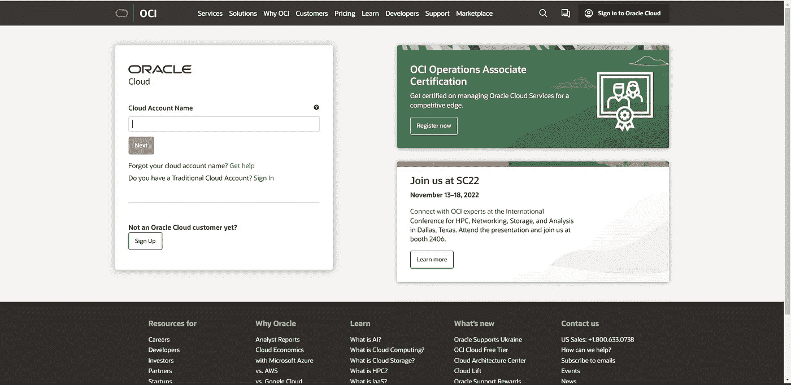
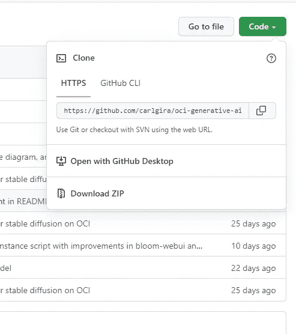

# 人工智能的假人

> 原文：<https://medium.com/oracledevs/ia-for-dummies-f4a7494e8e8a?source=collection_archive---------0----------------------->

上周，我在学习 Carlos Guirado 教授的一个关于如何使用 OCI 生成人工智能头像的精彩教程。在创建我的图像后，我决定更进一步，开发一个应用程序来查看我的甲骨文徽章周围的图像


观看此处运行的应用程序！

[](https://youtube.com/shorts/XXsFr7RmVbo?feature=share) [## AR 卡

youtube.com](https://youtube.com/shorts/XXsFr7RmVbo?feature=share) 

然而，当我在做人工智能教程的时候，我想到了一个问题…

不是 IT 人员的人能理解吗？

我可以想象我母亲看台阶时的表情…而答案是… **不！！**

并不是因为她不够聪明…但也许这个教程是针对他们的目标受众:**科技人！**他们认为对其他人来说不太常见的事情…

由于我使用 Oracle 云基础设施(我们用来生成人工智能的平台)才几个月，所以许多概念对我来说也不太熟悉。

这就是为什么我决定写这篇文章！

我将从复杂转向简单，以确保你有一些基本的基础来理解在我们心爱的云中人工智能正在发生什么。

听起来很有趣？开始吧！

首先…

# **AI 是什么鬼？**

人工智能(AI)是机器，尤其是计算机系统对人类智能过程的模拟。通常他们所指的 AI 只是 AI 的一个组成部分，比如**机器学习。**

一般来说，AI 系统的工作方式是摄取大量带标签的训练数据，分析数据的相关性和模式，并使用这些模式对未来状态进行预测。

人工智能可以帮助我们解决许多问题，但在这种情况下，我们将重点关注它生成图像的能力。人工智能生成的图像可以用于各种目的，例如创建逼真的 3D 图像(用于元宇宙目的)或从头生成图像。


像*稳定扩散*这样的模型创造了这个图像。按照教程，你可以生成像这样酷的图像…(我是神奇女侠，是《权力的游戏》中的一个角色，是赛博朋克…)

我最喜欢的一个是由谷歌的人工智能图像模型创建的


*Imagen* 的工作原理是获取自然语言文本输入，在本例中为“用 fireworks 编写的带有 Google brain 徽标的多伦多天际线”，然后使用编码器将该输入文本转换为嵌入内容。“条件扩散模型”然后将文本嵌入映射到一个小的 64x64 图像中。 *Imagen* 使用文本条件超分辨率扩散模型将 64x64 图像上采样为 256x256 和 1024x1024。

# 台阶

我们将遵循教程，我将指导您配置的每个步骤。

这四个步骤看似简单，但如果您不习惯在这些环境中工作，可能会非常棘手。

[](https://github.com/carlgira/oci-generative-ai) [## GitHub-Carl gira/OCI-generative-ai:Terraform 脚本来安装一个稳定扩散、dreambooth 和…

### 使用 OCI 的 nvidia GPU 在计算实例中启动稳定扩散、bloom 和 dreambooth 的 Terraform 脚本…

github.com](https://github.com/carlgira/oci-generative-ai) 

# **1。你在 OCI 创造了这个人工智能…但是 OCI 是什么？**

Oracle 云基础设施(OCI)是一个云服务平台，使您能够在一个高度可用、持续高性能的环境中构建和运行各种应用程序。

要登录:

> 【https://www.oracle.com/cloud/sign-in.html 号

这是控制台的一个方面:



OCI Sign in

要开始配置，我们必须对我们的租户进行身份验证，并安装我们的 OCI CLI。

# 但是什么是 OCI-CLI 呢？

CLI 是一个占用空间小的工具，可以单独使用或与控制台配合使用来完成 Oracle 云基础架构任务。CLI 提供了与控制台相同的核心功能，以及额外的命令。其中一些功能，如运行脚本的能力，扩展了控制台的功能。

*要在 Windows 中安装 OCI CLI，您必须使用“以管理员身份运行”选项打开 PowerShell 控制台。

# 但是 PowerShell 是什么？

**PowerShell** 是一个跨平台的任务自动化解决方案，由命令行 Shell、脚本语言和配置管理框架组成。PowerShell 可以在 Windows、Linux 和 macOS 上运行。

您可以在 Windows 菜单中找到它，键入 Windows Power Shell。但是，这里的技巧是选择“以管理员身份运行”选项。


之后，将出现一个新窗口，您只需编写出现在本文 Windows 部分的命令:

 [## 快速入门

### 本节包含针对以下环境的快速安装说明:如果您使用的是 Oracle Linux 8…

docs.oracle.com](https://docs.oracle.com/en-us/iaas/Content/API/SDKDocs/cliinstall.htm) 

它将看起来像这样…


Windows Power Shell

现在您只需要为您的用户创建一个 API 密匙。

**应用编程接口** ( **API** ) **密钥**是用于认证用户、开发者或调用 API 的程序的唯一标识符。然而，它们通常用于通过 API 而不是人类用户来认证一个*项目*。

这些步骤在 Carlos Guirado 的这篇文章中有解释，所以你只需要遵循它们

[](/@carlgira/install-oci-cli-and-configure-a-default-profile-802cc61abd4f) [## 安装 OCI 命令行界面并配置默认配置文件

### OCI CLI 是一个命令行工具，用于访问和管理所有 Oracle 云资源。

medium.com](/@carlgira/install-oci-cli-and-configure-a-default-profile-802cc61abd4f) 

恭喜你！你做了第一部分！

现在让我们做一些更多的配置，一切都将很快准备好…

# 2.存储库…

# 但是什么是存储库呢？？

有人叫它 GitHub……有人叫它**神。**

GitHub 是一个用于**版本控制**和协作的代码托管平台。它让你和其他人在任何地方一起工作。

版本控制是跟踪对文档或文件夹的所有更改的一种方式。它基本上允许您为您对文件所做的任何更改创建历史点，并在将来的任何时间点返回到该文件的相同版本。

基本上，如果你是一名程序员，你想保持你的 ***精神健康*** 你必须使用它。

[](https://codeburst.io/why-git-version-control-is-the-most-important-software-skill-i-have-6f5ffed3522b) [## 为什么 Git 版本控制是我最重要的软件技能

### 如果你没有使用版本控制，你就是在浪费时间

codeburst.io](https://codeburst.io/why-git-version-control-is-the-most-important-software-skill-i-have-6f5ffed3522b) 

在 Github 中，一个存储库包含所有项目文件和每个文件的修订历史。您可以在存储库中讨论和管理您的项目工作。

我们将在项目中使用@carlgira 存储库

[](https://github.com/carlgira/oci-generative-ai) [## GitHub-Carl gira/OCI-generative-ai:Terraform 脚本来安装一个稳定扩散、dreambooth 和…

### 使用 OCI 的 nvidia GPU 在计算实例中启动稳定扩散、bloom 和 dreambooth 的 Terraform 脚本…

github.com](https://github.com/carlgira/oci-generative-ai) 

现在我们将为 https://gitforwindows.org/安装 Git

这个安装让我们可以使用 **Git Bash** ，一个用于从命令行运行 Git 的 Bash 仿真。

## 你需要知道的基本命令…

```
cd <path>
```

`**cd**`命令也称为`**chdir**` ( **ch** 安歌 **dir** ectory)，用于改变当前工作目录

```
ls
```

`**ls**`是一个在 Unix 和类 Unix 操作系统中列出计算机文件和目录的命令。使用它你可以看到这个目录里面有什么。

如果你只是提示 cd，你回到根目录。

现在我们转到 Github，在资源库中选择代码，复制出现的第一个 URL



我们打开 Git Bash 并执行这个命令

```
git clone https://github.com/carlgira/oci-generative-ai.git
```

我们的狂欢应该是这样的…


瞧啊！

现在我们有了 Github 库的本地副本！

# 3.变量

下一步是在我们的路径中加入 3 个变量。

这个变量是至关重要的，因为它是 OCI 知道我们是谁以及我们想把我们的资源放在云中的什么地方的方式。

***租佃 OCID***

租赁是 Oracle 云基础架构的安全隔离分区，用于创建、组织和管理您的云资源。这可能包括计算实例、网络、存储、数据库、身份、分析等。

你可以认为租赁是公司或组织的同义词

如果您进入个人资料(右上角)并选择租赁，您可以看到您的租赁 OCID。


您只需要复制那个 OCID 并在 Git Bash 中编写这个命令

```
export TF_VAR_tenancy_ocid='<tenancy-ocid>'
```

你应该把<tenancy-ocid>换成你自己的 OCID。</tenancy-ocid>

***车厢 OCID***

隔离专区是相关资源(如云网络、计算实例或数据块卷)的集合，只有组织中的管理员授予权限的那些组才能访问这些资源。

如果你倾斜车厢，这个窗口将会出现


然后，您只需要用自己的 OCID 在 GitBash 中编写命令。

```
 export TF_VAR_compartment_ocid='<comparment-ocid>'
```

***地区标识***

一个地区是**一个局部化的地理区域。**

你可以很容易地在控制台中看到你在哪个地区。


例如，我在法兰克福地区工作，所以我的标识符是 eu-frankfurt-1。

```
export TF_VAR_region='<home-region>'
```

恭喜你！我们几乎完成了…

# **4。执行脚本 generate-keys.sh**

现在我们需要执行脚本 generate-keys.sh 来生成访问实例的私钥。

计算实例是一个在云上创建的 **Linux/Windows 机器**，具有**形状**，我们可以使用它来根据应用需求部署各种服务。计算机器有 OCPUs、内存、存储和引导卷与之相连，它们定义了实例的形状。

在这个使用 terraform 脚本的教程中，我们使用 OCI 的 nvidia GPU 在计算实例中启动了 3 个应用程序:stable-diffusion、bloom 和 dreambooth。

您必须在 Git Bash 中编写的命令是:

```
sh generate-keys.sh
```

你的狂欢应该是这样的


问候！我们完成了所有的配置工作！

现在我们就来看看怎么建吧！差不多完成了…

# 建设

## **Terraform** 是一个基础设施代码工具，可以让您安全高效地构建、更改和版本化基础设施。这包括低级组件，如计算实例、存储和网络；以及高级组件，如 DNS 条目和 SaaS 功能。

要在 Windows 中安装它，您只需按照以下步骤操作

[](https://spacelift.io/blog/how-to-install-terraform) [## 如何在 Windows、Linux 和 Mac 上下载和安装 Terraform

### 当我开始学习 Terraform 的时候，我遇到的第一件事就是如何获得正确的安装说明…

spacelift.io](https://spacelift.io/blog/how-to-install-terraform) 

然后在 bash 中编写这三个命令

```
terraform init
terraform plan
terraform apply
```

为了测试这个应用程序，需要创建一个 ssh tunel 连接到端口 7860 (stable-diffusion-webui)、5000 (bloom)和 3000 (dreambooth)。

terraform 脚本的输出将给出 ssh 完整的命令，因此您只需要从 GitBash 复制和粘贴。

```
ssh -i server.key -L 7860:localhost:7860 -L 5000:localhost:5000 -L 3000:localhost:3000 ubuntu@<instance-public-ip>
```

还有…结束了！

如果您做的一切都正确，您应该在实例中看到这样的计算实例。


现在你只需要享受！

遵循后配置部分，并享受与人工智能玩！！！！！

[](https://github.com/carlgira/oci-generative-ai) [## GitHub-Carl gira/OCI-generative-ai:Terraform 脚本来安装一个稳定扩散、dreambooth 和…

### 使用 OCI 的 nvidia GPU 在计算实例中启动稳定扩散、bloom 和 dreambooth 的 Terraform 脚本…

github.com](https://github.com/carlgira/oci-generative-ai) 

## **然后，我用 Unity 和 Vuforia 开发了我的增强现实应用…但那是另一个故事了…**

# 如果你想知道更多，请继续收听。我将很快发布更多关于 AI 和 AR 的内容！！