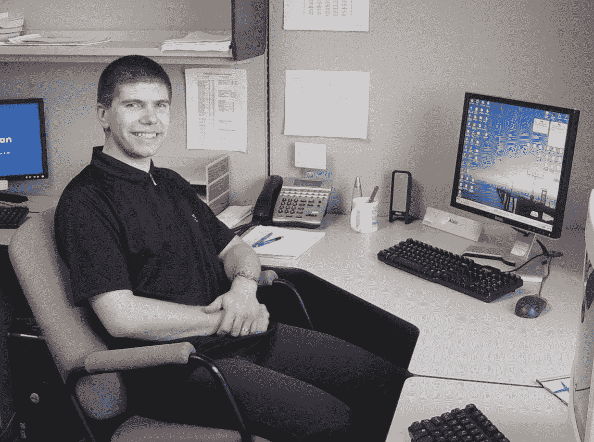
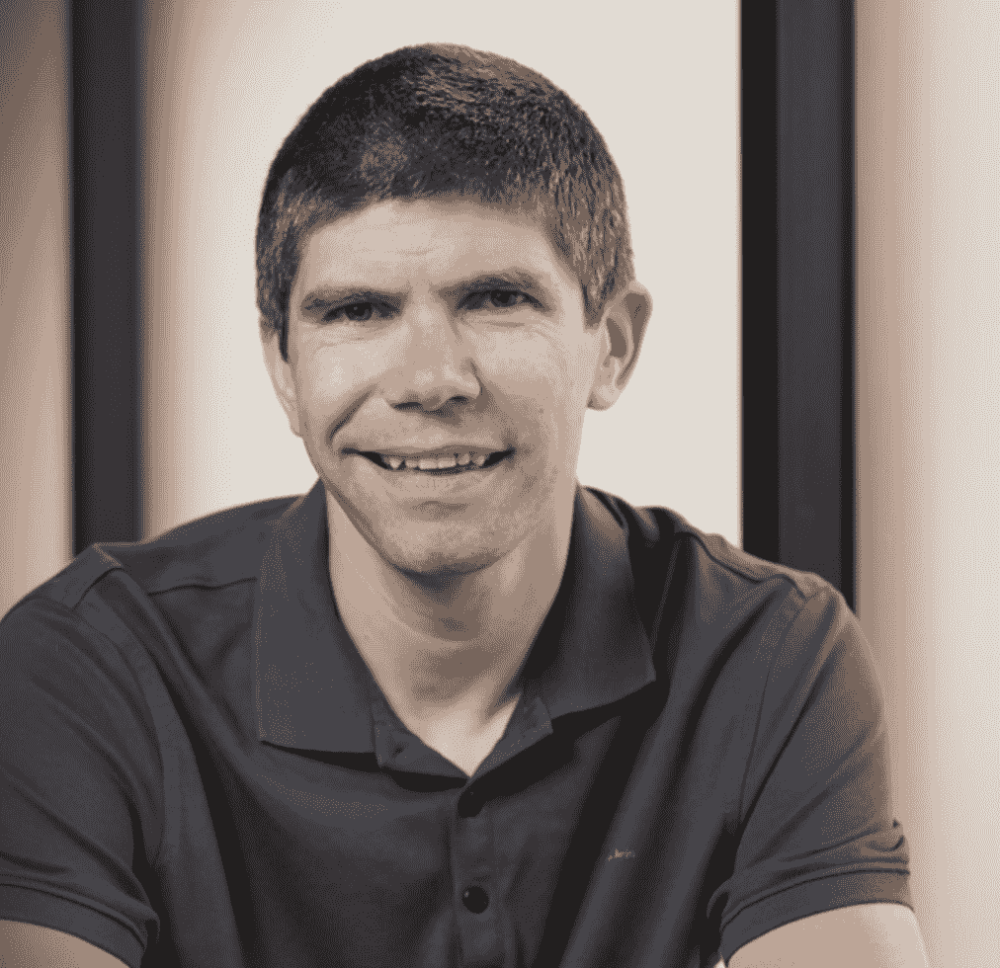
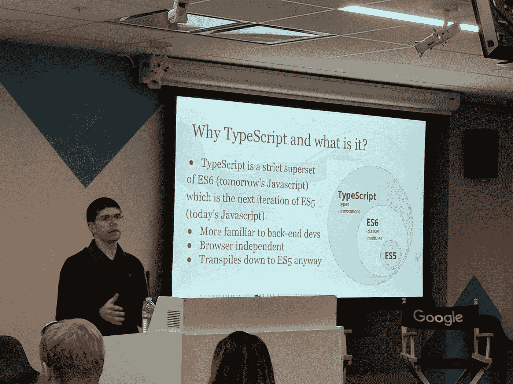
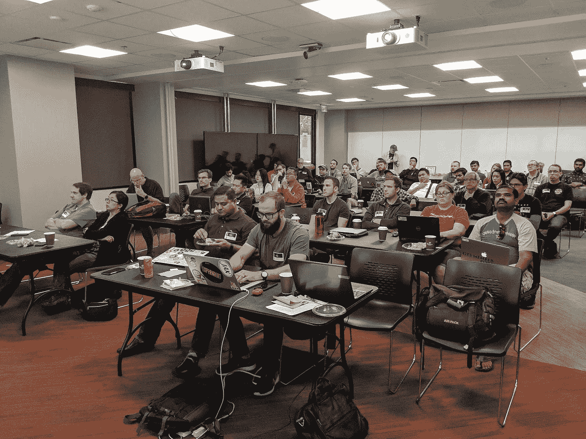

# #IamaGDE:阿兰·肖达

> 原文：<https://medium.com/google-developer-experts/iamagde-alain-chautard-829cd8cd18a6?source=collection_archive---------3----------------------->

#IamaGDE 系列呈现:谷歌地图

*欢迎来到我们的扩展#IamaGDE 系列！在接下来的几个月里，我们将展示来自不同产品领域的 Google 开发者专家的亮点。发现他们的故事、激情和社区工作的亮点。*

[*谷歌开发者专家计划*](https://developers.google.com/community/experts) *是一个由经验丰富的技术专家、影响者和思想领袖组成的全球网络，他们通过在活动中发言和发布内容来积极支持开发者、公司和技术社区。*

**今天，认识一下**[**Alain chautar**](https://twitter.com/AlainChautard)**——**[**谷歌地图平台 GDE**](https://cloud.google.com/blog/products/maps-platform/meet-google-maps-platform-developer-experts) **他为不同的客户教授 Javascript 和 Angular，并为需要 Angular 帮助的开发团队提供咨询服务。**

[Alain Chautard](https://twitter.com/AlainChautard)

> “这意味着我在审查代码，处理架构任务或要解决的复杂问题，这总是很有趣，”Alain 说。“2020 年早些时候，我还启动了一个角度认证计划，帮助人们在冠状病毒疫情中找到新的职业机会。我的工作主要是帮助人们在专业上成长，特别是 Angular 和 web 开发方面。”

阿兰 16 岁时开始在他的 TI-80 计算器上编程。

> “那时候，我家里没有电脑，也不能上网，所以我不知道代码和程序是电脑如何工作的，”他说。"对我来说，那时编码只是一个计算器的事情！"

一年后，他得到了他的第一台电脑，并开始学习更多关于编码的知识。

> “这对我是一个启示，”他说。“我被迷住了，我知道这是我想从事的职业。”

他获得了计算机科学的学士和硕士学位。他的第一份工作是软件开发人员，从事专业编程已经超过 14 年。

> “一般来说，软件开发和技术的有趣之处在于，一切都变化得如此之快，”Alain 说。“例如，尽管我在大学里学习了几种编程语言，但像谷歌地图或 Angular 这样的技术在当时甚至还不存在。”

**加入开发者社区**

Alain 于 2014 年从法国搬到加州萨克拉门托，创办了自己的软件开发公司。

> “作为一名刚到美国的移民，我在萨克拉门托不认识任何人，所以我认为了解人们的最佳方式是去参加镇上不同的技术聚会，”他说。“我在加州参加的第一次聚会是与谷歌开发团队(GDG)的会面。我开始每个月都参加 GDG 聚会，几年后成为 GDG 的共同组织者，两三年前成为主要组织者，至今仍是我的角色。”

阿兰说，GDG 集团对他的职业和个人都很重要。

> “谷歌开发团队在专业上给了我极大的帮助，”他说。“在 GDG 萨克拉门托，我遇到了许多人，他们后来成为了朋友、客户，或者两者兼而有之。如今，作为一名组织者，我想回馈社区，帮助我们的参与者学习、成长和寻找有趣的机会。”

作为 GDG 的组织者，Alain 在不同的会议上做了很多演讲。他还开始亲自授课，撰写教程和博客文章，并为在线社区做出贡献，如 [GitHub](https://github.com/alcfeoh) 和 StackOverflow。

> “我意识到这些活动中的大多数正是 GDEs 所做的，所以我决定申请这个项目并被选中，”他说。“如果六年前有人问我是否想过自己会成为 GDE，我会回答，‘不，这对我来说似乎不可能。’然而，只要努力工作并坚持不懈，一切皆有可能。成为 GDE 是我职业生涯中最自豪的事情之一。"

阿兰说，尽管 2020 年对每个人来说都非常具有挑战性，但也有光明的一面。

> “由于大多数聚会和会议都转向了在线形式，在过去的 12 个月里，我几乎可以在所有的大洲进行演讲，这是一个巨大的成就！”他说。“这是当前全球形势的一个积极方面:任何国家的任何社区都可以在没有任何预算限制的情况下主持远程专家演讲，使 GDEs 和世界各地的人们之间的互动比以往任何时候都更容易。也就是说，在线活动并不能完全取代真实的互动，所以我期待着尽快亲自促成这样的活动。”

**谷歌地图平台项目和喜欢的功能**

Alain 已经在谷歌地图平台上做了大约 50 个项目，并且欣赏地图开发者可以创造的各种工具。

> “我为澳大利亚的超市开发了商店定位器，为德克萨斯州和南非的投资者开发了房地产地图软件，为加拿大和英国的初创企业开发了各种数据呈现器，”他说。“各种谷歌地图平台 API 使软件开发变得简单。使用谷歌地图平台最有收获的部分是，几乎每个人都知道谷歌地图，这意味着用户可以很容易地使用和接受我们构建的工具和应用程序，因为他们已经知道如何放大和缩小地图，拖动地图等。这大大方便了用户体验。”

Alain 说，作为一名开发人员，他发现用 [Maps Javascript API](https://developers.google.com/maps/documentation/javascript/) 绘制线条和形状并编辑它们的能力非常有吸引力。

> “这是一个非技术人员可以用来给地图添加信息的东西，”他补充道。

作为谷歌地图的用户，他喜欢谷歌街景的“时光机”功能。

> “[街景](https://developers.google.com/maps/documentation/streetview/)本身就是一个奇妙的特色，能够回到过去，看看一个地方当时是什么样子，这绝对是不可思议的，”他说。

他对[基于云的地图风格](https://mapsplatform.withgoogle.com/horizons/maps-customization)感到兴奋，因为这让非技术人员更容易为地图创建自己的风格，并相信使用地图数据的游戏有很大的潜力。

> “我看过几个用谷歌地图平台搭建的游戏试玩，都是真的让人印象深刻！”他说。

**未来计划**

2021 年，Alain 希望发布一个视频课程，教授谷歌地图平台 API 的基础知识，他还希望建立一个以互动方式展示美国国家公园的地图。

> “我的目标是继续接触世界各地的社区，帮助人们在职业生涯中取得进步，并为软件开发人员创造新的机会，”他说。

*有关谷歌地图平台的更多信息，* [*访问我们的网站*](https://cloud.google.com/maps-platform/) *或了解我们的* [*GDE 计划*](https://developers.google.com/community/experts) *。*