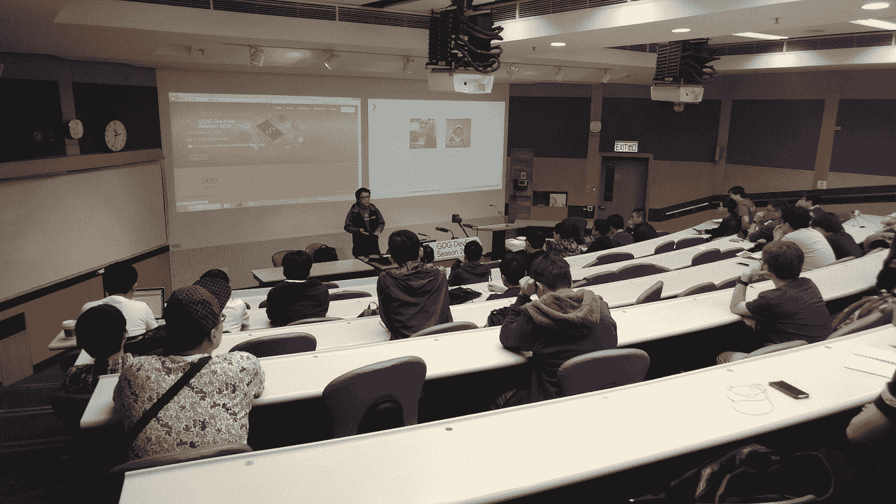
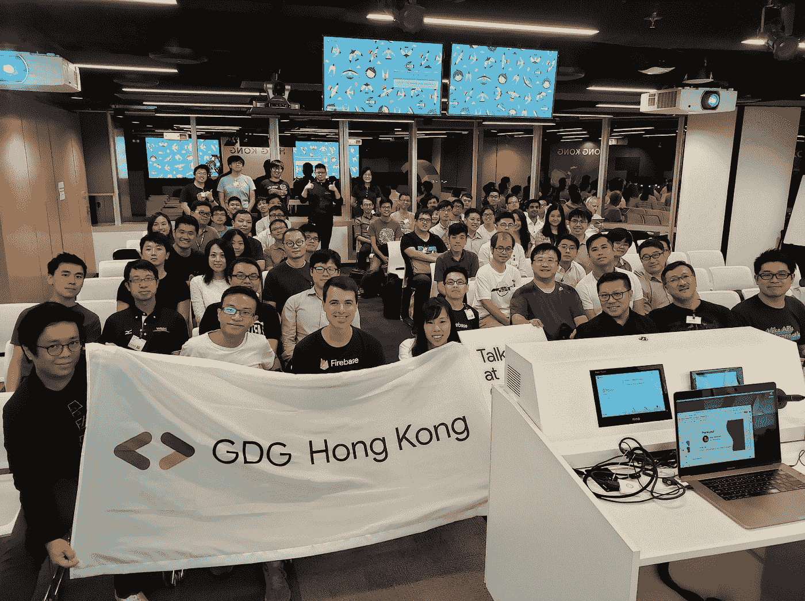

# #IamaGDE: Homing Tam

> 原文：<https://medium.com/google-developer-experts/iamagde-homing-tam-76d7927261f1?source=collection_archive---------3----------------------->

*#IamaGDE 系列赠送:谷歌地图*

*欢迎来到# IamaGDE——这是一系列展示来自全球的谷歌开发者专家(GDE)的聚焦节目。发现他们的故事、激情和社区工作的亮点。*

Homing Tam, Maps Google Developer Expert

H oming Tam 是按需物流公司 Lalamove 的产品经理。在进入产品管理之前，他在该公司担任产品经理，专注于基于位置的系统，与开发人员和商业用户交谈，以增强公司的地图解决方案。现在，Homing 处理公司解决方案；照顾那些想与公司系统整合的人；处理 API 方面的事情，帮助简化集成；并为开发人员和其他技术团队成员提供建议。

**成为地图开发者**

Homing 在大学学习地理信息和计算，他 2009 年的论文基于谷歌的 API 后端。他的论文关注于使用 Google Maps API 进行地图绘制和叠加。他的第一份全职工作是在全球最大的私营软件公司 Esri 担任 GIS 分析师。一年半后，他成为了另一家公司的解决方案顾问，帮助那些对将谷歌地图与他们的软件集成感兴趣的客户。

**加入开发者社区**

在 Homing 加入谷歌技术用户组(现在称为谷歌开发者小组)后，他当时的老板告诉了他谷歌开发者专家计划。在采访中，Homing 展示了一款使用谷歌地图 API 的产品。当他成为 GDE 时，他作为谷歌地图平台团队的代理人，在大中华区发表演讲和讲话。Homing 目前是 GDG 港的组织者之一，组织和举办社区讲座。

**最喜爱的地图功能和当前项目**

Homing 说[地图样式向导](http://mapstyle.withgoogle.com/)，更新的[基于云的地图样式功能](https://developers.google.com/maps/documentation/javascript/styling)的前身，是他最喜欢的功能之一。

> “我在大学里学过的制图学非常重要，尤其是对于简单的黑白示意图，或者在将地图主题与一个地点匹配时，”他说。“我非常喜欢这个功能。”

2020 年，Homing 在 Android 11 Meetup 上做了一次关于 Android 的演讲，并在有史以来第一次虚拟的香港开发者大会上做了另一次关于地图的演讲，他准备做更多的演讲。

> “自从我做了一次关于地图的演讲已经有一段时间了，基于云的地图样式的发布是如此令人兴奋，我觉得是时候做一些演示，让社区更多地了解它了。除了知道如何使用 API，你还需要知道如何充分利用 API。”

Homing 指出，特别是今年，更多的小企业主需要知道如何收集客户地址，允许客户按需下单，并更新客户信息。

2021 年，除了举办更多讲座，Homing 还希望与 GDG 的组织者合作，计划一次黑客马拉松，或者向社区成员传授更多关于新地图功能的知识。

> “我们能否开发一款 MVP 或真正初级的骑行应用，作为探索新功能和使用不同谷歌组件的基础？'

随着职业生涯的继续，Homing 说他有两个优先事项:作为产品经理进步和利用技术，包括地图，来改善生活。

> “今年是每个人都变得懂数字的一年，”他说。“有了花在技术上的多余时间，我们应该好好利用技术，让生活变得更美好。”

*关于谷歌地图平台的更多信息，* [*请访问我们的网站*](https://cloud.google.com/maps-platform/) *。*

*关于 Google 开发者专家的更多信息，* [*访问我们的网站*](https://developers.google.com/community/experts) *。*