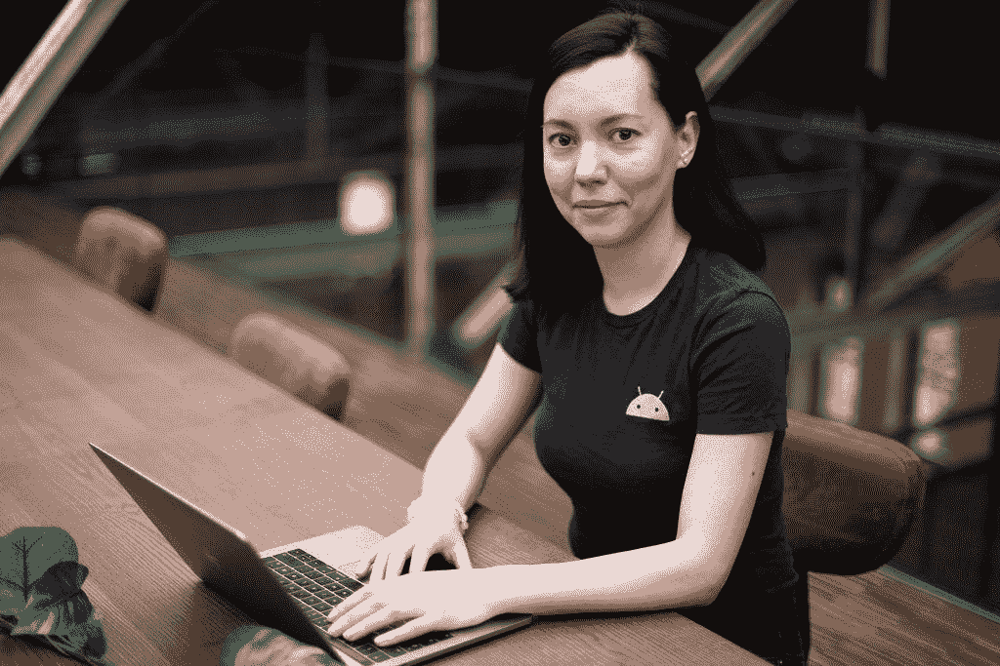
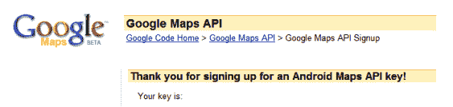

# #IamaGDE:克里斯蒂娜·西玛科娃

> 原文：<https://medium.com/google-developer-experts/iamagde-kristina-simakova-adffb183b8c3?source=collection_archive---------6----------------------->

#IamaGDE 系列呈现:谷歌地图

*欢迎来到我们的扩展#IamaGDE 系列！在接下来的几个月里，我们将展示来自不同产品领域的 Google 开发者专家的亮点。发现他们的故事、激情和社区工作的亮点。*

[*谷歌开发者专家计划*](https://developers.google.com/community/experts) *是一个由经验丰富的技术专家、影响者和思想领袖组成的全球网络，他们通过在活动中发言和发布内容来积极支持开发者、公司和技术社区。*

***今天，认识一下克里斯蒂娜·西玛科娃——地图和安卓 GDE。***

Kristina Simakova

地图 GDE Kristina Simakova 是一名独立顾问，她 60%的时间是在挪威一家咨询公司担任 Android 经理。在这个职位上，她帮助 Android 顾问完成他们的项目。

> “这是一种全新的体验，”克里斯蒂娜说。“我突然要负责 14 个人，从编码变成了经理。这对我们目前的 COVID 情况非常有帮助，因为如果你是一名坐在家里编码的开发人员，那可能会有点孤独和单调，但当你必须与人更多地互动时，即使是在网上，那也是不同的。”

Kristina 过去经常旅行，是挪威一个会议的组织者，突然，一切都停止了。她一直活跃在开发者社区，参与在线活动，如 DevFest 和 4 月份的女性技术创造者活动。

> 她解释道:“我们尝试开展辅导课程，这样人们可以预约半个小时，询问有关职业发展或项目的问题。“我想继续这样做。”

**成为开发者**

克里斯蒂娜在俄罗斯长大，直到 17 岁开始上大学，她才拥有电脑。

> 她说:“在美国和挪威，孩子们很早就有电脑是很常见的，但我是在俄罗斯长大的，我们家买不起电脑。”。"在学校，我们没有多少机会接触电脑。"

Kristina 在大学开始学习一个 IT 项目，计算机辅助设计系统，这是编程和工程的结合。她有了自己的第一台电脑，并学会了编码。

> “我真的很喜欢计算机图形，我们有很多这样的东西，”她说。

克里斯蒂娜搬到挪威攻读硕士学位，但她不确定选择哪个项目，项目说明是挪威语，她还没有掌握。她最初申请学习工程设计，但在最后一刻转到了计算机科学，重点是计算机图形，并获得了两年的 C++和 OpenGL 研究。

克里斯蒂娜的硕士论文来自她 2011 年在挪威最大的石油公司 Equinor(前挪威国家石油公司)的暑期工作。平板电脑刚刚问世，Android 是全新的。当公司工程师去评估潜在的油田时，该公司提出为克里斯蒂娜提供一台平板电脑，如果她能知道如何在 Android 上使用 AR。他们告诉她，他们喜欢谷歌地球，这在手机上还不可用，并设想为他们的应用程序提供一种谷歌地球体验。

> 克里斯蒂娜说:“我试图用 OpenGL 和 Java 为手机开发谷歌地球。"我找到了美国国家航空航天局的数据，并可以建立它，有点."

Kristina 的原型应用程序允许用户以 3D 方式查看数据点，并使用移动设备的摄像头和 AR 在现场查看附近的数据。克里斯蒂娜使用了挪威的一个小区域作为原型，所以她的应用程序不可扩展，但她说这是一次有趣的体验。

> *“我学到了很多关于地图投影的知识，并做了一些关于 GPS 精确度的实验，”她说。“我的教授说，‘为什么我们不创建一个实验来测量我们从移动设备获得的 GPS 位置的准确性？’”*
> 
> *“那是我的第一个安卓项目，也是我第一次接触谷歌地图，”她说。“很激烈。”*

Kristina 的硕士论文旨在探索在石油和天然气行业的现场工作中使用多点触控平板电脑的可能性。卑尔根的挪威国家石油公司研究中心指出了他们希望在原型应用中看到的特性:使用传感器来控制摄像机；多点触摸标签；将 2D 数据放入 3D 世界的能力；以及编辑图片的能力。

> “这些需求描述了包含 VR 和 AR 部分的软件解决方案，”Kristina 说。

Screenshot from Kristina’s Master’s thesis. She didn’t know she was using a beta version of Google Maps at the time!

在获得硕士学位后，克里斯蒂娜一直对谷歌地图和增强现实感兴趣。

> 她说:“我去了一家大公司工作，为石油和天然气公司做船舶和起重机模拟器培训。我们有带监视器的大房间——你会觉得你在一艘船上或什么的——你有所有的按钮，但它只是一个模拟器。我在那里做 OpenGL 和 C++。”

一年后，克里斯蒂娜搬到奥斯陆，在一家专注于建筑行业和 3D Android 开发的初创公司工作。之后，她成为了一名顾问。

**加入开发者社区**

> *“当我搬到奥斯陆时，我听说过谷歌开发团队，我会见了组织我们 GDG 的人，告诉他们我可以帮忙，他们真的很高兴让我尽快加入，”她说。“我从 2015 年开始帮忙，去年 3 月辞去了 GDG 组织者的职务。”*

克里斯蒂娜还在 2018 年成为安卓系统的 GDE，并在 2019 年有机会时成为地图 GDE。

**最喜欢的地图功能和当前项目**

作为一名地图用户，GDE 让克里斯蒂娜可以使用谷歌地图平台游戏服务，这是她最喜欢的地图产品。自 2018 年推出以来，她一直关注游戏服务，并认为它为游戏和应用程序开发者提供了众多解决方案。

克里斯蒂娜写了一篇关于如何使用另一个最受欢迎的功能“地图样式”的博文。

> *“这太简单了，有了谷歌云，你不用做任何额外的事情就可以在你的应用程序中添加一个简单的 ID，”她说。“你可以使用品牌颜色，甚至删除你的应用程序不需要的功能，这样地图就不会被其他信息弄得杂乱无章。”*

克里斯蒂娜表示，2020 年是地图的好年景，她也对新的 Android SDK 感到高兴。

> *“我觉得今年对地图开发者来说有很多更新和令人兴奋的机会，”她说。*

**当前项目**

克里斯蒂娜目前正在为博物馆做两个咨询项目，目标是小学年龄的孩子。一款是地理藏宝寻宝应用，将使用谷歌地图。

> “我在寻找造型选择，”克里斯蒂娜说。“我真的想让它成为一次对孩子友好的特殊体验。”

**未来计划**

克里斯蒂娜计划记录儿童寻宝游戏的发展过程。

> 她说:“我也非常热衷于在游戏平台上做一些教育内容。**我想探索更多关于教学和做一个教育者的事情。我喜欢和学生一起工作。”**

**在推特上关注克里斯蒂娜*[*@克里斯蒂马科娃*](https://twitter.com/KristiSimakova)*

**关于谷歌地图平台的更多信息，* [*访问我们的网站*](https://cloud.google.com/maps-platform/) *。**

**更多关于谷歌开发者专家的信息，* [*访问我们的网站*](https://developers.google.com/community/experts) *。**