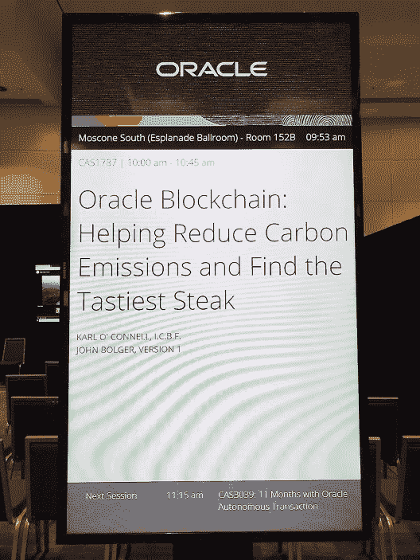
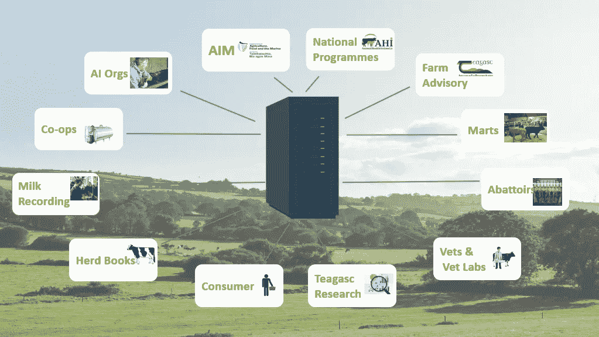
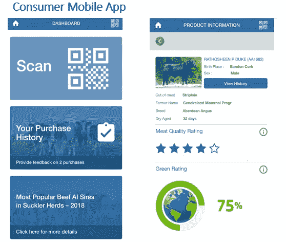
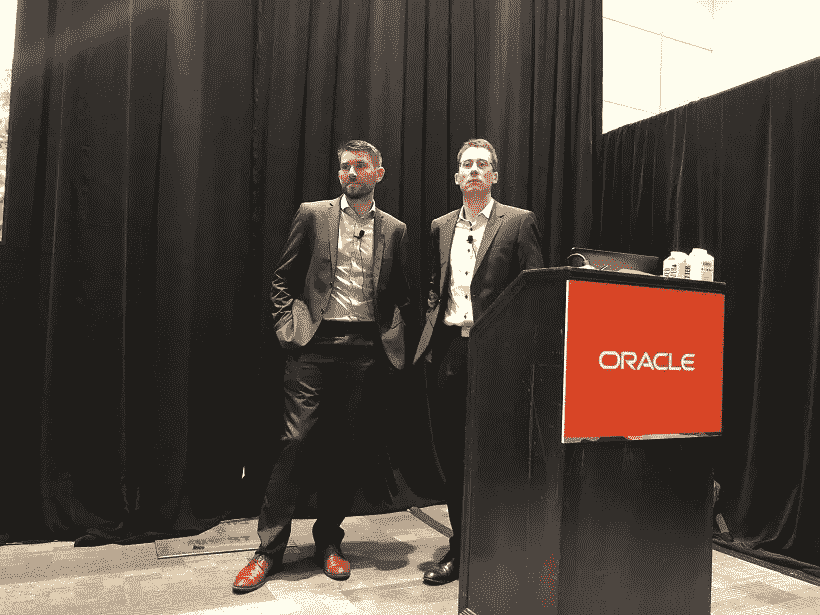

# 区块链、从农场到餐桌的可追溯性与 ICBF 和甲骨文全球大会:3 个月过去了

> 原文：<https://medium.com/version-1/icbf-farm-to-fork-traceability-3-months-on-fdebe4d36386?source=collection_archive---------0----------------------->

三个月前，我在旧金山[甲骨文全球大会](https://www.version1.com/nw-cld-ocl-oracle-openworld-2019/)上共同展示了 [*这组*](https://www.icbf.com/wp/wp-content/uploads/2019/10/ICBF_Blockchain-for-website.pdf)——这被证明是至少未来 3 年内最后一次在旧金山举办甲骨文全球大会。我们演讲的重点是第 1 版创新实验室与 ICBF 合作开发的“价值证明”项目。

有许多出版物和博客都在谈论这项工作，但是我还没有花时间坐下来谈谈我自己的看法。所以我们在这里，3 个月后，我想是时候我伸出我的手指，因为害怕我们的营销团队背叛我！顺便说一句，我要感谢第 1 版营销团队(尤其是 Joey Phan ),他们出色地帮助我们推广了我们的品牌，我还要感谢来自 ICBF 的 Erin Kennedy，她在整合演示文稿和这个故事的整体信息方面发挥了重要作用。

# 这一切是怎么发生的？

15 年来，Version 1 一直是 ICBF 的 IT 交付合作伙伴，我们在相互信任和尊重的基础上建立了非常牢固的关系，分享了鲜血、汗水和泪水。当我们建立创新实验室时，我们考虑了我们的客户，以及谁可能是探索颠覆性技术的好伙伴。ICBF 立即跃入脑海。

# 等等，ICBF 不是农民吗？

**绝对不行。**ICBF 是一家由行业资助的非营利性农业技术公司，其目标是利用技术促进和改善爱尔兰养牛业。这些人都是专业技术人员，能够接触到专业技术，包括本地 Oracle 数据库云服务器！拿着。

他们有一个“定性遗传学家”团队(拥有与数据科学家相似的技能，但对农业和动物遗传学领域有非常深入的了解)，他们分析爱尔兰牛的 DNA，以了解哪些特征导致牛 a)更美味 b)更环保(排放更少)c)增重更快以及 d)需要更少的饲料。仅在一个数据库表上，他们就有超过 900 亿行用于数据分析！！谁会想到呢？此外，ICBF 使业内其他人能够访问这一令人难以置信的数据源，就像一个“数据科学平台”，可供业内成员使用。

# ICBF 的使命是什么？

ICBF 的任务最终是改善爱尔兰养牛业，利用技术检查和改善爱尔兰牛的遗传，检查目标如下:

*   如何培育出更多的 GHG 高效牛？(即牛打嗝时产生的甲烷较少)
*   *我们如何培育更美味的牛排？(老实说，他们实际上可以从 DNA 上看出这一点！不可思议)*
*   *我们如何培育出需要更少饲料、更快、更高效地达到体重目标的牛？*

ICBF 与其行业伙伴合作，在研究和应用技术以实现这些目标方面取得了令人难以置信的成功。

# 那么区块链和这有什么关系呢？

ICBF 整理来自行业合作伙伴的数据(见左图),并将其存储在数据库云服务器实例中进行分析，尽管 ICBF 拥有这一令人难以置信的数据宝库，并将其提供给行业，但消费者无法访问这些数据。

供应链没有端到端的可见性——没有消费者可以更好地告知消费者的“从农场到餐桌”的可见性:

*   这肉是哪里来的？真的是“本地”吗？！
*   这肉有多好吃？
*   *这肉有多绿？*
*   给我看看这肉的产地？真的是牛肉吗？(想起马肉丑闻！)

ICBF 不向消费者提供这些数据的原因是，他们目前没有完整的端到端供应链记录，当你了解到 90%的爱尔兰牛肉用于出口时，你就会明白他们永远不会指望外国实体将这些数据发回给他们。

T ime 让[区块链](https://www.version1.com/it-service/is-dgt-inn-blockchain/)步入框架。区块链是供应链的一个完美用例，其中多个组织需要在它们之间共享数据，以创建完整的端到端可见性，但没有一个组织负责拥有这些数据。

# 区块链到底是什么？

我看到很多关于区块链的炒作，这只会让客户感到困惑，但让我们明确一点——它是一个分布式数据库。因此它只适用于需要分布式数据库的情况。是的，区块链为该党带来了有趣的特征，如不变性，但你应该永远记住，它的主要功能是充当分布式数据库，无论是全球和公共可用的数据库，如以太坊或比特币，还是在批准的组织团体之间共享的私人联盟数据库，通常运行在类似 HyperLedger Fabric framework 的东西上。

# 价值的证明

一旦我们确定[区块链是一种能够实现“从农场到餐桌”可追溯性的技术](https://www.version1.com/it-service/is-dgt-inn-blockchain/)，我们就同意合作开发区块链的“价值证明”。

出于速度和灵活性的目的，我们决定使用“区块链即服务”解决方案，在分析了 AWS、Azure 和 Oracle 解决方案后，我们发现 Oracle 提供了一个非常好的基于 Hyperledger Fabric 的解决方案，它有一个很好的 UI，可以非常直接地创建我们的网络和管理我们的智能合同。

我们在 12 周的时间内开发了 PoV，并在此期间开发了一个移动应用程序，消费者可以使用它来查询网络和区块链网络，并通过智能合同为供应链网络的所有成员提供集成点。我们能够基于现有的 ICBF API 对此进行建模，因此使用真实数据来复制完整的交易，同时为 ICBF 网络之外的其他方建模集成点。

该项目取得了巨大成功，我们能够在 12 周的时间内证明区块链可以为 ICBF、行业和消费者增加价值。

# 捕捉想象力

这一观点抓住了国际想象力，因为它展示了爱尔兰牛肉如何继续成为优质和创新的产品，并展示了区块链的真实用例。因此，甲骨文邀请我们在包括伦敦区块链峰会和甲骨文全球大会 2013 在内的众多会议上介绍该解决方案。此外，这还出现在几个主要出版物中，包括 ITPro、T2、Diginomica、甚至 T4 的福布斯。我们还参加了[为《企业时报》录制的播客。](https://www.enterprisetimes.co.uk/2019/09/18/moving-erp-to-the-cloud-blockchain-cattle-and-brexit/)

# 那么下一步是什么？

我对这可能创造的可能性感到非常兴奋，成为这个故事的一部分对我来说是一种难以置信的荣誉。我们将继续与 ICBF 合作推进这一解决方案，并与业界合作实现这一目标。

# 摘要

我非常喜欢在这个项目中工作，我想请来自 ICBF 的 Karl O'Connell 与我一起工作，他也是我在台上的同事！我对他们的业务、他们正在进行的不可思议的旅程了解了很多，了解他们为爱尔兰养牛业所做的令人兴奋的事情绝对是一种享受。

区块链被炒作得太多了，并且以抽象和技术的方式谈论，这使得人们很难理解它为什么以及何时有用，不幸的是，这也经常导致人们立即将其视为另一个区块链炒作项目。然而，这是对这项技术真正有意义的故事之一，它可能对行业和消费者产生巨大影响。

想象一下——你在超市寻找今晚晚餐的牛排。会是哪一个？如果你能做出一个更加明智和认真的决定来决定哪种牛排适合你，那不是很好吗？一个真正本地的，绿色的，美味的？

请继续关注这个故事的进一步更新。