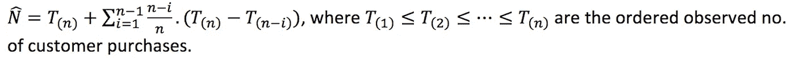
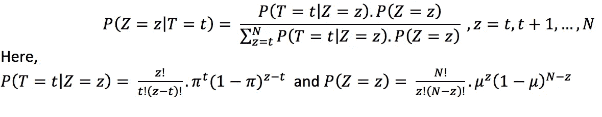
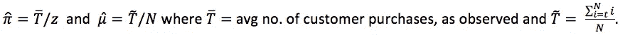

# 识别传统零售店中的非购买者

> 原文：<https://medium.com/walmartglobaltech/identify-no-purchasers-in-a-traditional-retail-store-9f375bd59d6e?source=collection_archive---------4----------------------->

Queue of purchasers in a Wal-Mart Store

## 让我们回到 90 年代:

让我们暂时假设网上零售店不存在。

*   在这种情况下，你想过像我们这样在零售领域工作的数据科学家会做些什么来理解顾客的购买行为吗？
*   你能理解我们在现有数据中会有多少偏差吗？

好吧，如果你还没猜到的话，我们唯一能接触到的面向客户的数据是扫描数据(即客户购买数据)。

将没有访问过商店但没有进行任何购买的顾客的信息。即使我们可以估计不购买者的数量，也没有办法准确识别顾客在商店里面对的是什么样的商品组合，导致她没有购买就离开了。

## 现实检查:

大多数传统的实体店仍然没有任何措施来识别不购买的顾客。

## 无买家的重要性:

我认为，基本上，是不购买者的行为表明了零售商的商品组合有多好。我所说的分类，不仅是指一套产品，还包括它们各自的价格和可用性。

在这个竞争激烈的市场中，零售商的目标应该始终是，保持这样一种分类，以最大限度地增加每个来访顾客的收入；这也就意味着减少了不购买者。在这方面，对于零售商来说，能够准确地了解顾客面对的是什么样的商品组合，从而导致不购买是很有用的。

# 不购买者的估计

## 定义:

*   n:零售店的潜在顾客数量(可能未知)
*   z:某一天光顾零售店的顾客数量。
*   t:在给定的一天里，从零售店实际购物的顾客数量。

## 假设:

*   在几天内观察来自给定商店的购买者数量(T)。
*   Z ~ Bin (N，mu)
*   T|Z=z ~ Bin (z，pi)

## 第一步:估算 N

如果 N 已知，我们就可以开始了。但是，假设 N 未知。

现在，由于 N ≥ T(实际上，等式很少成立)，T 的顺序统计量用作估计 N 的充分统计量。因此，N 的估计可以用刀切法获得，如下所示:

JackKnife estimate of N

## 第二步:估计 Z

现在我们已经估计了 N，并且有了在几天内观察到的 T 的值，我们需要获得当观察到 T = t 时 Z 的条件 p.m.f。

利用贝叶斯定理，我们得到 ***Z|T=t*** 的概率密度函数为:

p.m.f of Z|T=t

但是，为了使用上面的 p.m.f 来估计 Z，我们需要知道未知的μ和 pi 的值。

μ和 pi 的简单估计值可通过下式获得:

trivial estimates of mu and pi

使用上面的估计，我们现在可以容易地获得每个 ***Z = z*** 的发生概率，给定 ***T = t*** 的值。最后，对于每个观察到的 T = t，我们可以从上面的分布中获得一个 Z 值，并将其作为每个相应日期的 Z 观察值。

## 第三步:确定不购买者

我们现在拥有以下资源:

*   对 N 的估计
*   不同天的 T 的观测值
*   Z 的估计值，对应于不同日期的每个观测 T
*   对不同日期的无购买者数量(Z-T)的估计。

但是，仅有不购买者的数量是不够的。我们需要能够足够有效和明智地在购买者中插入不购买者，以便识别每个不购买者面临的分类，这导致他们没有购买就离开。

我们已经假设:

***T | Z = z ~ Bin(z，pi)*** ，其中 pi 的估计值可以是 ***mean(观测 T)/z*** 。

现在，我们知道在某一天， ***z*** 顾客访问了一家零售店，其中 ***t*** 顾客在该店购买了商品，其余的顾客没有购买。

因此，现在剩下的就是从*客户中抽取 ***t*** 客户，并标记为购买者。该取样将按照 ***Bin(z，t/z)***pm . f 进行*

*因此，我们现在既知道了不购买者的数量，也知道了他们去零售店的顺序。*

## *好了，这不是结束，实际的客户购买数据建模现在开始…愉快的产品组合优化！！*