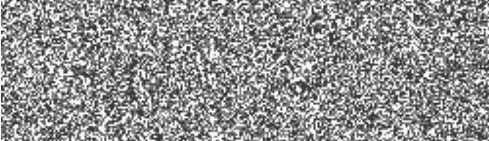
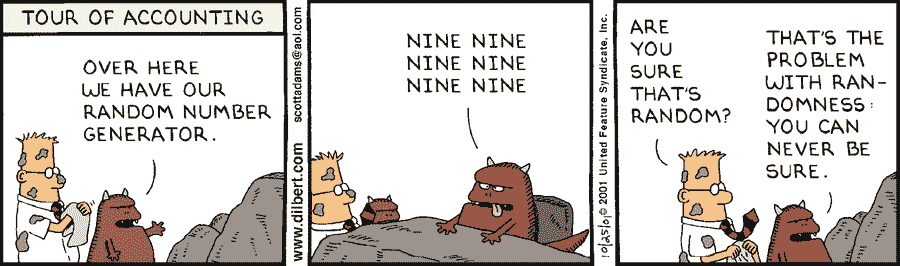
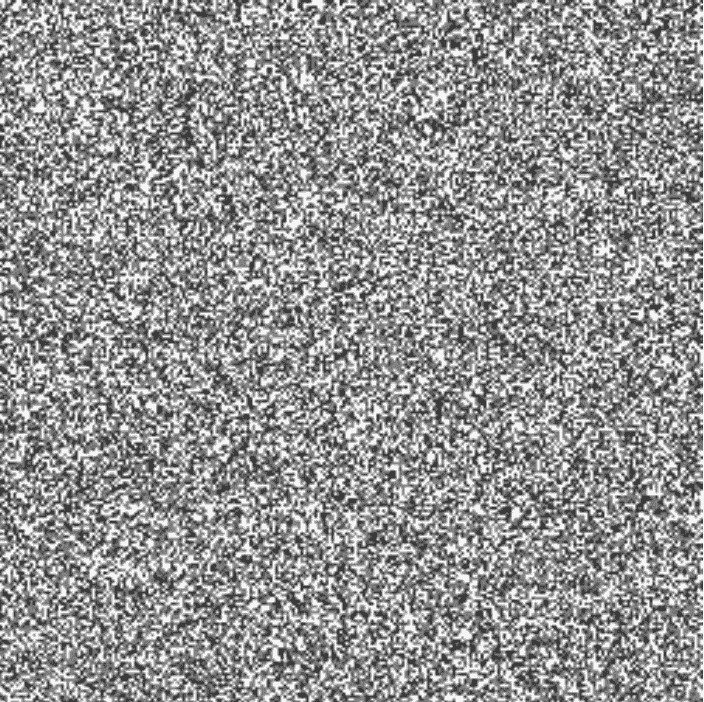
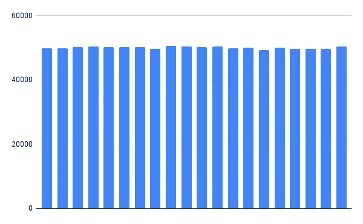

# 身份危机:现代应用程序如何生成唯一的 id

> 原文：<https://medium.com/javascript-scene/identity-crisis-how-modern-applications-generate-unique-ids-39562736f557?source=collection_archive---------1----------------------->

*TL；DR:使用* [*Cuid2*](https://github.com/paralleldrive/cuid2) *所以你不需要担心所有这些标识符的复杂性。*

现在是早上 7:15，客户支持忙得不可开交。我们刚刚上了《早安美国》的专题节目，一大群第一次来的顾客遇到了问题。一个顾客会在购物车里装满商品，结账，付款，然后收到一张订单收据，上面全是错误的商品！

发生了什么事？我们使用 GUIDs，我们相信它们不会冲突。毕竟，它们被称为“全球唯一标识符”，所以它们必须是唯一的，对吗？在`5.316912e+36`中，GUIDs 冲突的几率应该是 1。那是一个巨大的熵空间。熵是系统中总信息量的一种度量。在唯一 id 的上下文中，更高的熵将导致更少的冲突，也使得攻击者更难猜出有效的 id。如果您仍然使用 UUID/GUID 或数据库标识符作为主记录键，那么是时候重新评估了。

这一事件促使我创建了 Cuid 规范，该规范被移植到不同的语言超过 20 次，并用于数千种应用程序，其中一些应用程序拥有数亿用户。但是在过去十年的使用中，我意识到我做了错误的优化。不过，在我们深入探讨之前，我们需要一点背景知识。

应用程序存储需要唯一标识的数据，以便可以引用和查找。为此，我们为数据创建唯一的标识符。

一种解决方案是使用数据库自动增量 id，但是当您的数据增长到无法存储在单个数据库主机上时，这种解决方案就失败了。不同的主机将生成已经在其他主机上使用的 id。成功的现代应用程序会扩展到数亿或数十亿用户，每个用户都会生成数百条记录，每条记录都需要一个唯一的标识符。这些应用程序需要大量的服务器来处理需求。

为了解决这个问题，Instagram 使用了一个分布式数据库系统来生成唯一的 id。这允许水平可伸缩性，但也有一些缺点:

*   设置和维护是复杂的。
*   它很慢——当客户机需要创建一个新记录时，首先它需要从分布式 id 生成器请求一个新的 id，这为每个记录的创建增加了一次额外的往返行程。
*   线下根本不行。为了创建任何包含 id 的新记录，客户端必须连接到互联网。

另一种解决方案是使用 UUIDs 或 GUIDs。但是 UUIDs 和 GUIDs 有它们自己的问题。它们很大，在破折号上浪费空间，它们不能在许多语言中用作标识符(使它们在许多数据结构中作为键不兼容)，最重要的是，尽管它们的名字听起来很响亮，理论上发生冲突的可能性很小，但它们经常生成重复的 id。由于糟糕的伪随机算法，V4 UUID 的一些旧实现无法在不产生冲突的情况下生成超过 10k 的 ID。

Twitter Snowflake 通过使用 64 位整数 id 解决了这些问题，该 id 由时间戳、工作 id 和序列号组成。Snowflake 假设生成 id 的主机整齐地排列在唯一标识的 workers 中，但是如果您想在没有往返的客户机中生成 id，情况就不是这样了。

# 解决方法

我们的理想解决方案必须是:

*   安全的
*   抗碰撞
*   水平可伸缩
*   脱机兼容
*   标识符兼容
*   快速方便— Id 生成不需要网络请求或异步熵

# Ids 必须安全

标识符安全性比以往任何时候都更重要，而 Cuid 做得还不够。

*   Ids 不应该泄露任何关于它所识别的信息的信息
*   Ids 不应该泄露生成该 id 的主机的任何信息
*   Ids 不应该泄露记录数据的时间
*   给定其他有效 id 的样本，猜测另一个有效 id 应该是不可行的

如果您在 web 上搜索不同的标识符标准，您可能会发现令人印象深刻的性能图表，这些图表讨论了顺序 id 对数据库性能的好处。10 年前，我认为这比泄露时间戳、主机指纹或生成序列更重要。我错了。

今天的应用程序更有可能保护有价值的数字资产、金钱、电子商务帐户的访问、私人数据等等。我们正在进入价值互联网时代，这意味着我们需要加强安全性。如果查找你的私人数据的人是黑客，那么 60 毫秒的服务器往返可能是 30 毫秒，这无关紧要。

# Ids 必须是抗碰撞的

Id 冲突是有问题的，因为它们会导致应用程序:

*   将他人的隐私数据泄露给错误的用户
*   覆盖或丢失重要数据
*   通过展示不正确的信息来迷惑或误导用户
*   允许攻击者通过利用冲突统计猜测有效的标识符
*   如果系统必须不断地检查和处理冲突，性能会很差

避免冲突的一个好策略是包含各种熵源。这是因为当用于生成唯一标识符的所有熵源都相关或具有低熵(很少可能的值)时，更有可能发生冲突。熵的一些好来源包括:

*   当前系统时间
*   伪随机值
*   会话计数器
*   宿主指纹

每一个都是脆弱的。在流行的应用程序中，在同一毫秒内生成多个 id 是可能的。由于糟糕的随机数分布，伪随机值因[产生碰撞](https://hackaday.com/2015/12/28/v8-javascript-fixes-horrible-random-number-generator/)而[臭名昭著](https://bugs.php.net/bug.php?id=70014)。这不在某人自制的`random()`函数中。

这些错误在 PHP 和 JavaScript 中存在了很多年。如果你觉得自己喜欢的编程语言更好，[再想想](https://codeforces.com/blog/entry/61587)。类似地，我在几乎所有流行的编程语言的主随机函数中都发现了错误。现在很多错误都被修复了，但是冒险并不是一个好主意。如果你能增加比一个纯粹的伪随机发生器给你更多的熵，你绝对应该。

许多 id 解决方案只是用当前系统时间作为随机值的前缀，但这实际上并没有改善熵，因为大多数伪随机发生器使用系统时间作为种子。你需要更多的非相关熵。每次生成新的 id 时，会话计数器都会增加一个计数器，这有助于保证在单个主机上生成的每个 id 都会产生一些熵变化。我将它添加到原始 Cuid 中，以防止在同一主机上的同一毫秒内生成多个 id 时发生冲突。

还有两个熵问题:单个会话计数器不能提供太多的熵，如果这就是一个 id 与下一个 id 之间的所有变化，那么很容易预测后续的 id。最后一个问题是，如果您在许多不同的主机上生成许多 id，您仍然可能会遇到冲突，因为不同主机上的会话计数器可能会相互重叠。换句话说，当许多不同的用户同时在许多不同的设备上使用该应用程序时，两个用户仍然可以同时生成相同的 id——除非我们添加指纹来区分一个用户的设备和另一个用户的设备。那是宿主的指纹。

Cuid2 对指纹的 JavaScript 实现特别强大。它使用一个很长的全局变量名串，散列它们，用一个随机的盐和每个其他熵源混合它们的熵，使用一个不可能逆转的过程。想象一下，把一堆不同的水果块扔进搅拌机，然后混合在一起。一旦完成，就不可能只提取香蕉了。Cuid2 从所有熵源制作熵思慕雪。

一个好的 id 生成器应该产生随机均匀分布的 id。换句话说，当您在图表上绘制输出时，它应该看起来像随机的静态噪声。应该不会太顺利。它不应该展示模式或结构。它应该看起来像随机分布的静态噪声。这是 Cuid2 的随机图:

均匀随机分布的另一个测试是直方图。要生成一个，将生成的 id 转换成数字，将总熵范围分成大小相等的桶，然后生成许多 id，并根据数字的值将它们分类到桶中。结果应该是相当均匀的，但顶部有点颠簸。直方图中不应有任何明显的大峰值或缺口。这是 Cuid2 的直方图:

# 关键要点

现代应用程序需要唯一的 id，能够无冲突地扩展到大型用户群，处理多台服务器，并且可以离线使用。它们必须是安全的。

*   UUIDs 和 GUIDs 在大小、格式、语言兼容性和不良随机化方面存在问题，从而导致冲突和安全问题。
*   服务器管理的 ids 导致往返缓慢，并使离线操作变得复杂。
*   最初的 Cuid 规范解决了许多这样的问题，但是它在安全性方面做得不够好。
*   后续的 Cuid2 通过使用一个微小但分布良好的单向哈希函数来组合许多熵源，从而解决了这些问题。散列步骤防止 ids 泄漏可能被黑客用来攻击系统或用户私人数据的信息。
*   Cuid2 是一个安全、抗冲突、可水平扩展、脱机兼容的解决方案，用于生成唯一的 id。

就像原来的 Cuid 一样，它很小。包括哈希函数在内，Cuid2 的重量不到 5k，gzipped。

***埃里克·艾略特*** *是一位科技产品和平台顾问，《 [*【作曲软件】*](https://leanpub.com/composingsoftware)*[*【EricElliottJS.com】*](https://ericelliottjs.com/)*[*devanywhere . io*](https://devanywhere.io/)*的联合创始人，以及 dev 团队导师。他曾为 Adobe Systems、* ***、Zumba Fitness、*** ***【华尔街日报、*******【ESPN、*******【BBC】****等顶级录音艺人和包括* ***Usher、【Metallica】********

*他和世界上最美丽的女人享受着与世隔绝的生活方式。*