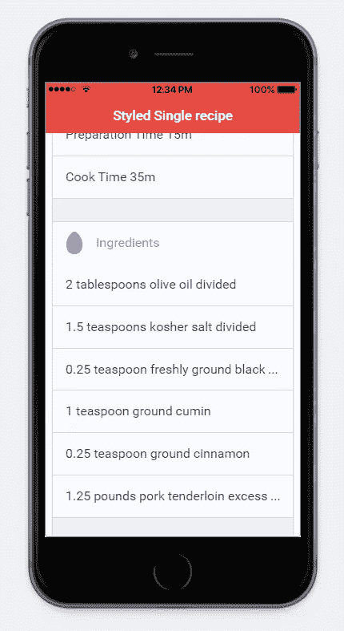

# 如果你有一个基于食谱的网站，也想有一个应用程序

> 原文：<https://medium.com/quick-code/if-you-have-recipe-based-website-and-want-to-have-an-application-too-5da1a17737d8?source=collection_archive---------1----------------------->

Credits: [Alex Dapunt](https://dribbble.com/alexdapunt), Recipes App UI Kit Freebie, [https://dribbble.com/shots/2661249-Recipes-App-UI-Kit-Freebie](https://dribbble.com/shots/2661249-Recipes-App-UI-Kit-Freebie)

让我们假设你有一个食谱网站。你想把你的网站连接到食谱应用程序。你当然明白它的工作原理。

但是有些东西阻止了你。

我的目标是给你提供如何在你的网站上添加应用程序的相关信息。告诉你这没什么大不了的。当然情况和项目不一样。但是这可以节省你的时间和金钱——如果你使用我正在做的项目的话。目前还没有完成。你可以在这里阅读更多

 [## 如果我解释我打算做什么，它会是一个秘密的创业吗？

### 我觉得没有:)

medium.com](/@arthurtkachenko/will-it-be-a-stealth-startup-if-ill-explain-what-i-plan-to-do-6c4fa37592de) 

当我开发第一个版本的应用程序时，我专注于以前为我的客户创建的项目。类似这篇文章。

他们有网站和一个应用程序将是一个很好的用户新功能。
他们将需要创建一个应用程序设计，找到一种方法如何从 MySQL 数据库中获取数据(WordPress +自定义食谱插件和自定义数据库，用 Yii 框架帮助构建)。
因此，当前的应用程序代码可以被重新标记，并由我的上一个版本使用。客户。
他们必须将 JSON 文件与数据一起存储在在线服务器上。该应用程序将读取该文件，并以适当的方式显示食谱。

**注:**此版本功能有限。没有用户注册，没有膳食计划，但它可以在很短的时间内完成。

如果你没有主网站，你可以通过我们的配方 API 服务器使用这个应用程序(更多信息见下文)。

**关于一个 app**
代码是用 Angular 帮助写的。[使用离子框架](https://www.google.com.ua/url?sa=t&rct=j&q=&esrc=s&source=web&cd=1&cad=rja&uact=8&ved=0ahUKEwiCmuj7-sPYAhVD_ywKHaGjAWUQFggzMAA&url=https%3A%2F%2Fionicframework.com%2F&usg=AOvVaw3OzgWJQULniw0wtc6C98zf)。
第一个视图和基本结构是在 [Ionic Creator](https://www.google.com.ua/url?sa=t&rct=j&q=&esrc=s&source=web&cd=2&cad=rja&uact=8&ved=0ahUKEwjC7cD_-sPYAhWJ2CwKHV-ACGAQFggvMAE&url=https%3A%2F%2Fionicframework.com%2Fpro%2Fcreator&usg=AOvVaw1zWj2N_4xGJEVkXo1G8p8k) 构建和导出的。
**注:**我没有把这个 app 发到 app store。未编译且未创建 Cordova 版本。而且没有在 app 预览器测试。
所以它会有错误。但是它在模拟器上工作得很好，这对我来说已经足够了。

下一个版本将在 React 本地帮助下创建。
有一个 [**创造-反应-应用**](https://www.google.com.ua/url?sa=t&rct=j&q=&esrc=s&source=web&cd=1&cad=rja&uact=8&ved=0ahUKEwiqs_Ob-8PYAhXG8ywKHeKaAWwQFgg5MAA&url=https%3A%2F%2Fgithub.com%2Ffacebookincubator%2Fcreate-react-app&usg=AOvVaw0TRGkiD838CKaJso8dGVxW) 这样的首发真是太牛逼了。很有帮助。React native 也有一个很大的项目实例档案。

但你需要深入“反应”世界。两周前，我设置了一个创建-反应-应用空白启动器。我花了 4 分钟。这对我来说是一个很大的时间节省。一年前，为了开始工作，你必须知道 React 是如何工作的，配置 Webpack 和构建东西。现在，当你只想在本地主机上打开一个页面时，这不是问题。伙计们和 GitHub 社区做了了不起的工作。

## 阶段(如何将此应用程序添加到您的项目中)

1)你的网站+ app(显示来自网站的内容)。或者您可以创建单独的内容容器实例。仅限应用程序

2)应用程序将通过 API 端点或 webhooks 连接到您的数据库

app 内授权+注册。这可以由我们的 API 来涵盖。
或者您可以使用之前设置的注册流程(您自己的注册方式)。在下一个版本中，我们将为 API 和接收数据提供一个高级安全选项。

最复杂的事情是在你的网站数据库、应用程序接口和应用程序之间建立一座桥梁。我们的配方 API 和一个应用程序可以(*可能*)一起工作，而无需复杂的设置。但是您的项目和数据库将需要一些更改。

你现在就可以设置一个带有免费菜单功能的应用程序。
你将显示一周 5-6 个食谱，以及附加数据。您将使用配方 API(版本#0)和 Ionic App(版本#1)

如果你问我的意见—最好设置一个不连接 API 或数据库的应用程序。
**为什么？**因为简单快捷。这是一个懒人的解决方案(简单的方法)。您可以快速启动它并向您的用户展示。

Ionic App(release #1)又名 Free Menu 有这个应用程序屏幕(截屏可在文章末尾获得):

*   登录/注册
*   关于 app tour
*   查看菜单(配方列表)
*   查看配方数据
*   查看设置
*   轮廓
*   配方信息简短/详细(限于不同用途)
*   带有待办事项复选框列表的简单杂货列表表单。

**注意:**在这个版本中，我们有配料表的屏幕——现在自动生成(将食谱数据转换成食品清单)不工作。
为了使用此功能，您必须拥有另一个仅包含杂货清单项目的文件。

*它将在下一阶段动态生成。*

下一次发布:

*   启用登录并从主数据库获取信息。显示当前菜单(又名用餐计划)
*   付费订阅、订阅管理、带过滤器的高级搜索。

[你也可以查看这篇文章](/p/recipe-based-tech-projects-database-structure-basic-troubles-to-be-ready-for-6b48cab2dc2b)

我计划在下一个版本中有一个更新的设计。通过使用一个设计 UI 工具包，将使一个应用程序更好，更漂亮。设计部分不是这个项目的重要任务。我想先把它修好。

我喜欢这个 UI 套件:

 [## 食谱应用程序 UI 套件免费赠品

### 一个设计师社区，分享他们的工作、流程和当前项目。获得灵感并建立您的网络，如果…

dribbble.com](https://dribbble.com/shots/2661249-Recipes-App-UI-Kit-Freebie)  [## 元素 UI 套件

### 无论您是素描新手还是经验丰富的专业人士，Elements UI 套件都有您开始下一个…

www.sketchapp.com](https://www.sketchapp.com/elements) 

1357 配方应用 UI 套件(找不到链接)

 [## akveo/kittenTricks

### 基特里克斯-🐈react 本地移动入门套件，有 40 多个屏幕和主题热重装支持

github.com](https://github.com/akveo/kittenTricks)  [## Shoutem UI 工具包

### 一个详尽的 UI 组件集，使得编写跨平台的 React 原生组件变得非常容易。

shoutem.github.io](https://shoutem.github.io/ui/) 

线框/又名我的团队中还没有设计师。*请随意使用，感谢您的宝贵时间。你可以鼓掌几下——这是我写下一篇文章的灵感。*

