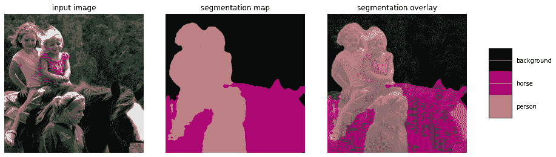

# 通过风格化图像背景创造艺术效果—第 1 部分:项目介绍

> 原文：<https://medium.com/google-developer-experts/image-background-stylizer-part-1-project-intro-d68c4547e7e3?source=collection_archive---------0----------------------->

## 细分+风格转移

作者玛格丽特·梅纳德·里德，ML GDE

这是与团队合作编写的端到端 TensorFlow Lite 教程的第 1 部分，讲述了如何通过分割图像，然后使用神经风格转移对图像背景进行风格化，来组合多个 ML 模型以创建艺术效果。

本教程分为四个部分，您可以随意跟随或跳到您最感兴趣或最感兴趣的部分:

*   第一部分: [**项目简介**](/@margaretmz/image-background-stylizer-part-1-project-intro-d68c4547e7e3) (本作)[玛格丽特·梅纳德-里德](https://twitter.com/margaretmz)
*   第二部分: [**TensorFlow Lite 型号**](/@spsayakpaul/e614af91944d) ， [Sayak Paul](https://twitter.com/RisingSayak)
*   第三部分: [**Android 实现**](https://farmaker47.medium.com/android-part-of-create-artistic-effect-by-stylizing-an-image-segment-2a646da2d39a) ，[乔治·索洛比斯](https://www.linkedin.com/in/george-soloupis/)
*   第 4 部分: **iOS 实施**(即将推出…)，Patrick Haralabidis

代码可以在这个 [**GitHub 仓库**](https://github.com/margaretmz/segmentation-style-transfer) 中找到，在这里你可以找到关于 TensorFlow Lite 模型和移动实现的细节。

Image by the author

# 教程目标

本教程的主要目标如下:

*   帮助您了解如何将多个 ML 模型应用于**真实世界场景**以创建**艺术效果**。
*   为您提供如何保存、转换、优化和基准测试 **TensorFlow Lite 模型**的参考。
*   通过**分段任务 API** 和 Android Studio **ML 模型绑定**，指导您如何使用 TensorFlow Lite 模型轻松创建移动应用。
*   向您展示如何在移动应用程序中链接多个 ML 模型的实际实现。

# 细分+风格转移

对于软件特性、专业艺术家和业余爱好者来说，使用 AI/ML 来辅助艺术和设计的创作变得越来越重要。Snapchat、T2、Adobe Photoshop、T4、英伟达等都有很多这样的例子。

**背景效果**

背景去除或模糊有助于保护隐私或表达参与者的情绪。这是一个重要的特性，你可以在会议应用程序中找到，比如 Google Hangout 或者微软 Teams。

**风格转移**

其他一些常见的场景包括图像风格的转换，这在定义一件艺术品或艺术家时非常重要。

虽然神经样式转移可以创建艺术效果，但它无法模仿特定艺术家或艺术类型的确切风格。神经样式转移的另一个缺点是，当对一些对象(如人脸或肖像)应用变换时，输出图像可能看起来不那么吸引人，尽管很有艺术感。

因此，只对分段的背景进行风格化会使照片肖像的图像更加优雅。这也模仿了摄影或图形设计中改变艺术品背景纹理和/或风格的常见场景。

# **项目概述**

当将 ML 模型应用于现实世界的应用时，我们经常需要将多个计算机视觉模型链接在一起。在本教程中，我们将向您展示如何通过分割图像来组合多个 ML 模型以创建艺术效果，然后使用神经风格转移技术将图像背景风格化。

在这个项目中，我们使用了两个 ML 模型——一个用于细分，另一个用于风格转换。

## 1.细分模型

分割模型是一个基于 [DeepLabV3](https://github.com/tensorflow/models/tree/master/research/deeplab) 的语义分割模型，它可以将图像中的每个像素与类别标签、人物、椅子等相关联。下图描述了这个想法-

## **2。风格转移模型**

对于风格转移模型，我们使用按照本文提出的方法训练的模型— [探索实时、任意神经艺术风格化网络的结构](https://arxiv.org/abs/1705.06830)。这个模型允许我们控制我们希望在最终风格化图像中看到的样式数量。这里有一个例子-

参考:[官方 TensorFlow Lite 文档](https://www.tensorflow.org/lite/models/style_transfer/overview)

## 应用设计

我们将这两个模型连接起来，产生一个风格化的图像，如下所示:

1.  拍摄照片或从图库中选择图像作为输入。
2.  将分割模型应用于输入图像。
3.  将样式转移模型应用于图像背景(内容图像)
4.  将被遮罩的前景图像与风格化的背景混合，生成最终的图像。

参考:[柯拉布笔记本](https://colab.research.google.com/drive/1KZpmuwBfLZM_0mzUyX2W-xcNq26jCNtn)作者:[孔列维](https://twitter.com/khanhlvg)

分割模型应用语义分割，语义分割将每个像素分类为一类。分割模型可以在一个图像中的多个对象上工作，尽管对于我们的示例应用程序，我们选择使用自拍或人脸肖像。所以每张图片都有肖像和背景。然后，我们将样式转换仅应用于背景。

从技术上来说，风格转换也可以应用到肖像上，但是图像用风格化的背景看起来更有吸引力。将背景风格化也更符合摄影中应用不同背景的真实世界场景。

## **用户界面/UX 设计**

虽然这只是一个示例应用程序，但为了适应多种 ML 任务，需要精心设计的用户体验:

1.  输入图像:首先用相机捕捉图像或从图库中选择。
2.  应用分割模型去除图像背景。
3.  对图像背景应用样式转换。
4.  将前景图像与风格化的背景相结合。

一个简单的设计使所有的图像和复杂的逻辑能够在第二个屏幕上显示。

现在你对这个项目有了一个很好的想法，让我们深入到 Sayak 撰写的教程的第 2 部分，关于如何创建 [**TensorFlow Lite 模型**](/@spsayakpaul/e614af91944d) 的细节。

# **致谢**

该项目是正在进行的创建端到端 TensorFlow 教程和示例代码的工作的一部分。这是 ML GDEs 和社区成员的合作。

查看 [**端到端 TensorFlow Lite 教程**](https://github.com/ml-gde/e2e-tflite-tutorials) repo，获取想法、工作进展和所需帮助的列表。

查看[**awesome-TF Lite**](https://github.com/margaretmz/awesome-tflite)**repo，获取 TensorFlow Lite 模型、样本、教程、工具和学习资源的精彩列表。**

**我们要感谢 TensorFlow Lite 团队 Khanh LeViet 和王陆的持续支持。**