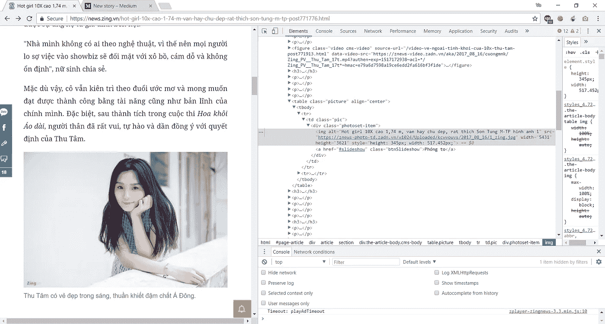
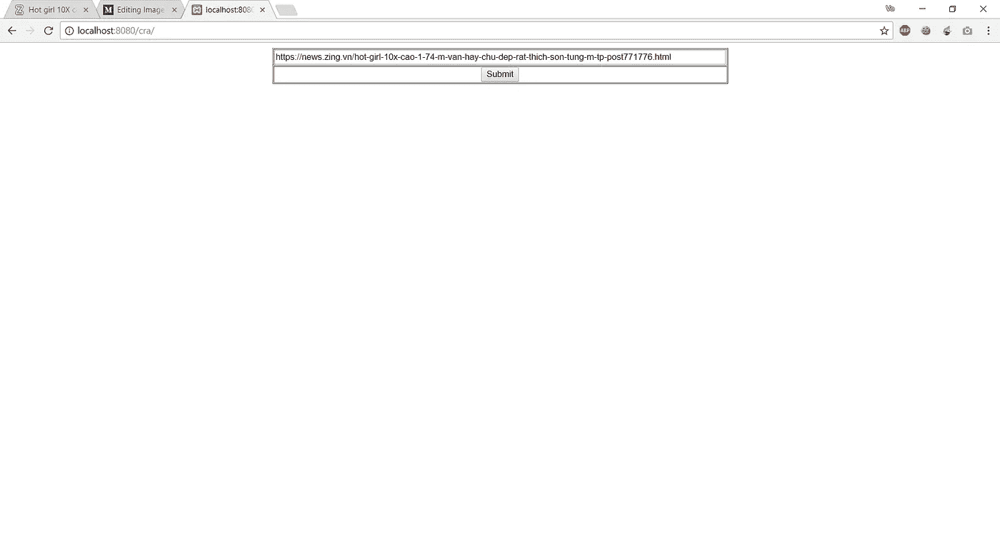
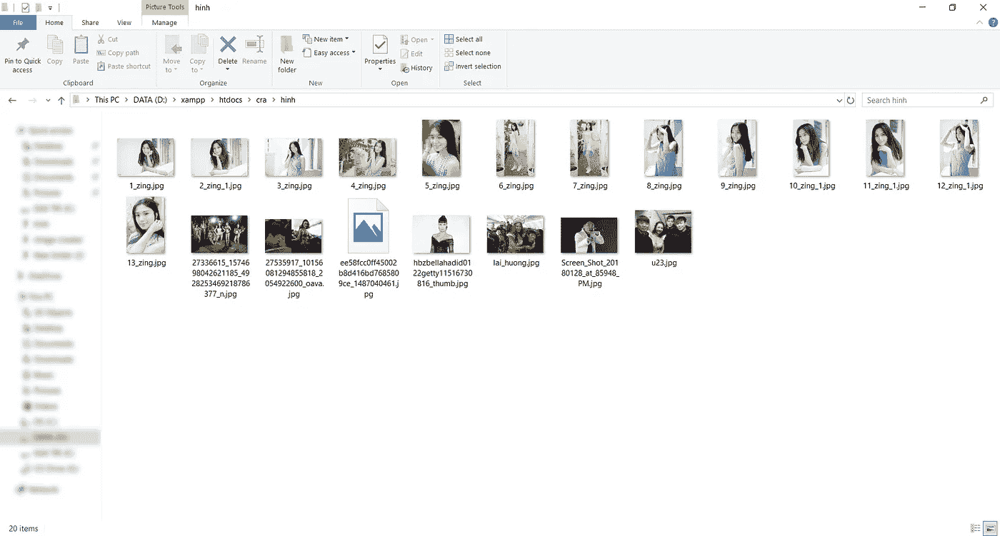

# 用 PHP 实现图像网络爬虫

> 原文：<https://medium.com/quick-code/image-web-crawler-with-php-edfbfb4ef823?source=collection_archive---------0----------------------->

每次我想放弃的时候，我内心深处的声音都会轻轻地说:“再尝试一下，你就会得到你想要的一切！”。

如果你只有自己而一无所有，学习是一条漫长而艰难的路。但是当你用你所拥有的知识从零开始建造一些东西时，这是非常有趣的！

几年前，我有了一个关于如何从指定链接下载所有图片的想法。可能是新闻网站，也可能是图片网站。与其点击“图片另存为…”来保存页面中的每一张图片，为什么不下载一次呢？

想看看我的完整代码吗？检查这里！

[https://github.com/votinhthuong/crawler_image_php](https://github.com/votinhthuong/crawler_image_php)

幸运的是，我已经学会了 PHP，可以用它来编程。所以，我们来试试吧！


Think I will demonstrate this tutorial with my idol? Nope! You wrong!

我想做一个工具，不仅是一个网站，但任何网站，我想得到图像。所以我查看了一些网站的源代码，发现图片使用的 HTML 标签是 *< img src="…" >* 。让我们来看一些来证实那件事吧！



如你所见:

```

```

现在我可以确定标签包含图像。因为用 WWW 工作，使用服务器脚本语言 PHP 是最好的选择。用几句话解释一下这篇文章的标题。我在网上看到很多人称这个行动为“*从网站上收集大量图片*”是一个“**网络搜集**”。不过这个概念还有另外一个名字叫做“**网络爬虫**”。我仍然对这两个大纲感到困惑！=.=

在查了一些字典后，我决定用“**图片网络爬虫**代替“**图片网络抓取**”。原因是因为“*刮*”比“*爬行者*”不礼貌。那在我看来，不是国际！

返回到本文的主要内容。我不想从字面上从头开始构建一切。即使你再努力，也要花很多时间才能完成。所以我在网上找了找，发现了一个 PHP 库，名为“ **PHP Simple HTML DOM Parser** ”。我无法告诉你当我找到它的时候我有多兴奋！这个令人敬畏的库的作者甚至为任何想使用它的人创建了一个手册。通过[最佳 PHP 教程](https://blog.coursesity.com/best-php-tutorials/)，学习成为专业 PHP 开发人员所需的一切。

 [## PHP 简单 HTML DOM 解析器:手动

### file _ get _ html(' http://slashdot . org/')；foreach($ html-> find(' div . article ')as $ article){ $ item[' title ']=…

simplehtmldom.sourceforge.net](http://simplehtmldom.sourceforge.net/manual.htm) 

> 在[快速代码](http://www.quickcode.co/)上找到各种编程语言的免费课程。在[信使](https://www.messenger.com/t/1493528657352302)上获取新的更新。

我必须为我的网络工具设计一个主题。在本教程中，我不太关心它的界面，所以我只是在 HTML 中使用一些基本的标签，这里没有使用 CSS。这不重要！

```
<form id=”form1" name=”form1" method=”post” action=””> 
     <table width=”700" border=”1" align=”center” cellpadding=”1" cellspacing=”1"> 
        <tr> 
            <td colspan=”2">
                       <label for=”textfield”></label> 
                       <input style=”width:100%;” type=”text” name=”url” id=”textfield” /> 
            </td> 
        </tr> 
        <tr> 
            <td colspan=”2" align=”center” valign=”middle”>
                        <input type=”submit” name=”submit” id=”button” value=”Submit” />
            </td> 
        </tr> 
      </table>
</form>
```

只需要记住一些属性的名称，不要在意其他的。

在流程代码中，我把所有的东西都放在事件里面检查是否存在“*提交*点击动作。

```
if(isset($_POST[‘submit’])){//code here…}
```

但是首先你必须 *include()* 或者 *require_once()* 这个库进入这个页面进行处理。没有它，你会被错误淹没。

```
include(‘simple_html_dom.php’);
```

在这一步，我必须从 URL 或文件(在这种情况下是从 URL)创建 DOM。

```
$url=file_get_html($_POST[‘url’]);
```

之后，我算出这个页面中有多少个 *< img >* 标签。

```
$image = $url->find(“img”);
```

得到我们需要的所有信息后，就进入最重要的步骤。

```
foreach($image as $img) {//Get attribute of images}
```

对于每一个$image 变量，我都接触到它自身的每一个属性。详细来说，我想了解一下" **src** "属性，获取我之前获取的每一个 *< img >* 的 **basename()** 。

```
$souceImg=$img->src;$imgName = ‘myImages/’.basename($souceImg);
```

在这里，我可以显示我的 web 应用程序的 url 链接的所有图像。但是我的目的是把所有的图像都弄到我的电脑上，所以我还得多做一步。

```
file_put_contents($imgName, file_get_contents($souceImg));
```

在我手里有了每张图片的信息后，我会把它捕获并存储到之前指定的地方——名为“ **myImages** 的文件夹。

现在运行这个工具来使用。



按下**提交**按钮后，可能需要几分钟才能成功，这取决于您的网速和系统 *php.ini* 中 *max_execution_time* 的参数。除了在您的文件夹中，结果在浏览器的屏幕中不返回任何内容。



如果您想在工具的屏幕浏览器中显示该目录中的所有图像，只需添加一行代码:

```
echo “”;
```

现在，你可以在任何你喜欢的网站上使用这个工具。

PS:感谢 StackOverFlow 上的 onik——他帮助我找出了为什么有时我的函数在一些站点上不起作用。他的解决方案是，在获取图像的属性之前添加一个 check *if()* 。

```
if(!empty($img->src)) {////Get attribute of images}
```

**VO TINH THUONG**

**votinhthuong9@gmail.com**

请点击👏按钮下面几下，以示支持！⬇⬇

谢谢！别忘了**按照下面的**快速码。