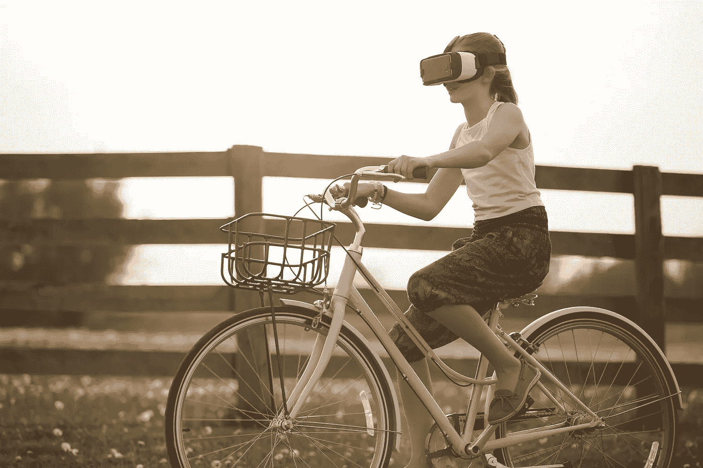
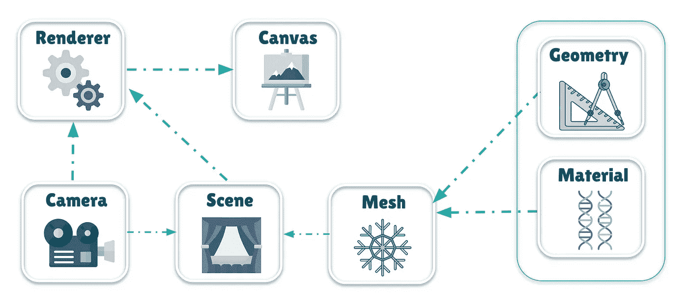
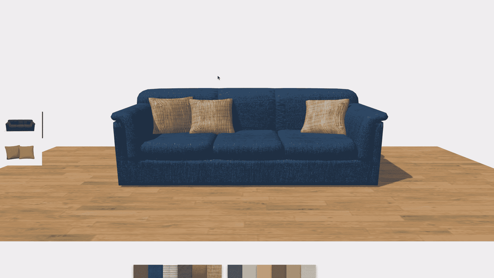
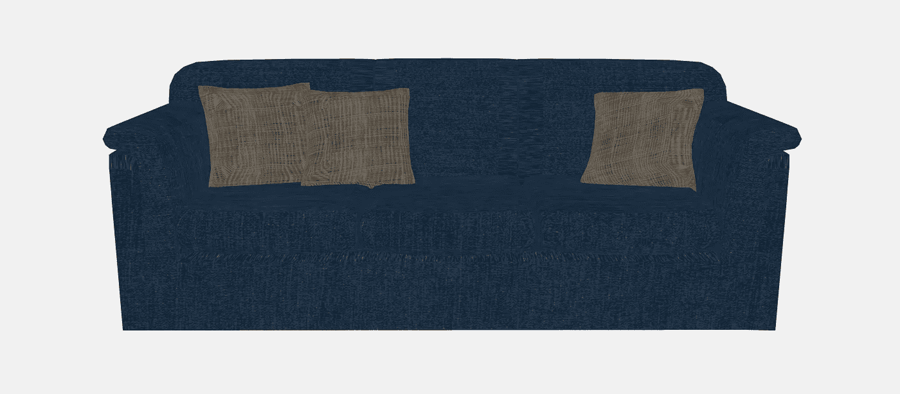
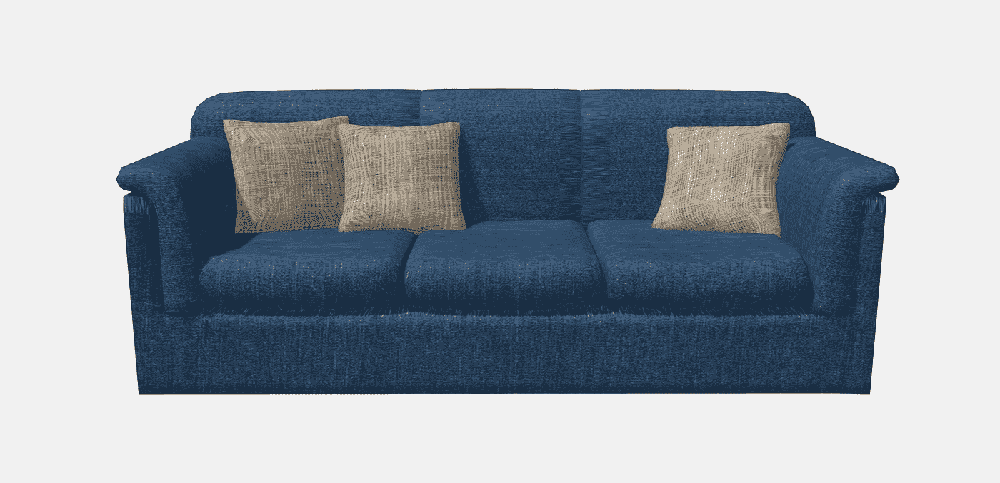
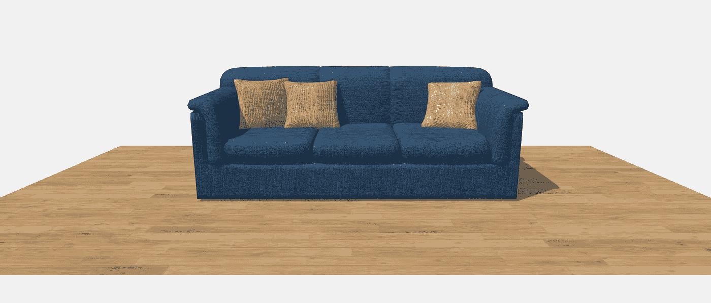
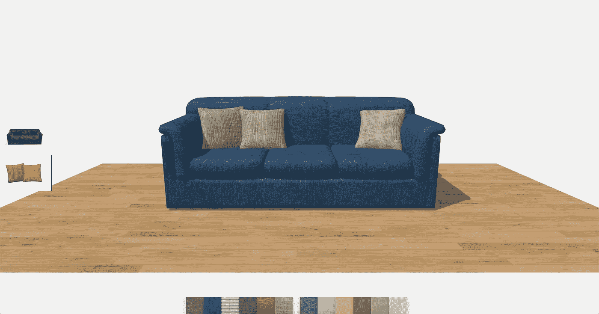

# Three.js 沉浸式骑行

> 原文：<https://medium.com/globant/immersive-ride-with-three-js-8d6eb3b7fff9?source=collection_archive---------0----------------------->



作为 Web 开发人员，我们总是很想知道浏览器除了创建传统的应用程序之外还能做什么。

我已经很久没有评估 JavaScript 库了，以了解浏览器的真正潜力和功能，以及我们如何提供出色的沉浸式体验。

到本文结束时，您将对为您的下一个 web 项目添加额外维度所必需的基本构件有一个坚实的理解。

## 但是等等，什么是沉浸感？

**沉浸**的意思是参与某事。这是关于能够与你所看到的联系起来。它依赖于两种技术:增强现实(AR)和虚拟现实(VR)。

简而言之，**增强现实**意味着将虚拟物体放入我们的现实世界，创造一种互动体验。这个概念最清晰最主流的例子就是 Pokémon Go。

而**虚拟现实**意味着模拟虚拟环境本身。它是完全沉浸式的，我们看到的一切都是通过图像、声音等人工构建的环境的一部分。这种环境是通过一种称为虚拟现实耳机的设备感知的，如谷歌的 Daydream、Oculus Rift、三星 Gear VR、HTC Vive 和 Windows 混合现实耳机。VR 体验也可以在浏览器中浮出水面。

很神奇，不是吗？
现在让我们看看众多工具中的一个，它可以帮助我们创造这些体验——three . js。three . js 是我们今天用来创建沉浸式 web 应用的 JavaScript 库之一。

Three.js 是一个 JavaScript 库，它试图尽可能容易地在网页上获得 3D 内容。Three.js 使用 [WebGL](https://webglfundamentals.org/) 绘制 3D 图像。WebGL 是一个非常底层的系统 API，只画点、线、三角形。
考虑到你已经知道了 JavaScript，让我们从 Three.js 的基本原理开始吧[请在这里查看先决条件。](https://threejsfundamentals.org/threejs/lessons/threejs-prerequisites.html)



Fundamentals of the Three.js

## Three.js 的主要概念

**场景—** 这是一个存放其他物品的容器。你可以把它想象成一个‘小宇宙’，你所有的 3D 物体都生活在其中。

**相机—** 这直接等同于现实世界中的相机概念，您将使用它来查看您的场景。3D 物体应该保持在什么角度，应该保持多远和多近的距离，我们可以在相机的帮助下处理所有这些事情。

**渲染器**——它将一台相机和一个场景作为输入，并将漂亮的绘图输出到您的<画布>上，以便可以在浏览器中查看。

**Canvas —** 这是一个 HTML canvas 元素，就像现实世界中的画布一样，它从一个空白的矩形开始，只等着容纳你美丽的作品！

场景、相机、

<canvas>和渲染器一起给了我们一个 app 的脚手架，然而，它们都是看不见的。我们还需要添加一些可见的物体。</canvas>

**几何图形/对象—** 我们可以借助几何图形绘制 Three.js 中的东西，或者您可以直接加载 3D 模型或对象。

**材质** **—** 当绘制或添加任何 3D 对象时，它需要一些外观，如颜色、阴影、不透明度、渐变等等。这可以通过材料来处理。

**网格—** 这只是一个几何图形和材料的支架，并定义三维空间中的位置。我们可以把这个添加到我们的场景中。

为了看看 Three.js 能给你带来多么酷和惊人的结果，让我们来看看这个[http://carvisualizer.plus360degrees.com/threejs/](http://carvisualizer.plus360degrees.com/threejs/)的例子，它是一个 360 度汽车可视化工具。相信我这是一个很基本的例子，Three.js 有很多超能力。
在上面的例子中，有一个汽车的 3D 模型，可以定制，甚至可以改变模型。酷吧？

从哪里获得这些 3D 模型？你可以从[这里](https://sketchfab.com/)得到。

让我们建造一些令人惊奇的东西。我们将创建一个 3D 模型的沙发，木地板，并添加一些互动。



让我们首先创建一个名为 ThreeJS Example 的文件夹，然后在其中创建一个***index.html***。该文件将包含为 Three.js、GLTFLoader.js 和 OrbitControls.js 添加 CDN 链接的基本内容。gltf 文件格式。js 有助于激活鼠标和触摸所需的所有旋转、拖动和缩放控件。同样，让我们添加 ***index.js*** 文件，我们将在其中编写我们的主要函数。

还有，我们添加 ***app.css*** 文件，添加[这些](https://gist.github.com/Mr-10/a05c61d2897ef327c3b28e03803e557a) CSS 规则。

现在，在 ***index.js*** 中添加下面一行来创建我们的场景。

```
const scene = new THREE.Scene();
```

让我们给场景添加一些背景色

```
scene.background = new THREE.Color(0xf1f1f1);
scene.fog = new THREE.Fog(0xf1f1f1, 20, 100);
```

准备好场景后，添加 canvas 元素，这样它就可以容纳对象了。

```
const canvas = document.querySelector("#sofa-canvas");
```

我们已经在 id 为沙发画布的***【index.html】***中添加了这个 HTML 元素。
让我们添加相机。

```
let camera = new THREE.PerspectiveCamera( 50, window.innerWidth / window.innerHeight, 0.1, 1000);
camera.position.z = 5;
camera.position.x = 0;
```

三. js 提供了两种类型的摄像机[透视摄像机](https://threejs.org/docs/#api/en/cameras/PerspectiveCamera)和[正投影摄像机](https://threejs.org/docs/#api/en/cameras/OrthographicCamera)。在我们的例子中，我们使用了透视摄像机。

准备好场景和相机后，让我们添加渲染器，通过它可以在浏览器中查看场景。

```
const renderer = new THREE.WebGLRenderer({ canvas, antialias: true });
renderer.shadowMap.enabled = true;
renderer.setPixelRatio(window.devicePixelRatio);
document.body.appendChild(renderer.domElement);
```

现在让我们为我们的对象添加一些控件。

```
let controls = new THREE.OrbitControls(camera, renderer.domElement);
controls.maxPolarAngle = Math.PI;
controls.minPolarAngle = 0;
controls.enableDamping = true;
controls.enablePan = false;
controls.dampingFactor = 0.1;
controls.autoRotate = false;
controls.autoRotateSpeed = 0.2;
```

如果我们将自动旋转设置为真，并自动旋转速度，那么我们的沙发对象将自动旋转。
以下方法可以帮助我们制作模型动画。

要设置对象的初始结构，以下方法将帮助我们。在此之前，首先使用以下常量为沙发和枕头创建默认结构，即 DEFAULT_SOFA_TEXTURE 和 DEFAULT _ 枕头 _TEXTURE。

```
const DEFAULT_SOFA_TEXTURE = {texture: './textures/denim_.jpg',
size: [3, 3, 3],
shininess: 0};const DEFAULT_PILLOW_TEXTURE = {texture: './textures/cloth.jpeg',
size: [6, 6, 6],
shininess: 0}function setInitialSofaMaterial() {const sofaMaterial = getTextureMaterial(DEFAULT_SOFA_TEXTURE);
setMaterial(theModel, sofaMaterial, "sofa");
const pillowMaterial = getTextureMaterial(DEFAULT_PILLOW_TEXTURE);
setMaterial(theModel, pillowMaterial, "pillows");}
```

这里我们添加了图像的路径，您可以为其创建名为**纹理**的文件夹。这些都是您可以在找到的必备资产。

此外，我们还调用了一种方法**获取纹理材料**来获取沙发和枕头的材料。

这将简单地根据颜色返回材质纹理，并由**设置材质**方法使用，如下所示。

为了更好地隔离，让我们创建一个 utils 文件夹。然后创建***material helper . js***文件并在其中添加 **getTextureMaterial** 和 **setMaterial** 方法。

现在，我们需要一些东西来加载我们的三维物体。GLTFLoader 将帮助我们在场景中加载 3D 对象。为此，我们需要模态。您可以在这里找到。

到目前为止，我们已经将物体添加到场景中，但是你会看到它是黑色的。为了照亮它，我们必须增加灯光。

让我们在 ***index.js*** 文件中添加以下几行。

```
let hemiLight = new THREE.HemisphereLight(0xffffff, 0xffffff, 0.61);
hemiLight.position.set(0, 50, 0);
scene.add(hemiLight);
```

到目前为止，我们的对象将如下所示:



为了更清楚地看到我们的物体，我们必须增加[方向灯](https://threejs.org/docs/#api/en/lights/DirectionalLight)。

```
let dirLight = new THREE.DirectionalLight(0xffffff, 0.54);
dirLight.position.set(-8, 12, 8);
dirLight.castShadow = true;
dirLight.shadow.mapSize = new THREE.Vector2(1024, 1024);
scene.add(dirLight);
```

现在你将能够更清楚地看到物体。因此，灯光在视觉效果方面很重要。



让我们借助下面的代码来添加楼层。

floor.receiveShadow 方法将为对象添加阴影。

到目前为止，我们已经添加了地板，我们已经建立如下:



有点静态色彩。让我们添加一些交互来改变沙发垫和枕头的颜色。

让我们创建一个名为 constants 的文件夹，然后在其中添加 ***constants.js*** 文件，并创建一个包含不同纹理和颜色的对象数组。你可以在这里找到所有关于 T4 的数据。

完成后，让我们在我们的***material helper . js***文件中添加一个方法 **selectSwatch** ，该文件包含了我们在本文前面部分创建的所有实用程序。

现在让我们为我们的颜色托盘和选项添加一些 HTML 元素。

还有，我们在 ***app.css*** 文件中添加一些 CSS 规则。你可以在这里找到那些。

你可以在这里找到沙发和枕头[所需的图片。另外，你可以在这里](https://github.com/Mr-10/ThreeJS/tree/main/assets)找到我们托盘[所需的纹理。](https://github.com/Mr-10/ThreeJS/tree/main/textures)

现在，我们已经准备好添加颜色托盘和选项所需的所有东西。首先，导入所有我们已经定义好的颜色和纹理。

```
import { texturesAndColors } from "./constants/constants.js";
```

让我们添加一些方法来设置调色板的所有颜色和纹理。

我们已经准备好了我们的托盘。但是我们还不能改变沙发的任何颜色或纹理图案。为此，我们需要将以下代码添加到我们的 ***index.js*** 文件中。

坚持住！我们快到了！

您可以观察到我们正在调用方法 **selectSwatch。** 我们已经将此添加到我们的***material helper . js***文件中。

我们需要将其导入到 ***index.js*** 文件中。

```
import { selectSwatch } from "./utils/materialHelper.js";
```

在此帮助下，我们将能够选择任何样本，并改变沙发的颜色或纹理图案。

现在，最后一部分是在同色同质地托盘的帮助下与枕头互动。我们可以打造两种选择——沙发和枕头。
我们可以将下面的代码添加到 ***index.js*** 文件中。

当我们点击枕头选项并从托盘中选择任何颜色时，我们的模型会相应地改变。很酷，不是吗？

我们的模型和彩色托盘准备好了！！



还有一件事要做！

我们可以显示加载器，以便在将模型加载到浏览器之前。你可以在这里找到最终代码:[https://github.com/Mr-10/ThreeJS](https://github.com/Mr-10/ThreeJS)

到这里，你会有一个惊喜，这肯定会激励你更多地开始使用 Three.js。

到目前为止，我们一直在用普通的 JS 开发代码，有时由于许多因素，很难扩展。现在，随着现代 web 开发的发展，我们非常幸运地拥有了先进的架构，如基于组件/模块的开发。

如果我们可以在开发 Three.js 应用程序时使用这些高级概念，最终一切都是 javascript！

所以给你！

你可以在任何你喜欢的框架/库中开发一个 Three.js 应用程序，下面是链接。

*   反应——https://github.com/pmndrs/react-three-fiber
*   棱角分明—【https://github.com/JohnnyDevNull/ng-three-template 
*   vue . js—[https://github.com/fritx/vue-threejs](https://github.com/fritx/vue-threejs)

恭喜你，你已经进入了沉浸式世界！！

# **总结**

**Three.js** 用于在浏览器上创建 3D 内容，让您能够在浏览器和智能手机上显示难以置信的模型、游戏、科学和数据可视化，或者几乎任何您可以想象的东西！

它使用了 JavaScript API**web GL**，让我们能够使用 JavaScript 访问计算机的专用图形硬件。

我希望通过这篇文章，你能学到一些超越传统 web 开发的东西，相信我这是未来！

如果你觉得这很有用，或者有什么建议，请在评论中告诉我。此外，你也可以随时在 Twitter 或 LinkedIn 上联系我。

祝你学习愉快，不断探索沉浸式世界！