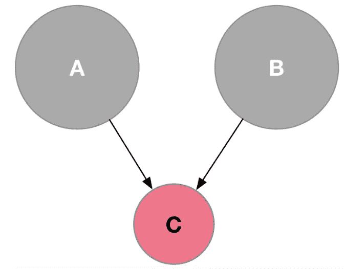
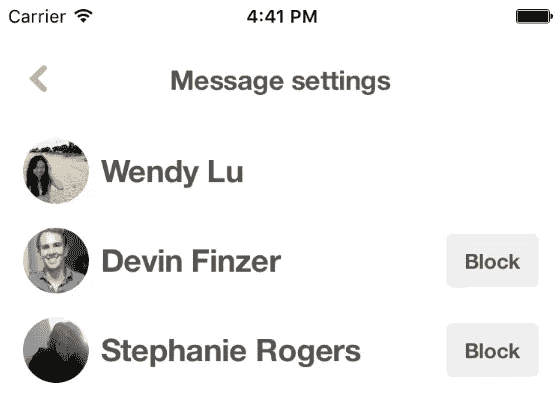
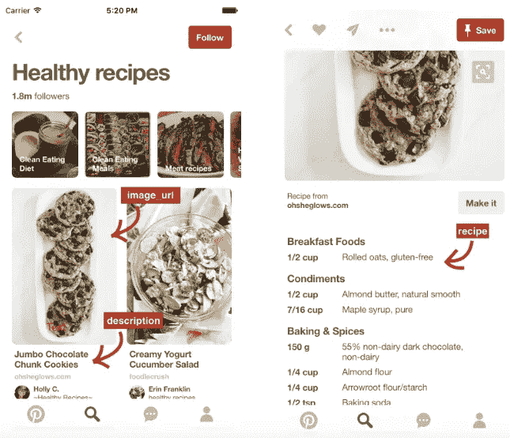
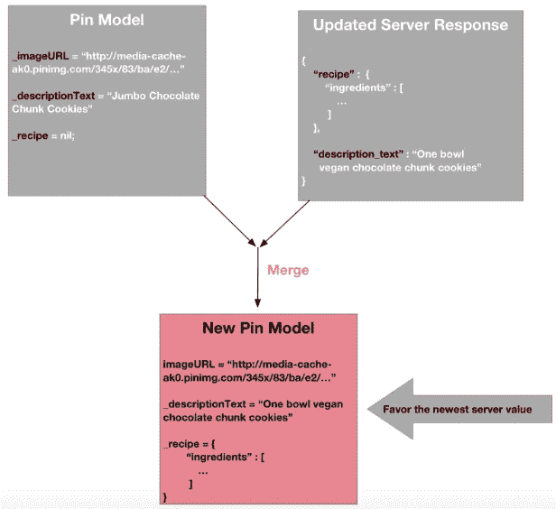

# 我们的 iOS 应用中的不可变模型和数据一致性

> 原文：<https://medium.com/pinterest-engineering/immutable-models-and-data-consistency-in-our-ios-app-d10e248bfef8?source=collection_archive---------0----------------------->

Wendy Lu | Pinterest 工程师，核心经验

今年早些时候，我们重新设计了我们的 [iOS 应用](https://engineering.pinterest.com/blog/re-architecting-pinterests-ios-app),以获得更快、更干净的体验，特别是对于大多数在美国以外使用该应用的 Pinners 来说。重新设计的目标之一是将我们的应用移动到一个完全不可变的模型层。在这篇文章中，我将讨论这背后的动机，并探索我们的新系统如何处理更新模型，从 API 加载新信息和数据一致性。

## 为什么是不可变的模型？

“不可变模型”是我们最近经常听到的一个术语，因为许多应用程序已经转化为不变性。不变性意味着模型在初始化后不能被修改。我们为什么要使用它们？嗯，可变性的主要问题在于共享状态。

可以这样想:在一个可变模型系统中，A 和 B 都保留一个对 c 的引用。



如果 A 修改了 C，A 和 B 都会看到一个变化的值。这可能没问题，但是如果 B 没有预料到这一点，就会发生非常糟糕的事情。

例如，假设我正在与另外两个用户进行消息对话。我有一个带有“用户”属性的消息对象。



当我在这个视图上时，应用程序的另一部分决定从对话中删除 Devin(也许它得到了更新的服务器响应并继续改变模型)。当点击第二行时，我在 message.users 数组中检索第二个对象。现在返回的是斯蒂芬妮而不是 Devin，我最终阻止了错误的人。

不可变模型本质上也是线程安全的。以前，我们不得不担心一个线程可能正在写入模型，而另一个线程正在试图读取它。在我们的新系统中，对象在初始化后不能改变，所以我们可以安全地让多个线程并发读取，而不用担心读取不安全的值。随着我们的 iOS 应用变得越来越并发和多线程，这让我们的生活变得更加轻松。

## 更新模型

由于我们的模型在创建后是完全不可变的，更新或更改模型的唯一方法是创建一个全新的模型对象。我们有两种方法可以做到这一点:

*   使用字典初始化模型(通常来自 JSON 响应)

```
User *user = [[User alloc] initWithDictionary:dictionary];
```

*   使用一个“builder”对象，它基本上只是一个模型的可变表示，具有模型的所有属性。您可以从现有的模型创建一个构建器，修改您想要的属性，然后调用 initWithBuilder 返回新的模型(在以后的文章中会有更多的介绍)。

```
// Change the current user's username to “taylorswift”
UserBuilder *userBuilder = [[UserBuilder alloc] initWithModel:self.currentUser];
userBuilder.username = @"taylorswift";
self.currentUser = [[User alloc] initWithBuilder:userBuilder];
```

## 加载和缓存 API 数据

我们的 API 允许我们从服务器请求部分 JSON 模型，包括模型字段的子集。例如，在 Pin feed 视图中，我们需要像图像 URL 和描述这样的字段，但是我们不需要请求完整的信息，比如食谱成分，直到用户导航到 Pin 特写视图。这有助于我们减少通过网络发送的数据量，以及后端处理时间。



我们保留了一个建立在 [PINCache](https://github.com/pinterest/PINCache) 上的中央模型缓存，一个我们建立的对象缓存和用于 iOS 的[开源](https://engineering.pinterest.com/tags/pincache)。这个缓存的键是模型的惟一的、服务器指定的 id。当我们得到新的服务器响应时，我们检查现有模型的缓存。如果找到了现有的模型，我们将把服务器响应的字段和现有模型的属性合并到一个全新的模型对象中。这个新模型替换了缓存中的现有模型。这样，缓存的模型总是包含我们收到的所有字段的最新超集。



## 数据一致性

在模型被更新后(即，一个新的模型对象被创建)，变化应该被反映在显示模型的视图中。我们之前为此使用了[键值观察](https://developer.apple.com/library/ios/documentation/Cocoa/Conceptual/KeyValueObserving/KeyValueObserving.html)，但是 KVO 不处理不可变的对象——它只观察模型的一个实例的变化。我们现在使用一个基于 NSNotificationCenter 的系统来通知对象他们关心的模型已经被更新。

## 观察变化

视图或视图控制器可以注册模型的更新通知。在本例中，消息视图控制器注册其消息模型的更新。它希望知道新的消息模型是何时创建的，因为这个新模型可能已经更新了属性。


下面的代码创建了一个观察器，它使用消息模型的名称+唯一标识符来侦听更新的模型。在这种方法的基础上，我们使用了基于块的 NSNotificationCenter API ，这样我们可以更好地控制观察器的生命周期。

```
[self.notificationManager addObserverForUpdatedModel:self.message block:^(NSNotification *notification) {
    // Update message view here!
}];
```

notificationManager 只是一个 NSObject，它持有对已注册观察者的强引用。因为它是我们的视图控制器的一个属性，它的 dealloc 应该在我们的视图控制器的 dealloc 之后被调用，我们可以确保所有的观察者在那里都是未注册的。

## 发布更改

更新消息模型时，将发布更新通知:

```
Message *newMessage = [[Message alloc] initWithBuilder:newBuilder];
[NotificationManager postModelUpdatedNotificationWithObject:newMessage];
```

postModelUpdatedNotificationWithObject 将检查模型缓存中相同类+服务器标识符的最新模型，并发布缓存的模型实例。

## 进行用户界面更新

当一个通知被触发时，新的模型被传递到 NSNotification 的“object”字段中。然后，视图控制器可以使用更新后的模型进行任何需要的更新！

```
__weak __typeof__(self) weakSelf = self;
[self.notificationManager addObserverForUpdatedModel:self.message block:^(NSNotification *notification) {
    __typeof__(self) strongSelf = weakSelf;
    Message *newMessage = (Message *)notification.object;
    strongSelf.usersInMessageThread = newMessage.users;
    [strongSelf.tableView reloadData];
}];
```

## 接下来

切换出一个相当大的应用程序的整个模型层不是一件容易的事情，我们创建了一些非常酷的工具来帮助我们。期待我们的下一篇文章，在那里我们将解释如何自动生成我们所有的模型类等等。

*致谢:感谢我们所有的 iOS 开发者使用新模型层并给出反馈，特别是我的队友 Rahul Malik、Chris Danford、Garrett Moon、Ricky Cancro 和 Scott Goodson，以及 Bella You、Rocir Santiago 和 Andrew Chun 对本文的反馈。*