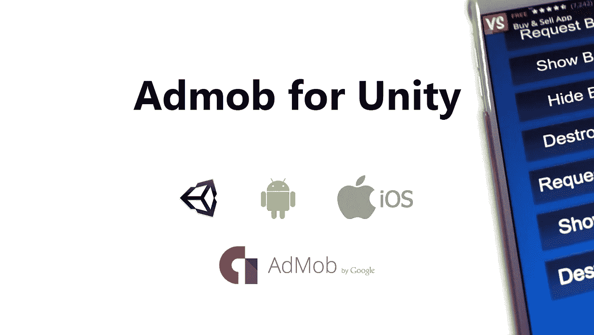

# 为你的 Unity3D 游戏实现 Admob

> 原文：<https://medium.com/google-developer-experts/implement-admob-for-your-unity3d-games-b60559a2ea54?source=collection_archive---------3----------------------->

在我们的游戏上投放广告已经成为游戏开发者非常普遍的盈利方式。Admob 是最好的供应商之一，没有入门要求。

下面的视频向你展示了如何使用谷歌制作的插件在 IOS 和 Android 上为 Unity 游戏实现 Admob。