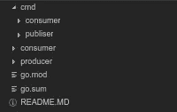
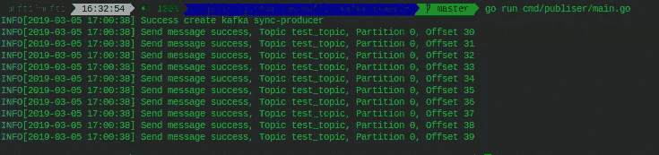
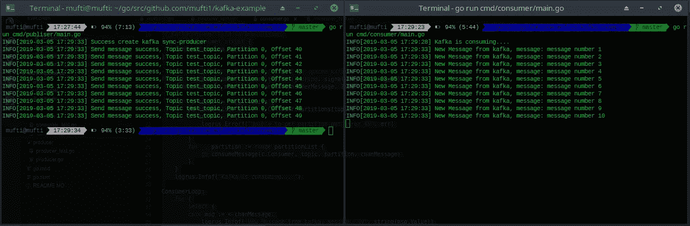

# Implementasi Kafka menggunakan Golang + Testing

> 原文：<https://medium.easyread.co/implementasi-kafka-menggunakan-golang-testing-db183e0b3c29?source=collection_archive---------0----------------------->

Hallo kawan, di tulisan kali ini saya bakal share tentang implementasi apache kafka menggunakan golang, pada artikel ini ada beberapa yang mungkin menjadi istilah baru seperti message broker, kafka, dan docker. So sebelum menuju ke topic utama mari kita breakdown pengertianya satu-satu.


Go And Kafka

# Message Broker

Message broker singkatnya adalah sebuah sistem atau program yang mengatur pesan, yaitu menjadi perantara dan mengatur antara pengirim(sender) dan penerima (receiver).

# Zookeeper

Zookeeper adalah proyek dari Apache yang berguna untuk centralized service for distributed systems, yaitu untuk penyimpanan value store(wikipedia).

# Apache Kafka

Apache Kafka adalah message broker yang awalnya dikembangkan oleh Linkedin kemudian sekarang berada dibawah Apache, kafka ditulis dalam Scala dan Java.

# Docker

Docker adalah program komputer yang melakukan virtualisasi tingkat sistem operasi, juga dikenal sebagai “containerisasi”. Ini pertama kali dirilis pada 2013 dan dikembangkan oleh Docker, Inc.

Untuk mengetahui ketiga istilah diatas silakan bisa kalian pelajari, pada artikel ini pastikan kalian sudah terinstall go, dan apache kafka akan saya jalankan diatas docker agar lebih mudah

# Instalasi Kafka Server menggunakan Docker

Langkah 1

Pertama buat docker network kali ini saya namakan “kafka” berikut sintaksnya

```
docker network create kafka
```

Langkah 2

Untuk menjalankan kafka kita memerlukan zookeeper, untuk menjalankan zookeeper menggunakan docker, lakukan perintah berikut

```
docker run --net=kafka -d --name=zookeeper -e ZOOKEEPER_CLIENT_PORT=2181 confluentinc/cp-zookeeper:4.1.0
```

sedikit penjelasan script diatas adalah menjalankan image confluentinc/cp-zookeeper:4.1.0 dengan network kafka dan memiliki alias container zookeeper, script setelah “-e” berarti environment dari image tersebut

Langkah 3

Di langkah ini kita tinggal menjalankan image apache kafka

```
docker run --net=kafka -d -p 9092:9092 --name=kafka -e KAFKA_ZOOKEEPER_CONNECT=zookeeper:2181 -e KAFKA_ADVERTISED_LISTENERS=PLAINTEXT://kafka:9092 -e KAFKA_OFFSETS_TOPIC_REPLICATION_FACTOR=1 confluentinc/cp-kafka:4.1.0
```

Langkah 4

Untuk konek dengan kafka kita perlu set DNS pada server atau komputer kita, DNSnya harus sama dengan environment KAFKA_ADVERTISED_LISTENERS, dimana nantinya DNS yang akan kita gunakan adalah “kafka”

untuk pengguna linux dapat mengedit file di

```
sudo vim /etc/hosts
```

lalu tambahkan DNS kafka sehingga kurang lebih seperti ini

```
127.0.0.1 localhost
127.0.0.1 kafka
```

selamat kafka server kita sudah siap kemudian saatnya kita ke sesi coding

# Coding Session

Pada artikel ini saya menggunakan golang versi 1.12 namun untuk versi dibawahnya sama kodingnya tidak ada yang berubah, sedikit gambaran nantinya aplikasi yang akan kita buat ada dua yaitu satu sebagai publiser, dan satu sebagai consumer.

langsung saja teman-teman membuat directory sbb:



directory

untuk file go.mod, dan go.sum jika kalian menggunakan golang ≥ 1.11 bisa menjalankan script “go mod init” bagi yang dibawah tidak perlu membuat, atau bisa menggunakan dependency manager yg lain.

folder CMD nantinya akan menjadi file main dari aplikasi kita, kemudian folder consumer dan producer akan berisi kodingan untuk implementasi kafkanya.

# Producer

Library yang saya gunakan untuk menggunakan kafka adalah sarama , pada artikel kali ini akan sedikit TDD jadi kita akan membuat testcase terlebih dahulu.

 [## Package sarama

### Package sarama is a pure Go client library for dealing with Apache Kafka (versions 0.8 and later).

godoc.org](https://godoc.org/github.com/Shopify/sarama) 

Pertama kita buat file di folder producer

```
producer.go
producer_test.go
```

kita isi file producer.go dengan script berikut

```
package producerimport ("github.com/Shopify/sarama")type KafkaProducer struct {Producer sarama.SyncProducer}func (p *KafkaProducer) SendMessage(topic, msg string) error {return nil}
```

Lalu kita koding test filenya terlebih dahulu, salah satu alasan menggunakan sarama adalah, sarama menyediakan package mock kafka jadi kita hanya perlu memanggil fungsi dari package tersebut.

[](https://github.com/Shopify/sarama/tree/master/mocks) [## Shopify/sarama

### Sarama is a Go library for Apache Kafka 0.8, and up. - Shopify/sarama

github.com](https://github.com/Shopify/sarama/tree/master/mocks) 

berikut isi file producer_test.go

producer_test.go

Setelah kita membuat file producer_test.go lalu kita buat actual code producer agar test case yang kita buat tidak fail

producer.go

untuk membuat sebuah producer kita harus mengisi struct sarama.ProducerMessage, untuk isi dari struct producer dapat dilihat di dokumentasi sarama, tapi pada kali ini kita akan mengimplementasikanya dengan cara yang paling simple, dimana kita akan mengirim sebuah message ke topic tertentu dan isi messagenya hanyalah sebuah string.

kita telah berhasil membuat modul producer, kemudian kita panggil fungsi yang telah kita buat di cmd/publisher/main.go

main.go

Untuk membuat producer ke kafka kita harus memanggil fungsi dari library sarama yaitu “NewSyncProducer” yang memiliki parameter sarama.config, dan address broker(address broker adalah server kafka kita). untuk parameter config sebenarnya dapat diisi nil namun pada program ini saya menyiapkan jika kafka yang akan kita konek memiliki username dan password.

jika kita jalankan file main publisher maka akan menampilkan seperti ini



# Consumer

Sebelumnya kita telah membuat service producer yang berfungsi untuk mengirim pesan ke apache kafka, kemudian untuk menerimanya kita akan membuat service consumer.

Yang perlu diperhatikan ketika membuat consumer adalah topic yang akan kita consume dan message yang akan kita ambil, pada kali ini kita akan menggunakan offsetNewest yang berarti consumer akan menerima pesan ketika producer mengirim pesan, ada skema lain seperti offsetOldest yang akan mengambil pesan dari awal hingga pesan terbaru.

langusng saja kita masuk ke kodingan

Pertama kita buat testcase untuk consumer dimana masih menggunakan package mock dari sarama, untuk membuatnya sangat mudah yang pertama kita init mock consumer dengan memanggil fungsi mock.NewConsumer, kemudian kita set topic metadatanya, setelah itu kita expect pesan yang akan kita consume. berikut file testnya

consumer_test.go

Kemudian kita buat actual code untuk consumer.go, perlu diketahui untuk mendapat message dari kafka consumer harus mengetahui topic, partisi, dan skema pengambilan messagenya maka dari itu kita akan membuat sebuah fungsi untuk mengambil message berdasar partisi yang ada dan fungsi untuk handle message yang telah dikirim, berikut file consumer.go

Horee kita telah berhasil membuat service consumer, dan publisher untuk mengujinya mari kita jalankan kedua service tersebut di terminal dengan mengetikan command berikut pada terminal 1

```
go run cmd/consumer/main.go
```

lalu pada terminal yang lain jalankan publisher

```
go run cmd/publisher/main.go
```

makan akan muncul pesan sbb:



producer (kiri), consumer (kanan)

Jika muncul seperti itu berarti program yang kalian buat berhasil, oiya bagi yang bingung saya menyediakan source code fullnya di github berikut linknya

[](https://github.com/mufti1/kafka-example) [## mufti1/kafka-example

### Example produce and consume kafka with test. Contribute to mufti1/kafka-example development by creating an account on…

github.com](https://github.com/mufti1/kafka-example) 

# Conclusion

Belajar mengimplementasikan apache di golang cukup mudah karena banyak library yang tersedia, tutorial diatas dapat kamu kembangkan lagi, mungkin valuenya bisa dicompress jadi gzip atau kalian mengirim sebuah JSON, atau mencoba untuk implementasi dengan kafka yang sudah memiliki security SASL, selain itu ada juga asynproducer, dan consumer group yang patut kalian coba juga ketika bermain dengan sarama, akhir kata selamat belajar :D.