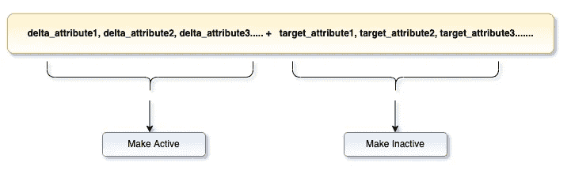

# 用 Apache 胡迪和 Spark 实现 SCD-2(渐变维度)

> 原文：<https://medium.com/walmartglobaltech/implementation-of-scd-2-slowly-changing-dimension-with-apache-hudi-465e0eb94a5?source=collection_archive---------1----------------------->

> 作者及供稿: [*贾亚西埃尔·卡尔加尔*](https://medium.com/u/7b59b9130f45?source=post_page-----465e0eb94a5--------------------------------) *，* [*艾莎·丁*](https://medium.com/u/48093e2b1014?source=post_page-----465e0eb94a5--------------------------------) *，* [*普拉尚特·米什拉*](https://medium.com/u/cbfd10c97864?source=post_page-----465e0eb94a5--------------------------------)

Image source : [https://pixabay.com/photos/files-paper-office-paperwork-stack-1614223/](https://pixabay.com/photos/files-paper-office-paperwork-stack-1614223/)

## 我们要解决什么？

D 在当今的分析世界中，ATA 是一笔无价的财富。在向最终用户提供数据时，跟踪数据在一段时间内的变化非常重要。渐变维度(SCD)是一种存储和管理当前和历史数据的维度。在 SCD 的类型中，我们将特别关注类型 2 (SCD 2)，它保留了值的完整历史。每个记录都包含有效时间和到期时间，以标识记录处于活动状态的时间段。这可以通过几个审计列来实现。**例如** : *有效开始日期、有效结束日期和有效记录指示器*。

让我们学习如何通过使用— **阿帕奇胡迪& Spark** 来实现 SCD-2 表格设计

> Apache 胡迪是下一代[流数据湖平台](https://hudi.apache.org/blog/2021/07/21/streaming-data-lake-platform)。Apache 胡迪将核心仓库和数据库功能直接引入数据湖。胡迪提供了[表](https://hudi.apache.org/docs/next/table_management)、[事务](https://hudi.apache.org/docs/next/timeline)、[高效的更新/删除](https://hudi.apache.org/docs/next/write_operations)、[高级索引](https://hudi.apache.org/docs/next/indexing)、[流摄取服务](https://hudi.apache.org/docs/next/hoodie_deltastreamer)、数据[集群](https://hudi.apache.org/docs/next/clustering) / [压缩](https://hudi.apache.org/docs/next/compaction)优化以及[并发](https://hudi.apache.org/docs/next/concurrency_control)，同时将您的数据保持为开源文件格式。

Apache 胡迪总是显示表中的快照数据，即最近提交的最新数据。如果我们想要跟踪历史变化，我们需要利用胡迪的`**Point in Time Query**`([https://hudi . Apache . org/docs/quick-start-guide # point-in-time-query](https://hudi.apache.org/docs/quick-start-guide#point-in-time-query))

胡迪允许最新的数据读取和时间旅行与旧版本的时间点查询。利用时间点查询遍历历史数据变化是乏味的，并且需要对给定数据进行多个时间间隔的分析。

让我们看看如何用一种传统的方法来解决这个问题。

让我们考虑一个包含产品细节和卖家折扣的表格。

Hive Table (product_dtl)

## **步骤**

1.  让我们使用 Spark 将这些数据放入胡迪表中。

Launching Spark Shell with Hudi dependencies

一旦 spark shell 启动，我们就可以导入库，并创建我们的胡迪表，如下所示。

Importing Hudi libraries & creating Hudi target table

在将数据添加到桶中之后，这就是我们的**胡迪**目标表的样子。

Hudi target table (product_dtl)

2.让我们假设我们的增量数据存储在下表中(非胡迪格式，可以是 hive)。

3.现在让我们通过在目标表上做一个****左反连接来过滤掉 delta 表中所有的 **Insert** only 记录。****

****Filter Insert only records****

****4.我们有一个只插入记录的**数据帧。接下来，让我们创建一个 dataframe，它将包含来自增量表和目标表的属性，在目标表上有一个**内连接**，它将获取需要更新的记录。******

**Update records , in both delta and target tables**

**5.现在我们有了一个在单个记录中包含新数据和旧数据的数据帧，让我们将更新记录的**活动**和**非活动**实例分别放在单独的数据帧中。**

****

**Split update records into active and inactive**

**在进行上述练习时，我们将通过将活动(新)记录的`eff_end_ts`更改为`eff_start_ts -1` 并更新`actv_ind = 0`来废弃非活动记录**

**Create active and inactive updates dataframes**

**6.现在我们将用 union 操作符将**插入**、**活动更新**和**非活动更新**到单个数据帧中。将该数据帧作为最终胡迪写逻辑的增量源。**

**Hudi upsert logic & final data of the target table after upsert operation**

## **实施过程中需要考虑的几点**

*   **对于现有记录的每次更新，parquet 文件将在存储中被重写/移动，这可能会影响写入时的性能**
*   **在数据查询过程中，根据代表主要过滤器的属性对目标表进行分区总是一个更好的主意。例如:销售日期在销售表格的情况下，销售者为产品目录登记。在我们的例子中，我们选择了`actv_ind`,因为我们希望保持简单的解释，并将所有活动记录保存在一个分区中。**

## **结论**

**随着我们将 Apache 胡迪用于 Spark 应用程序，我们将继续改进加载数据的策略。上述尝试仅仅是用胡迪实现 SCD-2 功能的开始。**

## **参考**

**[https://hudi.apache.org/docs/overview](https://hudi.apache.org/docs/overview)**