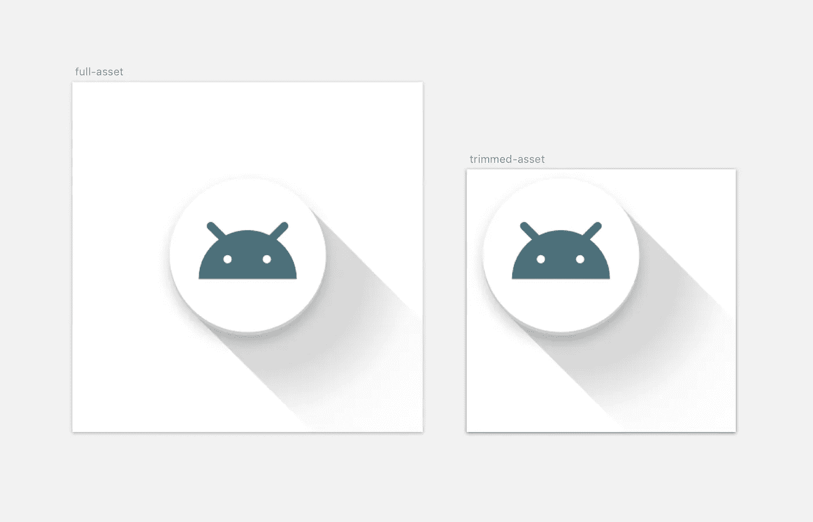

# 实现自适应图标

> 原文：<https://medium.com/androiddevelopers/implementing-adaptive-icons-1e4d1795470e?source=collection_archive---------3----------------------->

Android O 引入了一种新的应用程序图标格式，称为[自适应图标](https://developer.android.com/preview/features/adaptive-icons.html)，旨在使设备上的所有图标更加连贯。这篇文章将探讨如何为你的应用程序构建自适应图标。很多应用程序不太可能很快变成 26，所以这篇文章也将尽可能高效地研究添加这个额外图标的技术。

同样值得指出的是，Android Studio 3.0 包括一个[新向导](https://developer.android.com/preview/features/adaptive-icons.html#studio)来帮助你创建自适应图标，我们不会在这里讨论；我们将坚持基本的格式和技术。

如果你对这种格式的背景或者如何设计一个适应性图标感兴趣，可以看看这些帖子:

[](/@crafty/understanding-android-adaptive-icons-cee8a9de93e2) [## 了解 Android 自适应图标

### Android O 为应用程序图标引入了一种新的格式，称为自适应图标。为了更好地理解动机和…

medium.com](/@crafty/understanding-android-adaptive-icons-cee8a9de93e2) [](/@crafty/designing-adaptive-icons-515af294c783) [## 设计适应性图标

### Android O 引入了新的应用程序图标格式:自适应图标。自适应图标可以通过统一使设备更加一致…

medium.com](/@crafty/designing-adaptive-icons-515af294c783) 

## 基础

自适应图标是一种新的可绘制类型，即`[AdaptiveIconDrawable](https://developer.android.com/reference/android/graphics/drawable/AdaptiveIconDrawable.html)`。您可能永远不需要直接使用该类，而是用 XML 定义它并从您的清单中指向它。您可以使用以下格式:

```
<adaptive-icon>
  <background android:drawable="@[drawable|mipmap|color]/bar"/>
  <foreground android:drawable="@[drawable|mipmap|color]/foo"/></adaptive-icon>
```

每个可拉伸的**必须**的尺寸为 108dp * 108dp 背景绘画必须是不透明的，而前景可以包含透明度。

> 你还需要用`buildToolsVersion` 26.0.0 或更高版本来构建你的 apk。

## 实际上明斯克是 26 岁

因为自适应图标只在 API 26+上使用，所以您可以依赖某些可用的特性。专门挺能干的`VectorDrawable`支持。

> 不幸的是，你不能使用自定义可提取的通货膨胀；因为你的图标会被其他应用程序的进程加载，所以你需要坚持使用平台可绘制类型。

利用向量是有吸引力的，因为它允许我们以非常紧凑的格式指定一次 drawable。这意味着它在任何密度下都是酥脆的，不会使你的 APK 膨胀。

特别是，许多开发者似乎没有利用`VectorDrawable`对渐变的支持。关于这个话题，我推荐阅读 [Ian Lake](https://medium.com/u/51a4f24f5367?source=post_page-----1e4d1795470e--------------------------------) 最近发表的关于实现自适应图标的文章，其中涵盖了一些基础知识。

 [## 可矢量绘制的自适应图标

### 随着 Android O 最终成为 API 26，现在是时候开始考虑添加一个自适应的图标，而不会有…

medium.com](/@ianhlake/vectordrawable-adaptive-icons-3fed3d3205b5) 

伊恩展示了如何使用一个简单的线性渐变，但是`VectorDrawable`有一些更好的技巧。这是一个使用多色阶径向渐变实现“长阴影”的例子。我还使用了[内联资源语法](https://developer.android.com/guide/topics/resources/complex-xml-resources.html)，它允许你将多个文件嵌入到一个文件中(通过 AAPT 技巧，通常与`AnimatedVectorDrawable` s 一起使用):

```
<vector ...> <path android:name="long-shadow"
        android:pathData="..."> <aapt:attr name="android:fillColor"> <gradient
          android:type="radial"
          android:centerX="54"
          android:centerY="54"
          android:gradientRadius="76.37"> <!-- 15% black from center to 32% stop -->
        <item android:offset="0.0" android:color="#26000000" />
        <item android:offset="0.32" android:color="#26000000" /> <!-- 2% black at 62% stop -->
        <item android:offset="0.62" android:color="#05000000" /> <!-- fade to transparent -->
        <item android:offset="1.0" android:color="#00000000" /> </gradient> </aapt:attr> </path> ...</vector>
```


The shadow produced by the radial gradient.

大多数图标都包含某种投影元素(根据[材质指南](https://material.io/guidelines/style/icons.html#icons-product-icons))，不幸的是`VectorDrawable`不支持。使用自适应图标，有两个功能使向量更相关:

1.  启动器现在负责屏蔽整体的可绘制性，并为整个形状提供任何投影。你不再需要在阴影中烘焙整个形状。
2.  图标由背景和前景图像组成，因此如果其中一个图层不需要任何阴影，那么它可以利用矢量。

一些简单的阴影可以用渐变来近似，但不幸的是不是所有的都可以。

## 最小可行栅格

如果你不能用向量来实现你的设计，那么用 png 来实现也很好。你的启动图标是如此重要的一项资产，它绝对值得额外增加几个字节来给人留下正确的印象。

然而，有一个巧妙的技巧，你可以利用资产的透明区域…这在自适应图标前景中有些常见。虽然这种资源可能在构建时压缩得很好，但在运行时，无论不透明度如何，每个像素都要占用 8 位内存。为了最大限度地减少这种情况，如果透明度在边缘周围，您可以从 PNG 中修剪这些区域，并使用`[InsetDrawable](https://developer.android.com/guide/topics/resources/drawable-resource.html#Inset)`将其包裹，并将其填充到 108dp 大小。现在不幸的是`InsetDrawable`不喜欢被调整大小(也就是说，如果你设置了 16dp 的顶部插入，无论可绘制的边界如何调整大小，它都将始终是 16dp ),所以在 API26 *中添加了分数*插入来缓解这种情况。这可以让你指定插入占整个可绘制图形的百分比，这样它们就可以正确缩放。

例如，假设您有一个 54dp*54dp 的前景资产；除了将它放在 108dp*108dp 的透明资产中，您可以执行以下操作。

```
<inset ...
    android:drawable="@mipmap/**ic_fg_trimmed**"
    android:insetLeft="25%"
    android:insetTop="25%"
    android:insetRight="25%"
    android:insetBottom="25%" />
```

下面是[使用这种技术的一个例子](https://github.com/nickbutcher/AdaptiveIconPlayground/blob/master/app/src/main/res/drawable-xxxhdpi/ic_launcher_alt_foreground.xml)，我们移除了原本包含透明度的资产的顶部/左侧部分，并插入了一个经过修剪的版本:



*No need to ship/load transparent pixels*

请注意，您仍然需要以不同的密度提供经过修剪的栅格资产，但至少每个密度会更小，内存大小也会大大减小。

## 走捷径

自适应图标不仅仅用于*应用*图标，它们也用于[应用快捷方式](https://developer.android.com/guide/topics/ui/shortcuts.html)。应用程序快捷方式可以固定在主屏幕上，因此它们需要与应用程序图标相适应。(pre-O) [设计规范](https://material.io/guidelines/style/icons.html#icons-app-shortcut-icons)要求快捷图标位于灰色圆形背景上。在 Android-O 中，背景应该填充自适应图标遮罩。如果你不更新到自适应，你的快捷图标将被缩小，并放置在白色背景上。


*Plaid’s search shortcut; before and after becoming adaptive*

为了在我的应用程序[格子](https://github.com/nickbutcher/plaid)中实现这一点，我最初[在 v26 配置中添加了新图标](https://github.com/nickbutcher/plaid/commit/b7f0ed1)，为自适应网格和[关键线](/google-design/designing-adaptive-icons-515af294c783#aad8)重新绘制。我对这种方法不满意，因为它们本质上是 v25 图标的缩小版；这意味着我现在有两个图标需要维护。[最终](https://github.com/nickbutcher/plaid/commit/2d8d428)我决定将 v25 图标分为前景(如搜索图标)和背景(灰色圆圈)，并用一个`LayerDrawable`将它们组合起来:

```
<layer-list ...> <item android:drawable="@drawable/**ic_app_shortcut_background**"/> <item android:drawable="@drawable/**ic_shortcut_search_foreground**"/></layer-list>
```

然后，我可以在自适应图标中使用相同的前景资产。在 v25 上，app 快捷图标是一个 48dp 资产内的 24dp 在 v26 上，它们是 108dp 资产中的 44dp:


*App shortcut icon foreground assets required on API 25 & API 26*

为了使用同样的 48dp 文件，我需要插入它，这样图标一旦放大就有正确的大小了(耶矢量！)到 108dp 自适应图标大小。背景是用一个`ColorDrawable`实现的:

```
<adaptive-icon ...> <background android:drawable="@color/light_grey" /> <foreground> <!-- 10dp padding on each side of 108dp asset -->
    <inset
      android:drawable="@drawable/**ic_shortcut_search_foreground**"
      android:inset="9.26%" /> </foreground></adaptive-icon>
```

> `AdaptiveIconDrawable`会将提供的资源缩放到 108dp，因此要计算生成 44dp 图标所需的插图:48/24 * 44 = 88；也就是说，我们需要将按比例放大的资产每边插入 10dp:10/108→9.26%

对于位图图像快捷方式，使用[图标# createwithaptivebitmap](https://developer.android.com/reference/android/graphics/drawable/Icon.html#createWithAdaptiveBitmap(android.graphics.Bitmap))。

## 玩耍

如果你正在构建一个自适应图标，那么自适应图标游乐场应用程序可能会对你有用。它可以让您预览设备上的自适应图标，查看它们在应用不同遮罩后的外观，并探索一些运动效果。


你可以[获得一个 APK](https://github.com/nickbutcher/AdaptiveIconPlayground/releases) (针对已经运行 Android-O 的设备)或者在 github 上查看:

[](https://github.com/nickbutcher/AdaptiveIconPlayground) [## nick butcher/adaptive icon playground

### AdaptiveIconPlayground 一个用于试验自适应图标的 Android 应用程序。

github.com](https://github.com/nickbutcher/AdaptiveIconPlayground) 

## 适应了

希望这些提示能帮助你构建令人敬畏的自适应图标，让你的应用程序更好地驻留在用户的设备上。如果你有任何实现自适应图标的技巧，请在评论中告诉我。