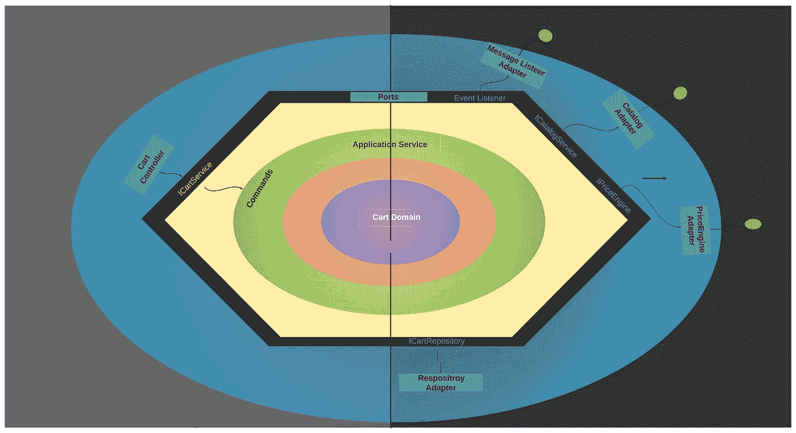
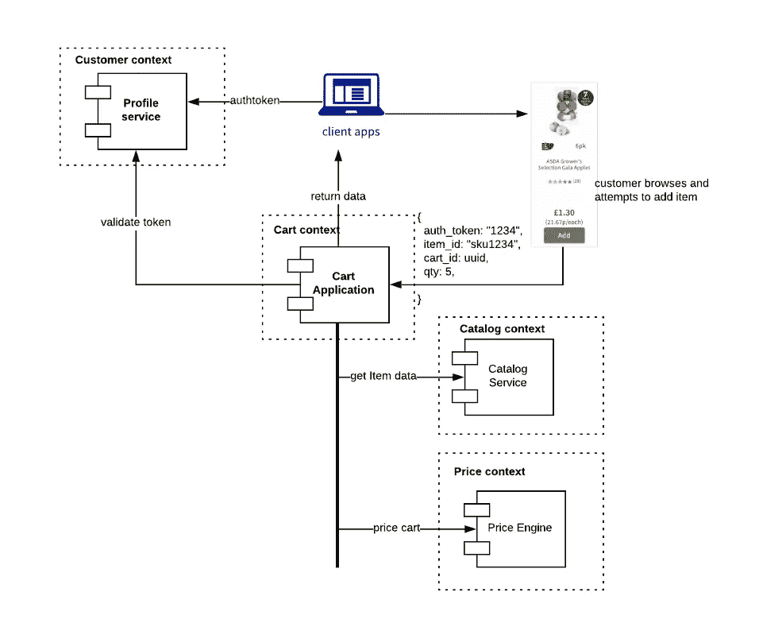
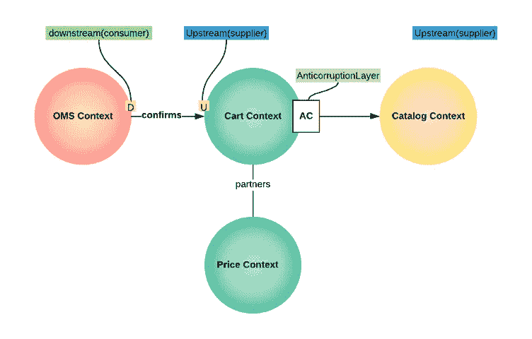
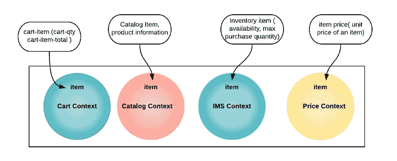
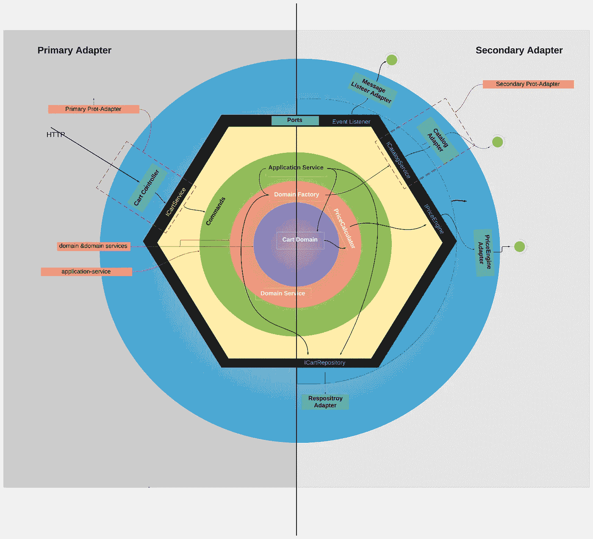
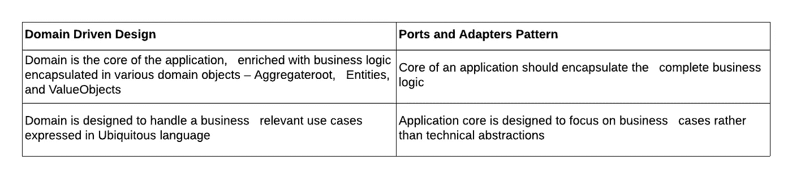
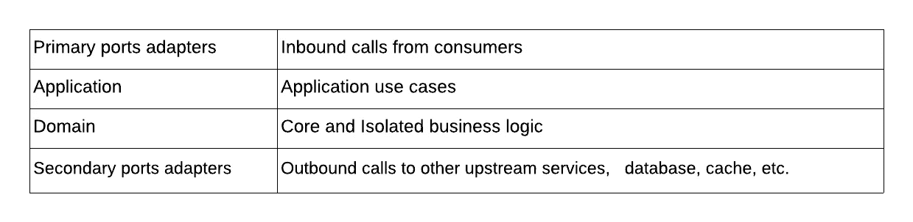

# 使用域驱动设计、端口和适配器模式实现 cart 微服务——第 1 部分

> 原文：<https://medium.com/walmartglobaltech/implementing-cart-service-with-ddd-hexagonal-port-adapter-architecture-part-1-4dab93b3fa9f?source=collection_archive---------1----------------------->

DDD with Ports and Adapter Pattern

在博客( [1](/walmartglobaltech/tech-modernization-at-scale-blog-series-32165d0ea23c) )和( [2](/walmartglobaltech/building-domain-driven-microservices-af688aa1b1b8) )中，我们讨论了微服务架构的一些动机和好处。简而言之，我们的目标是跟上变化的步伐——更快地部署特性、收集反馈和迭代。但是，这种灵活性的提高不应该以系统的稳定性和可靠性为代价。基于一些可靠的设计原则和模式构建模块化应用程序有助于我们实现这一目标——快速移动，但不破坏东西。

模块化应用程序很容易推理、测试、重构和修改。我们也可以并行构建东西，因为我们可以让团队同时在模块的不同部分工作。我们在之前的博客中看到的领域驱动设计的概念在这里也非常有用。毕竟，模块化是关于一起变化的组件之间的高内聚性和不一起变化的组件之间的低耦合性。

在这篇博客中，我们将讨论一些关键的领域驱动设计概念和一个应用程序设计模式——端口和适配器——帮助我们构建这样的模块化应用程序。在这篇博客中，我们将使用一个 Cart 微服务作为例子。我们将通过一些用例来展示这些原则和模式。

## 推车微服务—使用案例

在购物车中添加、更新和删除商品是客户在电子商务网站中执行的基本操作。这个看似简单的用例通常涉及一系列微服务，它们可能属于不同的受限上下文。为简单起见，我们假设如下:

1.  Cart 微服务公开了一些 REST APIs，用于向购物车添加/更新/删除商品。该服务还运行管理这些操作的所有规则。例如，用户只能将一定数量或重量的商品添加到购物车中
2.  定价微服务计算购物车的总价格，并为商品应用任何符合条件的促销
3.  目录微服务提供了 cart 微服务执行某些业务规则所需的项目信息

在我们深入研究如何使用端口和适配器模式构建这个用例之前，快速回顾一些基本的战略性领域驱动的设计原则是很有用的。

## 上下文地图

在我们开始构建用例之前，有必要理解 Cart 服务及其依赖服务之间的关系——特别是它们所属的上下文、可用的集成机制，以及拥有这些服务的团队之间的关系。

Fig 1\. Bounded Context

在[之前的博客](/walmartglobaltech/building-domain-driven-microservices-af688aa1b1b8)中，我们详细介绍了上下文地图。如果您不熟悉这个概念，我们建议您阅读它。

从图中可以看出(图 1)，4 个不同的有界上下文参与完成了向购物车添加商品的用例，并且这些上下文可能属于不同的团队。如果我们的应用程序设计不当，一个服务中的任何变化都会影响另一个服务，从而失去它们的自主性——多个服务之间的协调部署从来都不好玩，即使它们都属于同一个团队，更不用说涉及多个团队的变化了。因此，这些上下文公开的接口和拥有这些服务的团队之间的关系将在确定正确的集成模式和我们可能需要在 Cart 服务中构建的任何抽象中发挥作用。

为了简单起见，让我们假设如下:

1.购物车和价格上下文属于同一个团队。他们可能在同一地点，可以更密切地合作。这两种服务都提供了定义良好的接口，比如 REST APIs 或 gRPC，它们公开了自己的功能

2.目录上下文由另一个团队拥有，并且该服务可能已经在生产中，许多消费者可能已经在使用该上下文拥有的服务。协调一致的变革将是困难的。我们还假设目录上下文有一个 REST API，可以提供产品的细节

3.订单上下文取决于购物车上下文，并且由不同的团队拥有。一旦用户确认订单，订单服务就会收到订单。这可以是 Cart 服务发出的异步事件，而不是 REST API。订单服务订阅此事件

战略领域驱动设计定义了一些模式，可以帮助我们指导我们的设计。我们将讨论那些塑造购物车服务设计的概念，但是请参考领域驱动设计书来更深入地挖掘这些概念。下图显示了不同域之间可能的关系:

Fig 2\. Context Map

## **购物车和定价上下文:**

同一个团队拥有购物车和定价上下文，他们彼此密切合作。与其他上下文相比，功能和特性也是相对紧密耦合的。他们可以**彼此合作**，并通过 REST API 或 gRPC 直接调用他们的服务，无论哪一个都是由另一个公开的接口。在我们的例子中，购物车服务可以调用定价服务，通过调用定价服务的 gRPC 接口来为购物车定价。

## **购物车和目录上下文:**

购物车服务依赖于目录服务来获取商品的详细信息。由于目录服务属于不同的团队，并且这些接口可以独立更改，因此它们最好建立**客户-供应商**关系。在我们的例子中，购物车服务是目录服务的客户。目录上下文中的接口和项目域模型可以独立于购物车服务进行更改。Cart service 可以做一些事情来避免这种紧密耦合:

1.定义一个项目域模型，它代表购物车中的一个项目，独立于由目录上下文定义的项目域模型。

2.创建一个反讹误层，使目录上下文的项目域模型适应购物车上下文的项目域模型

## **OMS 和大车语境:**

OMS 服务从购物车服务订阅事件，并且这些服务不属于同一个团队。因此，如果他们进入**客户-供应商**关系——卡特是供应商，OMS 是客户——团队会更好，因为他们将努力协调他们的变化。然而，在这种情况下，OMS 服务可以**使**符合购物车上下文的事件数据契约。

因此，Cart 服务及其依赖项之间存在的关系是:客户/供应商、从众和伙伴关系。DDD 谈到了更多的模式——OSH、共享内核等。—如果您的用例需要的话，考虑这些是很有用的。

## **其他一些领域驱动的设计原则**

除了上面的设计决策，考虑一些领域驱动的设计模式也是有用的。这些模式和原则有助于确保我们讨论的目标——可重构性、可测试性和模块化。

**无处不在的语言:**

用无处不在的语言和业务领域的核心概念来丰富业务逻辑。项目中的每个人——开发人员、产品经理和业务运营人员。—在表达领域模型时，使用一种通用的、明确的语言。比如说。在我们的例子中，Item 在不同的上下文中可能有不同的意思。在目录上下文中，它意味着“核心产品信息”，但在购物车上下文中，它意味着“添加到购物车中的商品”，因此将包含添加的商品数量、商品的计算价格等。

Fig 3\. Ubiquitous Language

与您的产品经理和业务运营团队密切合作，严格定义领域语言并在代码中大量表达它是非常有用的。

**设计非贫血领域模型:**

当你表达领域的语言时，避免使用缺乏活力的领域模型。一个贫血的域模型是一个仅仅表示数据库实体的模型，它意味着一个或映射对象——只有 getters 和 setters，没有行为。这种编程范式倾向于支持构建业务逻辑的过程化方法，在这种方法中，逻辑位于几个模糊的过程组件中，而领域模型仅用于保存/检索数据。贫血模型是一种反模式，违背了面向对象设计的基本原则——[将数据和处理数据的过程](https://martinfowler.com/eaaCatalog/domainModel.html)放在一起。

**关注点分离:**

一个应用程序由许多负责不同功能的不同组件组成。模块化，以及可重构性和可测试性，依赖于在这两者之间建立清晰的界限。让我们回顾一下我们案例中各种不同的关注点:

**1。**这使得应用程序逻辑能够自主地改变，而不管消费者如何访问应用程序。例如，应用程序可以公开 REST APIs、gRPC 接口或任何类型的发布/订阅接口，但是核心域应该不知道调用应用程序逻辑的方式

**2。上游依赖关系**

购物车服务所依赖的应用程序—目录、定价、配置文件和订单。这些依赖关系将以它们相应领域的通用语言来表达它们的模型，因此 Cart 服务需要将这些模型翻译成它自己的领域模型。购物车服务将需要适配器(反腐败层)来完成这种转换

**3。下游依赖关系**

在我们的例子中，下游依赖者是购物车服务的消费者——例如 web 和移动应用程序。Cart 服务可以选择公开各种*意图展示*接口——REST API、gRPC 接口或事件来迎合消费者。请注意，构建这些接口通常涉及处理请求的组件、解组数据的 dto 以及进行各种输入验证的组件。这些是独立于领域逻辑的关注点，它们可能属于自己的上下文。为了维护模型的完整性和可维护性，必须将它们分离到各自的上下文中，并避免与领域逻辑的紧密耦合

上面的每一个关注点都需要它们内部的高内聚和它们之间的低耦合。构建代码库有几种方法，每种方法都有自己的优点和缺点。我们发现端口和适配器模式以及领域驱动设计的核心原则非常适合构建这些用例。

## **端口和适配器/六边形设计模式方法**

端口和适配器是一个[设计模式](https://en.wikipedia.org/wiki/Hexagonal_architecture_(software))，它帮助我们处理上面讨论的一些问题。这种设计模式将应用程序大致分为两部分——应用程序核心和外部。

Fig 4\. Cart service — Ports and Adapter view

**应用核心**:所有的领域逻辑构成了核心，它在很大程度上与所有外部关注点相隔离。这也是应用程序中丰富了领域驱动设计原则的部分——无处不在的语言、非贫血的领域模型、揭示意图的接口和领域服务(稍后将详细介绍)。

**外部**:外部问题包括来自应用程序的所有入站和出站连接。处理入站流量的组件称为主端口和适配器，处理出站流量的组件称为辅助端口和适配器。

*需要注意的一些要点:*

1.把端口想象成适配器实现的接口。这些通常是处理进出应用程序的 I/O 的基础结构组件。这也是反腐败层所在的区域。

2.核心(域)处理核心业务逻辑，并定义适配器遵循的端口。例如，在我们的例子中，Cart 服务需要目录服务提供的目录数据。核心域通过一个定义良好的接口定义该数据的契约，目录适配器负责实现该接口，调用目录服务，并将数据转换为核心域期望的格式。

3.因此，主要和次要层依赖于域。将这种体系结构描述为从域内到域外是很有用的，即域驱动业务逻辑，端口和适配器符合域的要求。这是这种架构和分层架构之间的一个重要区别。我们将在本博客的第二部分讨论这个问题。

下面是 DDD 概念到端口和适配器模式的比较或映射。

Fig 5\. DDD and Ports & Adapter

**端口/适配器模式的优势**

1.  ***用例驱动*** 自然适合 DDD
2.  ***易于理解***——通过将关注点与隔离的分层应用程序核心明确分离，将易于理解应用程序，因为它是由用例驱动的。
3.  ***开发速度更快—*** 添加新的主端口/适配器非常简单，从而缩短了上市时间
4.  ***测试*** —通过定义明确的端口、应用、域，可以单独使用模拟基础架构层进行测试。无需 REST/SOAP/GRPC/UI 等主要端口/适配器，即可全面测试应用核心。

大致来说，应用程序可以分为以下几层。在这个博客的第二部分[中，我们将看到这些概念和 DDD 模式的应用，以及代码示例。](/@mailtorkinbox/implementing-cart-service-with-ddd-hexagonal-port-adapter-architecture-part-2-d9c00e290ab)

Fig 6\. Ports & Adapters Layers and purpose

**注**:参考书/文章&链接在下期博客分享。