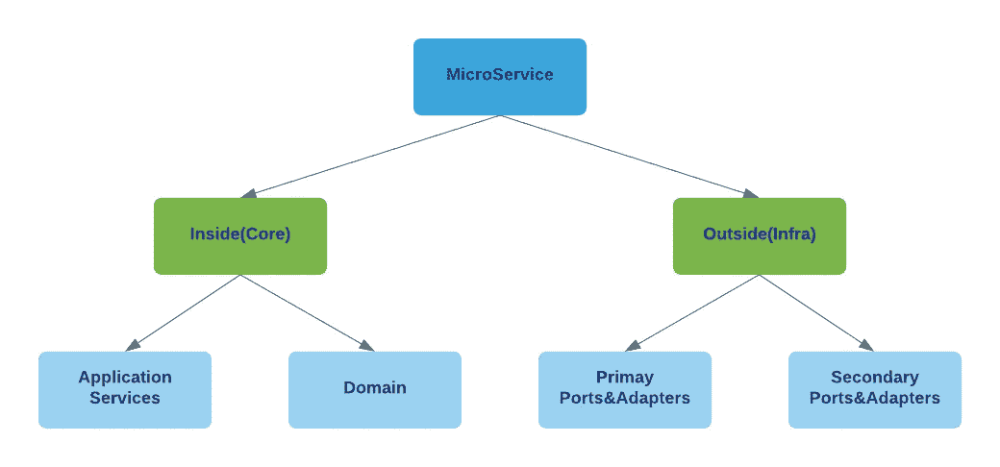
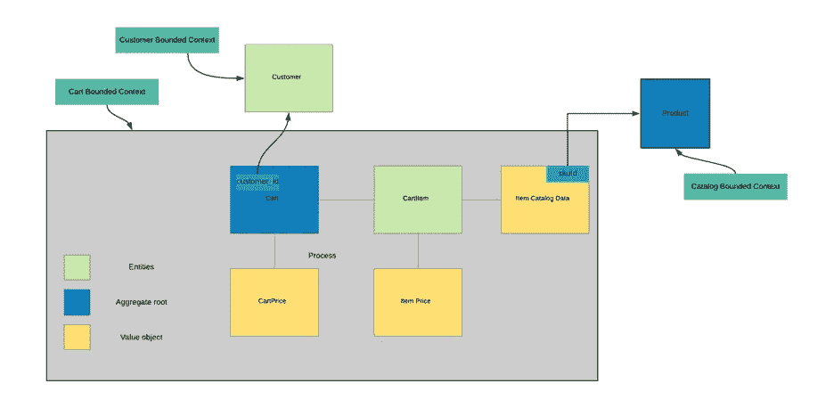
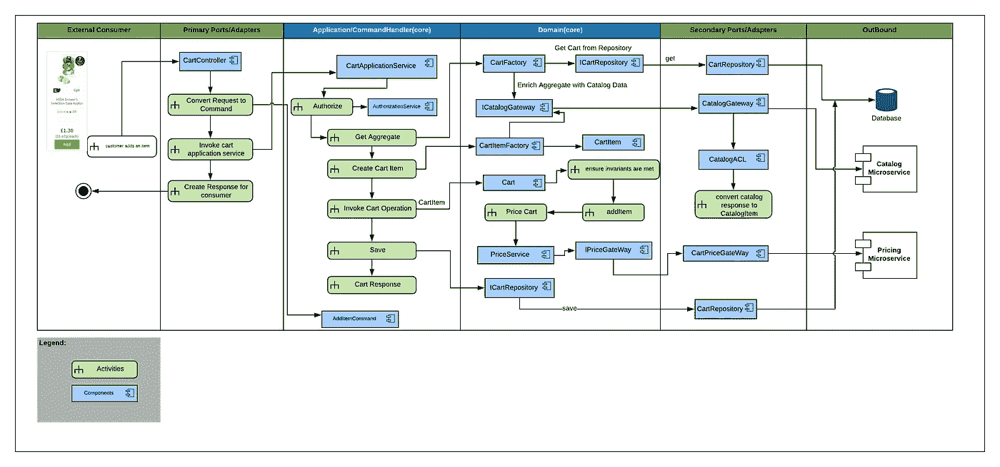
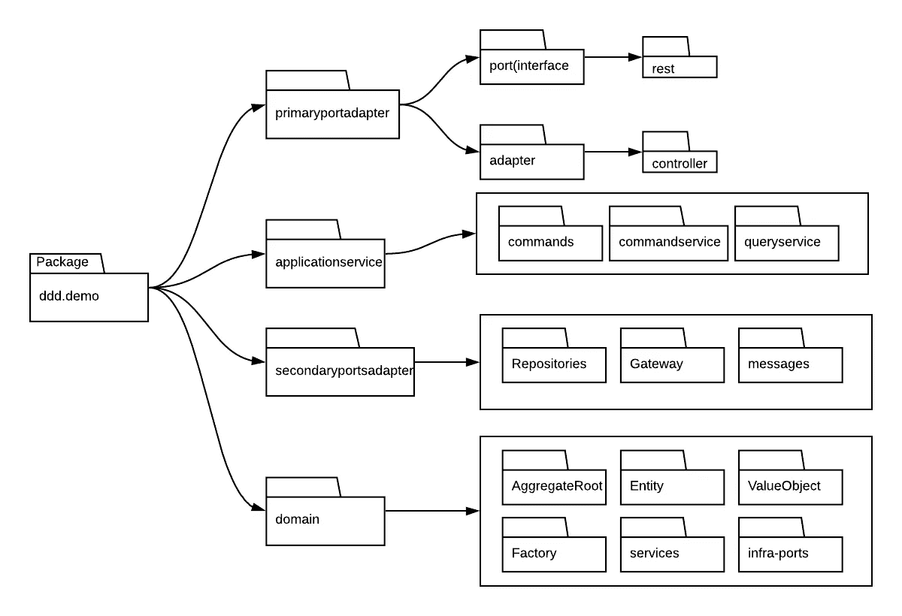

# 使用域驱动设计、端口和适配器模式实现 cart 微服务——第 2 部分

> 原文：<https://medium.com/walmartglobaltech/implementing-cart-service-with-ddd-hexagonal-port-adapter-architecture-part-2-d9c00e290ab?source=collection_archive---------0----------------------->


**DDD with Port and Adapter Pattern**

[***在第 1 部分***](/@mailtorkinbox/implementing-cart-service-with-ddd-hexagonal-port-adapter-architecture-part-1-4dab93b3fa9f) 中，我们讨论了领域驱动设计的重要性以及设计应用程序时要考虑的各个方面。我们还提到了端口和适配器设计模式，并讨论了 DDD 与端口和适配器模式的结合如何帮助我们设计模块化应用程序。

***在第 2 部分*** 中，我们将关注端口和适配器的各个层次。我们将使用第 1 部分中的相同用例——向购物车中添加商品——作为讨论构建用例所涉及的各种组件的基础。



Fig 1\. Layers of Cart service

我们的用例是构建一个公开一些 API(基于 REST)的 Cart 服务应用程序。web/移动应用程序将使用这些 API 来执行某些已定义的操作，如添加/更新/删除项目。

为了实现这个用例，我们需要构建一个 REST 服务，它接受输入数据、执行业务逻辑、与相关服务交互、持久化数据，并最终发送对消费者请求的响应。如果我们将这个用例插入端口和适配器模式，购物车服务将如下所示。应用程序核心仍然是系统的核心，被端口所包围。存在两种不同类型的端口——主端口(驱动端口)和辅助端口(从动端口)。


Fig 2\. Cart Service — P/A representation

## **域**

在我们深入这个模式的所有层之前，让我们讨论一下领域层中涉及的各种组件及其用途。从域向外看端口和适配器模式是很有用的。

域是这个微服务的核心。在第 1 部分中，我们说过领域模型应该包含数据和行为。最重要的是，它不应该是一个贫血的模型。在 cart 应用程序中，所有操作都围绕着 cart 的概念。

对于这个例子，让我们假设一个购物车实体必须有下面的。

推车有，

*   客户详细信息
*   项目
*   价格

各种模型之间的关系可以表示如下。



Fig 3\. Cart Service — Aggregate/Models/ValueObject mapping

## **定义聚合根**

马丁·福勒将 DDD [集合](https://martinfowler.com/bliki/DDD_Aggregate.html)定义为*一群可以被视为一个单元的域对象。*在我们的应用程序中，购物车实体充当一个聚合。它封装了嵌套的子实体，如上图所示。我们还假设每个 *CartItem* 实体都有计算出的价格&目录数据。聚合建模最关键的方面是确保领域始终保持一致，并且业务规则和不变量始终得到执行。关于聚集(在我们的例子中，是购物车实体)，需要注意一些事情。

1.  首先，聚合是一个实体，这意味着它有唯一的 id
2.  它充当进入域和所有实体的入口点
3.  它为应用程序中的其他模块(应用程序/域服务)提供了一组公共方法来与之交互。
4.  它作为一个单元被检索和持久化，并且总是保持一致的状态。
5.  当操作被执行时，强制执行业务不变量是它的职责。
6.  它应该在单个事务中被修改和持久化。
7.  如果一个聚合 Cart 依赖于另一个聚合 Cart，比如说 Customer，那么聚合 Cart 只能引用 Customer。客户实体不是由购物车实体组成的。

Cart 聚合域模型的伪代码(表示数据和行为)

***来自此集合建模的几个标注*** *:*

1.  尽可能避免使用公共 setters，而是通过构造函数或调用聚合根中有意义的方法来填充值。DDD 是无处不在的语言。用有意义的*揭示意图的*方法丰富模型。
2.  虽然购物车中的所有商品都可以通过 ***getCartItems*** ()访问，但是该方法返回不可修改的列表。以便调用者可以读取数据，但不能修改。
3.  聚合根的责任是确保它保持一致，并且不违反任何业务规则。因此，addItemToCart()通过调用***validateMaxItemsLimit***()和***isQtyWithinAllowedLimit***()来验证其不变量。

对于进一步的阅读，我推荐你阅读以下沃恩写的白皮书，可以在这里找到。

## 实体

实体使用唯一的 id 来标识。id 可以是序列号、UUID 或 GUID，并且在创建对象时与它相关联。实体是可变的。可以根据执行的业务操作更新值。在我们的用例中，Cart 和 CartItem 是实体。每个购物车都有唯一的标识。

一个微服务中的实体可能成为另一个微服务中的价值对象。例如，CartItem 与一个目录项目(SKU)相关联。在目录受限的上下文中，SKU 是一个聚集，而在购物车受限的上下文中，它不是。

## 价值对象

通常，我们倾向于创建实体，因为它们代表数据库中的一行。行中的列被映射为原始数据类型，如 int/double/string 和嵌套对象。它们有唯一的 ID，如果它们的 ID 不同，没有两个实体是相同的，即使它们为其余的属性保存完全相同的值。相反，它们没有唯一的 id，但是它们保存值。具有相同值的两个对象是相等的，即使它们与不同的实体相关联。考虑我们用例中的 catalog data(Product)——这代表客户添加到购物车中的商品。不同的客户可以添加相同的产品，但是产品名称和其他元数据信息不会改变。

1.  与实体不同，值对象是不可变的。
2.  考虑将姓名、货币、电子邮件等原始数据类型表示为值对象，这样就可以组合数据，并执行任何有意义的验证和业务规则。也就是说，值对象也是非贫血的。

举个例子，

*   在 CartPrice 值对象中，我们可以验证 PricingService 返回的商品价格是否为非负值。
*   同样，当 *Catalogservice* 返回目录数据时，CatalogItem 值对象可以检查产品的最大允许数量(maxQty)是否不为 0。
*   电子邮件可以有方法来验证电子邮件的格式是否有效

避免在值对象之外的实用程序类中执行这些操作。用在领域中有意义的有意义的方法(即无处不在的语言)丰富值对象

到目前为止，我们已经讨论了集合、实体和值对象。接下来，我们将讨论如何创建、持久化和检索。

## **储存库**

在大多数现实世界的应用程序中，当客户与应用程序交互时，一些对象的状态被保存到数据库中，无论是 RDBMS 还是 NOSQL。例如，当客户向购物车中添加商品时，购物车的状态和商品一起被存储。稍后，当客户回来时，从数据库中检索购物车的状态，以便客户能够从他们离开的地方继续。此外，购物车中组成的一些实体的状态可能已经改变——商品的价格可能已经改变；该项目可能变得不可用，等等。其中一些数据可能需要调用其他微服务来刷新最新信息。如上一节所述，核心域不需要关心这些基础设施或 I/O 组件的细节，但它确实规定了处理业务逻辑所需的核心域模型。这将域与对底层基础结构的任何更改隔离开来，例如，迁移到另一个数据库。

形式上，存储库是领域定义的抽象，通常以接口的形式，带有揭示意图的方法和那些方法预期返回的领域模型。因此，存储库是域感知的，因为它们接受/返回域实体/集合，并且它的操作也依赖于服务(核心域)提供的特性。存储库的实现者应该存储/检索/删除集合或实体以及其子/嵌套实体。通常，当检索数据时，ORM(对象关系映射框架)将数据库行的每一行/列转换成映射的实体

这是端口和适配器模式的一个亮点。存储库可以被建模为端口(辅助/驱动端口),而实现可以被定义为适配器。在我们的用例中，我们需要使用 cart_id 检索购物车，执行所需的操作，然后将其保存回来。域定义了带有预期契约的端口，任何适配器在实现该端口时都应该遵守该契约。就分层而言，端口属于域层，而适配器属于辅助适配器层。

**端口**(Java 中的接口)

**适配器**(也包括底层数据存储实现的基础设施组件)

总是保持聚合和实体尽可能小，但是仍然遵循高内聚和低耦合的规则。存储库将聚合作为一个整体来存储/检索，较大的聚合可能会导致性能问题，如读取/写入多个表

## 工厂

工厂是域中的另一个对象。通常，服务通过调用各自的存储库来创建集合和实体。如果一个实体纯粹是微服务中本地存储的数据的表示，这就足够了，不需要工厂。然而，有时聚合不仅仅是本地存储的数据的表示，而是来自外部微服务(可能来自另一个有界上下文)的数据的组合。当这样的需求出现时，工厂模式就派上了用场。创建复杂集合的逻辑可以委托给工厂，工厂在内部从各种来源构造对象。调用者(服务层)不需要关心对象是如何创建的。工厂是著名的四人帮设计模式。工厂模式和构建器模式在抽象实体构造的内部细节方面非常强大。

例如，CartItem 需要添加到购物车中的商品的 CatalogData(商品信息)。这包括以下操作:

1.  从存储库中检索购物车
2.  对于所有现有的 CartItems，只有产品 ID 存储在 cart 存储库中，并且应该获取 Catalog 微服务拥有的关于产品的大量元数据信息，尤其是可用性/最大数量限制、产品信息。
3.  CartItem 实体应该使用最新的 CatalogData 进行更新，以便域可以确保拥有最新的信息来执行其业务规则——例如，验证可以添加到购物车中的商品的最大限制

因此，我们将使用 CartFactory 创建一个 Cart 聚合。请注意，CatalogService 是注入到工厂中的。该组件负责调用 Catalog 微服务并提取目录数据，然后将这些数据组合到购物车集合中。

到目前为止，我们已经讨论了领域层和位于该层的一些重要对象。现在，我们将域与服务层连接起来，这为我们的应用程序提供了一个完整的形状。

## **主端口/适配器**

正如在第 1 部分中所解释的，主要端口层负责将外部世界连接到应用程序。尽管这是一个技术问题，但可以将其视为一个有界的上下文，其中包含入站基础设施问题。在我们的用例中，Cart 微服务为消费者公开了一些 REST APIs。这一层中的适配器负责处理入站呼叫。对于我们的用例，CartController 是一个适配器，它接收来自浏览器或移动应用程序等消费者的 HTTP 请求。这一层没有任何业务逻辑，适配器将外部世界的请求转换成命令对象，并将用例的处理委托给下一层——应用程序服务(稍后将详细介绍)..

CartController 是这一层中的一个适配器，它还负责将数据转换成消费者同意的格式/契约——在我们的例子中，是来自 REST API 的响应。如何使用这些数据取决于消费者。一个用例是 UI 可以显示带有商品名称、数量、总价和单个商品价格的购物车。如果你做一些像消费者驱动的契约或 GraphQL 之类的东西，这些问题就存在于这一层。


Fig 4\. UI mapping( External world use case)

请注意不要在这一层和应用程序/域层之间共享整理 REST API 请求的对象，通常是一些数据传输对象(dto)。这将有助于避免这些层之间的紧密耦合，并实现这些层之间急需的模块化。您可以避免复杂性，例如，一个图层在 DTO 中引入附加属性只是作为传递数据的一种方式，这样一来，只要 DTO 的结构发生变化，就会导致级联变化。

***我们喜欢遵循的几个设计方面是*** ，

1.  主适配器的请求和响应对象(dto)在主端口中存活和死亡。这有助于轻松地更改消费者响应契约，而无需更改任何核心层。通常情况下，您可能会在 prod 中发布不同版本的 API，并为消费者提供切换的灵活性。
2.  1.dto 不同于命令对象。命令对象旨在调用由应用服务(下面的层)公开的用例。
3.  应用服务层定义了主要端口的接口和数据协议(DTO)。主适配器实现此端口。推理这种启发的一种方式是，应用程序服务确定由应用程序公开的功能，而适配器只遵从所述契约
4.  将外部请求转换为命令对象，该命令对象的契约也由应用程序服务规定

示例代码片段，

## **应用服务**

就像我上面提到的，每个应用程序都是为了解决一系列业务问题/用例而构建的。每一个用例都是独特的，并以特定的方式执行。Cart 应用程序中需要一个组件来执行工作流，并确保工作流确实以正确的顺序执行。一个名为应用服务的组件负责执行完成这个用例的所有步骤。主适配器——在我们的例子中是 REST 控制器——通过传递正确的命令对象来调用应用程序服务

例如，在 Cart 微服务中，该组件可以负责以下内容:

1.  ***消费者授权和认证*** :假设我们使用用户登录时创建的某种形式的用户令牌(例如，基于 OAuth)，在处理请求之前必须验证这个令牌。应用服务是你处理这些的地方。CartApplication 服务可以将此功能委托给另一个应用服务 *AuthorizationService* 。
2.  ***事务管理*** :创建/提交/回滚操作
3.  通过调用存储库或工厂组件来创建所需的域实体/聚合根。
4.  在聚合、实体或域服务上调用适当的操作(稍后将详细介绍)。
5.  将响应返回给调用者(在我们的例子中，是主端口/适配器层)，调用者将响应转换成 JSON/XML 并将其返回给消费者。

请注意不要在应用程序服务中构建任何直接的业务逻辑；业务逻辑属于这个领域。尽管应用程序服务知道要创建的正确的集合或实体，但也是通过将责任委托给存储库组件的工厂，然后在这些对象上调用正确的操作。

## **域名服务**

域服务是战略 DDD 的一部分，但是非常适合端口和适配器模式的域层。将此与执行基础设施操作的应用程序服务和其他服务(组件)进行对比是很好的。

与应用程序服务的主要区别在于，域服务是一个域对象，它执行一个有意义的、域丰富的特性，否则它不会位于域实体或值对象中

让我们浏览一下我们的用例。当商品被添加到购物车时，购物车服务调用定价微服务来计算购物车以及购物车中商品的价格。参考购物车实体中的代码片段。 *addItemToCart* ()将计算购物车价格的功能委托给方法— *calculateCartPrice* ()方法。请注意，这样做的原因是需要用属于它的功能来丰富购物车实体。

```
public void addItemToCart(CartItem cartItem) {
  if (validateMaxItemsLimit(1) && isQtyWithinAllowedLimit(cartItem)) {
    this.cartItems.add(cartItem);
    ***calculateCartPrice***();
    updateLastModifiedTime();
  } else {
    *// Throw Exception for violating limit.* }
}
```

现在，Cart 实体可以直接调用定价微服务，但它会将 Cart 实体与基础设施依赖项耦合在一起，更不用说使实体膨胀了。但是，定价本身是一个存在于领域层的有意义的功能。在这种情况下，我们发现将责任委托给另一个组件(域服务)非常有用。

有两种选择，

***选项 1*** :应用服务，不是在实体上创建聚合并调用 addItemToCart，而是调用一个域服务(如下)。域服务将负责编排业务逻辑。

*   调用购物车实体将商品添加到购物车
*   调用 PriceDomain 服务为购物车定价。还请注意，PriceDomainService 将对定价微服务的调用委托给另一个组件——PriceCalculatorGateway。—进一步抽象基础架构依赖关系

***几件事要注意*** :

*   域服务可能必须公开代理 Cart 实体功能的方法。例如，每个购物车操作(添加/更新/删除)都需要计算购物车价格。域服务必须为这些公开等价的方法，应用程序服务调用它们。
*   确保这不会成为任何和所有业务逻辑的默认模式。只有在功能不明确属于任何业务实体的情况下，才需要域服务

***选项 2*** :当一个应用服务创建一个聚合时，也将 PriceDomainService 注入其中。这样，应用程序服务可以继续调用购物车实体，而购物车实体可以将逻辑的定价部分委托给 PriceDomain 服务。这个选项比选项 1 有两个好处。

1.  域服务不需要为添加/更新/删除操作提供代理方法。如果实体(在我们的例子中是 Cart)公开了更多的函数，我们可以避免将那些代理方法添加到另一个组件中。
2.  添加到 cart 的功能及其依赖项以松散耦合的方式很好地封装在 Cart 实体中

简而言之，就像应用服务一样，域服务也是无状态的。它们存在于该领域中，是该领域中无处不在的语言的一部分。复杂的领域服务也可以根据处理业务逻辑的需要注入存储库和其他领域服务。你必须小心创建一个域服务。除非您确定不能将业务逻辑放在聚合、实体或值对象中，否则不一定要有域服务

## **辅助端口/适配器**

这是一个支持层，帮助应用核心执行工作流。应用程序核心(应用程序/域)驱动这一层。可以将这一层想象成一个受基础设施限制的环境，很像*主端口/适配器*层，但是对于应用程序的上游依赖性——数据库、其他微服务、缓存和消息传递系统。这一层的适配器附着在域层定义的*端口*上，依赖倒置原则有助于注入应用服务/域服务使用所需的适配器。还要注意，应用程序核心不知道适配器，因为它只通过端口(java 中的接口)进行交互。

1.  辅助适配器是技术感知的。它们用于向另一个 http/soap/grpc 服务获取/发送数据。检索/保存数据存储中的数据。他们可以将事件发布到另一个有界的上下文/服务。
2.  如果您的应用程序依赖另一个服务输入来执行逻辑，这一层还充当 ACL(反腐败层)。目录服务就是一个例子。cart 需要目录数据来执行其核心操作，而该基础结构层将外部目录服务契约转换为域定义的目录值对象。请注意，在这些有界的上下文中，目录意味着不同的东西。

下图总结了我们到目前为止所看到的内容——在向购物车添加商品的用例中涉及的高级组件，以及每个组件所属的层。



Fig 5\. Cart Service — Components, PA Layer and Activities

在 Java 应用程序中，包在单个 Maven/Gradle 模块中表示这些层，或者它们中的每一个都可以是一个独立的模块，具有映射的依赖关系。高级包结构如下所示。



Fig 6\. Cart Service — Package structure

一些标注，

1.  ***命令对象驻留在哪里***

*   我保留了应用服务层的指挥权。应用服务提取信息，创建域实体，调用域操作。
*   有些命令可能会因嵌套对象而变得复杂。在这种情况下，应用服务将需要在调用域操作之前创建许多实体。
*   由于应用程序核心包括应用程序服务和域元素，因此命令也可以出现在域层。它可以简化应用服务的工作，聚合可以封装实体的创建。

2. ***为什么工厂在域***

*   CartFactory 的全部职责是通过从不同的端口(存储库/外部服务)获取信息来创建聚合根。因此，把它放在领域层比放在应用层更有意义

3. ***价格服务和价格网关的区别*** 。像存储库端口一样，外部 HTTP 端口被命名为网关。而价格服务包括调用 PriceGateway 的责任，还执行业务逻辑。

***注*** :本博客中分享的代码片段仅仅是给出上下文的例子，并不是完全可执行的。

我们将这些博客(第 1 部分和第 2 部分)的范围保持在端口、适配器和 DDD 的核心概念上。显然，还有更多的内容需要讨论。

1.如何处理同一个应用程序中有多个聚合根的情况？

2.将关键域状态转换传达给其他受限上下文或微服务的事件

3.测试策略

我们打算将来就这些话题进行写作。同时，请让我们知道您的反馈

# 进一步阅读

1.  [Eric Evans 的领域驱动设计](https://www.walmart.com/ip/Domain-Driven-Design-Tackling-Complexity-in-the-Heart-of-Software-Hardcover-9780321125217/2222375)
2.  [沃恩·弗农实施领域驱动设计](https://www.walmart.com/ip/Implementing-Domain-Driven-Design-Hardcover-9780321834577/21124187)
3.  [企业 Java 中实用的领域驱动设计](https://www.walmart.com/ip/Practical-Domain-Driven-Design-in-Enterprise-Java-Using-Jakarta-Ee-Eclipse-Microprofile-Spring-Boot-and-the-Axon-Framework-9781484245422/302398592)
4.  马丁·福勒[文章](http://martinfowler.com)
5.  [六边形建筑](https://alistair.cockburn.us/hexagonal-architecture/)
6.  沃恩·弗农设计集料[第一部分](https://dddcommunity.org/wp-content/uploads/files/pdf_articles/Vernon_2011_1.pdf)、[第二部分](https://dddcommunity.org/wp-content/uploads/files/pdf_articles/Vernon_2011_2.pdf)、[第三部分](https://dddcommunity.org/wp-content/uploads/files/pdf_articles/Vernon_2011_3.pdf)