# 在 Tableau Reader 中实现分散的行级访问

> 原文：<https://medium.com/globant/implementing-decentralized-row-level-access-in-tableau-reader-9af5621d59b9?source=collection_archive---------2----------------------->

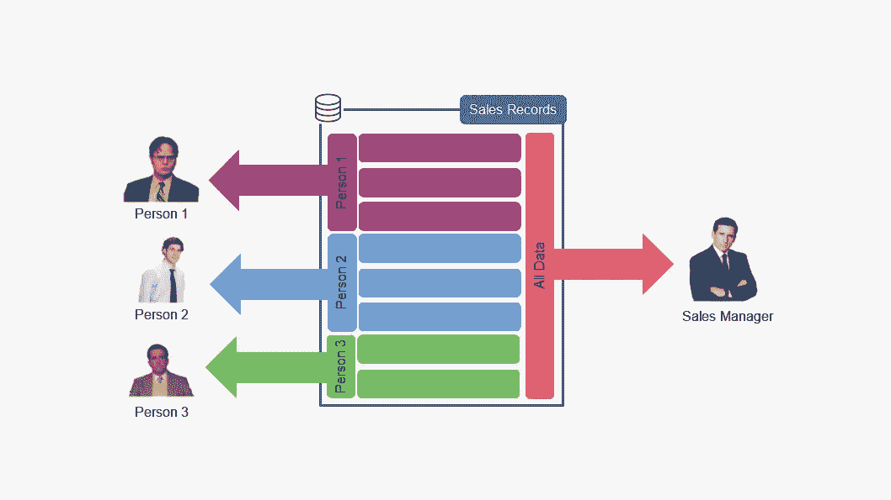

连续十年来，Tableau 一直是 Gartner 魔力象限中领先的商业智能和分析工具。原因有很多:Tableau 连接了大量的资源，有一个易于使用的界面，并且有很好的内置可视化。

虽然它在许多方面都很棒，但并非所有公司都因为财务限制或缺乏内部支持而无法充分发挥它的作用，这使得开发人员需要创建智能解决方案来交付我们手中的优秀产品。

本文讲述了我在不需要用户目录的情况下，在 [Tableau Reader](https://www.tableau.com/products/reader) 中开发行级访问的真实体验。本文的读者应该有一些以前构建 Tableau 仪表板的经验。下载链接到一个示例仪表板，它的数据源将包含在最后。

**背景和范围**

这是一家公司的案例，该公司的超负荷分析团队为 50 多名销售人员提供个人电子表格报告。由于大范围的公司合并，销售团队的规模扩大了一倍，工作量也随之增加。因此，该团队需要帮助来为他们不断增长的信息需求开发解决方案。

最终目标是减少 BI 团队的每月工作量，并激励销售人员做出基于信息的决策。

员工要求使用 Tableau 构建他们的仪表板，因此最终产品必须使用该平台交付。此外，项目必须遵循以下约束:

1.  员工有公司的笔记本电脑和平板电脑，但互联网并不总是可用。
2.  由于高昂的许可费用，客户端无法支付 [Tableau 服务器用户许可](https://www.tableau.com/pricing/teams-orgs#server)。
3.  每个销售人员的绩效都是通过分配给他们的地理区域来衡量的。根据公司政策，每个销售人员只能访问其相关的指定信息。
4.  根据公司策略，此项目不允许外部访问内部用户身份应用程序。
5.  由于许可协议，开发和服务交付不能使用 Tableau 服务器 API。开发和服务仅限于使用 [Tableau 桌面](https://www.tableau.com/products/desktop)。

**问题探究**

在解决项目限制之前，让我们从基础数据模型开始探索问题:

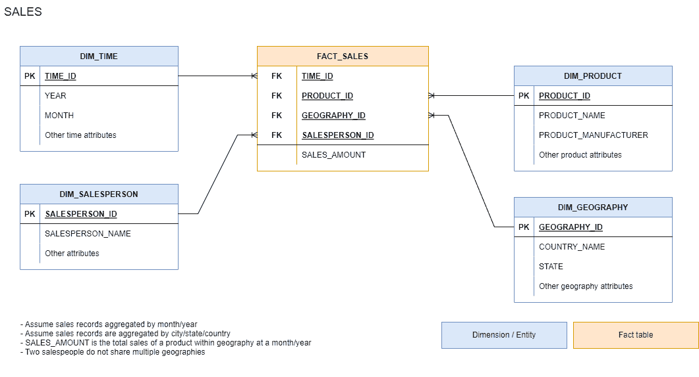

Starting data model

该模型包含 1100 个城市的单位销售额、2000 种不同的产品 SKU 以及长达 10 年的历史数据。

*   ***DIM_TIME*** :表示记录销售的时间段(月/年)。包含超过 120 行。
*   ***DIM_PRODUCT*** :包含已售出产品的信息。包含 2000 多种不同的产品 SKU 及其相关属性。
*   ***DIM_GEOGRAPHY*** :表示从国家到城市级别的地理。对于这个例子，它有 1100 个城市的信息。
*   ***DIM _ SALESPERSON***:描述负责生成销售的销售人员。
*   ***FACT_SALES*** :表 *FACT_SALES* 的每一行都记录了特定时间段(月/年)、产品 SKU、地理位置以及分配给销售人员的总销售量。

事实上，一旦在 Tableau 中设置完毕，所有用户都可以访问仪表板中的所有可用信息，如下所示。

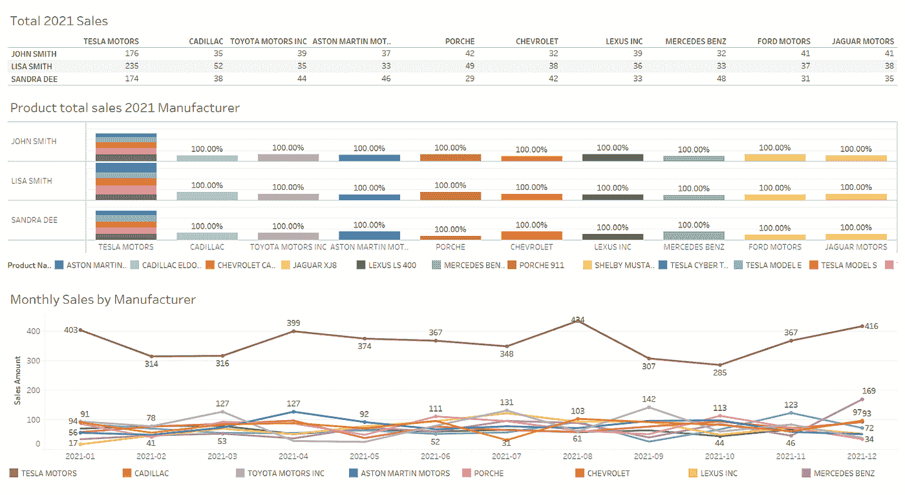

Sample base dashboard

**解决方案开发**

根据客户的要求，所有的仪表板必须建立在 Tableau。用户可以通过连接到 web 浏览器或平板电脑上的 Tableau 服务器实例来与可视化进行在线交互。尽管这需要稳定的互联网连接和每个用户一个许可证。

对于约束一，互联网连接并不总是可用的，因此服务器部署是不可行的。对于第二个限制，客户负担不起每个许可证的费用。

Tableau 提供了一个适用于笔记本电脑的离线[阅读器](https://www.tableau.com/products/reader)应用，并且是免费的。它允许用户与仪表板交互，并将仪表板组件导出为图像或电子表格文件。我们将在 Tableau Reader 上部署，当互联网可用时，他们将下载最新的每月版本，然后满足第一个和第二个约束。

约束三要求我们满足公司信息访问策略，即每个用户只能访问他们的个人信息。但是，约束四限制了对内部用户身份目录的访问，因此几乎不可能管理用户的信息访问。

让我们考虑两个选择。首先，可以生成单独的用户仪表板。这可能行得通，但是，我们必须每月为每个用户更新和提供一个控制面板。然而，用户数量也有可能随着时间的推移而增加。

另一方面，Tableau 服务器能够运行[编程/自动提取刷新](https://help.tableau.com/current/server/en-us/publish.htm)，当您必须更新许多仪表板时，这将大大扩展。

但是对于约束 5，我们不能使用任何 Tableau 服务器 API 功能，在这种情况下，我们必须刷新和维护每个提取，并且我们还必须处理保持每个提取之间的视觉一致性。那么这个选项既不省时也不划算。

对于第二个选项，让我们考虑如何在 Tableau 中建立一个身份验证机制，这样我们就不必生成许多单独的仪表板，而只需生成一个。

**推出定制认证机制**

在最基本的数据术语中，身份验证是一组用户名、加密的密码和每个用户可用的一组权限。

在大多数情况下，应用程序将与身份系统连接，首先对其用户进行身份验证，其次，如果用户经过正确身份验证，则根据可用权限允许访问信息和服务。

根据数据模型定义，Tableau 拥有与表 **DIM_SALESPERSON** 中的每个用户相关联的信息。让我们使用字段 *SALESPERSON_NAME* 作为用户名的代理，最后，我们需要一个存储与每个用户相关的密码的地方。

考虑到这一点，让我们转换 **DIM_SALESPERSON** ，并添加一个新字段 *SALESPERSON_PASSWORD* 。尽管这个项目无法访问集中的身份目录，但是每个用户都有一个访问仪表板的专用密钥。

管理用户访问的关键思想是为每个用户分配一个应用程序密钥，而不是连接到一个中央身份服务。密钥不由最终用户管理，只由管理员管理。如果用户丢失了密钥，他们可以向管理员索要。

*DIM_SALESPERSON* 模式定义如下:

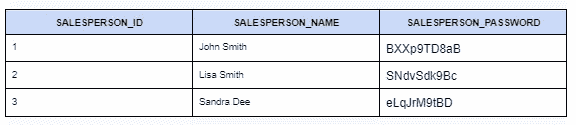

Sample implementation

我建议使用至少包含十(10)个字母数字字符的[随机字生成器](https://www.random.org/strings/?num=10&len=10&digits=on&upperalpha=on&loweralpha=on&unique=on&format=html&rnd=new)来填写 SALESPERSON_PASSWORD，并为每个用户分配一个。

现在让我们回顾一下新的数据模型:

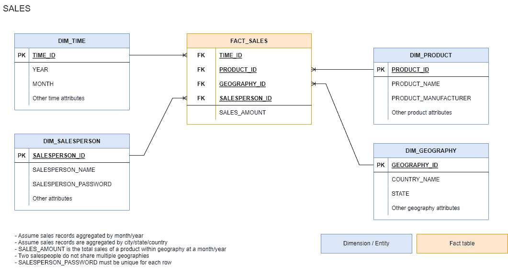

Modified data model

最后，我们必须为用户实现一种自我认证的机制，比如用户/密码提示。

Tableau 提供了[参数](https://help.tableau.com/current/pro/desktop/en-us/changing-views-using-parameters.htm)作为用户输入文本数据的一种方式，并且可以捕获它并将其用于计算字段。让我们使用这个功能将条件应用于最终用户可以在他们的仪表板上看到的内容。

**分步实施**

一旦新的摘录上传到 Tableau，我们就必须编写自定义的身份验证机制。

*   添加一个文本框参数，暂时将其留空。对于这个例子，我称之为 *PARAM_USER_INPUT_PASSWORD。*

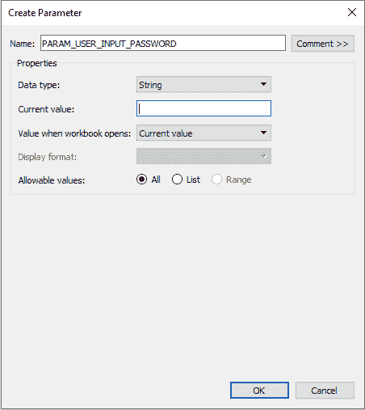

Create new parameter

*   创建一个新的计算字段，对于这个示例，我将其命名为 AUTH_KEY，其实现定义如下:

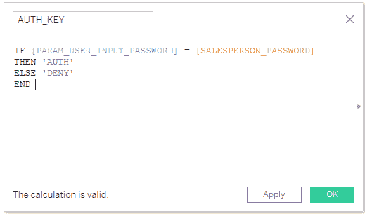

Create new calculated field

*   将新的计算字段拖到过滤器的架子上，将其设置为 AUTH，并将其应用于所有可视化效果。

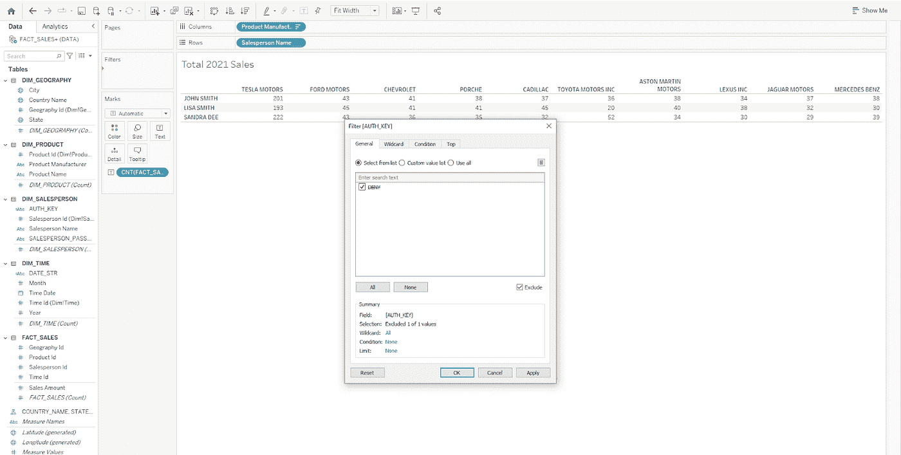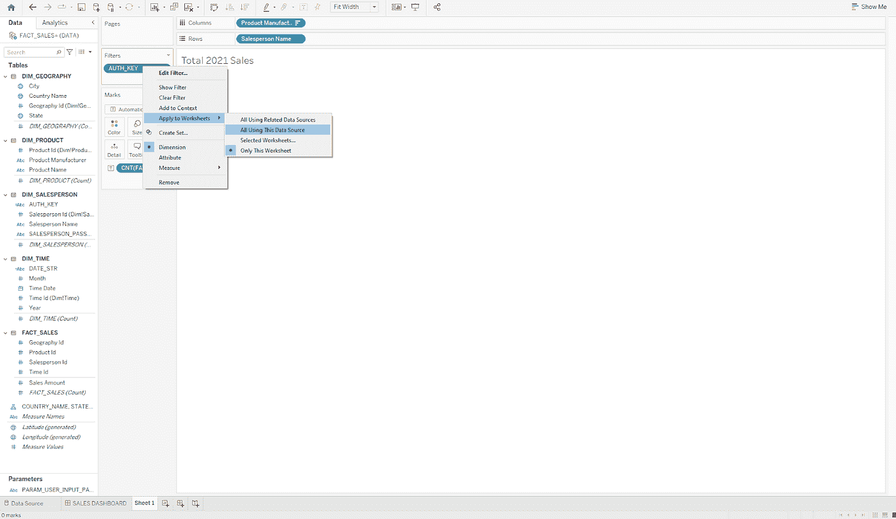

Setting-up user auth filter

现在让我们测试它，包括您的密码输入并将一个用户密钥粘贴到空白参数中，然后点击 enter。

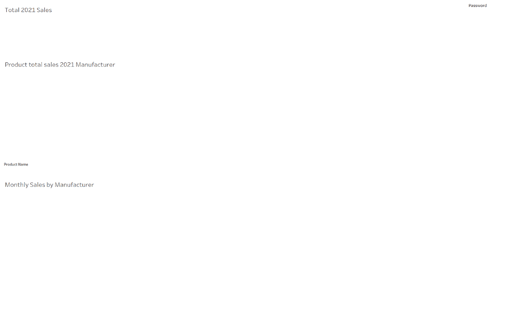

Locked dashboard

此时，您应该只能获得所选用户的相关信息。

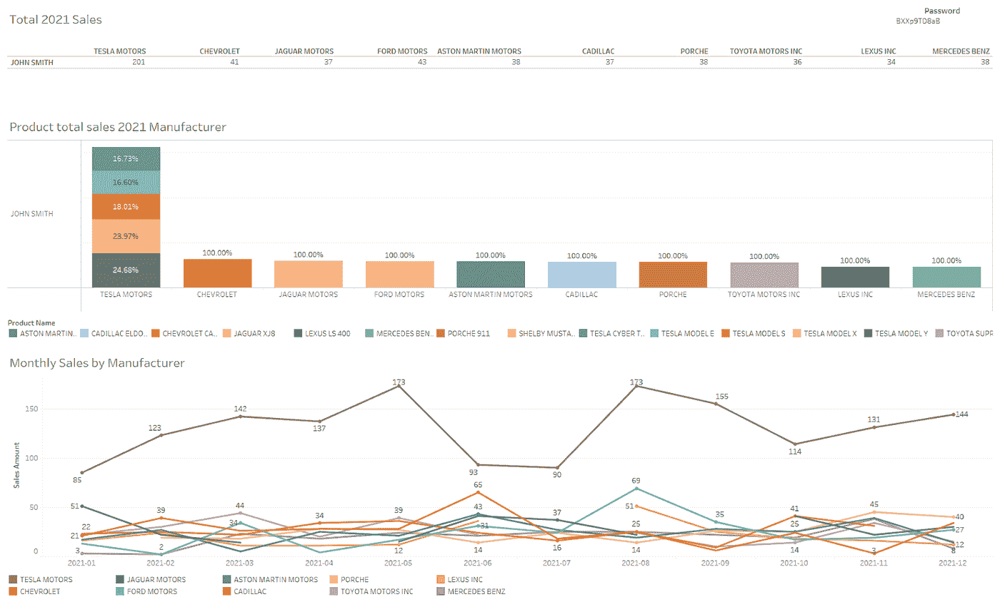

Authenticated user dashboard

**结论**

到目前为止，我已经介绍了一种只使用 Tableau 组件实现行级数据访问的实践，只做了很小的改动。

这种做法可以在可视化级别上进一步实现，可以根据用户显示/隐藏特定的图表。完全有可能用一个单一的仪表板来服务各种各样的受众。

最后，处理技术和组织约束不应该影响我们交付优秀产品的能力。让我们用限制来挑战我们的能力，让我们成长，教会我们跳出框框思考，最大限度地利用我们手中的东西。

**推荐阅读材料**

如果你是从 Tableau 开始，我鼓励你发挥你最大的能力进行游戏和实验，并深入到 [LOD](https://help.tableau.com/current/pro/desktop/en-us/calculations_calculatedfields_lod.htm) 中。

如果您是高级用户，我建议您修改您的数据模型，并尝试找到优化您的仪表板性能的方法。Tableau 有一个很棒的[性能调优指南](https://help.tableau.com/current/pro/desktop/en-us/perf_checklist.htm)。

你可以在这里下载样本文件！