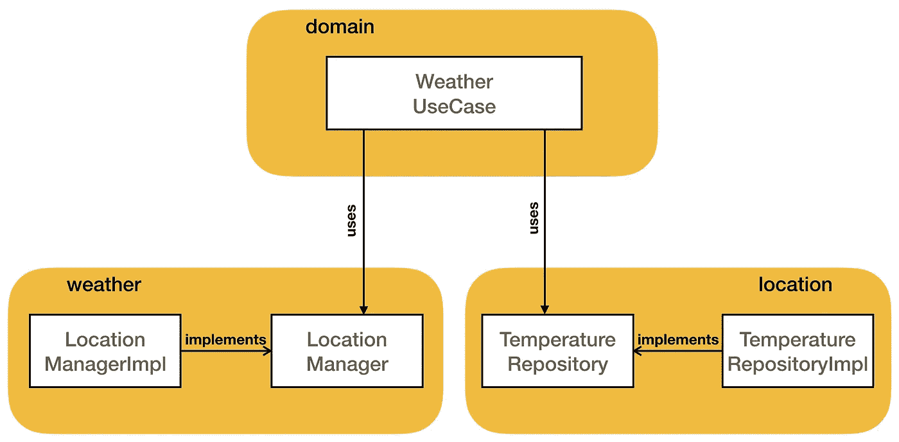
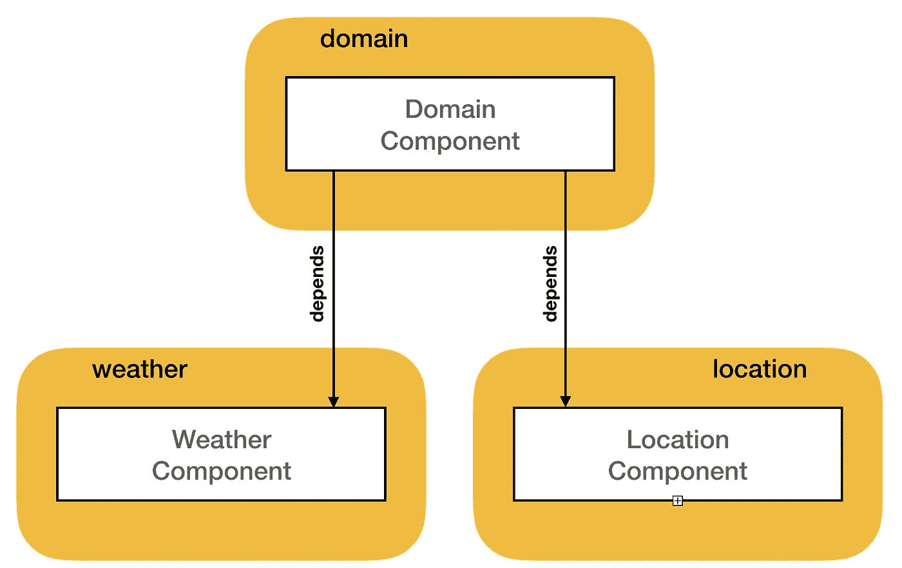
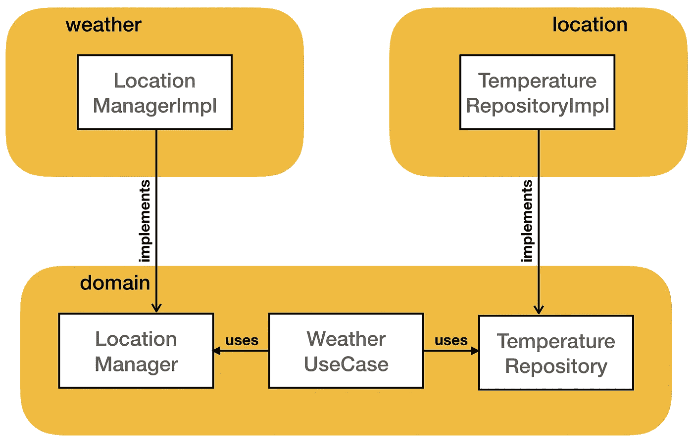
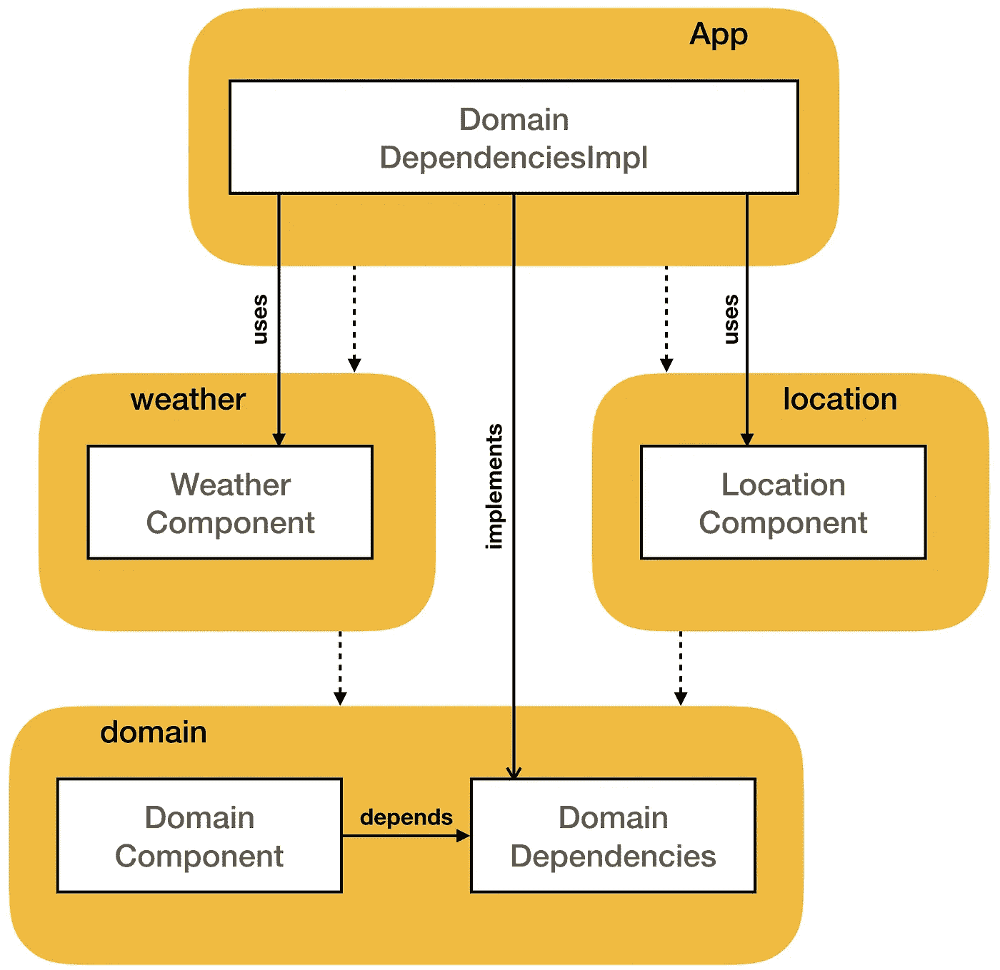

# 使用 Dagger 组件实现依赖倒置

> 原文：<https://medium.com/google-developer-experts/implementing-dependency-inversion-using-dagger-components-d6b0fb3b6b5e?source=collection_archive---------0----------------------->

《稳健原则》是罗伯特·马丁在 21 世纪初首次提出的。这篇[论文](https://fi.ort.edu.uy/innovaportal/file/2032/1/design_principles.pdf)解释了五个原理即使没有使用缩写词 SOLID，后面也会介绍。这是很久以前的事了，但它们今天仍然有效:它们是许多 Android 应用程序中使用的干净架构的基础。SOLID 是一个缩写:D 代表*依赖倒置*，可能是五个原则中最复杂的(但也是最重要的)。

依赖性反转原则通常是这样定义的:

> 高级模块不应该依赖于低级模块

*高层*模块通常包含应用程序的业务逻辑，*低层*模块包含实现细节。例如，计算某些东西的算法在高级模块中定义，而数据库代码在低级模块中定义。

是时候看看如何在多模块 Android 项目上应用这一原则，以及如何利用 Dagger 来管理以这种方式组织的依赖关系了。开始吧！

## 实践中的依赖倒置

让我们看一个例子来解释如何使用依赖倒置。`WeatherUseCase`类返回基于设备位置的天气状况:

它使用协程和其他东西，并且可能以一种糟糕的方式管理异常，这里重要的一点是在构造函数中声明了两个依赖项。这个类使用了*依赖注入*，它也使用了依赖反转吗？名字相似但意义不同。

要回答这个问题，我们需要从更高的层面来看这个例子，这些类可以组织成三个模块:

`domain`模块(在这篇文章中，单词*模块*总是指 Android Studio 模块)只包含了`WeatherUseCase`类。它依赖于定义接口和类实现的其他两个模块来获取设备位置和从远程服务器检索天气。看着这个图，我们可以回答前面的问题:这个例子使用了依赖注入，但是没有使用依赖倒置。原因是，与原理相反，*高电平*模块`domain`依赖于*低电平*模块`weather`和`location`。

## 多模块项目中的匕首

在前面的例子中，Dagger 可以以多种方式配置，例如使用子组件、组件依赖或 Dagger Android。这里我们将使用组件依赖，一种类似于本文中[描述的方法。](/androiddevelopers/dependency-injection-in-a-multi-module-project-1a09511c14b7)

Dagger 代码有两种组织方式:

*   Dagger 代码只能在顶层模块(通常是应用程序)中定义
*   每个模块可以定义自己的匕首配置

第一种方法似乎更清晰，因为使用它，项目中的大多数模块都不知道 Dagger。虽然它对小项目很有效，但是当有很多类需要管理时，我更喜欢在每个模块中定义 Dagger 配置。

回到前面的例子，每个模块都可以定义自己的 Dagger 组件，在`weather`和`location`中定义的组件非常简单:

在`domain`模块中定义的`DomainComponent`使用另外两个组件作为*依赖*:

这里有一个与上一个类似的图表，显示了组件之间的依赖关系:

`WeatherUseCase`然后使用`@Inject`对构造函数进行注释:

通过这种方式，Dagger 可以使用由`LocationComponent`和`WeatherComponent`提供的对象作为构造函数参数来创建一个新的`WeatherUseCase`实例。

## 让我们颠倒依赖关系！

我们如何在这个项目中应用依赖反转？目标是颠倒依赖关系，`weather`和`location`应该依赖于`domain`。最简单的方法是将接口`LocationManager`和`TemperatureRepository`移至`domain`模块:

现在类之间的依赖关系是相同的，但是我们可以看到模块的依赖关系与最初的例子相反。低级模块依赖于高级模块，所以我们使用依赖倒置。

依赖倒置在 Clean 架构中大量使用，其主要优点与该架构相同:

> `domain`模块是独立于框架的，它不包含任何对用于实现的框架的引用

基于这一考虑，我们还有另外两个重要优势:

*   代码约定 Vs 架构:即使在许多项目中没有使用依赖倒置，`domain`也不包含任何对 Android 类的引用，并且可以使用 JVM 测试来测试。但在那个项目中，可能只是因为代码约定，开发者知道不应该在那个模块上使用 Android 类。使用依赖倒置，我们 100%确定 Android 类(或其他低级框架类)没有在那里使用，它们不在类路径中，所以在使用它们的情况下存在编译错误。
*   JVM 测试很快:类路径真的很小，它只包含对一些实用程序库的一些依赖，对其他模块没有依赖。所以在那个模块上的 JVM 测试可以非常快地执行，从而支持 TDD。而`domain`包含业务逻辑，即值得测试的代码。

我在 Droidcon Italy 2019 上的演讲是关于干净的架构，尤其是依赖性反转。如果你感兴趣，这里有演讲的幻灯片和视频。

## 使用具有反向依赖关系的 Dagger

在最初的例子中，`DomainComponent`依赖于另外两个组件，在颠倒了依赖关系后，这段代码不再编译，因为`domain`模块不依赖于另外两个模块。

依赖性反转也可以用来解决这个问题，我们可以移除对`LocationComponent`和`WeatherComponent`的依赖性，并用新的接口`DomainDependencies`替换它们:

`DomainDependencies`接口包含了`DomainComponent`创建`WeatherUseCase`的新实例所需的对象。需要注意的是，这个新接口没有使用`@Component`进行注释，它是一个具有两个属性的标准 Kotlin 接口(它甚至可以定义两个方法来代替属性)。

`DomainDependencies`实现必须在依赖于所有其他模块的模块中定义，通常应用程序可以用来连接所有组件。一个简单的实现可以只是委托给`LocationComponent`和`WeatherComponent`:

带有组件依赖关系的图表稍微复杂一些:

在这篇关于 Dagger on library development 的[帖子](https://proandroiddev.com/dagger-component-dependencies-for-library-development-e2df7ce68233)中可以找到一个类似的例子。想法是相似的，但是它被用来管理稍微不同的东西。

## 组件依赖关系和范围

也可以使用真正的 Dagger 组件创建`DomainDependencies`实现。我们可以创建一个用`Component`注释的接口:

`DomainDependenciesImpl`知道如何创建`DomainDependencies`中定义的对象，这得益于对其他两个组件的依赖。所以不需要定义额外的方法，它就可以工作！

编辑:这要感谢 Dagger 2.27 中引入的一个特性。使用旧版本的 hacky 解决方案是必要的(详见 [1225](https://github.com/google/dagger/issues/1225) )。

在一个多模块项目中，组织方式类似于这篇[文章](https://jeroenmols.com/blog/2019/03/18/modularizationarchitecture/)中描述的方式，我认为为每个模块定义一个作用域组件是一个好主意。这样，每个组件都可以定义自己的单例对象。范围取决于组件存储的位置，在本例中，所有组件都保存在`Application`中。

定义的三个组件使用自己的范围注释(例如`LocationSingleton`和`WeatherSingleton`)。这不是必需的，即使对每个组件使用相同的注释也可以。需要注意的是，必须定义一个自定义注释，因为使用标准`Singleton`注释确定作用域的组件不能依赖于其他作用域的组件。然而，我认为定义多个注释代码更清晰，出错时的错误消息也更明确。

可以从这种组织中受益的应用程序的一个真实例子是一个使用`OkHttp`、`Picasso`、`Retrofit`和`Apollo`的应用程序(假设一些特性使用 REST 端点，而其他特性使用 GraphQL 端点)。在这个例子中，我们可以创建四个组件，每个组件定义它自己的单例(像`OkHttpClient`或`ApolloClient`)。另外三个模块使用`OkHttp`模块来共享同一个`OkHttpClient`。我们可以使用一个定义所有单体的匕首`Component`来实现类似的东西，但是使用多个组件可以更好地分离关注点，一个特性模块可以只包含需要的模块(和库)。如果一个特性模块只使用一个 GraphQL 端点，它可以忽略定义改进内容的模块。

## 包扎

依赖倒置是一个原则，它可以很好地帮助在小的独立模块中组织一个大项目。在这篇文章中，我们已经看到了一个如何在一个项目中组织 Dagger 组件的例子，这个项目应用了依赖倒置。这个 [GitHub 库](https://github.com/fabioCollini/CleanWeather/tree/dagger)的`dagger` [分支](https://github.com/fabioCollini/CleanWeather/tree/dagger)上有完整的例子。