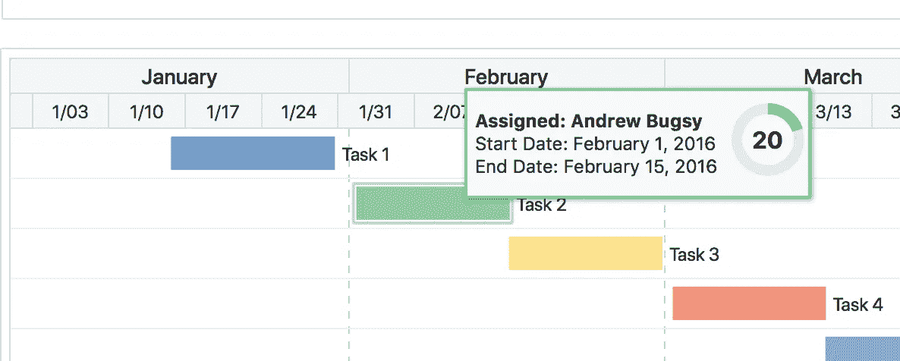
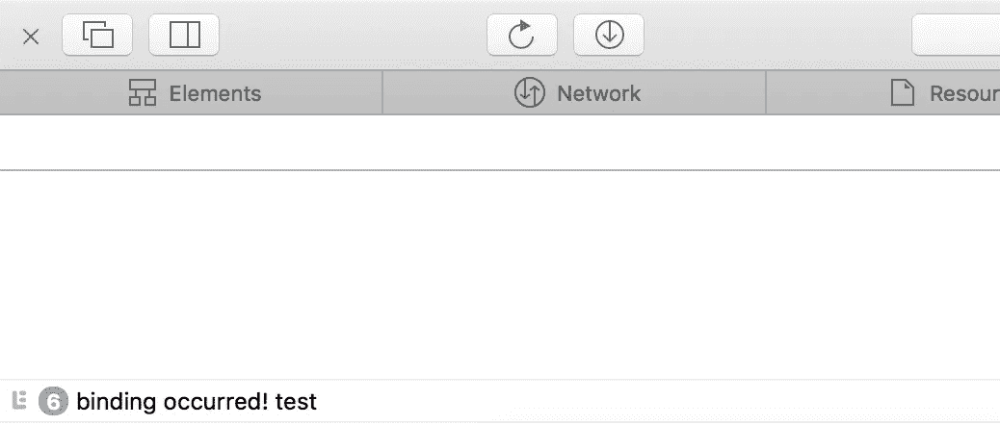
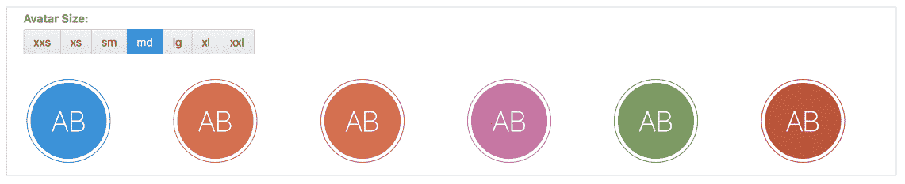

# 在 Oracle JET 中使用自定义剔除绑定实现功能丰富的工具提示

> 原文：<https://medium.com/oracledevs/implementing-feature-rich-tooltips-in-oracle-jet-using-custom-knockout-bindings-7eeeb8b17f01?source=collection_archive---------2----------------------->

在一些场景中，我发现工具提示示例和插件对于需求来说不够丰富， [Oracle JET cookbook](http://www.oracle.com/webfolder/technetwork/jet/jetCookbook.html?component=popup&demo=tooltip) 也不例外。

cookbook 包含了一个使用元素属性来包含工具提示内容的示例场景(我认为这适合大多数项目的需求)，但是如果您想做更多的事情呢……比如在 [ojGant 组件](http://www.oracle.com/webfolder/technetwork/jet/jetCookbook.html?component=gantt&demo=tooltipTemplate)中显示的示例:



ojGant component with tooltip template

在我的例子中，我需要创建一个功能丰富的工具提示，我希望实现简单。

经过一番挖掘后，我决定最好的方法是利用创建自定义 knockout 绑定的能力，这是一个真正展示 JET 才华的展示。我们有一个包含许多有用组件的框架，但是如果我们需要实现自定义功能，没有必要与框架对抗，扩展起来相对简单。

因此，让我们首先创建一个定制绑定(使用 **init** 回调，因为在这种情况下不需要更新)，并将其绑定到 ojAvatar 组件。

*(对于这个例子，我将使用食谱中的*[*OJ avatar*](http://www.oracle.com/webfolder/technetwork/jet/jetCookbook.html?component=avatar&demo=colors)*)*

## 视图模型

```
ko.bindingHandlers.toolTip = {
  init: function (element, valueAccessor, allBindings) {

      var value = valueAccessor();
      var valueUnwrapped = ko.unwrap(value);

      console.log("binding occurred! " + value)
  }
}
```

## 视角

```
<oj-avatar data-bind='css: value, attr:{"aria-label":"Avatar of " + $parent.firstName
                  + " " + $parent.lastName + " with color " + label}, **toolTip: "test"**', 
                role='img'  size='[[$parent.avatarSize]]' initials='[[$parent.initials]]'>
                </oj-avatar>
```



这将写入**“绑定发生！测试你的队伍中每个角色的日志(6 个不同的角色)。**‘test’**的值正在传递，稍后可以在我们的弹出逻辑中使用。**

让我们进一步扩展它，创建一个 div 来保存一些关于用户的额外信息。

**视图**

```
<!-- ko foreach: avatarColors -->
     <div class="oj-flex-item oj-sm-margin-2x" **data-bind="toolTip: true"**>
          <oj-avatar data-bind='css: value, attr:{"aria-label":"Avatar of " + $parent.firstName + " " + $parent.lastName + " with color " + label}, '  role='img' size='[[$parent.avatarSize]]' initials='[[$parent.initials]]'>
          </oj-avatar>
    **      <div class="myTooltip" style="position:absolute; padding:10px; z-index:1; background-color: #ebebeb; left:-999999px;" data-bind="style: { border: '3px solid ' + color }">
            <b>First name:</b> <span data-bind="text: $parent.firstName"></span><br>
            <b>Surname:</b> <span data-bind="text: $parent.lastName"></span>
            <oj-rating-gauge class="myRating" value="4" readonly style="width:90px;height:35px;" selected-state.color="{{color}}">
            </oj-rating-gauge>
          </div>**
    </div>
<!-- /ko -->
```

我已经修改了我们之前开始的代码，查看加粗的代码。

> **注意:**样式属性应该被添加到 myTooltip 类中，但是 cookbook 不支持样式表的编辑，所以在这个例子中我已经内嵌了它。

现在我们已经完成了视图，让我们修改自定义绑定处理程序中的逻辑来隐藏/显示我们的工具提示:

**viewModel**

```
ko.bindingHandlers.toolTip = {init: function (element, valueAccessor, allBindings) { // Determine if popup should be loaded
   var value = valueAccessor();
   var valueUnwrapped = ko.unwrap(value);
   if (valueUnwrapped == true) { // Show or hide popup depedent on hover status    
      $(element).hover(function () {
         $(element).find('.myTooltip').show();
      }, function () {
         $(element).find('.myTooltip').hide();
      }).mousemove(function (e) {
         // Enables the tooltip to follow the users cursor
         var mousex = e.pageX + 50 //Get X coordinates
         var mousey = e.pageY - 50 //Get Y coordinates
         $(".myTooltip").css({ top: mousey, left: mousex });
      }) }}}
```

avatarColours 数组也已扩展为包括十六进制代码，用于工具提示边框和仪表星形颜色:

```
self.avatarColors = ko.observableArray([
      {label: 'a', value: 'demo-avatar-a', color: '#0096e0'},
      {label: 'b', value: 'demo-avatar-b', color: '#d97638'},
      {label: 'c', value: 'demo-avatar-c', color: '#eb5a50'},
      {label: 'd', value: 'demo-avatar-d', color: '#d16ba6'},
      {label: 'e', value: 'demo-avatar-e', color: '#749e5a'},
      {label: 'f', value: 'demo-avatar-f', color: '#c94e30'},
])
```



Custom tooltips using ojAvatar

框架已经就位，可以在工具提示中包含自定义数据和组件，欢迎使用！

— DC

> **有用阅读:**[https://hacker noon . com/my-approach-to-using-z-index-ECA 67 feb 079 c](https://hackernoon.com/my-approach-to-using-z-index-eca67feb079c)