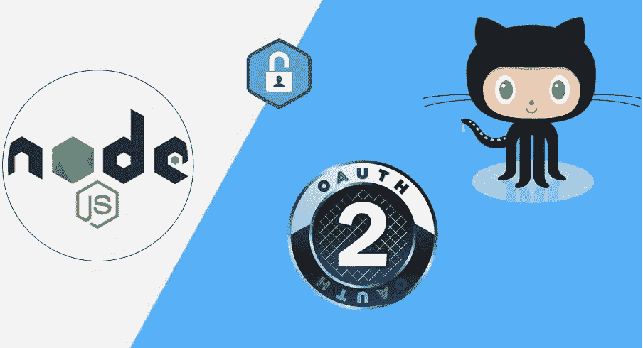
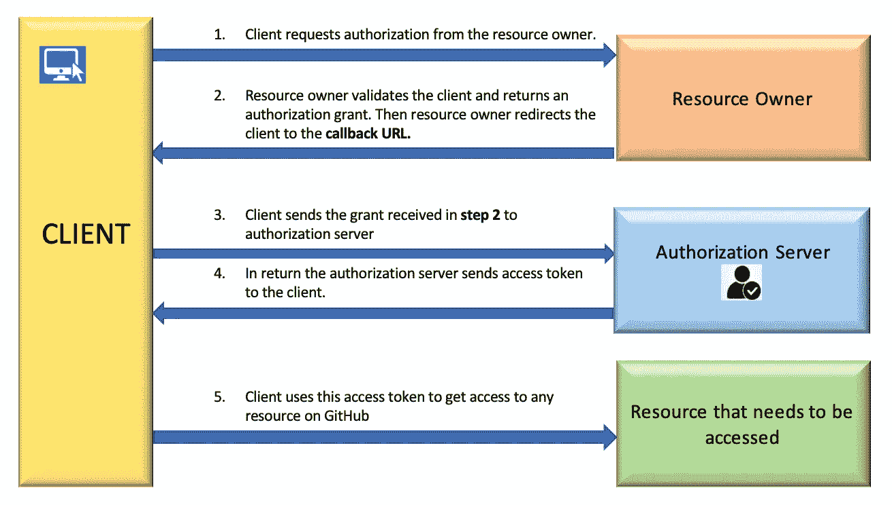
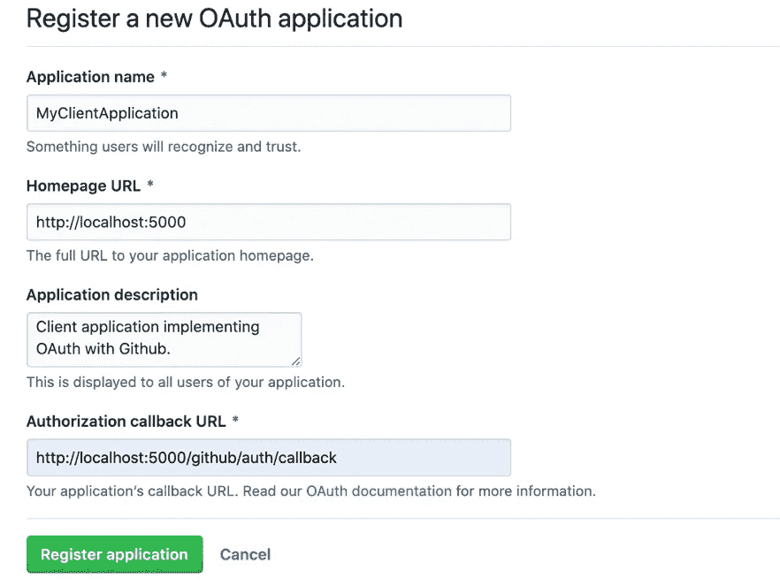
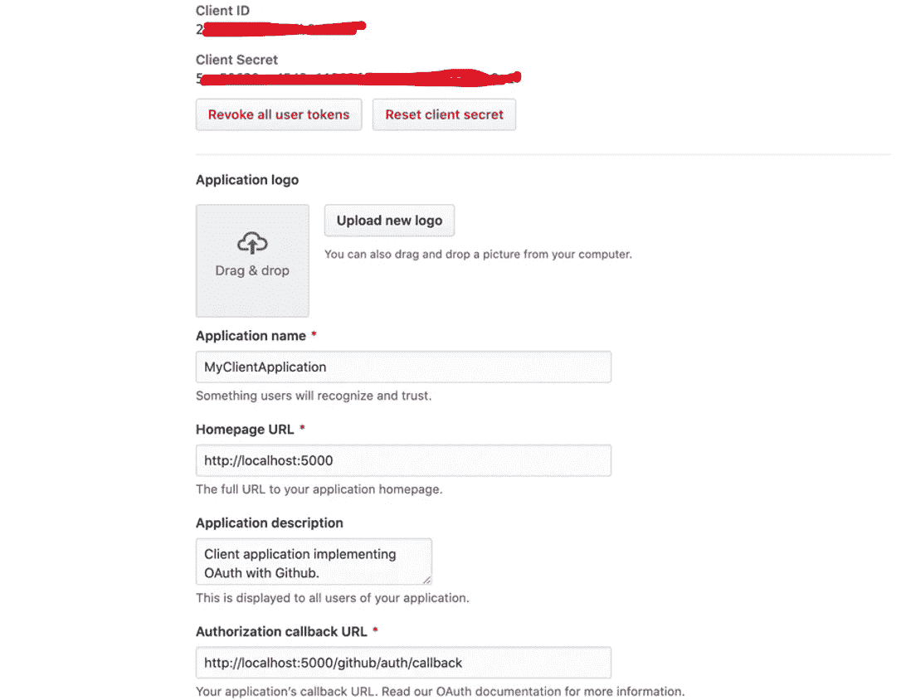
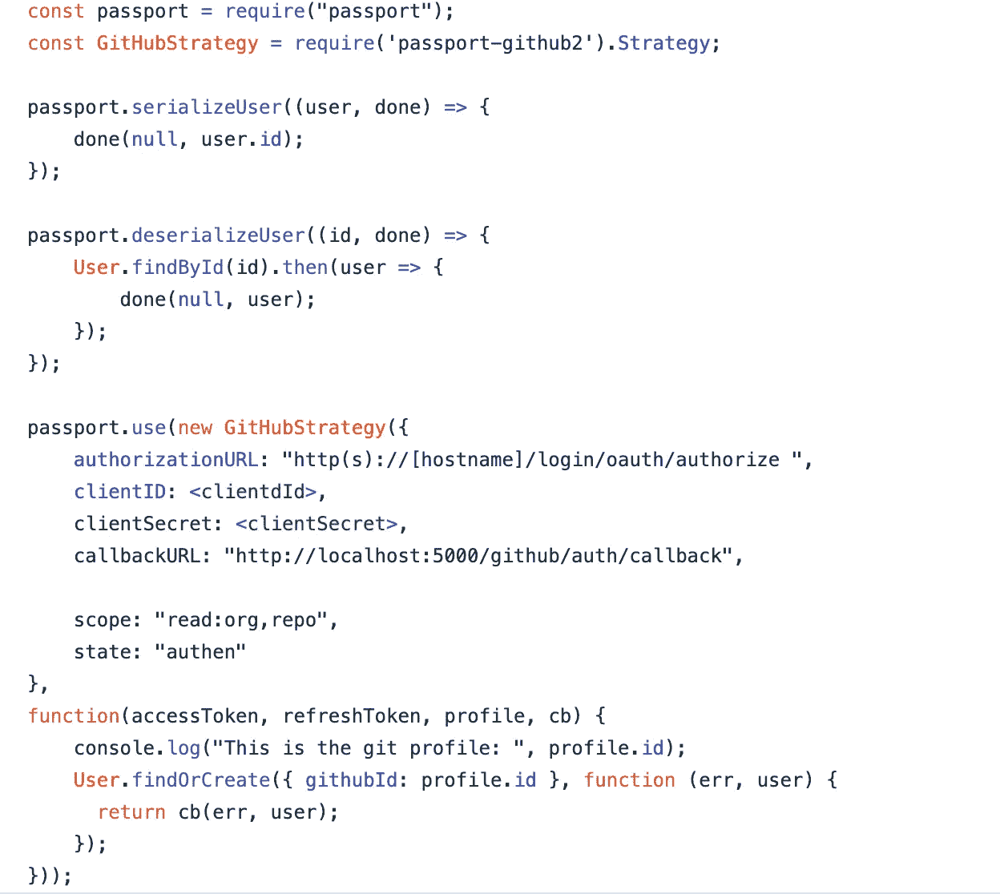
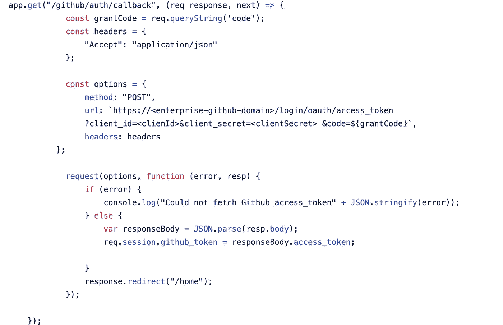

# 用 Passport.js 实现 GitHub Enterprise OAuth2

> 原文：<https://medium.com/walmartglobaltech/implementing-github-enterprise-oauth2-with-passport-js-fd18ee9fefe7?source=collection_archive---------0----------------------->

Photo by [Brooke Giles](https://morioh.com/@5c4a8166f2de1b4342249373/) On [Morioh](https://morioh.com/p/730680517c1a)

# **您是否面临过让用户使用 Node 授权 Github enterprise OAuth app 的挑战。Js？**

OAuth 是一种授权方法，通过 HTTP 协议提供对资源的访问。它可以用于各种应用程序的授权，如 Github、Twitter、脸书等等。

**Github enterprise** 提供 OAuth 2.0 实现，授权用户访问其资源。在使用 Node.js 时，您可能会面临让应用程序的用户能够访问他们的 Github 企业资源的挑战。如果是的话， **passport.js** 是一个可以拯救你的图书馆。

**Passport** 是 Node.js 的**认证**中间件这个模块让你在**节点**中使用 OAuth **2.0** 进行**认证。 **js** 应用。**

此贴包含 GitHub enterprise OAuth2 **认证**和**授权**使用 [passport.js](https://www.passportjs.org/packages/passport-github/) 。GitHub enterprise 使用标准[授权码授权类型](https://datatracker.ietf.org/doc/html/rfc6749#section-4.1)实现 OAuth2。

我将向您展示一个简短的演示和一些代码片段，可以在您的客户端应用程序中使用它们来验证和授权用户提供对特定 GitHub 资源的访问。

资源可以是 GitHub 上需要资源所有者授权的任何东西，比如存储库、分支、提交权限等。

下图解释了 OAuth2 实现的工作原理:

**Flow Diagram Showing How OAuth2 Works**

# 1.在 Github 上注册 OAuth 应用程序

首先，您需要在 GitHub 企业站点上创建一个 OAuth 应用程序。

进入“设置”> >“开发者设置”> >“OAuth 应用”> >“新建 OAuth 应用”。

然后提供您的客户端应用程序的端点，我已经给定为 [https://localhost:5000](https://localhost:5000) 。

此外，提及“授权回调 URL ”,其重要性将在下一节讨论。它可以是任何自定义端点。

这与上面流程图的步骤 2 中的身份验证之后，资源所有者重定向您的客户端应用程序的端点相同。

**GitHub OAuth Application Registration**

一旦我们在 GitHub 上注册了 OAuth 应用程序，我们将获得一个 clientId 和一个 clientSecret。
**注意:**这些是您的应用程序的授权密钥。保存这些密钥，但确保不要在任何地方发布它们。

# 2)从 Github 获得资助

创建一个文件，并给它取任意名称，比如 passport.js。

passport.js 中的 GitHubStrategy 将对**http(s)://[hostname]/log in/oauth/authorize**进行 GET 调用，以接收来自资源所有者的授权。
把以下内容放进你的档案:

Passport.js

在上面的代码片段中，我们使用 passport.js 的 GitHubStrategy 从资源所有者那里获得授权。记住授权的截止时间是 10 分钟。一旦到期，您将无法通过授权服务器使用此授权码来获取访问令牌。

**注意** : **clientId** 和 **clientSecret** 是你注册 GitHub 应用程序后得到的密钥。此外，回调 URL 应该与注册应用程序时给出的 URL 相同。
关于**范围**参见[本](https://docs.github.com/en/enterprise-server@3.0/developers/apps/building-oauth-apps/scopes-for-oauth-apps)。

# 3)获取 Github 访问令牌

既然现在您有了授权，那么您可以调用授权服务器，它将把访问令牌发送到您的客户机应用程序。

Index.js

在上面的代码片段中，需要考虑的事情很少:

a) /github/auth/callback 是您在步骤 1)中注册 github 应用程序时给出的同一个回调 URL。

b) grantCode 是步骤 2)中返回的授权。

c)我们将会话中的 access_token 保存为:
req . session . github _ token = response body . access _ token；

您的应用程序准备使用 access_token 来访问 GitHub enterprise 上的任何资源，这些资源的端点必须以[https://<enter pirse-GitHub-domain>/API/v3](https://<enterpirse-github-domain>/api/v3)开头。

参考 GitHub[API](https://docs.github.com/en/rest/overview/endpoints-available-for-github-apps)访问各种资源。

# **参考文献:**

[https://docs . github . com/en/enterprise server @ 3.1/developers/apps/building-oauth-apps/authoring-oauth-apps # we B- application-flow](https://docs.github.com/en/enterprise-server@3.1/developers/apps/building-oauth-apps/authorizing-oauth-apps#web-application-flow)

[https://www.passportjs.org/packages/](https://www.passportjs.org/packages/)

[https://datatracker.ietf.org/doc/html/rfc6749#section-4.1](https://datatracker.ietf.org/doc/html/rfc6749#section-4.1)