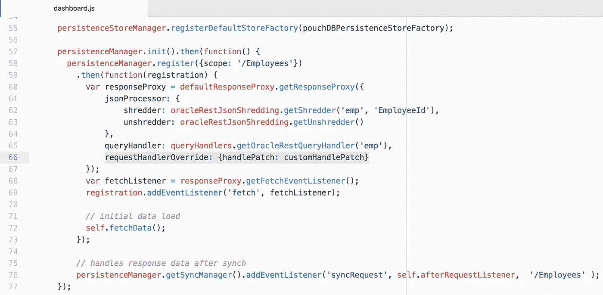
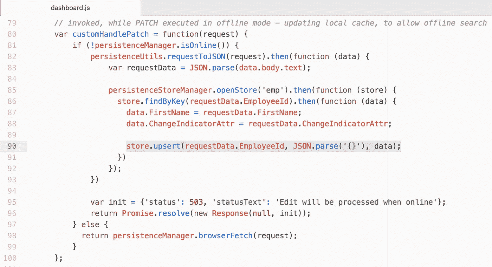
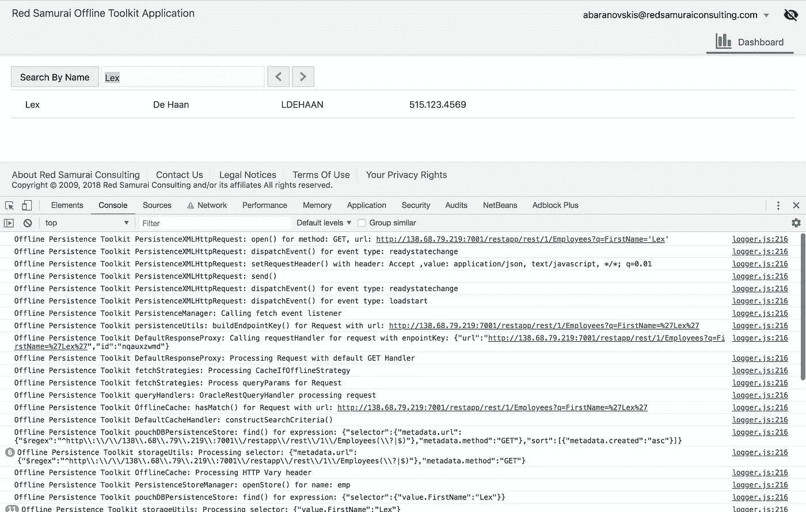
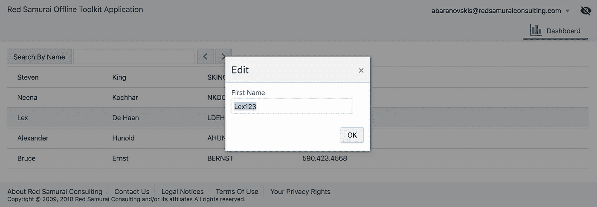
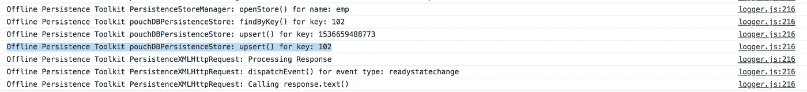
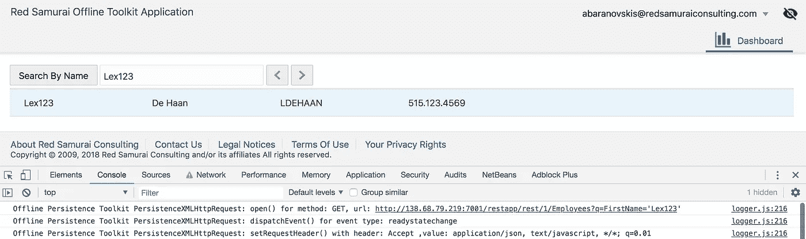

# 在 JET 离线工具包中实现句柄补丁方法

> 原文：<https://medium.com/oracledevs/implementing-handle-patch-method-in-jet-offline-toolkit-f6d8e418f4b0?source=collection_archive---------0----------------------->

当离线执行补丁请求时，JET Offline Persistence Toolkit 将记录该请求，并在在线时将其同步到后端。但它不会更新存储在缓存中的数据，这是设计的。由于缓存的数据不会更新，针对脱机缓存的搜索查询不会产生基于最新更改的结果。为了解决这个问题，我们需要通过提供句柄补丁方法来自己实现缓存更新。

注册持久性管理器时，通过 requestHandlerOverride 属性配置句柄修补程序:

处理补丁的示例实现。仅在脱机状态下执行修补程序时，才会调用此方法。我们必须从请求中读取信息，并将其传递给缓存存储。基于关键字在缓存中搜索条目，更新记录并将信息更新回存储:

让我们进行离线测试——将浏览器选项卡切换到离线状态(可以使用 Chrome 浏览器开发工具)。从 JET Offline Persistence Toolkit 中搜索并检查日志—它会根据缓存存储自动执行搜索:

离线时更新相同的记录—将记录补丁请求以供以后同步。我们的 handle patch 方法将被调用，以将更改写入缓存存储:

您将在日志中注意到，从 handle patch 方法执行的操作。它在缓存中按键查找记录并更新它:

按更新值搜索-找到更新值并从缓存存储中返回:

代码可以在 [GitHub](https://github.com/abaranovskis-redsamurai/persistencejetapp) 库中找到。

*原载于 2018 年 9 月 12 日*[*【andrejusb.blogspot.com*](https://andrejusb.blogspot.com/2018/09/implementing-handle-patch-method-for.html)*。*